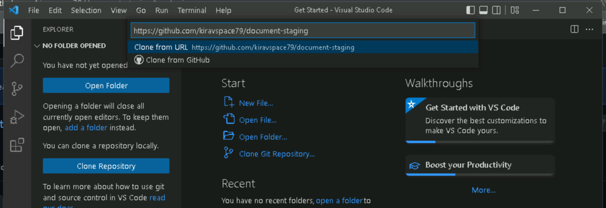

# NUGU developers 문서

본 페이지는 NUGU developers 문서를 보관하고 있는 저장소입니다.

NUGU developers 문서는 누구나 아래의 절차를 통해 문서의 개정을 요청하실 수 있습니다.

## 문서 사이트 구조

NUGU developers 문서는 markdown 문서로서 [Jekyll](https://jekyllrb.com/) `4.2.2` 버전으로 제작되었으며, 추가적인 plugin 은 [jekyll-spaceship](https://github.com/jeffreytse/jekyll-spaceship), [jekyll-potion](https://github.com/nugudevelopers/jekyll-potion) 을 사용합니다.

또한 GitHub Actions 를 통해 빌드하고 빌드된 결과물을 `gh-pages` 라는 브랜치로 archiving 하여 서비스 하도록 구성되어 있습니다. 

### 디렉토리 구조

NUGU developers 는 다음과 같이 예약된 디렉토리 구조를 가지며, 문서 작성시 해당 디렉토리를 이용해 문서를 작성합니다.

만일 정해진 경로 규칙에 맞지 않게 작업된 문서 개정 요청의 경우 문서 관리자는 개정 요청을 거부할 수 있습니다.

| 경로명                       | 설명                                                                                                                                          | 작업 가능 여부  | 
|---------------------------|---------------------------------------------------------------------------------------------------------------------------------------------|:---------:|
| _jekyll-potion            | NUGU developers 문서 구동을 위한 필수 라이브러리입니다.<br/>[jekyll-potion](https://github.com/nugudevelopers/jekyll-potion) 의 변경 요청은 링크를 통해 해당 프로젝트에 공헌하세요. |     N     |
| _plugins                  | NUGU developers 문서의 layout을 구성하는 디렉토리이며 수정할 수 없습니다.                                                                                         |     N     |
| assets/favicon            | NUGU developers 사이트의 favicon 을 보관하는 디렉토리이며 수정할 수 없습니다.                                                                                      |     N     |
| assets/files              | NUGU developers 사이트의 이미지를 제외한 정적 요소를 보관하는 디렉토리입니다.                                                                                          |     Y     |
| assets/images             | NUGU developers 사이트의 이미지를 보관하는 디렉토리입니다.                                                                                                     |     Y     |
| assets/guide-images                | NUGU developers 사이트 구성을 위한 이미지를 보관하는 디렉토리이며 수정할 수 없습니다.                                                                                     |     N     |
| developers                | [jekyll-potion](https://github.com/nugudevelopers/jekyll-potion) 의 NUGU developers 용 theme 디렉토리이며 수정할 수 없습니다.                               |     N     | 
| _config.jekyll_potion.yml | [Jekyll](https://jekyllrb.com/) 을 구성하는 파일로서 수정할 수 없습니다.                                                                                     |     N     |
| Gemfile                   | [Jekyll](https://jekyllrb.com/) 을 구성하는 파일로서 수정할 수 없습니다.                                                                                     |     N     |
| Gemfile.lock              | [Jekyll](https://jekyllrb.com/) 을 구성하는 파일로서 수정할 수 없습니다.                                                                                     |     N     |
| _config.yml               | [Jekyll](https://jekyllrb.com/) 을 구성하는 파일로서 수정할 수 없습니다.                                                                                     |     N     |
| _config.*.yml             | [Jekyll](https://jekyllrb.com/) 을 구성하는 파일로서 수정할 수 없습니다.                                                                                     |     N     |
| 404.html                  | [Jekyll](https://jekyllrb.com/) 을 구성하는 파일로서 수정할 수 없습니다.                                                                                     |     N     |
| README.md                 | NUGU developers 문서 제작 가이드로서 수정할 수 없습니다.                                                                                                     |     N     |

이외의 디렉토리, 파일은 정적 요소일 경우 `assets`에, markdown 문서일 경우 최상단 디렉토리를 기준으로 작성할 수 있습니다.

하위 페이지의 경우, 확장자를 제외한 페이지명과 동일한 이름의 디렉토리를 작성할 경우 하위 페이지로서 표현됩니다.

## 환경 구축하기

NUGU developers 문서는 [GitHub 저장소](https://github.com/nugudevelopers/document-staging) 를 fork 하여 작업한 후 [pull requests](https://docs.github.com/en/pull-requests) 를 통해 문서 개정 요청을 할 수 있습니다.

### 프로젝트 fork 하기

[Fork a repo](https://docs.github.com/en/get-started/quickstart/fork-a-repo) 를 통해 https://github.com/nugudevelopers/document-staging 를 `document-staging` 라는 저장소로 fork 합니다.

프로젝트명은 반드시 `document-staging` 로 지정되어야 합니다.

만일 이를 변경하고자 한다면, `_config.staging.yml` 파일 내 `baseurl` 값도 변경한 프로젝트명으로 변경해야 하며, pull requests 를 보낼 때 제외하여야 합니다.

기본적으로 `main`, `gh-pages` 브랜치는 반드시 copy 되어야 올바른 문서로 표현되기 때문에 `Copy the main branch only` 는 반드시 해제한 후 fork 합니다.

### GitHub Pages 활성화하기

1. [Configuring a publishing source for your GitHub Pages site](https://docs.github.com/en/pages/getting-started-with-github-pages/configuring-a-publishing-source-for-your-github-pages-site) 를 참조하여, `Settings` > `Pages` 로 이동합니다.
2. `Builde and deployment` 섹션 내 `Source` 를 `Deploy from a branch`, `Branch` 는 `gh-pages`, `/ (root)` 를 선택한 후 `Save` 버튼을 클릭합니다.
3. `Actions` 로 이동하여 1번째 workflow 가 녹색으로 완료되면 웹브라우저를 통해 `https://{계정명}.github.io/document-staging/` 를 접속하여 NUGU developers 문서 사이트가 정상적으로 접속됨을 확인합니다.
   1. 만일 `Actions` 가 활성화되어 있지 않으면 `Settings` > `Actions` > `General` 을 선택하여 `Actions Permissions` 항목에 `Allow all actions and reusable workflows` 를 선택한 후 저장합니다. 

## 문서 작성하기

문서를 작성할 때는 반드시 브랜치를 생성하여 작업해야 합니다.

자세한 내용은 [Creating a branch](https://docs.github.com/en/pull-requests/collaborating-with-pull-requests/proposing-changes-to-your-work-with-pull-requests/creating-and-deleting-branches-within-your-repository#creating-a-branch) 를 참고하세요.

프로젝트 환경이 구성되었으면, 문서 작업자는 각자의 환경에 맞게 주로 사용하는 text 에디터를 통해 markdown 문서를 작성하거나, 변경하고 필요한 정적 요소(이미지, 파일...)등을 업로드할 수 있습니다.

기본적으로는 [markdown 문법](https://www.markdownguide.org/basic-syntax/)이 준수된 문서라면 어떤 형태여도 상관없으며, [jekyll-spaceship](https://github.com/jeffreytse/jekyll-spaceship) 에서 제공하는 문법, [jekyll-potion](https://github.com/nugudevelopers/jekyll-potion)의 [태그](https://nugudevelopers.github.io/jekyll-potion/components/tag) 를 지원합니다.

[jekyll-potion](https://github.com/nugudevelopers/jekyll-potion)의 [태그](https://nugudevelopers.github.io/jekyll-potion/components/tag) 는 각 태그별 선언, 그리고 선언에 대한 설명만 이해하고 있다면 작성이 가능합니다.

만일 [jekyll-spaceship](https://github.com/jeffreytse/jekyll-spaceship) 에서 제공하는 문법, [jekyll-potion](https://github.com/nugudevelopers/jekyll-potion) 에서 제공하는 문법 간의 충돌이 발생한다면, [jekyll-spaceship](https://github.com/jeffreytse/jekyll-spaceship), [jekyll-potion](https://github.com/nugudevelopers/jekyll-potion) 순으로 적용됩니다. 

또한 수정되는 부분이 여러 페이지일 경우, 하나의 수정건으로 작업되어야 합니다.

반드시 모든 수정이 끝난 경우에만 pull requests 를 요청하세요.

### GitHub 를 통해 문서 작성하기

개인 PC 에 Ruby, [Jekyll](https://jekyllrb.com/) 을 설치하지 않은 경우, 작성할 수 있는 방법입니다.

GitHub 는 [Working with files](https://docs.github.com/en/repositories/working-with-files) 를 통해 웹페이지를 통해 파일을 생성하거나 편집할 수 있습니다.

편집을 마친 후 저장을 하면 GitHub 는 자동으로 변경을 감지하여, workflow 를 통해 변경된 내용을 GitHub pages 에 반영합니다.

### 로컬에서 문서 작성하기

개인 PC 를 통해 NUGU developers 사이트를 구동시켜 수정되는 내용을 직접 확인하며 작성할 수 있는 방법입니다.

먼저 [Git](https://git-scm.com/), [Jekyll](https://jekyllrb.com/) 의 설치가 필요합니다. [설치 가이드](https://jekyllrb.com/docs/installation/) 를 참조하여 설치합니다.
  > [Jekyll](https://jekyllrb.com/) 을 설치할 때 가이드대로 작성할 때 Ruby 역시 설치할 수 있습니다. Ruby 는 2.6.X 버전을 권장하며, 만일 3 대의 버전을 설치할 경우 [Webrick](https://github.com/ruby/webrick) 을 추가로 설치해야 합니다.

만일 Git 에 익숙하지 않은 경우, [GitHub Desktop](https://desktop.github.com/), 또는 [Visual Source Code](https://code.visualstudio.com/) 설치를 권장합니다.

설치를 마친 후 fork 한 저장소를 [Cloning a repository](https://docs.github.com/en/repositories/creating-and-managing-repositories/cloning-a-repository) 를 통해 clone 받습니다.

clone 한 디렉토리로 이동한 후 아래의 명령어를 수행합니다.

```bash
bundle exec jekyll serve --config _config.yml,_config.jekyll_potion.yml,_config.staging.yml --trace
```

서버 구동이 끝나면, 웹브라우저를 통해 `http://localhost:4000/document-staging/` 를 접근하여 NUGU developers 문서가 제대로 구동됨을 확인합니다.

정상적인 구동을 확인 한 다음 [Creating a branch](https://docs.github.com/en/desktop/contributing-and-collaborating-using-github-desktop/making-changes-in-a-branch/managing-branches#creating-a-branch) 를 참고하여 branch 를 생성합니다. 

branch 생성을 마친 후 문서를 변경합니다. 변경한 문서는 일정한 시간을 두고 반영되니, 웹브라우저를 통해 확인합니다.

변경을 마친 후 [Creating and editing commits](https://docs.github.com/en/pull-requests/committing-changes-to-your-project/creating-and-editing-commits) 을 참조하여, commit 을 생성합니다.

생성된 commit 을 [Pushing changes to GitHub](https://docs.github.com/en/desktop/contributing-and-collaborating-using-github-desktop/making-changes-in-a-branch/pushing-changes-to-github) 를 참조하여 push 합니다.

## pull requests 생성하기

작성한 문서를 수정한 후 fork 된 프로젝트의 Github Page 가 정확하게 수정됨을 확인했다면, [pull requests](https://docs.github.com/en/pull-requests) 를 통해 반영을 요청할 수 있습니다.

별도의 요청 양식은 존재하지 않으나, 희망하는 배포일정을 알려주시면 되도록 맞춰서 배포를 진행합니다. 

pull requests 는 문서 사이트 빌드 오류, 컨텐츠 들의 디렉토리 경로, 작성한 내용, merge 시 충돌 등을 검토하여 merge 되며 특이사항이 있는 경우 pull requests 의 댓글을 통해 커뮤니케이션합니다.

## 문서 현행화하기

작성된 문서는 review 를 통해 반영되었다면, repository 기본 페이지로 접속할 때 `Sync Fork` 버튼이 활성화됩니다.
  > 문서는 항상 변경될 수 있습니다. [메인 repository](https://github.com/nugudevelopers/document-staging) 가 바뀌었다면, 항상 최신화해야 합니다.

## 튜토리얼 따라하기

NUGU developers 문서의 형상은 Github 를 통해 관리되고 있습니다.

따라서 문서 작성을 위해서는 반드시 Github, Git 사용에 대한 이해가 필요합니다.

하지만 Github, Git 에 대한 경험이 부족한 경우 다음의 튜토리얼을 진행하시기 바랍니다.

설치 환경은 Windows PC 를 기준으로 작성하였으며, 맥이나 리눅스 등도 환경에 맞는 도구를 정상적으로 설치한다면, 동일한 형태로 진행이 가능합니다.

### Git 다운로드 하기

[Git](https://git-scm.com/) 에 접속하고 아래의 이미지를 참조하여 OS 에 맞는 최신 버전의 Git 을 다운로드 받습니다.


### 프로젝트 Fork 하기

[GitHub 저장소](https://github.com/nugudevelopers/document-staging) 에 접속하고 아래의 이미지를 참조하여 Fork 를 수행합니다.


### Pages 설정하기

아래의 이미지를 참조하여 `Settings` 메뉴에 접속합니다.


좌측 메뉴에서 `Pages` 설정에 접속합니다.


아래의 이미지처럼 `Build and deployment` > `Source` 항목을 `Deploy from a`, `Branch` 는 `gh-pages` 를 선택합니다.


### Pages 확인하기

`Actions` 메뉴에 접속하여 Page Build 작업이 진행됨을 확인합니다.


아래의 이미지처럼 빌드가 완료됨을 확인합니다.


다시 `Settings` > `Pages` 로 접속하여 빌드 결과물인 Site 에 접속할 수 있음을 확인합니다.


`Visit site` 를 통해 문서 페이지가 정상적으로 구동됨을 확인합니다.


### Jekyll 설치 및 문서 작성 도구 다운로드 하기

[Jekyll Install](https://jekyllrb.com/docs/installation/) 을 참조하여 PC 환경에 맞는 Jekyll 을 설치합니다. 이 때 설치될 Ruby 의 버전은 2.6.X 버전을 사용합니다.

[Git](https://git-scm.com/) 에 접속하여 PC 환경에 맞는 Git 을 설치합니다.

[Visual Studio Code](https://code.visualstudio.com/) 를 다운로드 받고 설치합니다.

설치를 마친 후 터미널(Windows 의 경우 cmd.exe)을 통해 아래와 같이 설치된 도구의 버전을 확인하여 정상적으로 설치됨을 확인합니다.


### repository clone 하기

[Visual Studio Code](https://code.visualstudio.com/) 를 실행하여 아래와 같이 `Get Started` 페이지의 `Clone Git Repository..` 을 선택하고 위에서 생성한 repository 의 clone 주소를 입력합니다.

설치 경로는 자신의 환경에 맞게 적절하게 정합니다.



### 로컬 PC 에서 실행하기

이제 로컬 PC 에서 developers 문서를 실행할 수 있는 모든 준비가 끝났으며 Jekyll 을 실행하여 웹브라우저를 통해 정상적으로 구동되는지를 확인해야 합니다.

환경에 맞는 터미널(Windows 의 경우 cmd.exe) 를 열고 clone 받은 경로로 이동하여 아래의 이미지처럼 다음의 명령을 수행합니다.


```bash
bundle install
```

이후 아래의 이미지대로 Jekyll 을 구동시킵니다. 


```bash
bundle exec jekyll serve --config _config.yml,_config.jekyll_potion.yml,_config.staging.yml --trace
```

정상적으로 빌드를 마치면 터미널에 다음의 이미지와 같이 노출됩니다.


서버가 정상적으로 구동됨을 확인했다면 이제 아래의 이미지처럼 브라우저를 통해 `http://localhost:4000/document-staging/` 에 접속하여 문서 사이트가 제대로 구동되는지를 확인합니다.


### 작업 branch 생성하기

브라우저로 구동됨을 확인했다면, 비로소 작업할 수 있는 환경 구축은 끝났습니다.

`Visual Studio Code` 화면 좌측면의 `Source Control` 메뉴를 선택하고, 아래의 이미지대로 메뉴를 선택하여 branch 를 생성합니다.


branch 이름은 , 반드시 `feature/` 로 시작하는 해당 작업을 의미를 설명할 수 있는 적절한 영문명으로 작성합니다.


### 문서 수정하기

문서는 [markdown 문법](https://www.markdownguide.org/basic-syntax/) 을 기준으로 [jekyll-spaceship](https://github.com/jeffreytse/jekyll-spaceship) 에서 제공하는 문법, [jekyll-potion](https://github.com/nugudevelopers/jekyll-potion)의 [태그](https://nugudevelopers.github.io/jekyll-potion/components/tag) 를 이용해 보다 풍부한 표현을 할 수 있습니다.

추가적인 리소스가 필요하다면, 위에서 언급한 폴더 규칙에 따라 적절한 위치에 정적 자원을 위치시킨 후, 본문에서 사용할 수 있습니다.

만일 서버를 구동한 채로 수정을 했다면, 수정 중간의 변경사항은 Jekyll 에서 자동으로 인지하고, 주기적으로 다시 빌드를 진행합니다. 빌드를 마치면, 터미널에 `done in...` 과 같은 메시지가 노출되며 브라우저를 갱신하여 변경된 내용이 정확히 변경되었는지 확인할 수 있습니다.


위와 같이 수정을 마치고 나면 수정된 모든 문서를 저장합니다.

### commit & push 하기

이제 작업된 내용을 온라인에 업로드 하는 과정입니다. 먼저 터미널을 통해 아래의 명령어를 실행하여 현재 업로드할 사용자의 name, email 이 정확한지 확인합니다.

```bash
git config user.name
git config user.email
```


만일 위와 같이 비워져 있거나, 제대로 세팅되어 있지 않다면, 아래의 명령어를 실행하여 수정합니다.


이제 `Visual Studio Code` 화면 좌측면 `Source Control` 메뉴로 이동하여 아래의 이미지처럼 commit 메시지를 작성합니다.


commit 메시지는 첫줄이 제목, 이후 빈 공백 한줄(제목과 본문의 구분) 이후 본문을 작성합니다.

작성을 마친 후 `V commit` 버튼을 클릭합니다.

이어서 아래와 같이 작성한 commit 을 온라인으로 push 합니다.


### pull request 작성하기

push 를 마친후 GitHub 의 repository 로 이동하면 아래와 같은 메시지가 노출됩니다. 


`Compare & pull request` 버튼을 클릭하여 pull request 를 생성합니다.


이 때 저장소의 base repository 가 clone 받은 repository 임을 확인합니다.


지금 생성하는 리뷰는 페이지가 정상적으로 변경되었음을 확인하기 위한 절차이며 임시적인 review 입니다. 

생성된 리뷰는 위와 같이 빌드 과정을 거치게 되며 문서가 정상적인 문법을 통해 수정되었다면, 아래와 같이 빌드가 잘 끝났음이 확인됩니다.

만일 이 때 markdown 이나, jekyll 의 문법적인 오류가 발생한다면 빌드를 실패하게 됩니다.

이럴 경우 로컬에서 작업된 내용들이 제대로 수정이 되었는지, 로컬에서는 문제가 없었는지를 확인하여 잘못된 부분을 수정해야 합니다.

또한 Git History 가 잘못되어 merge 를 할 수 없는 경우가 발생할 수도 있습니다.


빌드가 정상적으로 되었기 때문에 GitHub Pages 가 의도대로 변경되었음을 확인합니다.


페이지가 정상적으로 구동됨이 확인되었으면 이제 main repository 쪽으로 pull request 생성을 위해 아래의 이미지처럼 생성한 review 를 닫습니다. 


이제 다시 main repository 쪽으로 pull request 를 생성합니다.


필요하다면, 추가적인 커멘트, 배포 희망일을 추가 작성할 수 있습니다.


이제 문서 관리자는 review 를 검토할 것입니다. 검토가 완료되면 일정한 주기, 또는 희망하는 배포일에 배포될 것이며 배포된 문서를 확인하실 수 있습니다.

### sync base repository

이와 같이 자신이 작업했던 문서가 갱신되었거나, 타인의 문서가 변경되었을 경우 아래의 이미지처럼 main 햤의 형상이 변경되었음이 노출됩니다.


이럴 경우 `Sync fork` > `Update branch` 를 통해 변경된 내용을 clone 받은 repository 에 반영합니다. 이 과정을 생략할 경우 clone 받은 repository 의 문서는 현행화되지 않으며, 이 상태에서 문서를 작업할 경우 충돌이 발생할 수 있습니다.

충돌이 발생한 경우 [충돌의 기초](https://git-scm.com/book/ko/v2/Git-%EB%B8%8C%EB%9E%9C%EC%B9%98-%EB%B8%8C%EB%9E%9C%EC%B9%98%EC%99%80-Merge-%EC%9D%98-%EA%B8%B0%EC%B4%88#_basic_merge_conflicts) 를 참조하여 충돌을 해결해야만 정상적인 작업이 가능합니다.


