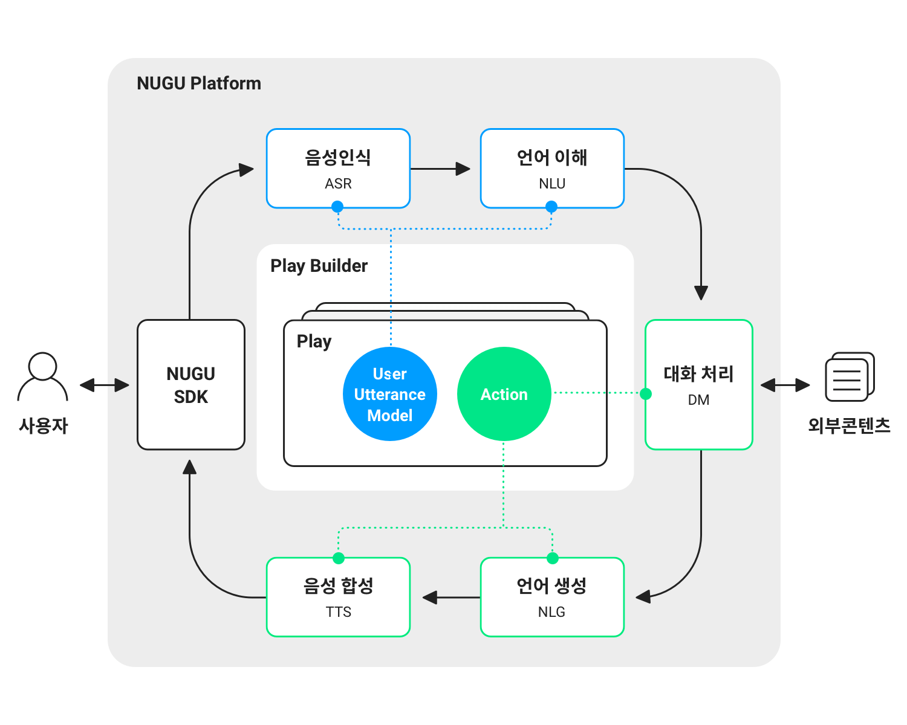
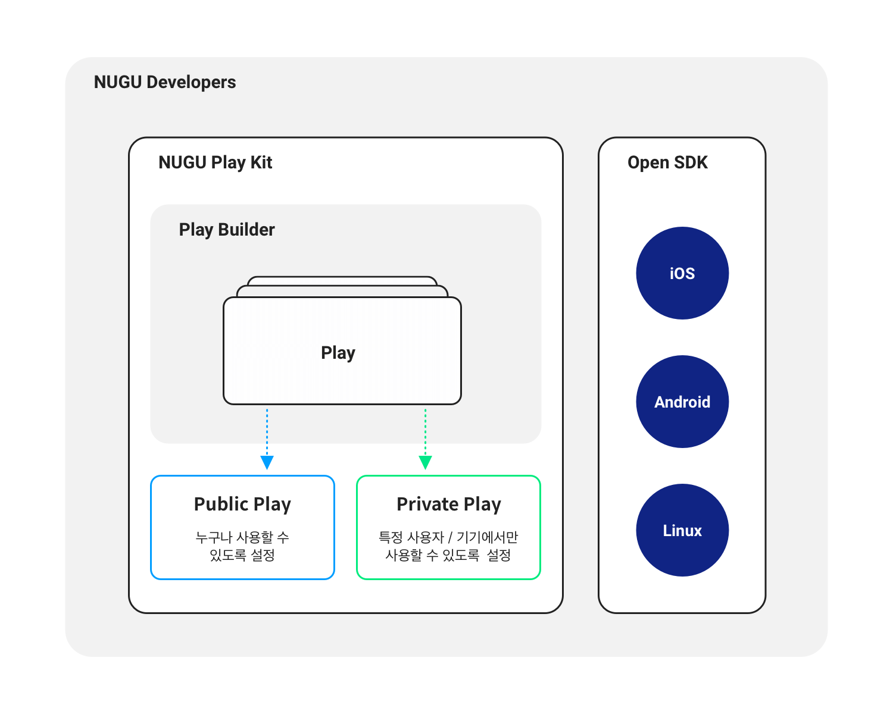

# NUGU developers 소개

NUGU developers에 오신 것을 환영합니다.

NUGU는 SK텔레콤의 인공지능 플랫폼으로, 사용자의 자연어(음성 언어 또는 문자 언어) 요청을 이해하여 의도를 파악한 후 정보 또는 관련한 서비스 제공합니다. NUGU 플랫폼은 NUGU 스피커, T map, B tv, 키즈폰, 알버트, T전화 등 다양한 디바이스와 애플리케이션 PoC(Point of Contact)에 적용 있으며 월간 최대 사용자 1000만 명을 넘어서고 있습니다.

NUGU developers를 통해 SK텔레콤이 보유한 최고 수준의 음성 인식, 음성 합성, 자연어 이해 등의 기술력을 기반으로, 새로운 기능을 개발하여 NUGU 이용자들에게 제공하거나, 제휴사에서 보유한 디바이스나 어플리케이션에서 음성명령을 통한 NUGU의 다양한 기능을 제공할 수 있습니다.

NUGU 플랫폼에서 사용자 발화를 처리하는 과정은 다음과 같습니다.

* 사용자 발화는 NUGU 플랫폼에서 제공하는 '음성 인식, 자연어 이해' AI 기술을 통해 그 의도가 파악되고,
* 대화 관리자는 파악된 의도에 맞는 액션을 설정하여 사용자에게 전달할 응답을 생성하며,
* 생성된 응답은 음성 합성 모듈을 거쳐서 사용자에 합성음(tts)으로 전달합니다.

NUGU developers에서는 NUGU의 PoC에서 손쉽게 새로운 기능과 서비스를 Play로 제공할 수 있도록 지원하는 NUGU play kit과,  Play를 비지니스 목적으로 Private하게 사용하게 하고 Announcement 메세지를 보낼 수 있는 NUGU biz kit를 지원하며, 여러분의 다양한 디바이스 또는 어플리케이션 등에서 NUGU의 다양한 서비스를 직접 제공할 수 있도록 지원하는 NUGU SDK를 제공합니다.

NUGU play kit은 대화 기반 인공지능 서비스를 개발할 수 있는 통합 개발 환경을 GUI 기반으로 제공함으로써, 사용자들은 쉽게 자신들의 서비스를 개발할 수 있습니다. NUGU play kit에서는 사용자 발화가 처리되는 과정에 필요한 요소 기술들을 제공하고 서비스를 개발할 수 있도록 하는 통합 개발 환경인 Play Builder가 제공됩니다. 개발된 서비스는 NUGU의 '심사'와 '배포' 과정을 거친 후 스피커, T map, Btv, T전화 등의 PoC에서 사용자들에게 제공됩니다. 또한 특정 사용자 그룹이나 전용 디바이스에서만 해당 서비스를 제공하고자 할 경우에는 NUGU biz  kit기능을 통하여 이를 설정할 수 있습니다.

NUGU SDK는 여러분의 다양한 디바이스와 어플리케이션 등에서 NUGU의 자연어 이해 기반의 다양한 기능이 직접 제공될 수 있도록 NUGU 플랫폼과의 연동 및 NUGU의 다양한 서비스 제공을 지원합니다. NUGU SDK는 Android OS, iOS, Linux OS를 지원하며, SDK 탑재를 위한 개발가이드 및 UX 가이드 등을 함께 제공합니다.

NUGU developers는 개발자가 아니어도 대화 기반 인공지능 서비스를 개발할 수 있는 플랫폼입니다. 또한 자체의 인공지능 플랫폼을 갖추지 못했더라도, 다양한 상품에 쉽고 빠르게 인공지능 기반의 기능을 제공할 수 있도록 지원합니다. NUGU 이용자들에게 좋은 서비스를 제공하길 희망하는 모든 분들과 빠르게 NUGU의 인공지능 기능을 다양한 디바이스와 어플리케이션에서 제공하고자 희망하시는 모든 분들께서 NUGU developers를 통해 그 희망을 실현할 수 있기를 바랍니다.
