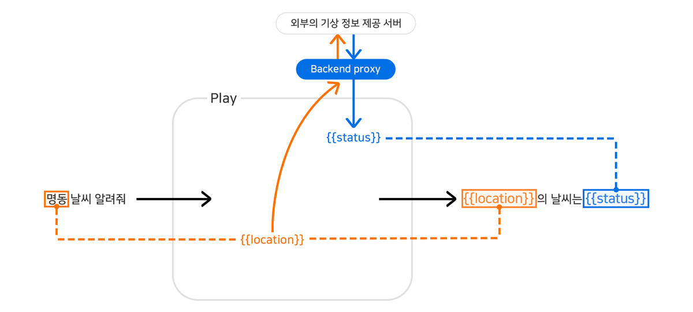

# Backend proxy

사용자의 발화로부터 Intent와 Entity가 분석되면 대화 관리자가 적절한 Prompt를 생성하여 스피커로 전달합니다.

Prompt를 생성할 때 외부 서버로부터 필요한 정보를 가져와서 응답을 생성해야 하는 경우가 있습니다. 외부 서버를 호출하여 대화 관리자에게 정보를 전달하는 서버를 Backend proxy라고 합니다. Backend proxy는 외부 서버로부터 가져온 정보를 수정하거나 복잡한 로직을 통해 조건을 판단하는 기능도 수행할 수 있는데, 개발자가 직접 개발하여 NUGU 플랫폼과 연동할 수 있도록 준비해야 합니다.

다음 그림과 같이 사용자가 '명동 날씨 알려줘'라고 발화한 경우, 'ask.weather' Intent와 함께 '명동'을 Backend proxy로 전달합니다.

Backend proxy는 기상 정보를 제공하는 외부 서버를 호출하여 원하는 시간의 날씨 정보를 얻어와 `{{status}}`로 결과를 반환하고, 대화 관리자 `{{location}}`과 `{{status}}`를 이용하여 날씨를 안내하는 응답을 스피커로 보내게 됩니다.

Backend proxy를 사용하는 경우는 다음과 같습니다.

* 외부 서버로부터 정보를 가져와야 하는 경우
* 사칙연산, 날짜/시간 계산 등 로직을 통해 정보를 가공하는 경우
* 오디오 재생을 위한 명령어(Play, Pause, Stop)를 생성해야 하는 경우 자세한 내용은 [AudioPlayer Interface 지원하는 Play 만들기](../create-a-play-with-audioplayer)를 참고하세요.
* 시나리오 전체에 필요한 정보를 미리 가져와서 사용하는 경우

외부 서버를 연동하는 경우 여러 가지 예외 상황이 발생할 수 있습니다. 이러한 예외 상황을 Action에 정의하고, Backend proxy는 예외 상황이 발생했을 때 Action에서 정의한 상태값을 전달함으로써 다양한 예외 상황에 대처하는 응답을 만들 수 있습니다.
