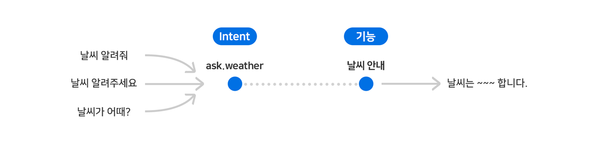
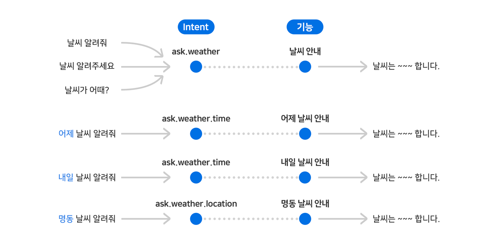
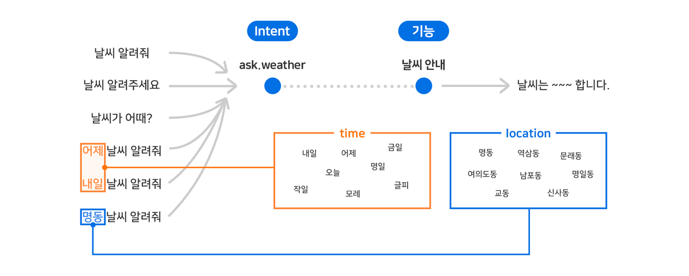

# Intent와 Entity

Play가 제공할 기능들을 사용하기 위해 사용자는 발화를 통해 Play에게 의도를 전달해야 합니다. 인간과 기계(Play)가 음성 대화를 통해 상호 작용할 수 있도록 하는 언어모델을 User Utterance Model이라고 합니다. Play는 이러한 모델을 통해 사용자의 말을 이해하고 그 속에 담긴 요청/명령을 수행할 수 있게 됩니다.


의도와 기능에 대한 자세한 내용은 [Play](./play)를 참고하세요.


그리고, User Utterance Model은 Intent와 Entity로 구성됩니다. 여기서 Intent는 Play의 기능을 동작시키기 위해 표현하는 사용자 의도를 의미하며, Entity는 사용자의 요청을 정확히 처리하기 위해 Intent 외에 추가로 알아야 하는 개체를 의미합니다.

Play Builder는 사용자가 정의한 User Utterance Model을 바탕으로 NLU 엔진을 자동으로 학습시킵니다. 이후 사용자가 예상 발화와 일치하거나 유사한 의도를 가지는 발화를 한 경우에 NLU 엔진은 해당 Intent와 Entity로 분석합니다.


User Utterance Model 모델에 대한 자세한 내용은 [User Utterance Model 정의하기(Intent & Entity)](../define-user-utterance-model)를 참고하세요.


## Intent

Intent는 사용자가 발화를 통해 수행하고자 하는 기능을 구체적으로 구분한 범주이며, Play의 필수 구성 요소입니다. 입력된 예상 발화를 바탕으로 NLU 엔진은 자동으로 학습하여 사용자의 실제 발화를 분석합니다.

Intent를 정의하기 위해서는 기능 수행을 위한 사용자의 예상 발화를 일정 수준 이상 입력해야 합니다. 동일한 Intent에 대해 사용자들은 각자의 상황/성향에 따라 여러 가지 형태 또는 문형으로 발화할 수 있으므로, 이를 고려하여 다양한 문형의 예상 발화를 입력하는 것이 좋습니다.

Intent는 Built-in Intent와 Custom Intent로 구분됩니다.

### Built-in Intent

* 자주 사용할 것으로 예상되거나 필수로 정의해야 하는 NUGU의 기본 제공 Intent입니다.
* Play 생성 시 추가되며, Capability Interface를 적용할 때마다 추가되는 Built-in Intent가 더 늘어납니다.

### Custom Intent

* 특정 Play 내에서 정의된 Intent입니다.

## Entity

Entity는 Intent만으로 특정 기능의 발화 의도를 표현하기 어려울 때 사용하는 부가 상세 정보를 의미하는 개체입니다. Entity는 Intent의 예상 발화 정의 시 해당 발화문 내에서 특정 텍스트를 지정하여 정의합니다. 예상 발화에서 정의된 Entity는 사용자 발화에서 동일한 의미/유형의 다른 어휘들로 나타날 수 있는 가변적인 요소입니다.

Entity는 필요한 경우에만 정의하는 선택 요소이지만, 정의한 Entity가 사용자 발화에 누락된 경우는 정상적으로 기능을 동작시키지 못할 수 있습니다. 이 경우에는 Entity를 필수로 지정하여 사용자에게 다시 물어 Entity를 확인하거나, Play 개발자가 기본 값으로 처리하도록 개발할 수 있습니다.

예를들어, "경로 알려줘" 라고 했을 때, <목적지>를 필수로 지정하여 "목적지를 말씀해주시겠어요?"와 같이 되묻도록 할 수 있고, 혹은, "날씨 알려줘"라고 했을 때, "현재 계신 곳의 지금 날씨는 맑습니다"와 같이 <현재 시간, 현재 위치>를 기본값으로 설정하여 처리할 수도 있습니다.

예를 들어, '명동', '남포동', '역삼동'과 같은 개체들은 '동 이름'을 나타내며, 이것을 Entity Type이라고 부릅니다. 또한 발화 문장에서의 역할(목적지, 경유지, 위치 등)을 Entity Role이라고 합니다.

**Entity Type**은 특정 Entity들의 집합 또는 그 범주를 의미하며, **Entity Role**은 특정 Entity의 발화 문장에서의 역할을 의미합니다.

Entity Type은 Built-in Entity Type과 Custom Entity type으로 구분됩니다.

### Built-in Entity Type

* 시간이나 장소, 숫자, 나이와 같이 범용적으로 자주 쓰이는 표현들을 정의해 둔 Entity Type입니다.
* Custom Entity Type과 동일하게 사용 가능합니다.
* 28개의 Entity Type이 Built-in으로 제공되며, 이후 추가될 수 있습니다.

### Custom Entity Type

* 특정 Play 내에서 정의된 Entity Type입니다.

발화 문장에서 Entity가 특정 역할을 수행한다면, 이를 구분하여 Entity Role을 별도로 정의합니다. "서울에서 부산까지 항공편 예약해줘"라는 발화 문장에서, '서울'과 '부산'은 도시를 나타내는 동일한 Entity Type이지만, 서로 다른 역할(출발지, 목적지)을 수행하고 있으며, 이는 명확히 구분되어야 정상적으로 기능을 수행할 수 있습니다. 이 경우에는 '서울'은 출발지, '부산'은 목적지라는 역할(Role)을 구분하여 지정해야 합니다.

| 사용자 발화               | Intent        | Entity Text   | Entity Type   | Entity Role            |
|----------------------|---------------|---------------|---------------|------------------------|
| 서울에서 부산까지 항공편 예약해줘   | book.flight   | 서울            | CITY          | POINT_OF_DEPARTURE     |
|                      |               | 부산            | CITY          | DESTINATION            |

## 예제를 통해 Intent와 Entity 알아보기

예를 들어, 날씨를 안내하는 Play를 만든다고 할 때, 날씨 안내 기능을 사용하기 위해서는 '날씨 정보를 요청'이라는 의도를 표현해야 하며, 이를 ask.weather라는 Intent로 정의할 수 있습니다. 이 의도를 표현하기 위해 사용자가 "날씨 알려줘", "날씨 알려주세요.", "날씨가 어때"라고 말할 것으로 예상되는 경우, 이 세 문장을 '예상 발화'라고 합니다.

ask.weather를 생성하고, 이 Intent에 예상 발화를 연결하면 User Utterance Model이 완성됩니다.

그러나, 실제로는 사용자가 "어제 날씨 알려줘", "내일 날씨 알려줘", "명동 날씨 알려줘" 와 같이 발화할 수도 있습니다. 이러한 발화들을 각각 독립된 Intent로 정의한 뒤, 각 Intent를 처리하는 기능들을 추가하여 처리하는 것도 가능합니다.

그러나 '어제', '내일', '명동'을 Entity로 간주하고 동일한 ask.weather Intent로 처리하면, 조금 더 효율적으로 대응이 가능합니다. 이를 위해, 같은 속성을 가진 Entity끼리 하나의 Entity Type으로 묶고, 이를 예상 발화에 지정하면 Entity를 활용한 User Utterance Model을 정의할 수 있습니다. Entity Type을 예상 발화에 지정할 때에는 Entity Type별로 하나의 값만을 사용해도 됩니다.

