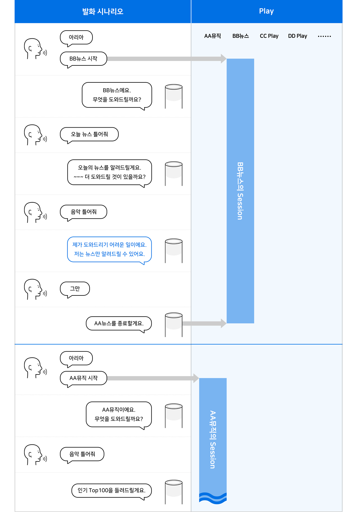

# Play

## Play

Play는 NUGU 플랫폼의 엔진들과 통신해 서비스를 제공하는 단위로서, 사용자와 상호 작용하여 의도를 이해하고 그에 맞는 적절한 답변을 주거나 명령을 수행합니다.

Play로 서비스를 제공하기 위해서는 사용자의 발화를 이해하여 의도를 파악하고 그에 맞는 답변을 제공해야 합니다. 즉, 서비스 제공자는 사용자의 발화를 예상하고 이 발화들의 의도에 맞는 기능들을 정의해야 합니다.

## Play 타입

NUGU play kit에서 만들 수 있는 Play는 사용 대상에 따라 다음 두 가지로 구분됩니다.

### Public Play

* NUGU 사용자 모두가 사용할 수 있는 Play입니다.
* 추후 공개 예정인 스토어에 Play가 등록되면 NUGU 사용자가 선택할 수 있습니다.
* 스토어가 공개되기 전까지는 선택 과정 없이 바로 사용할 수 있습니다.

### Private Play

* 등록된 디바이스 혹은 초대된 사용자만 사용할 수 있는 Play입니다.
* 예를 들어, 회사 내에서만 혹은 가족/친구끼리만 사용하는 Play로도 활용할 수 있습니다.
* 특정 디바이스를 등록하거나 제한된 사용자만 초대하는 것은 NUGU biz에서 설정할 수 있습니다.

## Play 호출 이름(Invocation name)

Play 호출 이름은 사용자가 Play를 호출하기 위해 발화하는 고유한 이름을 말합니다. 사용자가 Play 호출 이름을 발화하면 해당 Play의 세션으로 진입하여 해당 Play의 기능을 사용할 수 있게 됩니다. 호출 이름은 Play Builder를 통해 Play를 만든 후, NUGU play kit에서 심사요청서를 작성할 때 입력할 수 있으며, 심사 단계에서 호출이름을 검토합니다.


Play 생성 시에 이 호출 이름을 정의해야 하고, 호출 이름에 대한 자세한 내용은 [호출 이름 정의하기](../../play-registration-and-review/register-a-play#define-an-invocation-name)를 참고하면 됩니다.


## Play 시작

다음의 두 가지 발화 방법으로 Play를 시작할 수 있습니다.

### 1) Play 호출 이름 + Start(시작) / Open(열어줘)

Built-in Intent인 'Open' 또는 'Start'를 사용하여 특정한 기능 수행 요청 없이 Play를 호출할 수 있습니다. ‘Open’에 해당하는 발화 예시로 ‘열어’, ‘오픈’이 있으며, ‘Start’에는 ‘시작’, ‘스타트’, ‘실행’이 해당됩니다.

### 2) Play 호출 이름 + 해당 Play의 Intent

실행하고자 하는 Play의 기능을 호출 이름에 이어서 발화하여 Play를 시작할 수 있습니다. Play가 시작되며 곧바로 해당 Play의 Intent가 수행됩니다. 호출 이름과 Intent 사이에 '에게/에서/한테/로'와 같은 조사를 넣어 발화하거나 Entity를 함께 발화할 수도 있습니다.


**Welcome 메시지**

Play가 실행될 때에는 Welcome 메시지로 응답하여 Play가 시작되었다는 것을 사용자가 인지할 수 있도록 합니다. 단조롭게 느껴지지 않도록 Welcome 메시지는 2~3개 중 하나를 교차 사용합니다. Welcome 메시지는 필수 요소는 아니며, 각 Play 서비스의 상황에 맞게 제공 여부를 판단해 적용합니다.

예)\
**사용자:** 아리아, 워커힐 실행해줘\
**NUGU:** 워커힐에 오신 것을 환영합니다.


## Play 종료

다음의 네 가지 방법으로 Play를 종료할 수 있습니다.

### 1) Play 호출이름 + Stop(그만) / Close(닫아줘)

Play 호출이름에 Built-in Intent인 'Stop' 또는 'Close'를 사용하여 Play를 종료할 수 있습니다. ‘Stop’에 해당하는 발화 예시로는 ‘그만’, ‘정지’, ‘중지’, ‘종료’, ‘멈춰’, ‘스탑’, ‘끝’이 있으며, ‘Close’에 해당하는 예시에는 ‘닫기’, ‘닫아’가 있습니다.

### 2) 세션 대기 상황에서 Stop(그만) / Close(닫아줘)

세션 대기 상황에서 NUGU 에이전트가 Listening 상태인 경우, Play 호출이름을 포함하지 않아도 'Stop' 또는 'Close'를 발화하여 Play를 종료할 수 있습니다.


“그만” > Play 종료됨


### 3) 세션 대기 상황에서 미지원 발화(Fallback) 연속 발생 시

사용자 발화가 Play 내에 정의된 Intent가 아닌 경우 Fallback으로 처리되며, Fallback Action에서 정의한 수만큼 연속으로 Fallback이 발생하면 Play가 종료됩니다.


**NUGU**: (Listening 상태)\
**사용자**: 음악 틀어줘\
**NUGU**: 워커힐에서는 제공하지 않는 기능이에요. 무엇을 더 도와드릴까요? (Fallback 1회)\
**NUGU**: (Listening 상태)\
**사용자**: 음악 틀어줘\
**NUGU**: 워커힐에서는 제공하지 않는 기능이에요. 워커힐을 종료할게요. (Fallback 2회)


### 4) 세션 대기 상황에서 미발화(Silence) 발생 시

미발화(Silence) 발생 시 Play가 종료됩니다.


**Closing 메시지**

Play가 종료될 때에도 Closing 메시지를 재생하여 Play가 종료되었다는 것을 사용자가 인지할 수 있게 합니다. Welcome 메시지와 마찬가지로, 단조롭게 느껴지지 않도록 2~3개 중 하나를 교차 사용합니다. Closing 메시지는 필수 요소는 아니며, 각 Play 서비스의 상황에 맞게 제공 여부를 판단해 적용합니다.

예)

**사용자:** 아리아, 워커힐 종료해줘

**NUGU:** 워커힐을 종료할게요.


## Play 세션

사용자가 특정 Play의 호출 이름을 발화하여 호출하면, 그 Play가 활성화되면서 해당 Play의 명령만 수행할 수 있는 Play 세션으로 진입합니다. 이 세션이 열려 있는 동안에는 해당 호출 이름을 발화하지 않아도 그 Play의 기능을 계속 사용할 수 있고, 세션이 닫히기 전까지는 다른 Play를 사용할 수 없습니다.

특정 명령을 통해 세션을 닫을 수 있고, 정해진 세션 유지 시간이 경과하거나 Capability Interface 중 AudioPlayer의 명령이 수행되면 세션이 닫힙니다.

