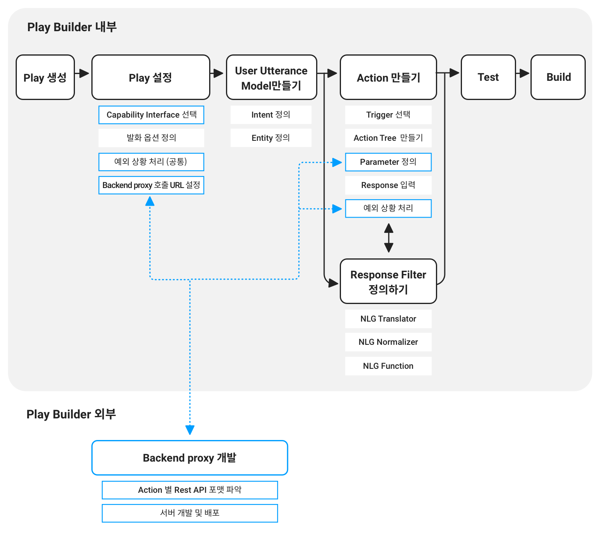

# 외부 연동 서버 (Backend proxy) 연결하기

## 개요

Backend proxy는 응답을 생성하기 위해 필요한 정보를 외부로부터 가져와야 하는 경우 사용하는 서버입니다.


개발에 대한 자세한 내용은 [외부 연동 서버(Backend proxy)](./use-backend-proxy)를 참고하세요.


Backend proxy는 위 그림과 같이 다음의 경우에 사용합니다.

1. Action의 응답을 정의할 때, 외부 서버로부터 정보를 가져와야 하는 경우


날씨 상태, 지하철 도착 예정 시간, 특정 POI의 전화번호 등


1. 특정 Entity에 대하여 서버의 판단이 필요할 때


사용자가 말한 날짜가 무슨 요일인지 판단

사용자로부터 2개의 Entity를 받아서 처리해야 할 때, 2개의 Entity의 정합성을 체크하는 경우(2월 31일의 날씨 알려줘, 일본의 뉴욕 시간 알려줘)


1. 서버에서 연산하여 결과를 제공할 수 있는 경우


현재 시간: 2 + 3의 결과


1. Directive를 사용하여 디바이스의 기능을 동작시켜야 하는 경우


오디오 재생, 멈춤


1. 예외 상황에 대한 판단이 필요할 때


콘텐츠 서버의 장애

사용자가 지원하지 않는 범위의 정보를 요청했을 때, Intent는 유지하면서 Entity만 다시 받아 처리하고 싶은 경우



Backend Parameter, 예외 상황 관리, Capability Interface(Directive)와 관련한 자세한 내용은 다음 링크 페이지를 참고하세요.

* **Parameter**: [Parameter 사용하기](./define-an-action/use-parameters)
* **Capability Interface(Directive)**: [AudioPlayer Interface 지원하는 Play 만들기](./create-a-play-with-audioplayer)
* **예외 상황**: [예외 상황 관리](./define-an-action/manage-exceptions)


## Backend proxy 연결 순서

Backend proxy를 사용하기 위해서는 다음과 같은 순서로 진행을 해야 합니다.

1. Backend proxy 서버를 구축합니다.
   * Backend proxy 개발에 대한 자세한 내용은 [외부 연동 서버(Backend proxy)](./use-backend-proxy)를 참고하세요. 
2. Backend proxy를 Play와 연결합니다.
   * Play Builder에서 해당 Play의 `General` &gt; `외부 서버 연결 정보` 페이지에서 Backend proxy의 Web URL을 입력합니다.
   * Web URL 입력 시 http:// 또는 https://를 포함하여 작성합니다.
   * 이 Backend proxy과의 통신이 실패했을 때 사용자에게 전달할 메시지를 '연결 실패 시 prompt'에 입력합니다. 
3. Play 개발자는 Backend proxy 개발자와 다음 사항을 공유해야 합니다.
   * 어떤 Utterance Parameter를 정의하였고, 해당 Utterance Parameter는 어떠한 값들이 전달이 될 것인지 전달해야 합니다. Entity를 정규화 한다면 대표값이 Utterance Parameter에 담겨서 전달이 될 것이므로 해당 대표값을 안내해야 합니다. 
   * 정의한 Backend Parameter에 어떤 값이 담기기를 기대하는지 안내해야 합니다. 
   * Play를 만들면서, 예외 상황을 처리해야 한다면 예외 상황 관리에 등록을 하고, 이를 Exception Code로 요청해야 합니다. (예 : 서버 장애,  잘못된 사용자의 요청 등) 
     * 예외 처리에 대한 자세한 내용은 [예외  상황 관리](./define-an-action/manage-exceptions)를 참고하세요.
   * Capability Interface를 사용하는 경우 어떤 Intent에서 어떻게 Directive를 내보낼 것인지 논의합니다.  
4. Backend proxy과 연결할 Action에서 `Backend proxy 사용 여부`를 On으로 설정합니다.
   * Backend proxy는 어떤 이름의 Action이 자신을 호출할지 알고 있어야 합니다. Backend proxy에서 알지못하는 Action이 호출을 하면, Play는 그  Action에서 멈추게 됩니다. 즉, Play 개발자는 Backend proxy를 호출할 Action을 Backend proxy 개발자에게 전달해야 합니다. 
   * 트리 내의 어떤 Action도 Backend proxy를 호출할 수 있습니다. 일반적으로 Root Action을 Backend proxy와 연결하여 필요한 파라미터를 받아와서 처리합니다.  
   * Capability Interface를 사용하는 경우, 트리 최하단에서 응답을 내보내는 Action도 Backend proxy와 연결하여 Directive를 받아와야 합니다.  


이 장과 같이 보면 좋은 도움말

* [Backend proxy](./use-backend-proxy)
* [Backend Parameter](./define-an-action/use-parameters)


