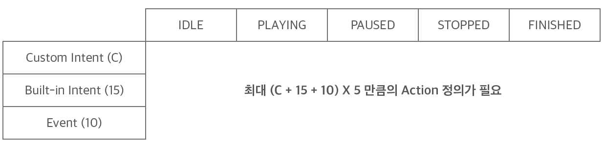

# Action 정의하기

AudioPlayer Interface를 지원하는 Play는 다음의 세 경우에 대해 Action을 정의해야 합니다.

* **Custom Intent**: 사용자가 정의한 Intent
* **Built-in Intent**: AudioPlayer Interface에서 기본으로 제공해주는 Intent
* **AudioPlayer Event**: 스피커의 state가 변경되었을 때 알려주는 이벤트

위 세 경우는 단순히 Action만 정의해서는 안 되고, 스피커의 AudioPlayer 동작 상태에 따라 적절한 처리를 해주어야 합니다.

스피커는 오디오 재생과 관련하여 `IDLE`, `PLAYING`, `PAUSED`, `STOPPED`, `FINISHED`의 5 가지 상태(state)를 가지기 때문에, Custom Intent, Built-in Intent, AudioPlayer Event에 대한 Action을 정의할 때 스피커의 상태에 따라 다른 동작을 정의해야 합니다.

예를 들어 사용자가 "아리아, 일시 정지"라고 발화를 했을 때 스피커가 일시 정지(`PAUSED`) 상태일 때는 아무 동작도 수행을 하지 않도록 처리하고, 재생(`PLAYING`) 상태일 때만 `AudioPlayer.Pause` Directive를 전송하도록 구현할 수 있습니다.

따라서 Custom Intent, Build-in Intent, AudioPlayer Event에 대한 Action을 정의할 때는 각 Action 내에서 스피커의 상태에 따라 구현을 달리해야 할 수 있기 때문에 매우 많은 조합에 대한 처리를 해주어야 합니다.

그러나, 실제 구현할 때는 모든 경우의 수를 다 정의할 필요는 없으며, 시나리오에 꼭 필요한 사항만 정의하면 되기 때문에 최댓값보다는 적은 수의 Action을 정의하게 됩니다.

하지만, 원하는 정확한 동작을 실행하기 위해서는 스피커의 오디오 재생 상태를 정확히 파악한 상태에서 Action을 정의해야 합니다.

