# Built-in Intent를 위한 Action 정의하기

스피커의 상태(state)에 따라 Action을 정의 방법을 "아리아, 이어서 재생"과 같이 "resume" Built-in Intent를 사용하는 경우를 예로 들어 설명합니다.

"resume" Built-in Intent (NUGU.INTENT.resume)가 들어오는 경우는 스피커의 상태에 따라 동작을 정의해 보면 다음과 같습니다.

| 스피커의 상태                        | 동작                                                      |
|--------------------------------|---------------------------------------------------------|
| `PAUSED`                       | AudioPlayer.Play Directive를 전송하여 일시정지했던 지점부터 이어서 재생 시작  |
| `PLAYING`                      | "이미 재생 중입니다" 응답 Prompt                                  |
| `IDLE`, `STOPPED`, `FINISHED`  | AudioPlayer.Play Directive를 전송하여 처음부터 재생 시작             |

위의 표과 같이 상태에 따른 동작이 정의되면 아래의 순서로 Action을 정의할 수 있습니다. Built-in Intent는 `NUGU.INTENT.XXXX` 형식으로 정의되어 있습니다.

## "resume" Built-in Intent를 처리하는 Action 정의

1. Action을 정의할 Play가 `General` > `기본 정보` 페이지의 Capability Interface에서 AudioPlayer Interface 제어 항목이 `ON`으로 설정되어 있는지 확인합니다.

   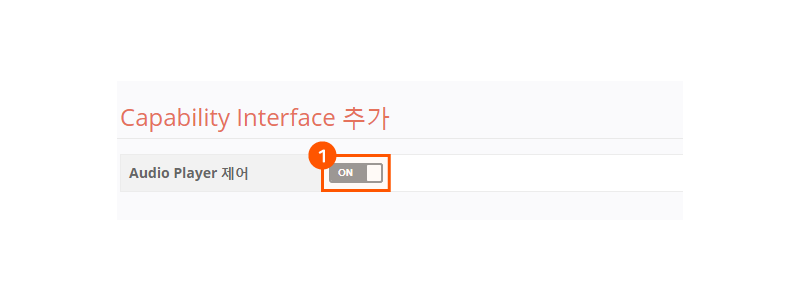
2. Play에 'resume'이라는 Action을 생성합니다.
3. Trigger의 Intent 항목에서 NUGU.INTENT.resume을 선택합니다.

   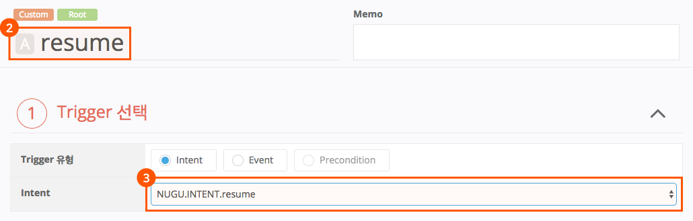

## 스피커의 상태를 처리하는 Branch Action 생성

스피커의 상태를 처리할 다음 세 가지 Branch Action을 추가한 후 `Play 저장` 버튼을 클릭하여 Action을 저장합니다.

* **resumeWhilePause** - 스피커가 `PAUSED` 상태인 경우
* **resumeWhilePlaying** - 스피커가 `PLAYING` 상태인 경우
* **resumeWhileStopped** - 나머지 모든 경우(Default)
* Branch Action의 종류는 위에서 스피커의 상태에 따라 동작을 정의한 표와 동일합니다.

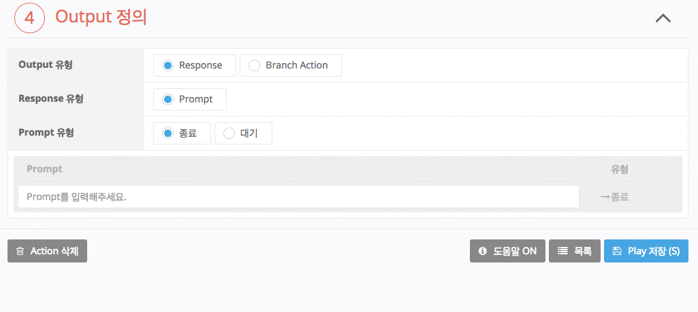

## 각 Branch Action에서 Trigger 조건 정의

1. Branch Action의 버튼을 클릭하여 각 Branch Action의 상세 설정 페이지로 이동합니다.

   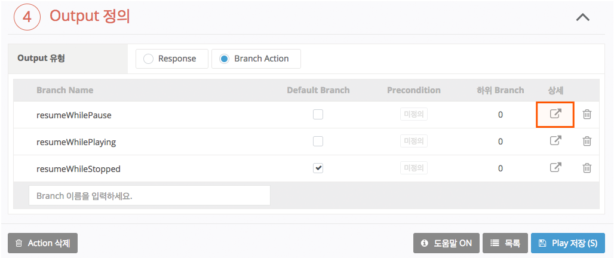
2. 이동한 Branch Action의 'Trigger 선택' 영역에서 Trigger Composite Condition 항목의 `+` > `Condition` 버튼을 클릭하면 하단에 셀렉트 박스(Select Box)가 표시됩니다.
3. 첫 번째 셀렉트 박스에서 `[NPK]context_supportedInterfaces_AudioPlayer_playerActivity`를 선택하고, 두 번째 셀렉트 박스에서 `다음과 같을 경우`를 선택한 후, 우측에 생긴 박스에서 `String`을 선택 상태로 두고 각 Branch Action별로 `PAUSED`, `PLAYING` 이라고 입력합니다.
   * Default로 선택된 Branch Action은 Trigger 정의가 필요없습니다.
   * AudioPlayer 상태는 context.supportedInterfaces.AudioPlayer.playerActivity"에 저장되어 있습니다.
   * context.supportedInterfaces.AudioPlayer.playerActivity는 Backend proxy API의 Request Body에 정의되어 있습니다. 자세한 내용은 [Backend proxy API Reference](../use-backend-proxy/backend-proxy-api-reference)를 참고하세요.
4. Trigger 다음과 같이 정의하면, 'resumeWhilePause' Branch Action은 PAUSED 상태에서 동작합니다.
   
   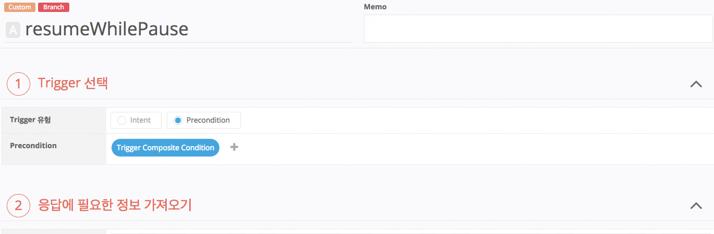

5. 그리고, 'resumeWhilePlaying' Branch Action은 같은 방식으로 PLAYING 이라고 입력합니다.

   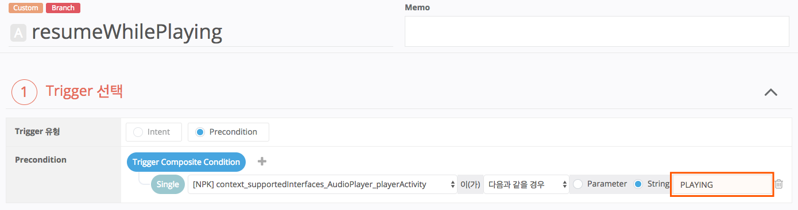
6. 나머지 모든 경우는 각 상태에 대한 조건을 모두 정의할 필요 없이 Branch Action을 Default로 지정합니다.
  
   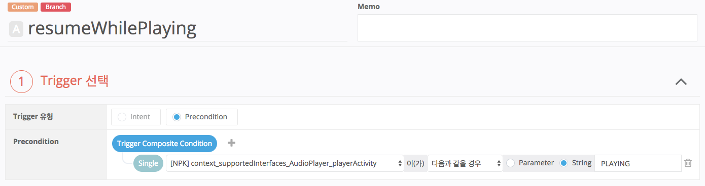

## 각 Branch Action의 응답 정의

1. 응답에 필요한 정보 가져오기에서 Backend proxy 사용 여부 항목이 `ON`으로 설정되어 있는지 확인합니다.

   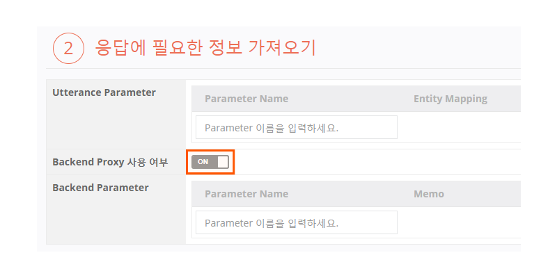
2. Output 영역에서 각 Branch Action별로 응답을 정의합니다. resumeWhilePause Branch Action은 Response 유형을 `Directive`로 선택합니다.

   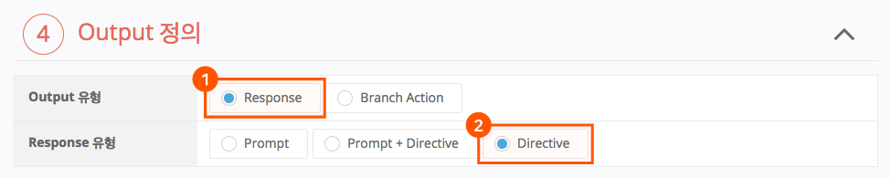

   * resumeWhilePause Branch Action의 응답은 이전의 일시 정지(PAUSED) 시점의 시간을 AudioPlayer.Play Directive를 통해 전송하면 됩니다.
   * AudioPlayer.Play Directive를 Backend proxy에서 만들어서 전송하면 해당 Directive는 스피커까지 전송되어 '이어서 재생'을 시작합니다.
   * AudioPlayer.Play Directive의 offsetInMilliseconds 값은 일시 정지된 시간을 넣어주어야 이어서 재생이 가능합니다.
3. resumeWhilePlaying Branch Action은 Prompt에 "이미 재생 중입니다." 등의 응답 메시지를 입력합니다.

   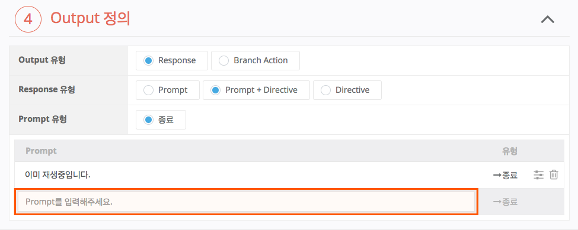

   * 오디오가 이미 재생 중이기 때문에 Directive를 전송할 필요가 없으므로 응답 Prompt만을 보내고 계속 이어서 재생합니다.
4. resumeWhileStopped Branch Action은 Response 유형을 `Prompt + Directive`로 선택하고, Prompt에 '음악을 들려드릴게요.' 등의 응답 메시지를 입력합니다.

   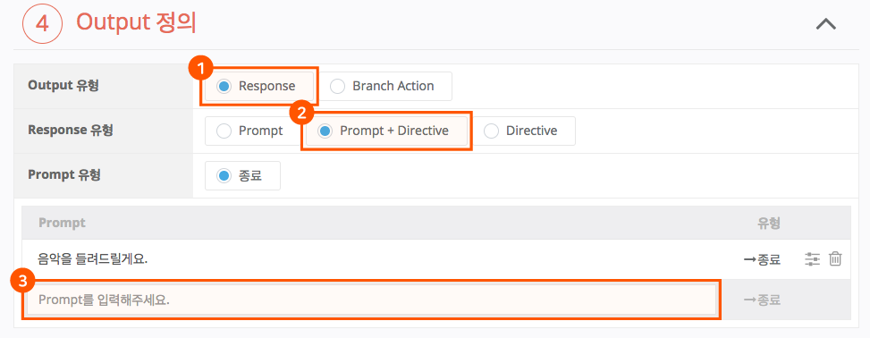
   * 오디오를 이어서 재생하는 것은 아니지만 해당 Action을 처음부터 재생 시작하도록 정의했으므로, 응답 Prompt로 음악 재생이 시작됨을 알려줌과 동시에 AudioPlayer.Play Directive를 전송해야 합니다.
   * 이 경우 Backend proxy는 offsetInMilliseconds 값을 0으로 하여 처음부터 재생하도록 AudioPlayer.Play Directive를 전송해야 합니다.
5. 각 Branch Action별로 설정을 완료할 때마다 `Play 저장` 버튼을 클릭하여 Play에 적용합니다.

## AudioPlayer Event를 위한 Action 정의

AudioPlayer Interface는 스피커의 상태에 따라 Play로 전달되는 이벤트들을 정의하고 있습니다. 이 이벤트들에 대한 Action을 정의하면 사용자가 발화를 하지 않은 경우에도 이벤트를 수신했을 때 적절한 Action을 정의하여 원하는 동작을 할 수 있습니다.

이벤트가 전송되는 것은 사용자가 인식할 수 없는 상태에서 이루어지기 때문에 이벤트 수신시 정의되는 Action은 사용자에게 적절한 응답을 하는 것보다는 내부 처리를 위해 필요한 추가 동작을 정의하는데 주로 사용됩니다.

여기서는 모든 이벤트에 대해 설명하지 않고, 일반적으로 AudioPlayer 기능을 지원하는 Play에서 필요로 하는 기능만을 설명합니다.

| 이벤트                                   | 설명                                                                                                                                                     |
|---------------------------------------|--------------------------------------------------------------------------------------------------------------------------------------------------------|
| PlaybackFinished                      | \1. 플레이 리스트를 재생하는 경우에는 다음 곡을 이어서 재생하기 위한 Play Directive를 전송합니다. \2. 더 이상 재생할 곡이 없으면 Stop Directive를 전송합니다.(필수 사항은 아니지만 Stop Directive 전송을 권장합니다.)  |
| ProgressReportDelayInMilliseconds     | 지정된 시간 위치까지 재생했을 때 이벤트를 한 번 발생시킵니다. 예) 과금을 위해 1분 이상 재생되는 경우를 체크하고자 하는 경우                                                                           |
| ProgressReportIntervalInMilliseconds  | 지정된 시간 주기로 계속 이벤트가 호출됩니다. 예) 인증을 위해 스트리밍 URL을 주기적으로 유효성 검사(Validation)를 해야 하는 경우에 사용됩니다.                                                           |
