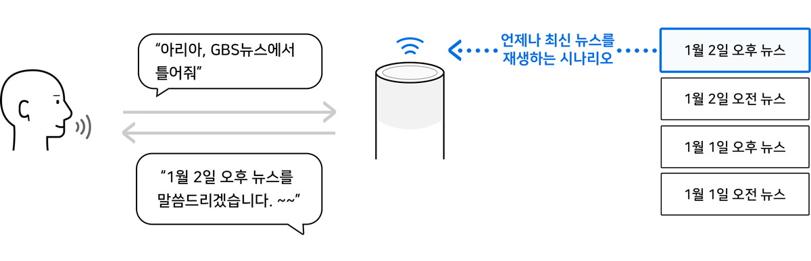

# Custom Intent 정의하기

AudioPlayer Interface에서 제공하는 Built-in Intent 외에 추가로 사용할 Custom Intent를 정의합니다. AudioPlayer를 개발할 때는 Built-in Intent의 종류와 용도를 정확히 파악하고, 시나리오에 따라 추가로 필요한 Custom Intent를 정의해야 합니다.


Built-in Intent에 대한 자세한 내용은 [Built-in Intent](../define-user-utterance-model/built-in-intents)를 참고하세요.


## 'play' Built-in Intent만으로 충분한 경우

Built-in Intent 중 NUGU.INTENT.play는 단독 발화인 경우에만 동작합니다. 즉, 특별한 Entity 없이 "틀어줘"와 같이 재생을 명령하는 경우에만 분석이 됩니다.

## 특정 음악을 틀어주는 Play를 개발하는 경우

만약, 개발하고자 하는 Play에서 "클래식 음악 틀어줘"와 같이 Entity로 분석되어야 하는 항목을 포함하는 경우에는 Built-in Intent만으로 표현할 수 없기 때문에, Custom Intent로 정의를 해주어야 합니다.


'play' Built-in Intent를 처리하는 Action을 추가로 정의하여 Entity를 지정하지 않은 경우의 동작 시나리오를 구현할 수도 있습니다.

