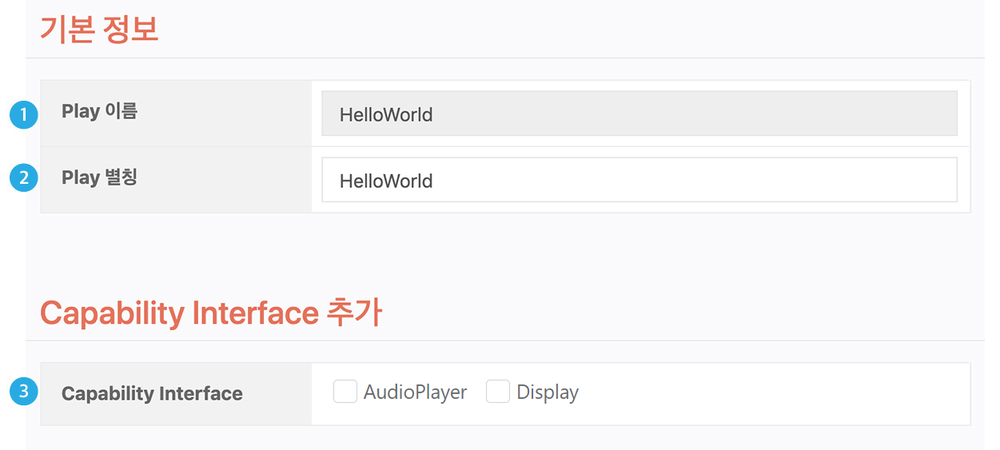
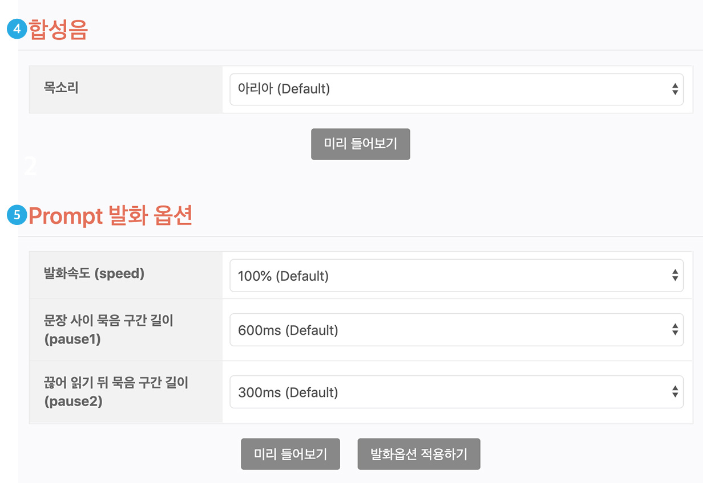
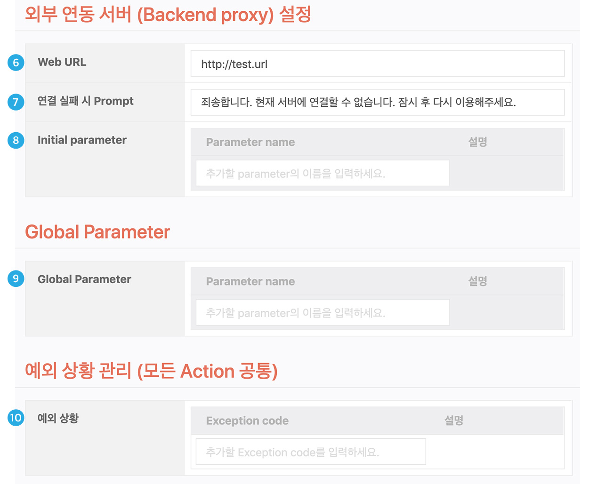
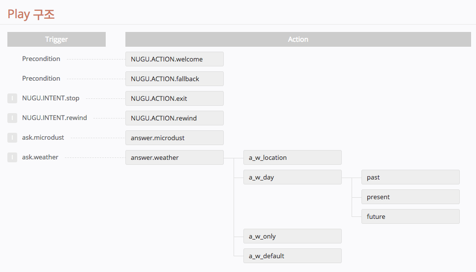
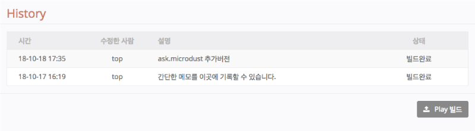

# Play 설정하기

Play를 처음 생성한 뒤 좌측의 `General`의 하위 메뉴에서 Play와 관련된 설정을 할 수 있습니다. 이 설정은 Play를 만드는 데 있어 필수 사항은 아닙니다.

## 기본 정보(`General` > `기본 정보`) 

**① Play 이름**\
Play를 생성할 때 등록한 것으로서, Play Builder 내에서 ID 역할을 하며, 중복과 변경이 허용되지 않습니다.

**② Play 별칭**\
Play Builder 내에서 사용되는 것으로 여러 버전의 Play를 만들고 관리할 때, 식별을 쉽게 하기 위한 용도로 활용 가능합니다. 별칭은 중복이 허용되며, 별도로 정의하지 않으면 Play 이름이 그대로 지정됩니다. 홈 화면의 Play List에서는 Play 별칭을 보여줍니다.

**③ Capability Interface**\
NUGU에서 제공하는 Capability Interface를 사용하여 Play를 만들 경우, 사용할 Interface를 체크하면 사용이 가능하며 여러 개의 Interface 간 중복해서 사용할 수 있습니다. 단, Capability Interface를 사용하기 위해서는 Backend proxy와 필수적으로 연동되어 있어야 합니다.


현재는 AudioPlayer Interface와, Display Interface를 지원합니다.  자세한 내용은

[AudioPlayer Interface 지원하는 Play 만들기](./create-a-play-with-audioplayer)

[Display Interface ](./use-backend-proxy/capability-interfaces/display-interface)

를 참고하세요.


**④ 합성음 목소리**

기본으로 제공하는 합성음은 `아리아`이며 추가로 `벨`이라는 목소리를 제공합니다. 원하는 목소리를 선택하여 Play를 만들 수 있습니다. 하나의 Play는 하나의 목소리만 가질 수 있습니다.

합성음 목소리는 다음과 같은 특성을 가지고 있습니다. (\* 20문장 합성음 측정 결과)

| 목소리    | 아리아                 | 벨                  |
|--------|---------------------|--------------------|
| 스타일    | 대화체                 | 낭독체                |
| 톤      | 높음 (평균 223㎐*)       | 보통 (평균 208㎐*)      |
| 톤 변화도  | 많음 (평균 46㎐*)        | 적음 (평균 39㎐*)       |
| 발화 속도  | 보통 (4.65음절/초*)      | 빠름 (5.01음절/초*)     |
| 음색     | 밝음, 명랑, 부드러움, 여성적   | 차분, 명확, 안정적, 중성적   |
| 용도     | 대화, 안내              | 정보 전달              |

**⑤ Prompt 발화 옵션**

음성 합성의 속성을 조절하는 옵션입니다. 발화 속도, 음의 높낮이, 문장 간 묵음의 길이, 끊어 읽을 때의 묵음 길이를 각각 설정할 수 있습니다. 이 페이지에서의 설정은 이 Play 내에 모든 prompt 발화 옵션을 일괄 조정하는 옵션입니다. `발화 옵션 적용하기` 버튼을 클릭한 이후에 만들어진 prompt부터 옵션이 적용되며, 각 문장 우측의 버튼을 통해 확인이 가능합니다.


발화 옵션에 대한 자세한 내용은 [발화 옵션 사용하기](./define-an-action/use-responses/use-prompts#use-utterance-options)를 참고하세요.


## 외부 연동 서버 설정 및 예외 상황 관리(`General` > `외부 서버 연결 정보`) 

**⑥ Web URL**

외부 연동 서버(Backend proxy)의 Web URL을 입력합니다.

http:// 또는 https://를 함께 입력해주세요. 1 글자 이상 입력하면 추가 메뉴가 노출됩니다.


외부 연동 서버(Backend proxy)는 80, 443, 8080, 8443 포트만 지원합니다.


**⑦ 연결 실패 시 Prompt**

외부 연동 서버(Backend proxy)와의 연결에 실패한 경우에 제시되는 에러 메시지입니다.

'Web URL' 항목을 입력하면 해당 항목이 나타납니다.

**⑧ Initial Parameter**

Play가 최초 동작하는 시점부터 Parameter가 필요한 경우, 이곳에서 정의하고 Backend proxy를 통해 가져올 수 있습니다. 'Web URL' 항목을 입력하면 해당 항목이 나타납니다.

**⑨ Global Backend Parameter 정의하기**

Parameter는 Utterance Parameter와 Backend Parameter 두 가지로 구분됩니다. Utterance Parameter는 사용자의 발화에서 부가 정보를 담는 Parameter이며, Backend Parameter는 Backend Proxy에서 받은 데이터를 담는 Parameter입니다.

Parameter는 액션 내에서 정의하여 사용하는 것이 일반적이지만, Global Backend Parameter는 미리 정의한 뒤 Play 내에서 공통으로 사용할 수 있습니다. 이 곳에 추가된 Parameter는 Play 내의 모든 Action에 상속됩니다.

**⑩ 예외 상황 관리(모든 Action 공통)**

Play에서 정상적인 응답을 못하는 경우(예: 콘텐츠 서버의 무응답, 지원하지 않는 범위의 요청 등)를 Exception Code로 추가하고, 이 때 제시될 Prompt를 정의합니다.

모든 Action에 공통으로 적용됩니다.


예외 처리에 대한 자세한 내용은 [예외 상황 관리](./define-an-action/manage-exceptions)를 참고하세요.


## Play 구조(`General` > `Play 구조`)

Intent(혹은 precondition)와 Action과의 관계 및 Action Tree를 보여줍니다.

## 빌드/History(`General` > `빌드 / History`)

빌드 이력(History)을 확인할 수 있습니다. 또한, 이 페이지에서도 `Play 빌드` 버튼을 이용하여 Play를 빌드할 수 있습니다.

