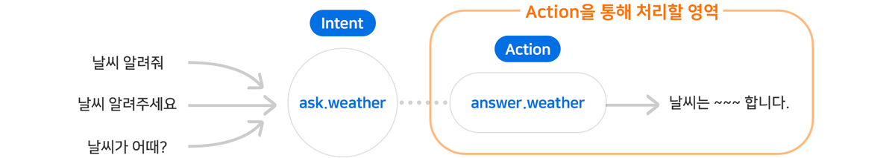
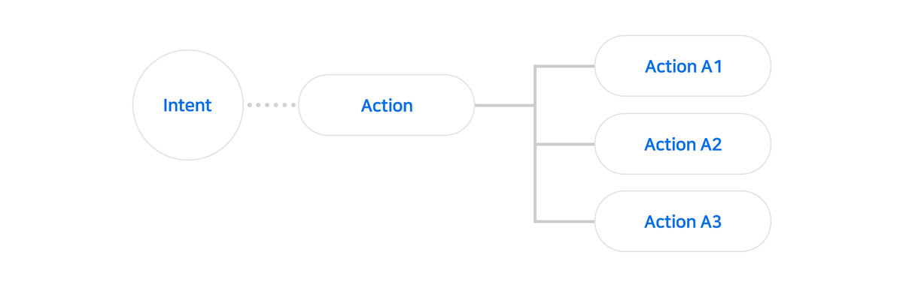

# Action 정의하기

사용자의 발화를 예상하여 만든 User Utterance Model에서 정의된 Intent들이 실제로 NLU 엔진을 통해 분석되었을 때 이를 처리하는 것이 Action입니다. 즉, Action은 Play 내에서 사용자의 발화에 대해서 답변하거나 명령을 수행하는 역할을 합니다.

[아리아, 안녕!](./hello-aria)에서 살펴보았듯이 Intent를 처리하기 위해 하나의 Action을 만들고, 이 Action에 응답을 작성할 수 있습니다. 이때의 Intent를 Action의 Trigger라고 표현하며 이 Intent가 들어오면 항상 연결된 Action이 동작하게 됩니다.

이와 같이 Action은 하나의 Intent를 처리하는 역할을 하기도 하지만, Action 하위에 또 다른 Action을 추가하여 Tree 구조를 만든 뒤 응답을 작성할 수도 있습니다.


Action Tree에 대한 자세한 내용은 [Branch Action 사용하기(Action Tree 만들기)](./define-an-action/use-branch-actions)에서 알아보도록 하겠습니다.

