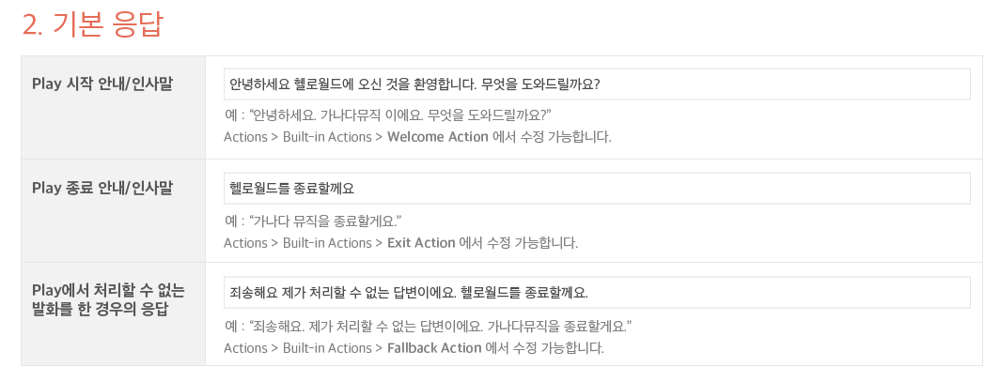
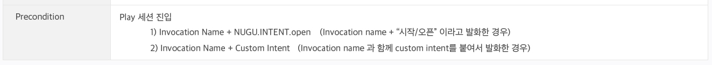
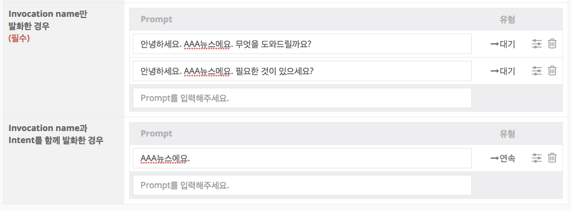
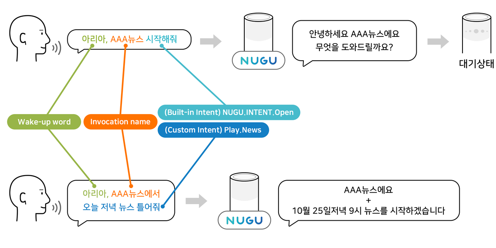
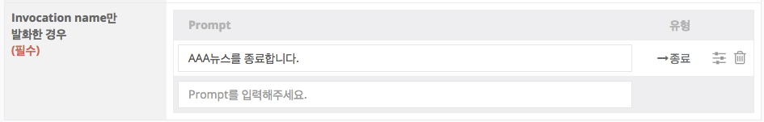
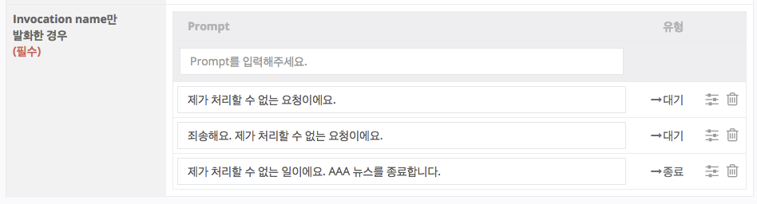
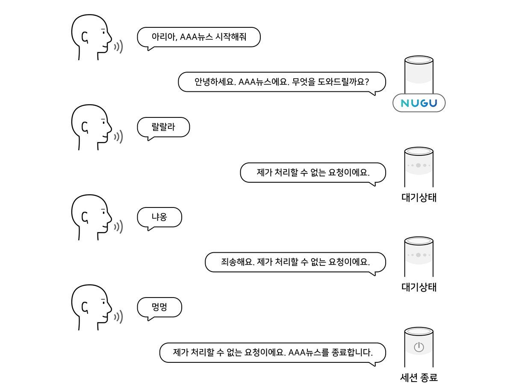

# Built-in Actions

Play Builder의 사용자가 Play를 만들면서 생성한 Action을 Custom Action이라고 하며, 꼭 만들어야 하거나 만들기를 권장하는 Action을 미리 생성하여 Built-in Action으로 제공하고 있습니다.

모든 Play에서 항상 정의해야 하는 Action 4개는 Play를 만들 때 자동으로 생성됩니다.

Built-in Action은 다음과 같습니다.

이 Action들은 Play를 처음 만들 때 입력하는 3개의 응답을 통해 생성됩니다.

위 액션들을 어떻게 활용하는지 좀 더 상세히 알아보도록 하겠습니다.

## NUGU.ACTION.welcome

(1) 기기 대기(IDLE) 상태에서 '아리아 XXX 시작'과 같이 Play 호출이름(Invocation name)과 NUGU.INTENT.open을 함께 발화하거나,

(2) 기기 대기(IDLE) 상태에서 '아리아 XXX에서 ~~ 해줘' 와 같이 Play 호출이름과 해당 Play 내의 Custom Intent를 함께 발화하여 Play로 진입하게 되었을 때 동작하는 Action입니다.

각 상황별(Case)로 응답(prompt)이 다르며, Action 내에서 각각 정의할 수 있습니다.

(1)의 경우에는 'Invocation name만 발화한 경우'에 해당하는 Prompt가 발화되며, Prompt가 발화된 이후 세션 대기 상태로 넘어가며, 이러한 Prompt를 '대기 Prompt'라고 합니다.

(2)의 경우에는 'Invocation name과 Intent를 함께 발화한 경우'에 해당하는 Prompt가 응답의 앞에 붙어서 발화됩니다. 이러한 Prompt를 '연속 Prompt'라고 합니다.

## NUGU.ACTION.exit

사용자가 Play의 세션 안에서 '그만', '멈춰' 등 NUGU.INTENT.stop에 해당하는 발화를 한 경우에 동작합니다. Prompt가 발화된 이후, 세션이 종료되고 IDLE 상태로 돌아갑니다. 이러한 Prompt를 '종료 Prompt'라고 합니다.

### NUGU.ACTION.fallback 

사용자가 Play 세션 내에서 발화를 했지만 처리할 Intent가 없는 경우에 동작합니다.

처리할 Intent가 없는 상황 즉, Fallback 상황은 종료 유형과 대기 유형을 혼합하여 Prompt를 구성하는 복합 유형입니다.

가장 처음 입력하는 Prompt는 '종료 Prompt'가 되며, 이후에 입력하는 것은 '대기 Prompt'가 됩니다.

즉, 마지막 발화부터 입력하는 스택(Stack) 구조이며, LIFO(Last In First Out; 후입선출)로 동작합니다.


prompt 대신 [Common Action](./use-common-actions)을 선택하여, 적절한 Directive를 사용하거나, Backend Proxy와 연계한 액션으로 처리도 가능합니다.


## NUGU.ACTION.rewind

사용자가 '다시', '다시 틀어줘', '재시작' 등과 같이 NUGU.INTENT.rewind에 해당하는 발화를 한 경우에 동작하는 Action입니다.\
이 Action은 Response는 갖지 않으며, 최근 응답을 처음부터 재생하는 명령을 수행합니다.


이 장과 함께 보면 좋은 도움말

* [Action Tree 알아보기](./use-branch-actions)

