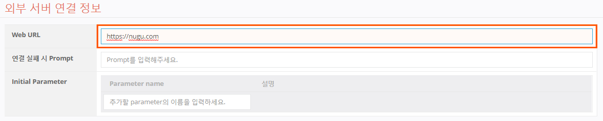
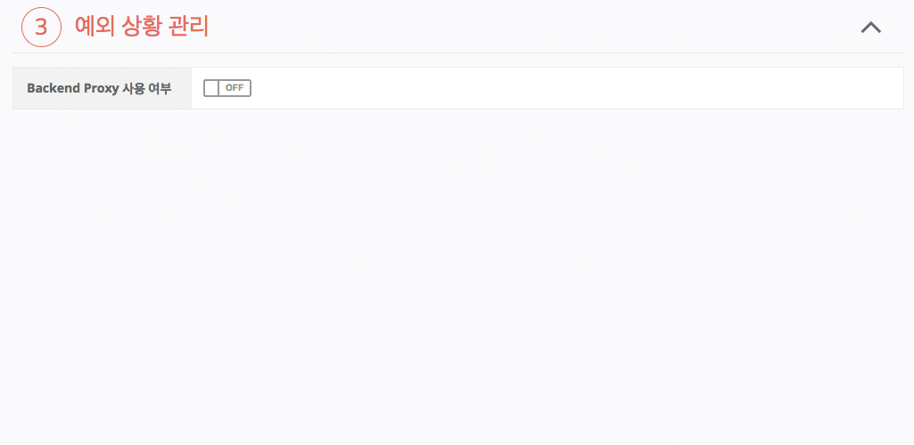
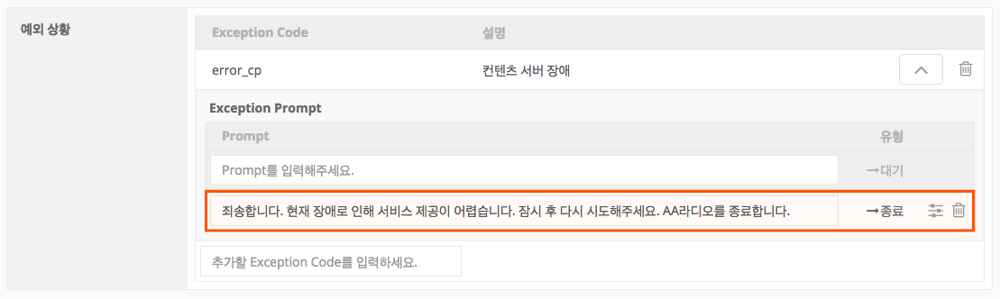
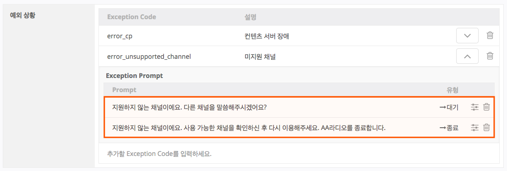
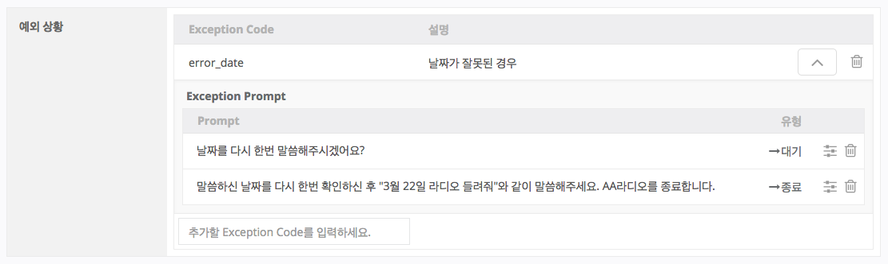
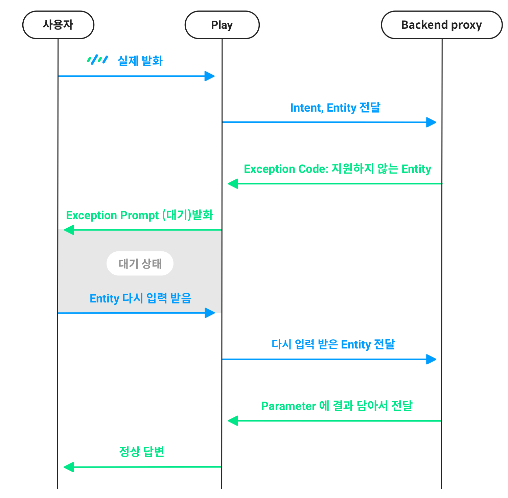

# 예외 상황 관리

Play가 동작하는 과정에서 정상적인 응답을 하지 못하는 경우가 발생할 수 있습니다. '예외 상황 관리'는 이렇게 정상적인 응답을 못하는 경우를 별도로 관리하는 공간으로, Exception Code와 그 상황에 나가게 될 메시지를 Prompt로 작성할 수 있습니다. 어떠한 상황이 예외 상황에 해당한다는 판단은 Backend proxy에서 하며, Backend proxy에서 Exception Code를 전달받으면, Action은 동작을 멈추고 Exception Prompt를 사용자에게 전달하게 됩니다.

예외 상황 관리는 Play의 모든 Action에 자동으로 적용되게 하거나 각 Action별로 설정할 수 있습니다. 각 Action별로 정의한 Exception Code는 해당 Action에서만 유효합니다. 예외 상황 관리는 Backend proxy의 URL이 등록되어 있어야 하고, Action의 Backend proxy 사용여부가 On으로 설정 되어 있어야 합니다.

## 예외 상황 등록 방법

1. 외부 연동 서버(Backend proxy)의 URL을 입력합니다.
   * http:// 또는 https://를 함께 입력해야 합니다.

       
2. Backend proxy 사용 여부를 ON으로 설정합니다.
3. 예외 처리 영역에서 Exception Code를 작성하고 \[Enter] 키를 누릅니다.
4. Exception Prompt 필드에 응답할 Prompt를 입력한 후 \[Enter] 키를 누릅니다.
   * Exception Code 하나당 Exception Prompt는 총 2개까지 입력 가능합니다.
     
     입력창에 처음 입력하는 Prompt의 유형은 종료 Prompt로, 두번째로 입력하는 Prompt는 대기 Prompt로 자동 설정됩니다.
   * 예외 상황의 Prompt는 스택으로 구성되어, LIFO(Last In First Out)로 동작합니다.

       

예외 상황은 일반적으로 두 가지 종류가 있습니다.

1. 서버 장애, 네트워크 문제 등으로 인해 서비스 제공이 불가능한 경우
   * 사용자에게 서비스 제공이 불가능한 이유를 간단히 설명하고 세션을 종료해야 하므로 종료 Prompt만 등록해야 합니다.
2. 사용자의 발화에서 분석된 Entity에 문제가 있거나 Entity 간 정합성 문제 등으로 기능 동작이 불가능한 경우
   * 사용자에게 Entity에 대해 문제가 있음을 안내하고 종료 Prompt를 통해 세션을 종료할 수도 있으나 사용자로부터 정보를 입력받도록 대기 Prompt를 추가를 할 수도 있습니다.


Exception Prompt에서는 무엇이 문제인지를 간단하게 안내한 뒤, 해결 방법을 제시하여 사용자의 올바른 응답을 유도해야 합니다. 세션 종료를 하는 경우, 이를 안내해야 합니다.


라디오를 스트리밍으로 재생해주는 Play를 만드는 경우를 예로 들어 살펴보도록 하겠습니다. 이러한 서비스를 하는 경우에는 Play 외부에 존재하는 스트리밍 서버의 장애가 발생할 가능성이 있습니다.

이렇게 예상되는 장애는 (1)에 해당하므로 예외 상황으로 등록하여, 해당 장애 발생 시 사용자에게 정상적인 서비스가 불가능한 이유를 간단히 안내하고 세션을 종료해야 합니다. 이런 경우에는 Exception Prompt는 종료 Prompt 하나만 등록합니다.

그러나, 사용자가 요청한 채널이 미지원 채널인 경우는 (2)에 해당합니다. 이러한 경우에도 종료 Prompt만 사용하여 미지원 채널임을 안내하고 세션 종료할 수도 있지만, 대기 Prompt를 하나 더 추가하여 사용자에게 Entity를 다시 입력 받도록 대기 상태로 이동할 수도 있습니다.

사용자로 부터 목적 시간이나 날짜를 입력 받는 Play에서는, '2월 31일'과 같이 특정 월을 나타내는 Entity와 특정 일을 나타내는 Entity의 조합이 맞지 않는 경우가 발생할 수도 있습니다. 이런 경우도 (2)에 해당하며 예외 상황으로 등록하고 다시 입력받을 수 있습니다.

사용자 발화의 Entity를 체크하는 예외 상황을 등록했다면, 이 Exception Code가 동작하는 과정은 다음과 같습니다.

## Exception Prompt를 통해 이동한 대기 상태의 특징

대기 Prompt에 의해 활성화되는 대기 상태는 사용자가 발화한 Intent에 포커스를 둔 상태에서 추가로 발화를 듣는 상태입니다. 이 대기 상태에서는 사용자의 추가 발화로부터 Entity를 신규로 입력 받거나, 업데이트할 수 있습니다. 이 Entity는 해당 Action의 Utterance Parameter에 연결된 Entity Type일 때만 유효합니다.

예를 들어, "2월 31일 날씨 알려줘"라고 하여, 예외 상황으로 체크하고 대기 상태로 이동하였다고 가정하겠습니다. 사용자가 "2월 28일 금요일 날씨 알려줘"라고 다시 발화했다면, 특정 일를 의미하는 '31일'은 '28일'로 업데이트되고, '금요일'은 신규로 입력 받아 Parameter에 담아 Backend proxy로 다시 전달합니다.

즉, 정의되어 있으나 비어 있는 Utterance Parameter가 있다면 해당 Parameter를 Entity로 채울 수 있고, 이미 Parameter를 채운 Entity와 같은 Type의 값이 있다면 기존 Parameter의 값을 새로운 Entity로 대체하게 됩니다. 이 Exception Prompt를 통한 대기 상태에서는 이와 같이 Entity만 추가로 받을 수 있습니다. 사용자의 발화로부터 추가 발화를 입력 받아도 Entity를 채울 수 없는 경우에는 두 번째 Exception Prompt를 내보내고 세션이 종료됩니다.

## Global Exception Case 정의 

Play 내에서 공통으로 사용할 Exception Case는 `General` > `외부 연동 서버 설정` > `예외 상황 관리` 에서 정의하고 사용할 수 있습니다. 이 곳에서 정의한 Exception Case는 모든 액션에 상속됩니다.
