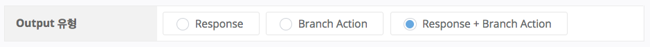
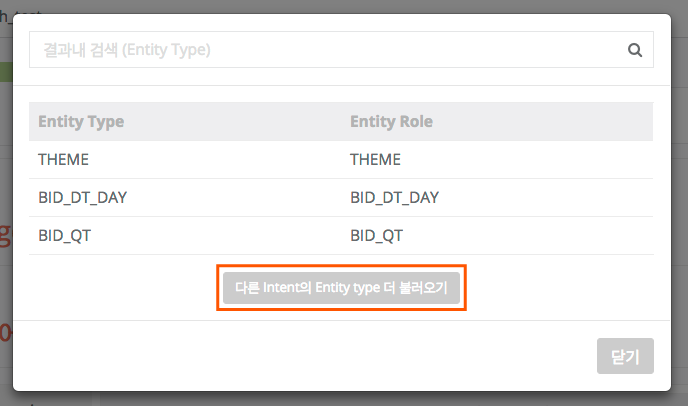
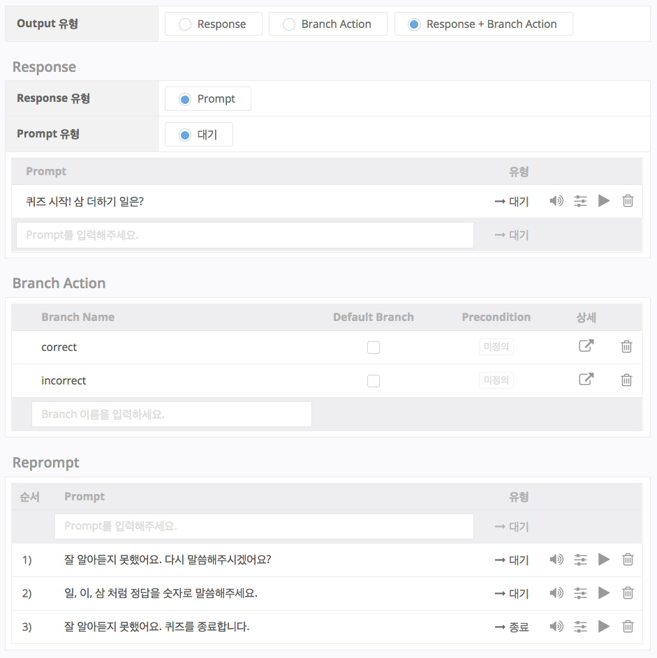

# Response + Branch Action (멀티턴 대화)

지금까지는 Response 혹은 Branch Action만을 이용하여 대화를 구성하는 법을 알아보았습니다. 이렇게 만들어진 Play는 싱글턴의 대화만을 구성할 수 있습니다. Action Tree를 복잡하게 구성하여도 Tree의 끝 Action만 Response를 갖기 때문에 결국은 싱글턴의 대화만 이루어지며, 세션 안에서 여러 번의 싱글턴 대화를 반복할 뿐 기존 대화의 컨텍스트를 이어갈 수는 없습니다.

그러나, Output의 세번째 유형 Response + Branch Action을 통해서는 컨텍스트를 이어 가는 멀티턴 대화를 구성할 수 있습니다. Response + Branch Action이 선택된 Action은 Response를 내보낸 뒤에 사용자의 발화를 다시 듣고, Branch Action 중 조건을 만족시키는 Action으로 이동합니다.

Response + Branch Action는 세 요소로 구성됩니다.

* Response
* Branch Action
* Reprompt

## Response의 특성

Response + Branch Action의 Response는 대기 Prompt만 사용할 수 있습니다. 이 대기 Prompt 발화 후에는 세션 초기로 돌아가지 않고, 직전 사용자 발화 정보를 유지한 채 사용자 발화를 다시 듣는 대기상태로 이동합니다. 이 대기 상태에서 사용자가 새로운 Intent를 발화하거나 Entity만을 발화를 한 경우, 그 Intent/Entity가 precondition으로 지정된 Branch Action이 있는 지 순차적으로 탐색하여 조건을 만족시키는 Action으로 이동하게 됩니다.

## Branch Action의 특성 

Response + Branch Action의 Branch Action은 Default 지정이 필수가 아닙니다. Branch Action의 precondition을 하나도 만족시키지 못한 경우 Default Branch로 이동하며, Default Branch가 없을 경우 Reprompt를 발화합니다.

Branch Action을 만들 때, precondition으로 사용할 Entity가 첫 Intent에 없으면 Branch Action의 precondition을 정의할 수 없습니다. 이 경우, Utterance Parameter의 Entity mapping 팝업 창에서 '다른 Intent의 Entity Type 더 불러오기' 버튼을 눌러, Play 내 모든 Entity Type을 가져 온 다음 원하는 Entity Type을 Utterance Parameter에 매핑하여 사용할 수 있습니다.


다른 Intent에서 Entity type 더 불러와서 Utterance Parameter에 mapping을 한 후에는, 불러온 Intent 수정이 되지 않습니다. 해당 Intent를 수정하기 위해서는 Entity mapping을 끊어줘야 합니다.


## Reprompt의 특성

Default Branch를 지정하지 않은 경우에는, Reprompt를 1개 이상 정의해야 합니다. Reprompt는 마지막 발화부터 입력하는 스택 구조이며 LIFO(Last In First Out)로 동작합니다. 여러 개의 Prompt를 입력하면 가장 마지막에 입력한 Prompt부터 차례대로 사용자에게 응답하게 됩니다.

Reprompt를 2개 이상 입력한 경우, 두번째 Prompt부터는 대기 Prompt로 지정됩니다. 이 대기 Prompt가 발화된 후에는 멀티턴 시작 Response 후의 대기 상태로 이동하여 다시 사용자의 발화를 듣습니다. 이렇게 이동한 대기 상태도 기존의 컨텍스트를 유지한 채 다시 사용자의 발화를 듣는 대기 상태입니다.


Reprompt에서 2개를 초과하는 대기 Prompt 사용은 피해주세요.

