# Branch Action (Action Tree)

하나의 Intent 를 처리하는 최소 단위인 Action 은 사용자가 어떠한 의도를 가지고 발화했을 때 그 발화를 해결하는 기능을 담고 있습니다. 하나의 Play 안에서 처리하고자 하는 Intent 가 여러 개라면 아래 그림처럼 그 Intent 의 수 만큼 Action 을 만들어야 사용자의 발화에 대해 적절한 응답 혹은 동작을 수행할 수 있게 됩니다.

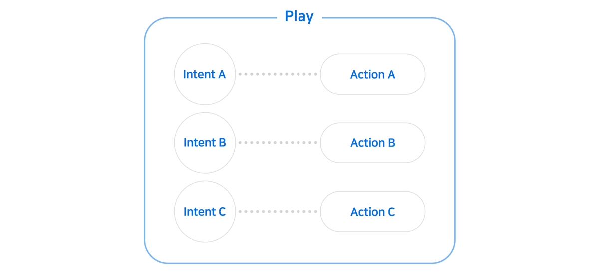

그러나 하나의 Intent 라도 그것을 처리하는 로직이 복잡할 경우 하나의 Action 만으로는 응답이 어려울 수 있습니다. 예를 들어, 날씨를 알려달라는 사용자의 요청에 대해 과거/현재/미래 별로 다른 응답을 하고 싶은 경우 하나의 Action 만으로는 구현이 쉽지 않습니다. 이때, Action 하위에 다시 Action 을 만드는 Action Tree 를 만들어, 조건에 맞는 응답 혹은 동작을 수행할 수 있습니다.

## Action Tree

[아리아, 안녕!](../hello-aria)에서는 하나의 Intent 를 처리하는 Action 을 하나만 만들어서 응답을 정의했습니다.

그러나 같은 의도이더라도 조금씩 다른 요구사항이나 조건들이 있기 때문에 이를 하나의 Action 에서 처리하려면, 모든 조건들을 서버 개발자가 if 문을 사용하여 코딩을 해야합니다. 이렇게 예상 가능한 모든 경우(case)마다 하나의 if 문을 개발자가 작성했다 하더라도, 개발이 된 후에는 어떤 상황에 어떻게 응답하는지를 개발자가 아닌 사람은 파악하기 힘들고, 코드를 수정하는 것은 더더욱 어렵습니다. Play Builder 에서는 Action 을 상하관계로 중첩하여 Tree 를 구성하여 대화 구조를 구성할 수 있으며, 이렇게 구성된 대화는 유지 보수 또한 상대적으로 쉽습니다.

한 Action 하위에 2개의 Action 을 다음과 같이 추가할 수 있습니다. 이 때 Trigger 를 Intent 로 갖는 Action 을 Root 위치에 있다라고 하며, Root 에 하위에 있는 Action 은 Branch 위치에 있다고 합니다.

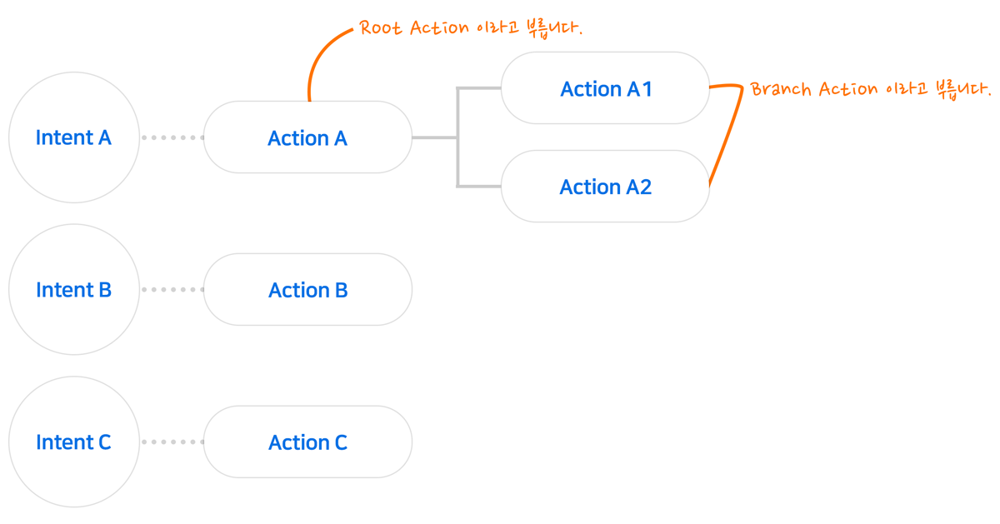

Action 의 하위에 여러 개의 Branch Action 을 만들 수도 있습니다. 그리고 각 Branch Action 하위에 Branch Action 을 하나 더 둘 수 있어 깊은 Tree 구조를 만들 수도 있습니다.

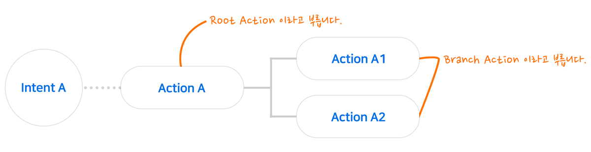

이러한 Tree 맨 끝(하위)의 Action 들은 반드시 응답(Response)을 가져야 합니다.

아래 예처럼 Branch 를 사용하여 하나의 "날씨 안내" Action 을 여러 개의 Action 으로 나누어 처리하는 것이 가능하며, 이렇게 Tree 구조를 만들게 되면 상황에 맞는 정확한 답변이 가능해집니다.

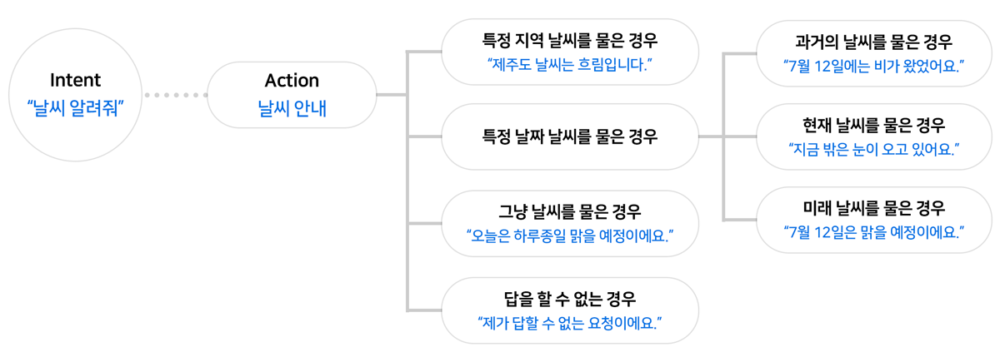

Branch Action 은 기본적으로 Root Action 과 같으나, Trigger 가 Intent 가 아니라 조건(Precondition)이라는 차이점이 있습니다.

위의 예처럼 '~~를 요청한 경우', '~~한 경우' 같이 조건이 Branch Action 의 Trigger 가 되며, 해당 조건이 만족했을 경우에만 그 Branch Action 이 실행됩니다.

조건이 만족하는지 여부는 상위 Action 에서 하위 Action 으로 내려오면서 차례로 판단이 이루어지며, 만족시키는 Action 이 하나라도 있으면 해당 Action 에서 정의한 응답(Response)가 실행되고 대화의 한 턴이 종료됩니다.

위 '날씨 안내' Action 에 대한 조건(Precondition)만 자세히 보면 다음과 같습니다.

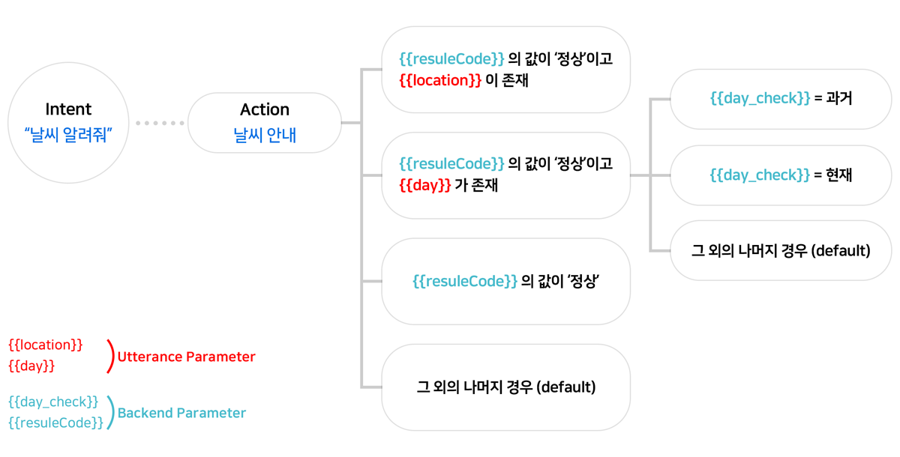

### Action Tree 만들기

앞에서 만들어 둔 Intent 인 'ask.weather' 와 Action 인 'answer.weather' 를 가지고 Action Tree 를 만드는 과정을 하나하나 알아보도록 하겠습니다.

1. Play Builder 홈 화면에서 Action 을 추가할 Play 를 클릭하여 선택한 후, `Actions` > `Custom Actions`을 누릅니다.
2. Acton List 에서 `answer.weather`를 선택합니다.

   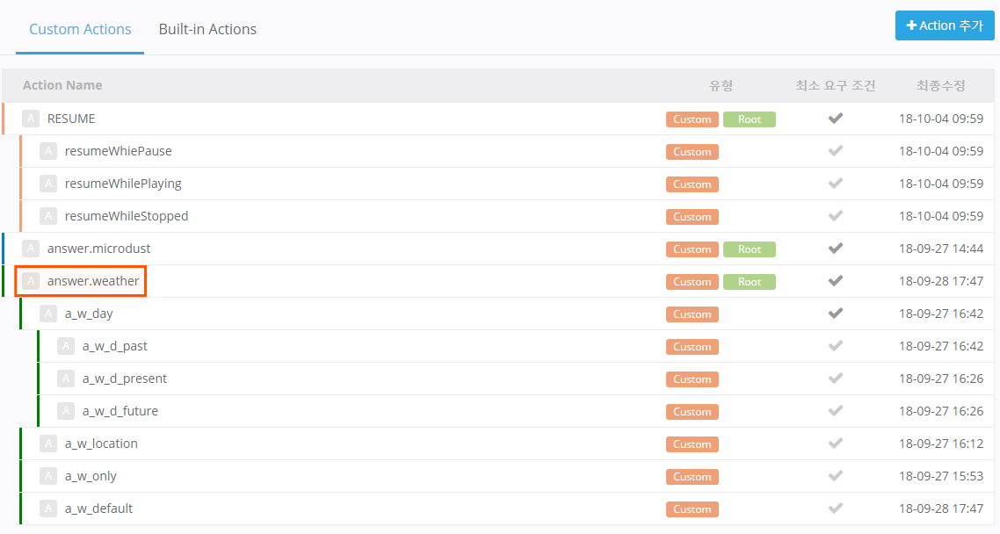
3. 응답에 필요한 정보 가져오기 영역에서 다음과 같이 Parameter 및 Backend proxy 사용 옵션을 설정합니다.

   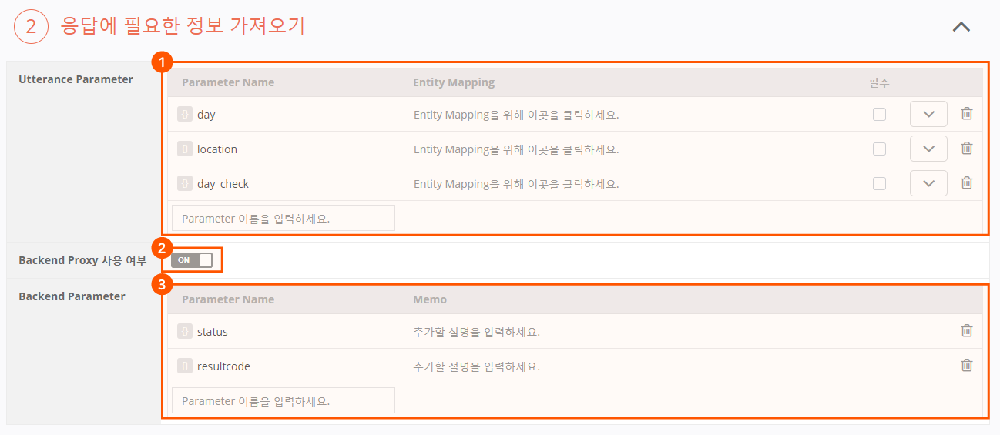

   * Parameter: 'day', 'location', 'day_check'
   * Backend proxy 사용 여부 : 'ON'
   * Backend Parameter: 'status', 'resultcode'
   * Parameter 등록 및 설정 방법에 대한 자세한 내용은 [Parameter](./use-parameters)를 참고하세요.
   * Output 정의 영역에서 `Branch Action` 버튼을 클릭하여 Output 유형을 Branch 로 선택합니다.

   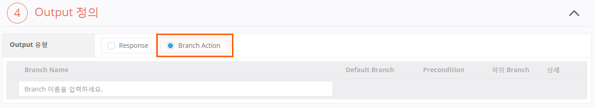
4. Output 정의 영역의 Branch Action list 내에 위치한 입력 필드에 Branch 명(하위 Action 명)을 입력한 후 `Enter` 키를 누르거나 입력 필드 외 영역을 마우스 왼쪽 버튼을 클릭하여 Branch 를 등록합니다.

   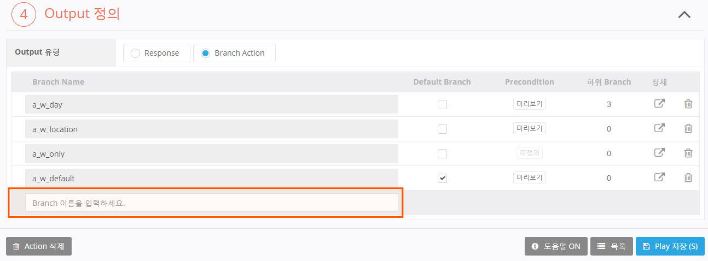

   * 그림과 같이 Branch Action 4개를 만들어줍니다.
   * Action 이름은 다른 Action 과 중복되지 않도록 하여 자유롭게 입력합니다.
   * Branch 를 만든 경우에는 하나를 반드시 Default Branch 로 지정해주어야 합니다.
   * Default Branch 는 Branch 의 Trigger 를 조건을 하나도 만족시키지 못한 경우에 실행되는 Action 이며, Default 로 선택된 Branch Action 은 Trigger 정의가 필요 없습니다.
   * Default 를 선택하면 자동으로 Branch Action list 최하단으로 이동하게 됩니다.
   * `Play 저장` 버튼을 클릭하여 지금까지 입력한 상황을 저장합니다. Branch Action 리스트의 상세 항목이 편집 상태로 변경됩니다.

   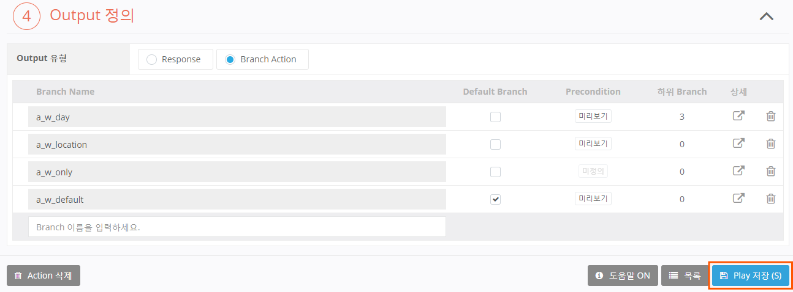

## `a_w_location` Branch Action 추가

1. Branch Action 별로 구체적인 설정을 하기 위해 설정할 Branch 의 항목 'a_w_location' 의 편집 버튼을 클릭합니다.

   
2. 이동한 Branch Action 설정 화면의 Trigger 영역에서 조건(Condition)을 추가하기 위해 `+` > `Condition` 버튼을 클릭하면 하단에 셀렉트 박스(Select Box)가 표시됩니다.

   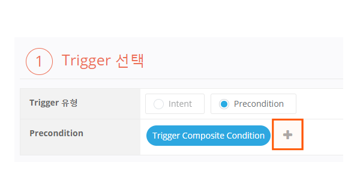

   * Branch Action 의 Trigger 는 Intent 가 아닌 Precondition 속성으로 자동 선택됩니다.
   * Condition 은 Trigger 가 될 하나의 조건입니다.

3. 첫 번째 셀렉트 박스에서 **resultcode**를 선택하고, 두 번째 셀렉트 박스에서 **다음과 같을 경우**를 선택한 후, 우측에 생긴 박스에서 **String**을 선택 상태로 두고 '정상' 이라고 입력합니다.

   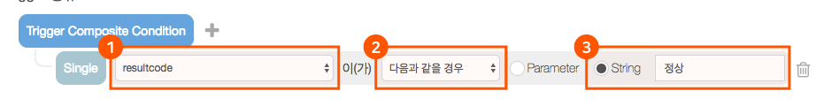

   * 이 설정은 resultcode 라는 Parameter 가 '정상'일 경우 이 Branch 를 실행한다라는 의미입니다.
   * `+` 버튼을 클릭하여 조건(Condition)을 하나 더 추가한 후 `+` 버튼 좌측에 생긴 And/Or 조건은 And 를 선택한 상태에서, 첫 번째 셀렉트 박스에서 **location**를 선택하고, 두 번째 셀렉트 박스에서 **존재하는 경우**를 선택합니다.
   
   

   * 지금까지의 설정으로 첫 번째 Branch Action 의 Trigger 가 완성되었습니다.
   * 이 Action 의 Precondition 은 이제 두 개의 Single Condition 이 AND 조건으로 묶인 Composite Condition 이 되었습니다.
   * 이것의 의미는 'resultcode' 라는 그릇 안에 '정상'이라는 값이 담겨 있으면서, 'location' Parameter 가 존재하는 경우'를 말합니다.

   그림으로 나타내어 보면 다음과 같습니다.

   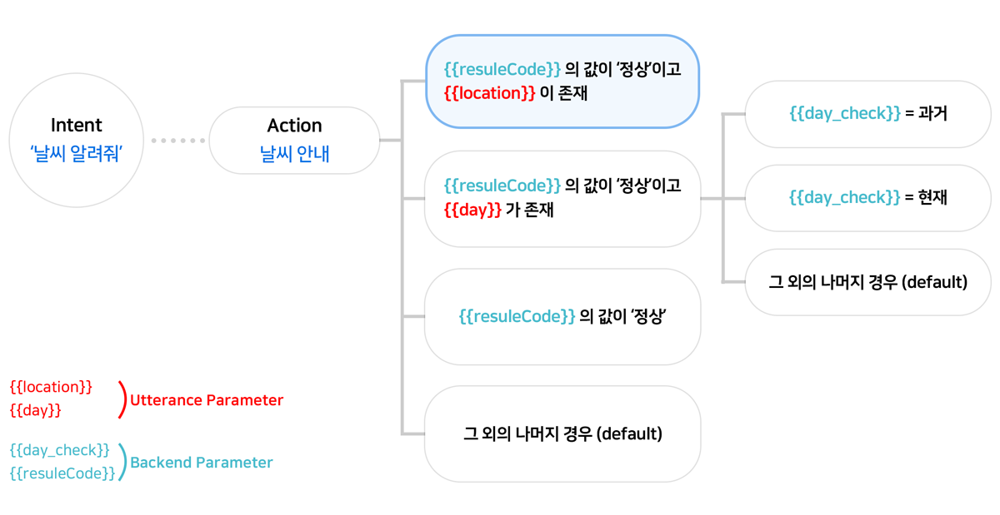
4. 이제 이 페이지의 Output 정의 영역에서 `Response` 버튼을 클릭하고, Prompt 에 "의 날씨는 ."라고 입력합니다. 이제 첫 번째 'a.w.location' Action 의 입력이 완료되었습니다.

   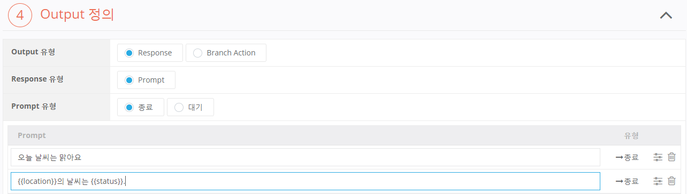

   * resultcode 파라미터값이 '정상'이면서 location 파라미터가 존재한다면, 즉 location 이라는 그릇에 아무 값이라도 담겨 있으면 이 'a.w.location' Action 이 동작하여 방금 입력한 값("의 날씨는 .")으로 응답하게 됩니다.

## `Branch Action` > `Branch Action` 추가

이제부터는 "a.w.day"라는 Branch Action 하위에 또다른 Branch Action 을 추가하는 방법에 대하여 설명합니다.

1. 위 'a.w.location' 설정과 동일한 방법으로 다음 그림과 같이 'a.w.day' 를 설정합니다.

   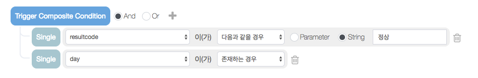
2. Output 정의 영역에서 `Branch Action` 버튼을 클릭하여 Output 유형을 Branch 로 선택합니다.

   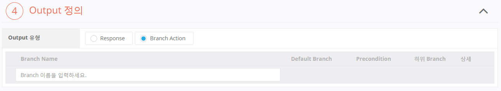
3. Output 정의 영역의 Branch Action List 내에 위치한 입력 필드에 Branch 명(하위 Action 명)을 입력한 후 `Enter` 키를 눌러 Branch 를 등록합니다.

4. 다음과 같이 3개의 Branch 를 새로 만듭니다.

   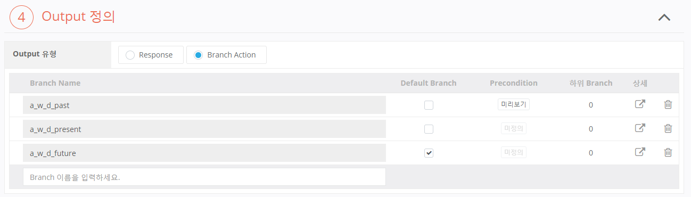
5. Branch 중 하나(예:a_w_d_future)를 선택(V 표시)하여 "Default Branch"로 지정한 후, `Play 저장` 버튼을 클릭하여 지금까지 입력한 상황을 저장합니다.

6. Branch Action 리스트의 상세 항목이 편집 상태로 변경됩니다.

   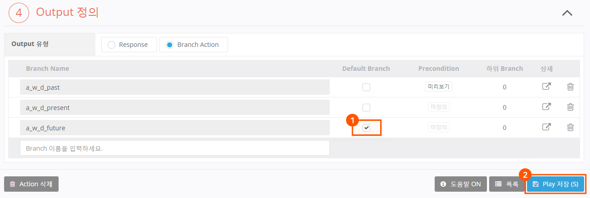
7. Branch Action 별로 구체적인 설정을 하기 위해 설정할 Branch 의 항목(예: a_w_d_past)의 편집 버튼을 클릭합니다.

   
8. "a_w_location" 설정과 동일한 방법으로 "a_w_day"의 각 Branch Action 을 다음과 같이 정의합니다.

9. a_w_d_past

   * Trigger : day_check == 과거
   * Response : 에는
10. a_w_d_present

    * Trigger : day_check == 현재
    * Response : 지금 밖은
11. a_w_d_future

    * Trigger : 자동입력
    * Response : 은
12. 마지막으로, 남은 "a_w_only"와 "a_w_default" Branch Action 을 동일한 방법으로 다음과 같이 정의합니다.

13. a_w_only

    * Trigger : == 정상
    * Response : 오늘은
14. a_w_default

    * Trigger : 자동입력
    * Response : 제가 답할 수 없는 요청이에요

15. 이로써 위에서 예로 든 구조의 Action Tree 가 구성되었습니다. 이를 다시 그림으로 살펴보면 다음과 같습니다.

    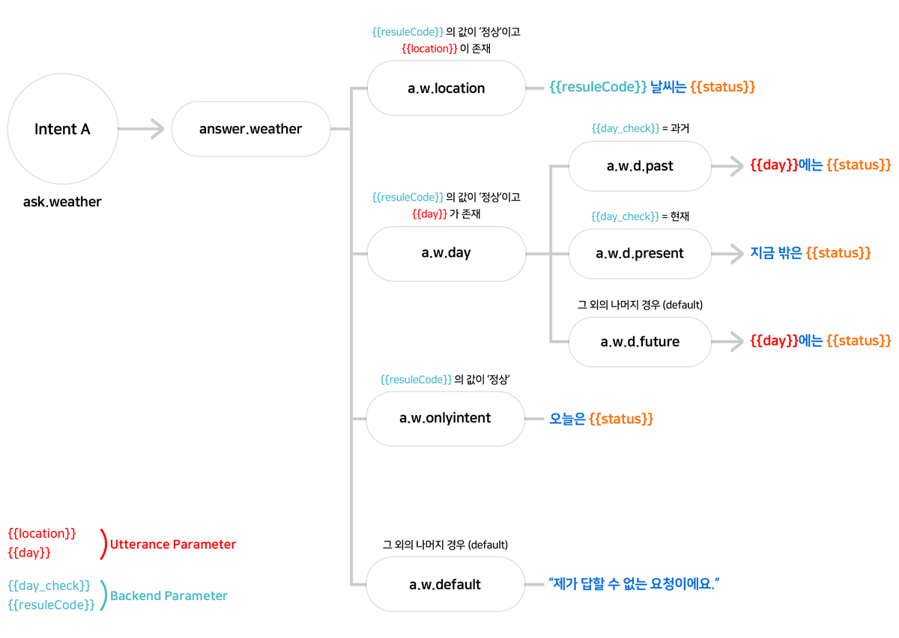


어떤 Action 이 Backend proxy 를 사용함으로 설정하고 Backend Parameter 를 정의하여 값을 받아온 경우 그 하위의 Action 들은 해당 Parameter 를 사용할 수 있습니다.



이 장과 함께 보면 좋은 도움말

* [Response Filter 사용하기](../define-response-filters)
* [Response 에서 조사 사용하기](./use-responses/use-prompts#process-postpositions)
* [Response 에서 발화 옵션 사용하기](./use-responses/use-prompts#use-utterance-options)

