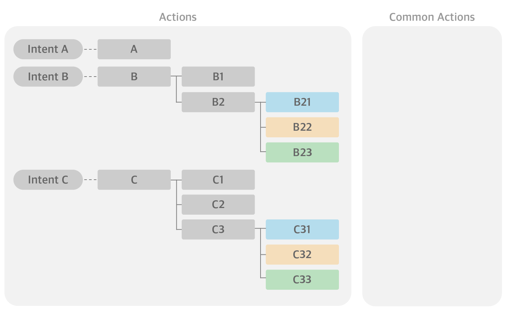
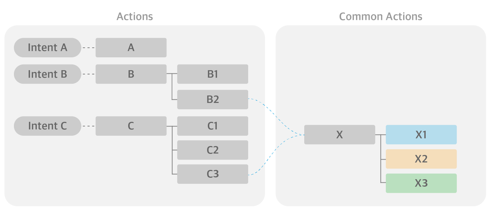
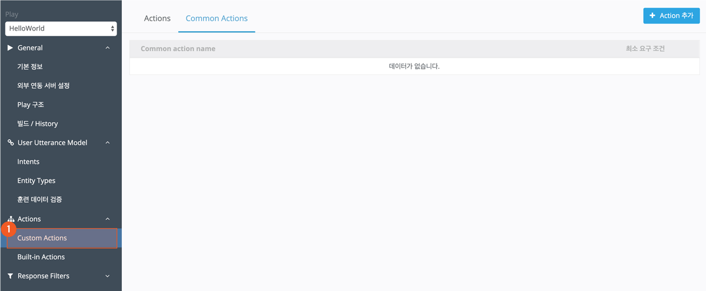
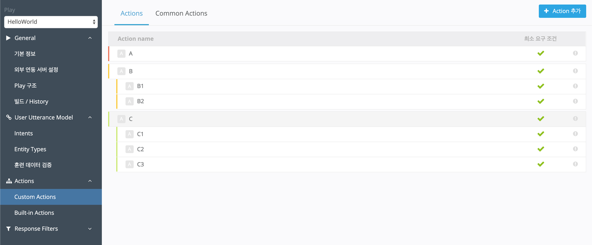
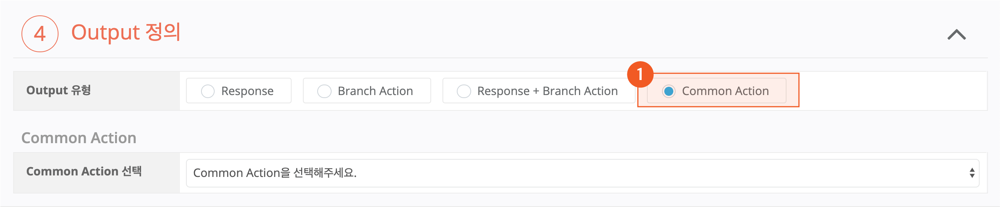

# Common Action 사용하기

Common Action이란 여러 액션이 공통으로 사용할 수 있는 액션입니다. 이 Common Action은 일반 액션과 유사하나 Trigger가 없고 어떤 Action에서 이 Common Action으로 이동할지 정의해야 하는 특징이 있습니다.

Play를 만들면서 동일한 Action을 여러 번 만들어야 하는 경우, Common Action을 통해 이러한 반복 작업을 줄일 수 있으며, 전체 Play를 이해하기 쉽도록 단순하게 구성할 수 있습니다. 3개의 Intent를 처리하는 Play를 예로 Common Action을 알아보겠습니다.

이러한 구성의 Play에서, B2의 Output인 B21, B22, B23과 C2의 Output인 C31, C32, C33이 각각 같은 응답을 하는 액션인 경우, 위와 같이 각각 정의할 수도 있습니다. 그러나, 중복이 되는 액션을 아래와 같이 Common Action으로 만들어 구성할 수 있습니다.

Common Action에서 X, X1, X2, X3를 만든 뒤, B2와 C3에서 이동할 액션으로 X로 지정을 하면 기존과 동일하게 동작하게 됩니다.

이제, 실제 화면을 통해 Common Action 만드는 법을 알아보겠습니다.

1. `Custom Actions`의 화면 상단 탭에서 `Common Actions`으로 이동한 뒤, `Action 추가` 버튼을 누른 뒤, Action 생성 페이지를 열어 Common Action을 생성합니다.

   
2. 일반 Action을 만듭니다.

   
3. Common Action과 연결할 Action(B2, C3)으로 이동하여, `Output 유형` > `Common Action`을 선택하고, 이동할 Common Action을 선택합니다.

   

Common Action은 다른 액션과 같이 Parameter를 정의하여 사용할 수 있습니다. 다만, Trigger Intent가 없기 때문에, Utterance Parameter에서 Entity mapping 시, 모든 Intent의 Entity Type 리스트가 노출됩니다. Backend Parameter는 액션 내에서 정의하여 사용할 수 있고, `외부 연동 서버 설정` > `Global Parameter`에서 정의한 Global Parameter를 상속받아 사용할 수도 있습니다.

다음의 위치에서 Common Action으로 이동할 수 있습니다.

* 일반 Action
* Common Action
* NUGU.ACTION.fallback (Built-in Action)


Common Action끼리 순환 호출을 하는 경우 Play는 정상 동작을 하지 않고 강제 종료됩니다.



이 장과 함께 보면 좋은 도움말

* [Global Backend Parameter](../customize-a-play#setting-backend-proxy)

