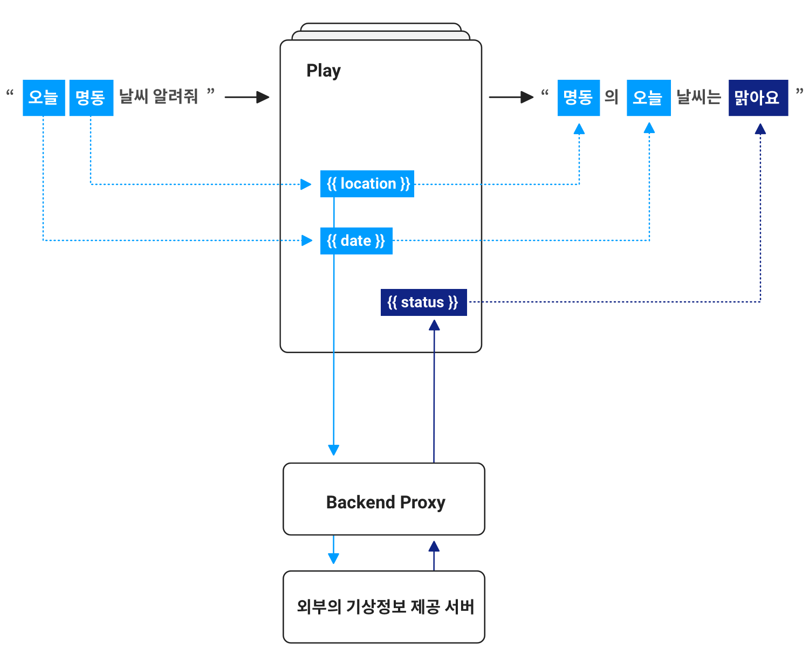

# Parameter

## Parameter 사용하기 

앞서 [아리아, 안녕!](../hello-aria)에서 사용자의 발화에 대해 응답하는 아주 간단한 Play를 만들어보았습니다.

이 Play는 사용자의 발화에 대해 똑같은 말만 반복하기 때문에 실제 활용도는 낮습니다. 사용자에게 의미있는 서비스가 되기 위해서는 정보가 필요합니다. 이 정보를 어딘가로부터 가져와서 Play에서 응답을 만들 때 활용하기 위해서는 이 정보들을 담아두는 Parameter라는 것이 필요합니다.

Parameter는 정보를 담아두고 사용하는 일종의 그릇입니다. Play에서 응답을 만들 때 문장 내에 parameter를 입력하면, 해당 Parameter에 담긴 정보(Entity)에 따라 Play가 응답합니다.

이러한 Parameter는 정보를 어디서 가져오는가에 따라 Utterance Parameter와 Backend Parameter로 구분됩니다. Utterance Parameter는 사용자의 발화에서 가져온 정보를 담는 Parameter이며, Backend Parameter는 외부 서버 등 사용자의 발화 외의 곳에서 정보를 가져와 담는 Parameter입니다.

