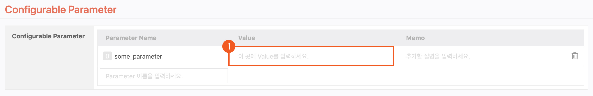
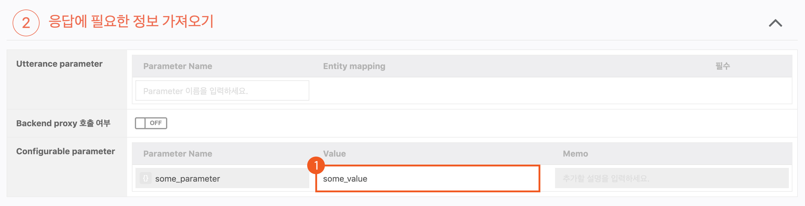

# Configurable Parameter

Configurable Parameter는 Backend Parameter와 유사하지만 Play Builder를 통해 Play에서 Parameter의 값을 변경할 수 있는 Parameter 입니다.

Configurable Parameter는 다른 파라미터처럼 Global 설정이나 어떤 액션에서 정의하여 사용할 수 있습니다.

Global 설정에서 파라미터를 정의한 뒤 Value 필드에 값을 넣으면 이 값은 파라미터의 기본값이 됩니다. Backend proxy에서 해당 값을 변경하지 않는다면, 여기에 넣은 값이 항상 들어있게 됩니다.

Global 설정에서 정의 했거나, 자신 보다 상위 액션에서 정의한 Configurable Parameter는 이름을 변경할 수 없지만 Value 필드는 수정 가능하도록 열려있게 되며, 여기서 입력한 값으로 파라미터의 값이 업데이트 됩니다.

Root Action에서 AAA라는 Configurable Parameter에 1이라는 값을 넣으면, 그 Root Action의 하위 액션에서는 AAA에 항상 1이 담기게 됩니다. 그러나 특정 Branch Action에서 AAA의 Value를 2로 지정하면, 해당 Branch Action에서 AAA 파라미터의 값은 2로 변경되게 됩니다.

이 파라미터를 통해, 특정 Branch Action의 동작을 Backend proxy와 상관없이 Play에서 직접 제어하거나, 특정 Branch Action에 도달했음을 Backend proxy에 전달할 수 있습니다.

