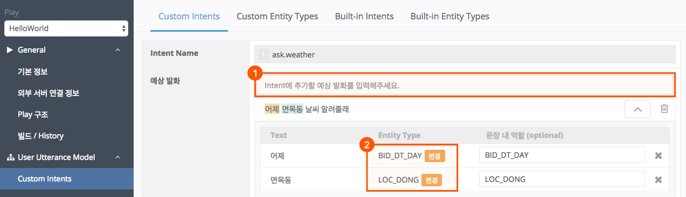
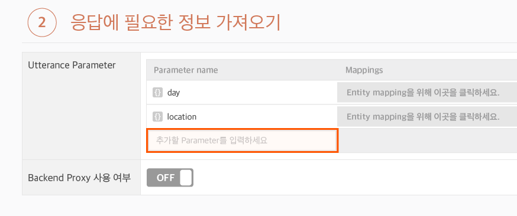
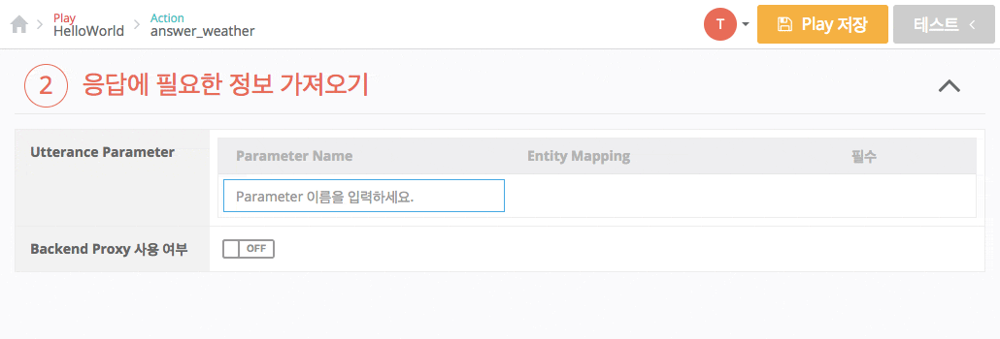
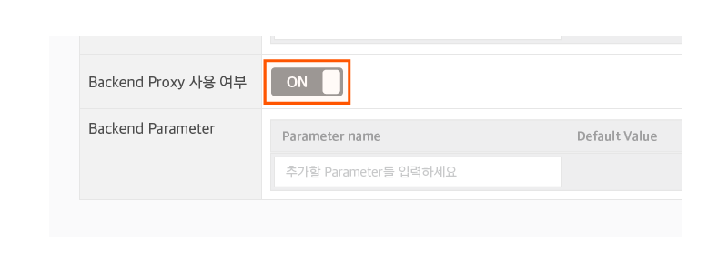
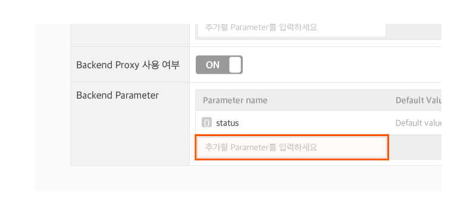
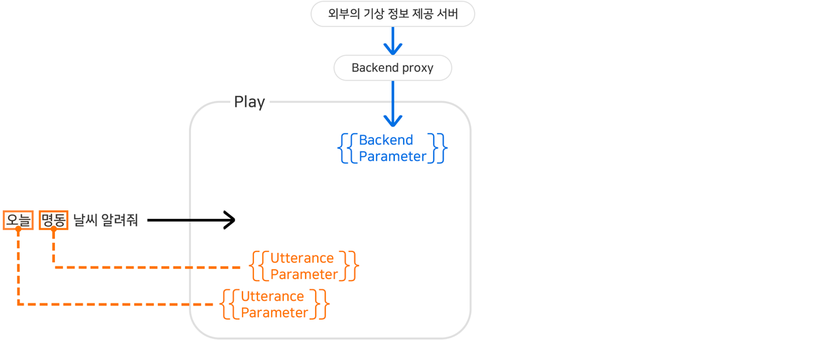

# Parameter 정의하기

Parameter의 사용 방법을 알아보기 위해, 다음과 같이 사용자에게 특정 날짜나 특정 장소에 대한 날씨 값을 제공해주는 Play를 만든다고 가정을 해보겠습니다.

여기서, "오늘"과 "명동"이라는 정보는 사용자의 발화("오늘 명동 날씨 알려줘.")에서 알 수 있는 정보(Entity)입니다.

이렇게 사용자의 발화에서 얻을 수 있는 정보는 Utterance Parameter를 만들어서 이곳에 담기도록 지정을 하여 Play의 응답에 이를 사용할 수 있습니다.

그리고, '흐리다', '맑다'와 같은 기상 정보는 기상청과 같이 외부의 서버를 통해 받아오는 정보입니다. 이러한 정보는 Backend Parameter를 생성하고 이곳에 담기도록 지정을 하면, 이 역시 Play 응답에 사용할 수 있습니다.

## Utterance Parameter 등록하기

[Action 만들고 응답 등록하기](../../hello-aria/create-an-action-and-an-answer)에서 만들어 보았던 'answer.weather'라는 Action에서 Parameter를 만드는 법을 설명하도록 하겠습니다.

1. 우선, `User Utterance Model` > `Custom Intents` 페이지에서 다음과 같이 예상 발화를 입력하고 Entity를 지정해줍니다.

* 시간, 날짜 표현은 Built-in Entity Type에서 선택합니다.
* 동 이름은 Custom Entity Type으로 추가합니다.
* Play Builder 홈 화면에서 Parameter를 추가할 Play를 클릭하여 선택한 후, `Custom Actions` 버튼을 클릭합니다.
* Action List에서 'answer.weather'라는 Action을 선택합니다.
* 응답에 필요한 정보 가져오기 영역의 Utterance Parameter 입력 필드에 Parameter명을 입력하고 `Enter` 키를 누르거나 입력 필드 이외 영역에 마우스 왼쪽 버튼을 클릭합니다.

* 영자, 숫자, 특수문자인 언더바(`_`), 하이픈(`-`)만 사용하여 40자 이내에서 작성할 수 있으며, Play 내에서 같은 이름을 중복해서 등록할 수 없습니다.
* 이번 예에서는 '오늘'과 같이 특정일을 담을 Parameter와 '면목동'과 같이 지역을 담을 Parameter를 담을 2개의 Utterance Parameter를 만듭니다.
* Parameter명을 각각 'day'와 'location'으로 지정합니다.
* 추가한 Parameter 우측 Mapping 항목의 `Entity mapping을 위해 이곳을 클릭하세요.` 버튼을 클릭한 후 Entity mapping 창에서 'day' Parameter에는 '오늘'이 담겨 있는 'BID_DT_DAY'를, 'location' Parameter에는 'LOC_DONG' Entity Type를 각각 매핑합니다.

* 각 Parameter 우측 Mapping 항목에 매핑된 Entity Type:Entity Role이 표시됩니다.
* Utterance Parameter 2개가 정의되었으며, 응답에 이 Parameter를 사용할 수 있습니다.

## Backend Parameter 등록하기

Backend Parameter는 Backend proxy을 통해서만 정보값을 채울 수 있는 Parameter입니다.


Backend proxy에 대한 자세한 내용은 [외부 연동 서버(Backend proxy)](../../use-backend-proxy)를 참고하세요.


다음 순서로 Backend Parameter를 설정합니다.

1. Utterance Parameter 아래의 Backend proxy 사용여부 항목의 `OFF` 버튼을 클릭하여 ON(사용)으로 설정합니다. Backend Parameter를 정의하는 테이블이 생깁니다.

   
2. Backend Parameter 입력 필드에 Parameter명을 입력하고 `Enter` 키를 누르거나 입력 필드 이외 영역에 마우스 왼쪽 버튼을 클릭합니다.

   

   * 영자, 숫자, 특수문자인 언더바(`_`), 하이픈(`-`)만 사용하여 40자 이내로 작성할 수 있습니다.
   * Backend Parameter명을 "status"로 지정합니다.
   * Play Builder 우측 상단에 있는 `Play 저장`을 눌러 Play를 저장합니다.

   Play의 Parameter 설정이 완료되면, 이제 Backend proxy에서 이 Parameter에 적절한 값을 전달해 주도록 Backend proxy 동작 환경을 설정해야 합니다.
3. 이렇게 입력을 하고, Backend proxy가 기상 정보를 Backend Parameter에 담아주면 다음과 같은 상태가 됩니다.

   
