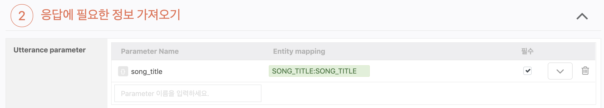

# 하나의 Parameter에 여러 Entity mapping 하기

Utterance Parameter는 사용자의 발화에서 정보를 담아 직접 처리하거나 Backend Proxy로 보내는 파라미터입니다. 이 때, 하나의 파라미터에 여러 개의 Entity를 담아 동일하게 처리하고 싶을 경우, 여러 Entity를 매핑할 수 있습니다.

위와 같이 설정한 경우, CITY로 분석된 Entity와 COUNTY로 분석된 Entity는 모두 `target` 파라미터에 담을 수 있게 됩니다. 이 Entity들은 사용자의 실제 발화에서 분석이 되면, 특별한 조건 없이, 매핑된 파라미터에 담기게 됩니다.

## Slot-filling 상황에서만 동작하는 Entity-mapping

여러 기능을 제공하는 Play를 만든다면, 필요한 만큼 Action을 생성하고 각 Action 별로 필요한 Parameter를 정의하여 각각 Entity를 매핑해야 합니다. Parameter가 Action을 수행하는데 필수 요소라면, `필수` 체크 후 Slot-filling prompt를 추가하게 됩니다.

이때, 제공하는 기능에 따라 아래와 같이 각 Action에서 사용하는 Entity가 중복되어 데이터로 구성될 수 있습니다. 텍스트가 여러 Entity type에 중복된 경우, 사용자가 해당 텍스트만 발화했을 때 NLU엔진은 두 Entity type중 하나로 분석하게 됩니다.

위의 경우에서, 사용자가 '아기상어' 라고 발화를 한 경우 SONG_TITLE 또는 VIDEO_TITLE로 분석됩니다. 특히, Slot-filling 상황에서라면 사용자는 Entity 하나만 발화할 가능성이 높으며, 사용자는 정상적으로 발화를 해도 Slot-filling이 되지 않게 됩니다. 이런 경우, 가급적 다음과 같이 하나의 Entity로 통합하여 User Utterance Model을 구성하는 것이 좋습니다.

그러나 Entity type 사이에 중복되는 텍스트를 피할 수 없는 경우, 다음과 같이 Slot-filling 상황에서만 파라미터에 담기도록 Entity를 매핑하여 해결할 수 있습니다.

먼저, 파라미터 `song_title`에 `VIDEO_TITLE` 엔티티를 매핑해줍니다. 다른 intent에 포함된 Entity인 경우, `다른 Intent의 Entity type 더 불러오기` 버튼을 한번 클릭하여 엔티티 리스트를 확장한 뒤 선택해야 합니다. Slot-filling 상황에서만 매핑되기를 희망하는 Entity (위의 예에서는 VIDEO_TYPE)를 클릭하여 배경색이 주황색으로 변하게 합니다. 이렇게 매핑된 Entity는 해당 파라미터의 Slot-filling 상황일 때만 파라미터에 담기게 되며, "아리아, 아기상어 틀어줘"와 같이 Intent와 함께 분석되는 경우에는 이 파라미터에 담기지 않게 됩니다.
