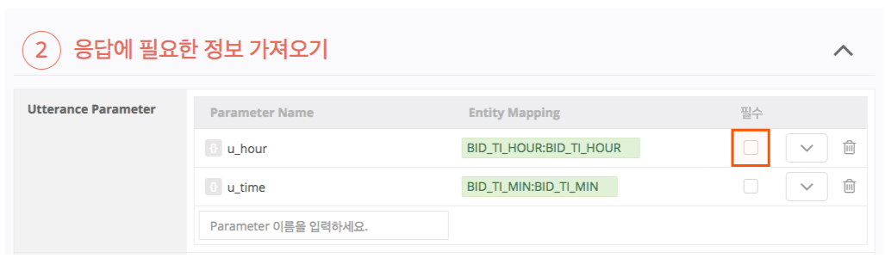
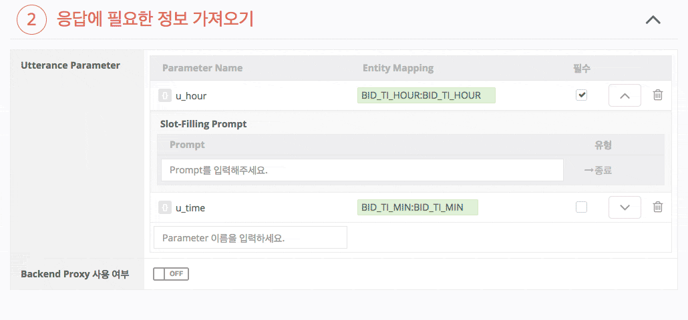

# 필수 Entity 정의하기 (Slot-Filling Prompt)

User Utterance Model을 정의하다 보면 사용자로부터 추가로 정보를 받아야만 처리할 수 있는 Intent가 있을 수 있습니다. 가령, 알람을 맞춰달라는 Intent를 처리하고자 한다면, '몇 시'라는 정보(Entity)가 꼭 필요합니다.

사용자가 단순히 '알람 설정해줘' 라고만 말했다면, 몇 시로 설정할 것인지 되물어야 합니다. 이렇게 추가 정보를 꼭 받아야만 해당 Intent를 처리할 수 있는 경우에는 사용자에게 되물어서 그 값을 받을 수 있습니다. 이렇게 사용자에게 추가 정보(Entity)를 받기 위해 되묻는 물음을 Slot-Filling Prompt(부족한 정보 재질의)라고 합니다.

Slot-Filling Prompt를 통해 Entity를 다시 받기 위해서는 Utterance Parameter에 Entity를 매핑한 후 '필수' 박스에 체크를 해야합니다.


Utterance Parameter 등록 및 매핑에 대한 자세한 내용은 [Parameter 사용하기](../use-parameters)를 참고하세요.


## 필수 Entity 정의하기

\1. Play Builder 좌측 메뉴에서 `Actions` > `Custom Actions`를 클릭한 후, Slot-Filling Prompt를 설정할 Action을 선택합니다.
\2. 응답에 필요한 정보 가져오기 영역에서 Slot-Filling Prompt를 통해 Entity를 다시 받을 Utterance Parameter에 Entity를 매핑한 후 '필수' 박스에 체크합니다.

\3. 이후 Slot-filling Prompt를 입력합니다.

Slot-filling Prompt는 다른 Prompt와 달리 마지막 발화부터 입력하는 스택 구조이며 LIFO(Last In First Out)로 동작합니다. 여러 개의 Prompt를 입력하면 가장 마지막에 입력한 Prompt부터 차례대로 사용자에게 응답하게 됩니다.

이 Prompt에 대해 사용자의 응답이 Entity Type에 속하지 않은 값일 경우(위의 예에서 시간이 아니라 날짜를 얘기한 경우) 그 다음 순서의 발화가 나가게 됩니다. 마지막에는 사용자가 입력한 첫 Prompt가 나가게 되며, 이 Prompt는 종료 Prompt로 동작하여 Play 세션을 종료합니다.


**종료 Prompt**에 대한 자세한 내용은 [Prompt의 유형](../use-responses/use-prompts#prompt-types)을 참고하세요.


## Slot-filling Prompt 작성 시 주의 사항

Slot-filling 문장 작성 시에는 아래의 항목들을 고려하도록 합니다.

*   Slot-filling이 연속적으로 여러 번 반복되는 것을 지양합니다.

    하나의 기능을 수행하기 위해서 Slot-filling이 여러 번 반복될 경우 사용자는 인내심을 잃고 서비스 이용을 포기할 수 있습니다.

    그러므로, 필수 Entity(Required Entity)에 대해서만 Slot-filling과정을 거치도록 하며, 선택적 Entity(Optional Entity)에 대해서는 기본값으로 설정하여 Slot-filling의 횟수를 최소화하도록 합니다.
*   사용자가 답변해야 할 내용을 명확하게 안내합니다.

    사용자가 무엇을 답변해야 하는지 명확히 알 수 있도록 Entity의 유형을 포함시켜 묻는 것이 좋습니다.


사용자가 알람 설정 요청 시, “언제로 할까요?” 라고 묻는 것보다 “몇 시로 설정할까요?” 라고 묻는 것이 더 명확합니다.(시각에 대한 답변을 유도)

또는, 사용자가 답변해야 하는 답변을 미리 제시하여 선택 발화하도록 할 수 있습니다. 단, 선택지는 2개 이하를 권장합니다.

“주문을 원하시면 '결제해줘', 다음 상품을 원하시면 '다음'이라고 말씀해주세요.”


*   인식이 어려운 발화를 유도하지 않도록 합니다.

    사용자가 발화해야 하는 Entity가 긴 경우에는 인식이 어려울 수 있습니다.


주소를 입력 받는 경우 연속된 숫자나 1음절 숫자는 인식하기 어려울 수 있습니다.

전화번호나 비밀번호를 입력 받는 경우(숫자 개개를 정확히 인식하기 어려움)

목록 중 하나를 선택해야 하는 경우, 1음절 숫자인 “일”, “이” 등으로 발화하지 않고 “첫 번째”, “두 번째”와 같은 방식으로 발화하도록 유도


*   사용자의 확인이 필요할 경우 발화 예시를 제시합니다.

    사용자에게서 얻고자 하는 답변이 확인 과정일 경우, 용자의 확인 여부를 명확히 구분할 수 있도록 “예/아니오” 형식의 발화보다는 명확한 의도가 담긴 발화를 할 수 있도록 예시를 제시하도록 합니다.


결제할까요? -> 응 (X)\
주문을 원하시면 “결제해줘”라고 말씀해주세요. -> 결제해줘 (O)

