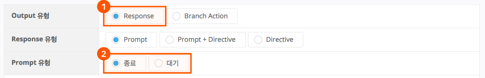
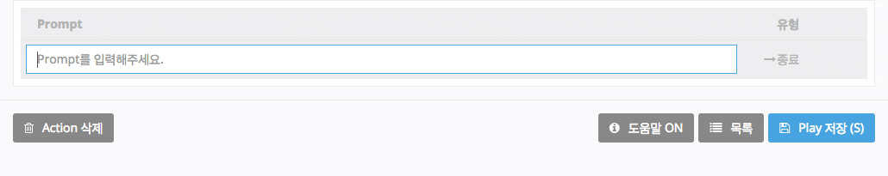
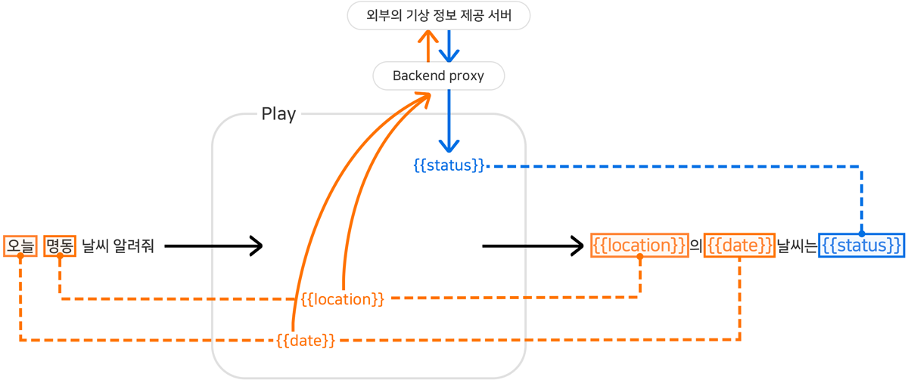

# Parameter로 응답 작성하기

지금까지 Parameter의 개념과 작성(등록)하는 방법에 대하여 알아보았습니다. 이제부터는 이와 같이 만들어진 Parameter를 사용하여 Play의 Response(응답)을 작성하는 방법을 알아보겠습니다.

1. Play Builder 좌측 메뉴에서 `Actions` > `Custom Actions`를 클릭한 후, `answer.weather` Action을 선택합니다.
2. Output 정의 영역에서 Output 유형은 `Response` 버튼을 선택하고, Prompt 유형은 `대기` 또는 `종료` 버튼을 클릭합니다.

   

   * Prompt 유형에서 '대기'는 Prompt가 스피커를 통해 발화되고 난 후 세션이 끊어지지 않고 유지되는 옵션이며, '종료'는 발화 후 세션이 끊어지는 옵션을 의미합니다.
   * Prompt List의 Prompt 입력창에 중괄호를 연속으로 2번 입력하면 Parameter 자동완성창이 열리며, 위에서 입력했던 "day", "location", "status" 3개의 Parameter가 표시됩니다.

   
3. 키보드 혹은 마우스를 이용하여 'location'을 선택한 후 '의'를 입력한 후, 다시 중괄호 두 개를 눌러 자동완성을 통해 'day'를 선택합니다. 그 후에 "날씨는" 을 입력하고 다시 동일한 방법으로 'status'를 입력합니다. 입력을 완료하면 Prompt 입력창에는 다음과 같이 표시됩니다.

   

4. Play Builder 우측 상단에 있는 `Play 저장` 버튼을 클릭하여 Action 생성을 완료합니다.

   지금까지 작업한 `answer.weather` Action은 다음과 같은 구조를 갖게 되며, Backend proxy가 기상정보를 'status'에 담아서 제공을 할 경우 "여수의 오늘 날씨는 흐립니다"와 같은 답변이 나가게 됩니다.

   


이 장과 함께 보면 좋은 도움말

* [Prompt의 유형](../use-responses/use-prompts#prompt-types)

