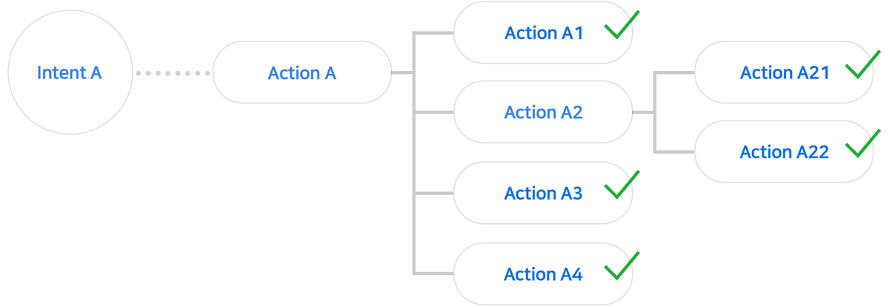
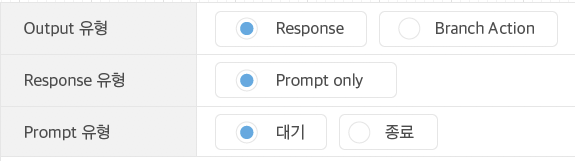
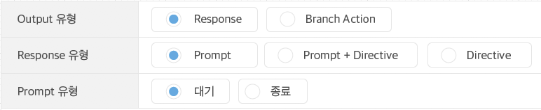

# Response

Response는 사용자의 발화를 입력 받았을 때 Play가 내놓게 되는 결과물을 의미합니다. Action이 Trigger에 의해 동작하게 되었을 때 자신의 하위에 Branch Action이 없으면 그 결과(output)로 Response를 반환합니다.

다음과 같이 Action Tree의 끝에 위치한 Action만 Response를 가질 수 있습니다.

Response는 Prompt와 Directive로 구분할 수 있습니다.

**Prompt**

* 스피커로 내보내게 될 메시지입니다.

**Directive**

* 디바이스를 제어하는 명령입니다.
* Capability Interface를 사용하는 Play만 사용할 수 있습니다.

Prompt는 모든 Action이 가질 수 있는 유형의 Response이며, 필요에 따라 Directive와 함께 사용할 수도 있습니다. 반면, Directive는 Capability Interface를 사용해야만 사용할 수 있는 Response입니다.

* 기본 상태의 Output 설정 화면

* Capability Interface를 하나 이상 `ON` 한 경우의 Output 설정 화면

다음 장에서 Prompt와 Directive 사용법에 대해 알아보도록 하겠습니다.


이 장과 함께 보면 좋은 도움말

* [Prompt](./use-responses/use-prompts)
* [Directive](./use-responses/use-directives)

