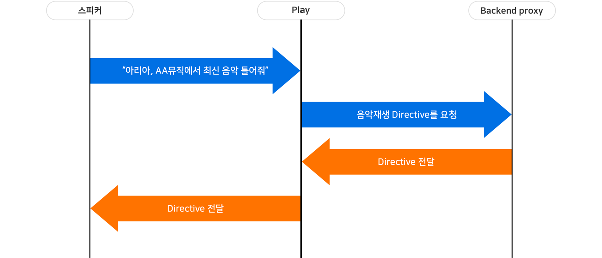
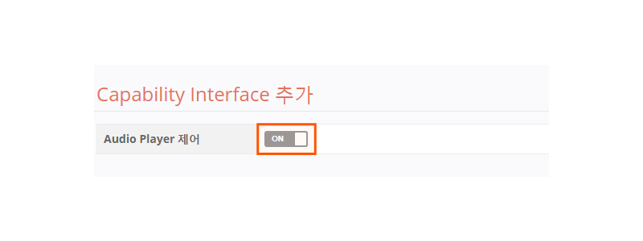
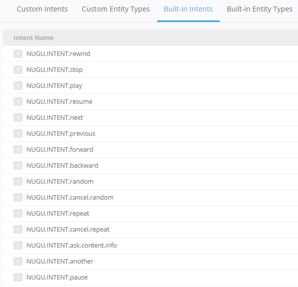
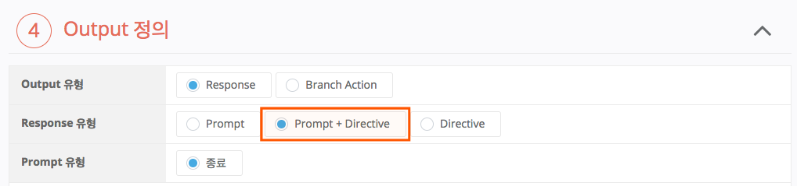

# Directive 사용하기

Action의 Response는 사용자의 요청/질문 등에 답을 하는 Prompt와 디바이스를 제어하는 Directive로 구분할 수 있습니다. Directive는 오디오 파일을 재생시키거나 멈추게 하는 명령어로 Backend proxy가 Capability Interface를 지원해야만 사용할 수 있습니다. 현재 제공되는 Interface는 AudioPlayer만 있습니다.

Directive를 사용하여 디바이스를 제어하기 위해서는 다음과 같은 과정을 거쳐야 합니다.

1. Backend proxy에 Capability Interface가 구현되어 있어야 하며,
2. Play의 설정(`General` > `기본정보`)에서 Capability Interface를 사용함으로 설정하고,
3. Directive를 사용할 Action의 Response가 Directive 또는 Directive + Prompt로 선택되어 있어야 합니다.


Directive의 개념과 이를 적용하는 방법에 대한 자세한 내용은 다음을 참고하세요.

* Directive 개념에 대한 자세한 내용은 [Response 사용하기](../use-responses)를 참고하세요.
* Capability Interface의 개념과 Play Directive에 대한 자세한 내용은 [Capability Interfaces](../../use-backend-proxy/capability-interfaces)를 참고하세요.
* AudioPlayer Interface 지원하는 Play를 만드는 방법에 대한 자세한 내용은 [AudioPlayer Interface 지원하는 Play 만들기](../../create-a-play-with-audioplayer)를 참고하세요.


## Backend proxy에 Capability Interface 구현하기

Directive를 사용하기 위해서는 Backend proxy에 Capability Interface 규격에 맞는 Directive을 구현해야 합니다. 사용자 발화가 어떤 디바이스(스피커)의 기능을 요청하면 Play는 Backend proxy에 요청을 보내게 되고, Backend proxy는 요청에 맞는 Directive를 Play에게 전달하게 됩니다. 따라서, Backend proxy에서는 Play에서 어떤 Action가 어떠한 Directive를 사용하는지를 확인하고 이를 구현해야 합니다.

다음은 AudioPlayer Interface를 지원하는 스피커에 Directive가 전달되는 과정을 설명한 그림입니다.

## Capability Interface를 사용함으로 설정하기

* Play Builder 홈 화면에서 Capability Interface를 설정할 Play를 클릭하여 선택한 후 `General` > `기본 정보` 페이지의 Capability Interface에서 AudioPlayer Interface 제어 항목을 `ON`으로 설정합니다.

* Built-in Intent 15개가 추가됩니다. Built-in Intent 추가 여부는 `User Utterance Model` > `Built-in Intents` 페이지에서 확인할 수 있습니다.

## Action에서 Directive 사용하기

Capability Interface를 사용함으로 설정한 Play는 Response의 유형이 다음과 같이 확장됩니다. Directive가 동작해야 할 Action의 Response를 `Directive` 또는 `Prompt + Directive`로 선택합니다.


위 내용에 대한 자세한 내용은 [AudioPlayer Interface 지원하는 Play 만들기](../../create-a-play-with-audioplayer)를 참고하세요. 그리고 필수 Intent에 대한 자세한 내용은 User Utterance Model 정의하기(Intent & Entity)의 [Built-in Intents](../../define-user-utterance-model/built-in-intents)를 참고하세요.


한 Play에서 여러 Directive를 사용하는 경우, Backend proxy에서 Action을 구분해서 Directive를 전달하게 됩니다.

Action에서 선택할 수 있는 Response 유형별 특징은 다음과 같습니다.

| Response 유형         | 특징                                                                                                                                                            |
|---------------------|---------------------------------------------------------------------------------------------------------------------------------------------------------------|
| Prompt              | Prompt만 합성음으로 발화합니다. Prompt의 유형을 선택할 수 있습니다.(대기/종료)                                                                                                       |
| Prompt + Directive  | Capability Interface를 사용하는 Play에서만 선택할 수 있는 유형입니다. Prompt가 먼저 합성음으로 발화되며, Prompt 발화가 끝난 뒤에 Directive가 동작합니다. Prompt 유형을 선택할 수 없으며, 종료 Prompt로만 동작합니다. |
| Directive           | Capability Interface를 사용하는 Play에서만 선택할 수 있는 유형입니다. Directive만 동작합니다.                                                                                      |

Directive는 Play의 세션의 밖에서만 동작을 할 수 있습니다. 따라서, `Prompt + Directive`를 선택한 경우 이 Prompt는 세션을 종료시키는 종료 Prompt로만 구성할 수 있으며, Prompt가 합성음으로 발화된 후 Directive가 뒤이어 동작합니다. 이 종료 Prompt는 어떠한 기능이 동작할지 예고하는 용도로 사용하기를 권장합니다. Directive만 단독으로 정의된 경우 세션이 자동으로 종료된 뒤 Directive가 동작하게 됩니다.
