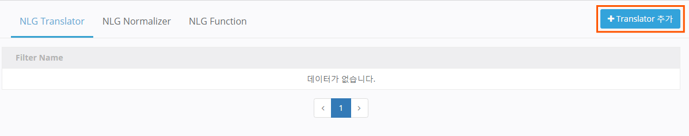
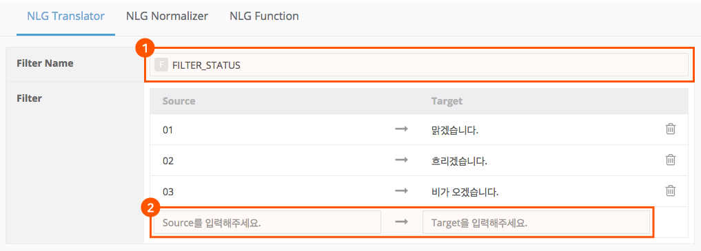
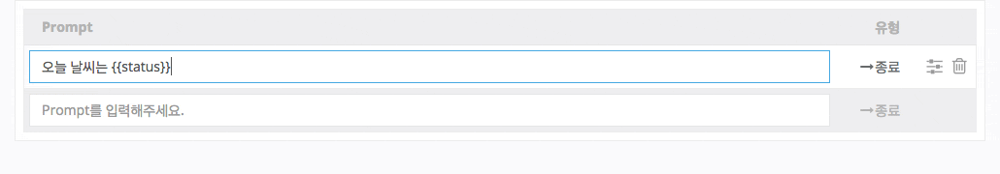
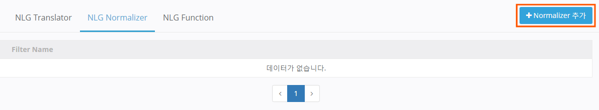
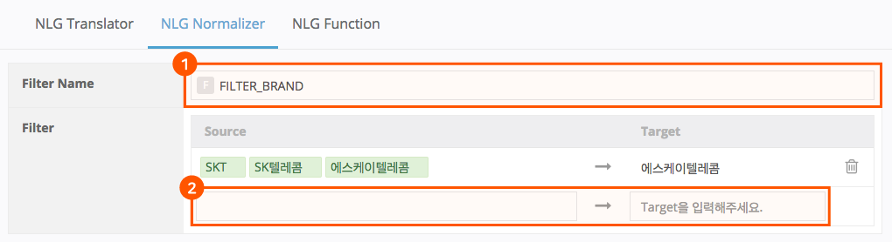
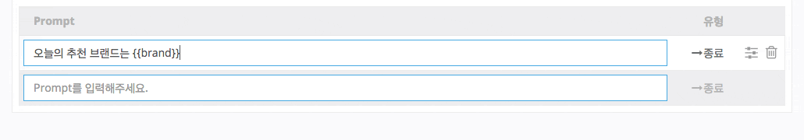
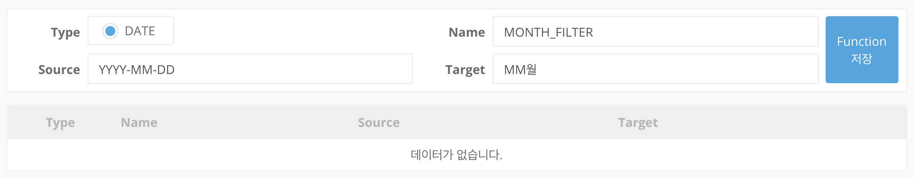
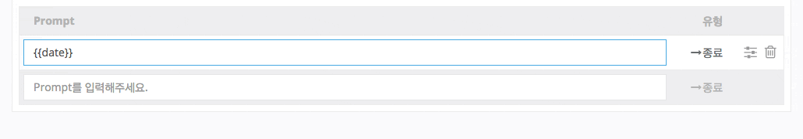
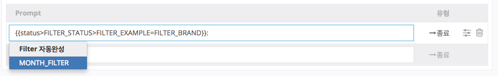

# Response Filter 사용하기

Response Filter는 Parameter에 담긴 값 또는 형식을 변환시킬 수 있으며, Prompt에서 사용할 수 있습니다. Response Filter는 크게 세 가지가 있습니다. 이들은 각각 다음과 같은 특성을 가지고 있습니다.

| Response Filter 종류  | 특성                                                                                                                 | 기호   |
|---------------------|--------------------------------------------------------------------------------------------------------------------|------|
| NLG Translator      | 정해진 규칙에 의해 값을 변환해 줍니다. 1이 들어오면 'a'로, 2가 들어오면 'b'로 변환시킬 수 있습니다.                                                 | \\\> |
| NLG Normalizer      | 정해진 규칙에 의해 값을 변환해 줍니다. 한번에 여러 가지 값을 일괄 변경할 수 있습니다. 1,2,3이 들어오면 'a'로, 3,4,5,6,7이 들어오면 'b'로 변환할 수 있습니다.      | \\=  |
| NLG Function        | 정해진 규칙에 맞게 형식값을 변환합니다.                                                                                             | \\\: |

## NLG Translator

날씨를 안내할 때, "오늘 날씨는 `{{status}}`" 같이, 외부(기상 정보 제공 서버)에서 날씨 상태값을 체크한 뒤, 외부 연동 서버(Backend proxy)에서 "맑겠습니다.", "눈이 올 예정입니다"와 같이 Prompt의 일부를 처리하는 것도 가능합니다.

그러나 이렇게 Play를 만들 경우, 최종적으로 나갈 Prompt의 내용을 Play Builder에서 모두 확인하기 어렵고, Backend proxy에서도 별도로 관리를 해야 합니다. 즉, 문장 하나를 수정 하려고 해도 외부 연동 서버 개발자가 함께 Prompt 수정해야 하기 때문에 수시로 응답을 바꿔가며 Play를 운영하기가 어려워집니다.

이럴 때, Parameter `{{status}}`에는 날씨 상태를 나타내는 코드를 담고, 이 Paraemeter에 NLG Translator를 사용하여 각 코드 별 응답을 입력하여 처리하면, 조금 더 유연한 대응이 가능해집니다.

NLG Translator를 입력하는 방법은 다음과 같습니다.

1.  Play Builder 홈 화면에서 NLG Translator를 추가할 Play를 클릭하여 선택한 후 `Response Filters` > `NLG Translator` > `+NLG Translator 추가`를 클릭합니다.

    
2.  Translator의 Filter명을 입력하고, 변경 전의 값을 Source에, 바뀔 값을 Target에 각각 입력한 후 `Enter` 키를 누르거나 입력 필드 이외 영역에 마우스 왼쪽 버튼을 클릭합니다.

    

이렇게 Translator가 적용된 `{{status}}` Parameter에 "01"이라는 값이 들어오면 Translator가 "맑겠습니다."라는 텍스트로 변환시키게 됩니다.


Parameter에 담긴 값이 Filter의 Source와 정확히 일치할 때만 동작합니다. 위의 예에서 status에 1 혹은 001이라는 값이 들어오면 동작하지 않습니다.


Play Builder는 Response Filter를 쉽게 입력할 수 있도록 자동완성 기능을 지원합니다.\
Parameter 의 끝의 기호 `}}` 뒤에 특수기호 >를 입력하면 앞서 정의한 NLG Translator의 리스트가 표시되며, 원하는 Filter를 선택합니다.

## NLG Normalizer

NLG Normalizer는 Translator와 기능이 유사하지만, 가장 큰 차이점은 여러 개의 Source를 하나의 Target으로 변경해 준다는 점입니다.

1. Play Builder 홈 화면에서 NLG Normalizer를 추가할 Play를 클릭하여 선택한 후 `Response Filters` > `NLG Normalizer` > `+NLG Normalizer 추가`를 클릭합니다.

   
2. Normalizer의 Filter명을 입력하고, 변경 전의 값을 Source에, 바뀔 값을 Target에 각각 입력한 후 `Enter` 키를 누르거나 입력 필드 이외 영역에 마우스 왼쪽 버튼을 클릭합니다.

   
3. NLG Normalizer의 자동 완성 기능으로 적용하기 위한 기호는 = 이며, 사용 방법은 NLG Translator와 같습니다.

   

## NLG Function

마지막으로, NLG Function을 추가하는 방법은 다음과 같습니다.

1. Play Builder 홈 화면에서 NLG Function를 추가할 Play를 클릭하여 선택한 후 `Response Filters` > `NLG Function`을 누릅니다.
2. NLG Function 타입을 선택 및 이름을 입력하고, 후 변경 전의 값을 Source에, 바뀔 값을 Target에 각각 입력한 후 `Enter` 키를 누르거나 입력 필드 이외 영역에 마우스 왼쪽 버튼을 클릭합니다.

* NLG Function은 날짜 형식에 사용하는 DATE 타입을 제공합니다.
* 날짜 형식에 맞는 문자열이 있다면, 보다 더 적합한 날짜 형태로 변경합니다.


날짜 형식에 대한 내용은 [DateTimeFormatter](https://docs.oracle.com/javase/8/docs/api/java/time/format/DateTimeFormatter.html)를 참고하세요.


1. NLF Function의 자동완성을 위한 기호는 : 이며, 사용 방법은 NLG Translator와 같습니다.

참고로, Response Filter는 종류에 상관없이 중첩해서 사용할 수 있습니다.

