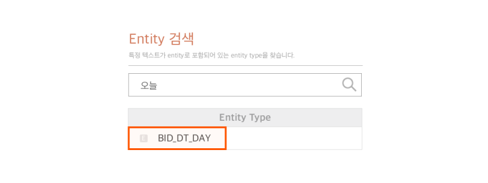

# User Utterance Model 정의하기 (Intent & Entity)

## Intent

Intent를 만들고 수정하는 것은 좌측 메뉴의 `User Utterance Model` > `Custom Intents`와 `Built-in Intents` 메뉴에서 할 수 있습니다. Custom Intent는 Play 내에서 정의된 Intent를 의미하고, Built-in Intent는 NUGU play kit에서 제공하는 Intent로서 여러 분야에서 공통적으로 사용될 것으로 예상되어 미리 학습시켜 둔 Intent입니다.

### Custom Intent 생성하기 

먼저 Custom Intent를 추가하는 방법에 대해 알아보도록 하겠습니다.

1) Play Builder 홈 화면에서 Intent를 추가할 Play를 클릭하여 선택한 후, `User Utterance Model` > `Custom Intent` > `Intent 추가` 버튼을 클릭합니다.

2) Intent Name 필드에 "날씨"와 관련한 Intent명을 먼저 정의합니다.

* Intent name은 영자, 숫자와 특수 문자인 마침표(`.`), 언더바(`_`), 하이픈(`-`)만 사용할 수 있습니다.
* NUGU 플랫폼에서는 'ask.weather'와 같은 네이밍 규칙으로 작성하고 있습니다.
* Intent Name 앞에는 NUGU를 사용할 수 없으며, 중복은 허용하지 않습니다.

3) 사용자 예상 발화를 Sentence 필드에 입력합니다.

* 발화 문장을 입력한 후 `Enter` 키를 누르거나 입력 필드 이외 영역을 마우스 왼쪽 버튼으로 클릭하면 문장이 추가됩니다.
* 날씨를 알고 싶어하는 사용자가 발화할 것으로 예상하는 문장을 차례로 입력합니다.
* Entity로 지정할 단어도 섞어가면서 예상 발화를 작성합니다.


예상 발화 작성에 대한 자세한 내용은 [예상 발화 작성 가이드라인](./define-user-utterance-model/how-to-write-customer-utterances) 및 [예상 발화 작성 가이드](./define-user-utterance-model/how-to-write-customer-utterances)를 참고하세요.


위 1) ~ 3)의 과정을 연속 이미지로 보면 다음과 같습니다.

4) 예상 발화 문장 중 Entity로 지정할 단어가 있다면 마우스로 해당 텍스트를 선택합니다. 텍스트가 선택되면 Entity Type을 지정할 수 있는 팝업창이 표시됩니다.

5) 이 팝업에서 적절한 Type을 클릭하면 자동으로 지정됩니다.

그러나 현재는 '명동'이라는 Entity에 적합한 Type이 없으므로, 새로 만들어 보겠습니다.

6) 하단의 `이 텍스트를 새로운 Type으로 추가하기` 버튼을 클릭한 후, 다음과 같이 입력합니다.

* 발화 문장을 입력한 후 `Enter` 키를 누르거나 입력 필드 이외 영역을 마우스 왼쪽 버튼으로 클릭하면 문장이 추가됩니다.

이제 위의 Entity Type 목록에 'LOCATION'이 추가된 것을 볼 수 있습니다.

7) 이 Type을 클릭하여 선택하면 다음과 같이 Entity Type이 연결됩니다.

8) 같은 방법으로 예상 발화 문장을 입력하고 Entity Type을 연결한 후 `Play 저장` 버튼을 클릭하면 Custom Intent의 생성이 완료됩니다.

위 4) ~ 8)의 과정을 연속 이미지로 보면 다음과 같습니다.

그러나 아직은 'LOCATION'에 하나의 Entity만 있으므로 Entity를 더 추가하거나 다른 Type으로 변경해야 합니다.\
이에 대한 자세한 내용은 아래의 [Custom Entity Type에 Entity 추가하기](#custom-entity-type)에서 더 알아보도록 하겠습니다.

'문장 내 역할'은 이 Entity가 문장 내에서 하게 되는 역할(Entity Role)을 의미합니다.

한 문장 내에서 동일한 Type이 사용될 것으로 예상될 때 Role을 구분하여 Entity를 연결시킬 수 있습니다.

예를 들면, '서울에서 부산 가자' 에서 '서울'과 '부산'은 모두 '도시'라는 동일한 Type을 가지지만 서울은 'FROM(출발지)', 부산은 'TO(목적지)' 등과 같이 Role을 구분하여 정의할 수 있습니다.

Role을 사용할 필요가 없는 경우에는 Role을 별도로 지정하지 않아도 되며, 지정되지 않으면 default로 Type 값이 Role로 지정됩니다.


Intent를 더 추가하고 싶다면 계속 추가가 가능하며, 추가 가능한 Intent와 예상 발화의 최대 개수에는 제한이 없습니다.

훈련 데이터에 다양한 문형의 문장이 많을수록 분석 커버리지가 높아지기 때문에 가급적 다양한 문형의 문장을 Intent당 20개 이상 등록하는 것이 좋습니다.



다음의 내용을 참고하세요.

* [예상 발화 작성 가이드](./define-user-utterance-model/how-to-write-customer-utterances)를 참고하세요.
* Play Builder에서는 예상 발화를 파일로 업로드할 수 있도록 지원하고 있습니다.
  예상 발화 및 Entity 업로드 가이드와 Built-in Intent에 대한 자세한 내용은 [Built-in Intent](./define-user-utterance-model/built-in-intents)를 참고하세요.


## Entity

Entity는 Type을 기준으로 생성하고 정의하며 Entity Type은 Custom과 Built-in Entity Type으로 구성됩니다. Custom Entity Type은 Play Builder를 통해 직접 등록하는 Entity Type이며, Built-in Entity Type은 시간, 개수, 지명과 같이 여러 분야에서 공통으로 사용될 것으로 예상되어 NUGU play kit이 제공해 주는 Entity Type입니다.

### Custom Entity Type에 Entity 추가하기 

[Custom Intent 생성하기](#create-custom-intent)에서 'LOCATION'이라는 Entity Type을 생성하고, '명동'이라는 Entity를 추가하였습니다. 이 Entity Type에 '명동'이라는 Entity 외 다른 Entity를 추가 등록하는 방법에 대해 알아보겠습니다.

1) Play Builder 홈 화면에서 Entity를 추가할 Play를 클릭하여 선택한 후, `User Utterance Model` > `Custom Entity Types`을 클릭합니다.

2) Entity Type List에서 'LOCATION'이라는 Entity Type을 선택합니다.

3) 화면에 표시한 '대표값'에 있는 인풋박스를 통해 '교동', '역삼동', '면목동'을 입력합니다.

* 텍스트를 입력한 후 `Enter` 키를 누르거나 입력 필드 이외 영역을 마우스 왼쪽 버튼으로 클릭하면 Entity가 등록됩니다.

### 동의어 Entity 추가하기 (Entity 정규화)

하나의 Entity를 지칭하는 단어가 여러 개 존재할 때, 동의어를 추가하여 정규화할 수 있습니다.

프로야구 경기 결과를 안내하는 Play를 예로 들어보도록 하겠습니다. 이 Play에서는 각 구단명을 Entity로 등록해야 합니다. 그러나, 구단 이름은 흔히 '에스케이와이번스', '에스케이', 'SK', 'SK와이번스'와 같이 여러 가지 방식으로 불리므로 이 단어들이 같은 대상을 지칭한다는 관계를 설정해 줘야 합니다.

1) `User Utterance Model` > `Custom Entity Types` > `Entity 추가` 버튼을 클릭합니다.

2) Entity Type Name 항목에 Entity Type명(예: CLUBNAME)을 입력한 후 화면에 표시한 '대표값'에 있는 인풋박스에 구단명을 입력합니다.

* 텍스트를 입력한 후 `Enter` 키를 누르거나 입력 필드 이외 영역을 마우스 왼쪽 버튼으로 클릭하면 Entity가 등록됩니다.

3) 동의어 영역을 클릭하여 커서를 옮긴 뒤 동의어를 입력합니다.

* '에스케이'는 실제 구단명이 아니지만 흔히 불리는 이름이므로 추가를 하는 것이 좋습니다.
* 또한 애칭, 약어, 영문 이름 혹은 정확하지는 않지만 불릴 가능성이 있는 이름이 있다면 함께 Entity로 추가해 주는 것도 좋습니다.

4) Entity 입력을 완료한 후 `Play 저장` 버튼을 클릭하면 'CLUBNAME' Custom Entity Type의 생성이 완료됩니다.

이렇게 Entity Type을 정의해 두면, 사용자가 '에스케이와이번스', '에스케이와이번즈', 'SK와이번스', 'SK와이번즈', 'SK', '에스케이', '스크' 중 하나를 발화했다고 분석되었을 때, Play Builder가 '에스케이와이번스'라는 정규화 처리된 대표값을 전달하게 됩니다. 이러한 정규화 과정은 Play를 만들 때 많은 수고를 덜어주게 됩니다.

### Built-in Entity Type

Built-in Entity는 NUGU play kit이 제공해 주는 Entity 목록으로서, 시간과 관련된 표현, 지역에 관련된 표현, 숫자, 온도 등을 포함하고 있습니다.

`User Utterance Model` > `Built-in Entity Types`로 이동하면 전체 목록을 확인할 수 있습니다.

Built-in Entity Type는 정책상 Type 내에 있는 Entity 목록 전체를 열거하지 않습니다.

특정 텍스트가 어떤 Type의 Entity에 포함되어 있는지 검색하는 기능을 제공할 예정이며, 이 검색을 통해 '오늘'을 입력하면 'BID_DT_DAY'라는 검색 결과(반환값)를 얻을 수 있습니다.

Built-in Entity Type도 Custom Entity Type과 마찬가지로 일부 Type에 대해 정규화(대표값-동의어 관계)를 제공하고 있습니다.(대푯값이 표준어이지만, '대표값'으로 표현하겠습니다.)

정규화를 제공하는 Type은 리스트 우측의 '상세보기' 열에 녹색 아이콘()으로 표시가 되며, 해당 Type의 상세 화면으로 이동하여 확인할 수 있습니다.

정규화 규칙을 제공하는 Type이라고 하더라도 상세 화면에서 보여지는 대표값이 해당 Type의 모든 Entity를 의미하는 것은 아닙니다.


함께 보면 좋은 도움말

* [Intent의 예상 발화 문장을 잘 입력하는 방법](./define-user-utterance-model/how-to-write-customer-utterances)
* [AudioPlayer Interface 알아보기](./use-backend-proxy/capability-interfaces/audioplayer-interface)

