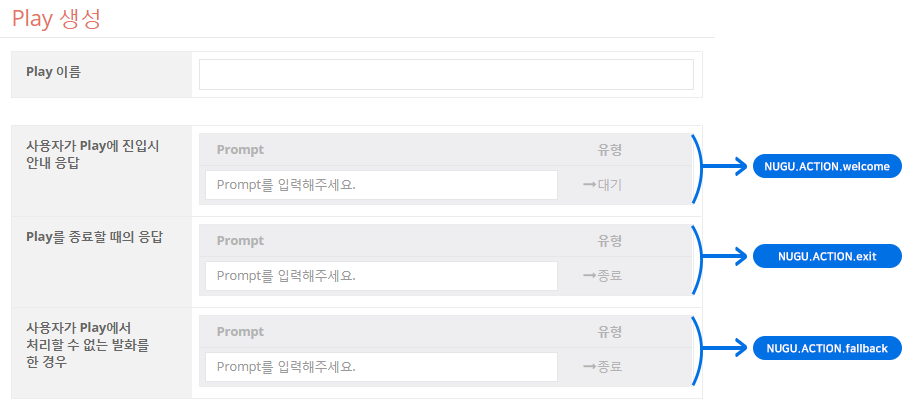

# Built-in Intent

Built-in Intent는 자주 사용될 것으로 예상되거나 꼭 정의해야 하는 발화들을 미리 훈련시켜 제공하기에 별도로 학습을 위한 발화문을 정의할 필요가 없는 Intent 입니다. NUGU플랫폼에서 Built-in Intent의 인식 및 자연어 처리 성능을 향상시킬 때 함께 성능이 향상됩니다.

Play의 설정에 맞게 제공되는 Built-in Intent들을 충분히 활용하여 Play를 정의한다면, 사용자들이 동작할 것이라고 기대하는 발화들을 잘 처리할 수 있어, Play를 쉽게 사용할 수 있습니다.

Play를 최초 생성하는 시점에 2개의 Built-in Intent가 자동으로 추가됩니다. 향후 선택한 Capability Interface에 따라 Intent가 더 추가됩니다. 최초에 추가되는 2개의 Intent는 모든 Play에서 공통으로 사용되는 Intent로 Universal Intent라고 부르며, Capability Interface에 의해 추가되는 Intent를 Control Intent라고 부릅니다.

Universal, Control Intent은 하나의 유형일 뿐이며, 사용자가 정의한 Intent와 근본적으로 같은 Intent입니다. NUGU에서 지원하는 Built-in Intent는 향후 늘어나거나 축소될 수 있습니다.

## Universal Intent

Play 생성과 함께 추가되는 Universal Intent는 다음과 같습니다.

| 유형                | Intent              | 대표 예상 발화                               | Action 정의 필수 여부  |
|-------------------|---------------------|----------------------------------------|------------------|
| Universal Intent  | NUGU.INTENT.stop    | 그만, 종료, 멈춰, 스톱, 정지, 중지                 | 필수               |
|                   | NUGU.INTENT.rewind  | 다시, 다시 틀어줘, 다시 들려줘, 다시 시작, 처음으로, 처음부터  | 필수               |

Play를 빌드하기 위해서는 Universal Intent을 처리할 Action이 반드시 존재해야 합니다. Universal Intent를 trigger로 설정한 Action을 생성하지 않은 경우, Built-in Action이 자동 추가되며 Play를 생성할 때 입력한 기본응답을 통해 자동 정의됩니다.

## Control Intent

Control Intent는 Capability Interface를 사용할 때 사용하는 Intent입니다.


Capability Interface 사용 설정에 대한 자세한 내용은 [AudioPlayer Interface 지원하는 Play 만들기](../create-a-play-with-audioplayer)를 참고하세요.


Capability Interface는 현재 AudioPlayer에서 사용하며, 이 Capability Interface를 선택하여 추가할 수 있는 Control Intent는 다음과 같습니다.

| 유형                                | Intent                        | 대표 예상 발화                                     | Action 정의 필수 여부  |
|-----------------------------------|-------------------------------|----------------------------------------------|------------------|
| Control Intent (AudioPlayer)  | NUGU.INTENT.stop              | 그만, 종료, 멈춰, 스톱, 정지, 중지                       | 필수               |
| ^^                                | NUGU.INTENT.play              | 틀어줘, 들려줘, 재생, 플레이                            | 필수               |
| ^^                                | NUGU.INTENT.pause             | 일시정지, 잠깐 멈춰                                  | 필수               |
| ^^                                | NUGU.INTENT.resume            | 계속 틀어줘, 이어서 틀어줘, 일시정지 해제, 일시정지 풀어줘           | 필수               |
| ^^                                | NUGU.INTENT.next              | 다음, 넘겨, 넥스트, 다음 것                            |                  |
| ^^                                | NUGU.INTENT.previous          | 이전, 이전 것                                     |                  |
| ^^                                | NUGU.INTENT.forward           | 앞으로                                          |                  |
| ^^                                | NUGU.INTENT.backward          | 뒤로                                           |                  |
| ^^                                | NUGU.INTENT.random            | 셔플, 랜덤, 무작위                                  |                  |
| ^^                                | NUGU.INTENT.cancel.random     | 셔플해제, 랜덤 해제, 무작위 취소                          |                  |
| ^^                                | NUGU.INTENT.repeat            | 반복해줘, 반복, 무한 반복, 계속 반복, 반복 켜줘, 반복해서 들려줘      |                  |
| ^^                                | NUGU.INTENT.cancel.repeat     | 반복 해제, 반복 취소, 반복 종료, 반복 꺼줘, 반복 그만            |                  |
| ^^                                | NUGU.INTENT.rewind            | 다시, 다시 틀어줘, 다시 들려줘, 다시 시작, 처음으로, 처음부터        |                  |
| ^^                                | NUGU.INTENT.ask.content.info  | 이거 뭐야, 뭔지 알려줘                                |                  |
| ^^                                | NUGU.INTENT.another           | 다른 것, 이거 말고, 그거 말고, 그거 말고 다른 거, 딴거, 다른거 틀어줘  |                  |

이 Control Intent는 Custom Action을 정의할 때 Trigger로 사용할 수 있으며, play, pause, resume은 필수로 Action을 정의해야 합니다.

Universal Intent는 Control Intent에도 속해 있으며 다음과 같은 특성이 있습니다.

### NUGU.INTENT.stop

NUGU.INTENT.stop은 항상 Play를 종료시킵니다. 따라서 Custom Action으로 다르게 정의하더라도 동작하지 않습니다.

### NUGU.INTENT.rewind

NUGU.INTENT.rewind 또한 Control/Universal에 모두 포함된 Intent 입니다.

AudioPlayer를 사용함으로 설정하면 NUGU.INTENT.rewind는 오직 Custom Action의 trigger로만 사용되며, 만일 이 Intent를 Trigger로 갖는 Action을 정의하지 않으면, 사용자가 '다시'라고 말을 해도 Fallback 처리되는 Play가 됩니다.
