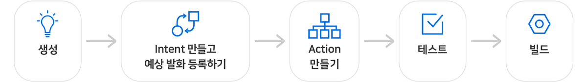
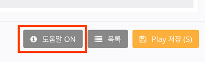

# 아리아, 안녕!

사용자가 발화했을 때 아주 간단한 응답을 하는 기본적인 Play를 만들어 보도록 하겠습니다.

Play는 `NUGU developers` > `NUGU play kit` > `Play Builder`에서 만들 수 있습니다.

Play를 만드는 과정을 간단히 보면 다음과 같습니다.

**Play를 만드는 순서**

1. **Play 생성하기**: Play의 기본정보들을 입력합니다. Play 이름, 인사말, 공통 에러 메시지 등이 포함됩니다.
2. **Intent 만들고 예상 발화 등록하기**: 사용자가 해당 Play를 사용하고자 할 때의 예상 발화문을 입력합니다.
3. **Action 만들고 응답 입력하기**: 사용자의 의도를 기반으로 NUGU가 응답하거나 동작하는 것을 Action이라고 합니다. Action별로 사용자에게 제공할 응답 및 동작들을 입력합니다.
4. **테스트 및 빌드하기**: 제공하고자 하는 동작을 정의했다면 Play Builder 내에서 테스트를 할 수 있고, 이후 빌드하여 Play를 완성할 수 있습니다.


Play Builder 내의 모든 상세 페이지에는 화면에 도움말이 직접 포함되어 있어 작업에 필요한 정보를 표시해 줍니다.\
화면 하단의 `도움말` 버튼을 통해 도움말을 켜고 끌 수 있습니다.


