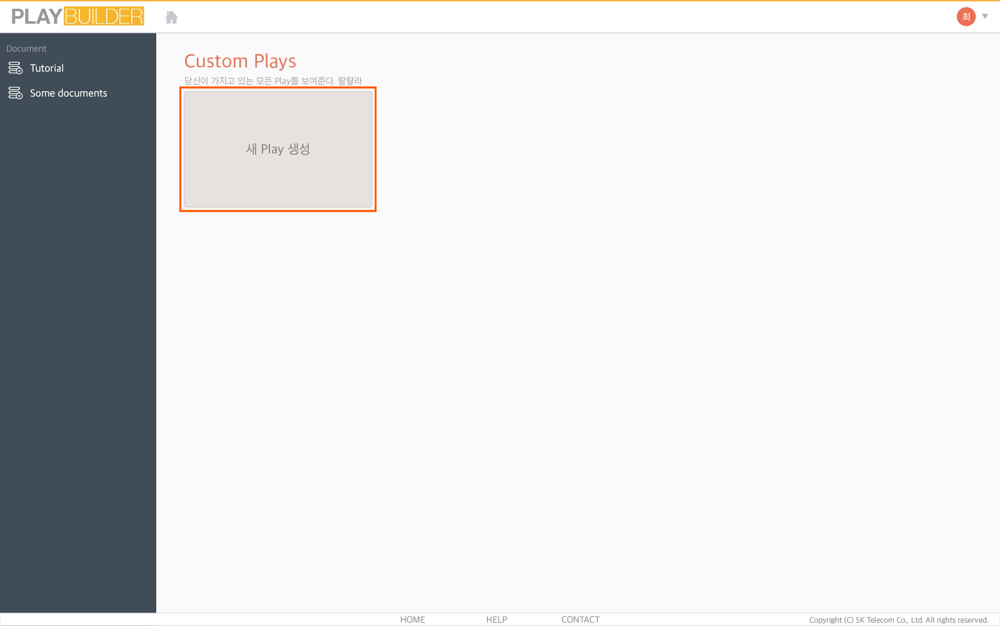
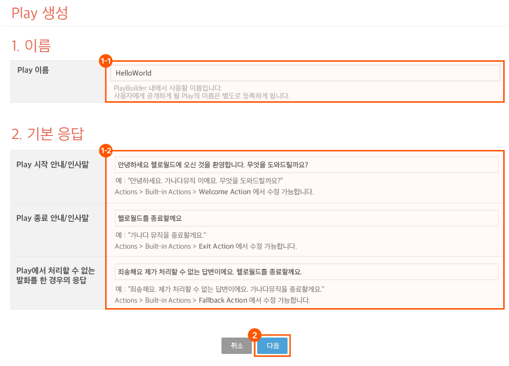
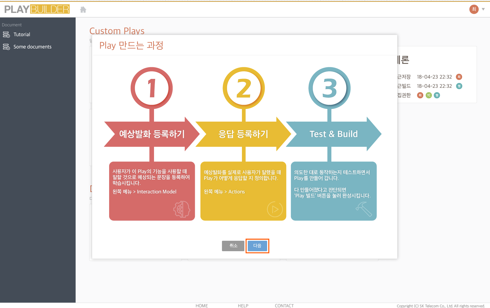
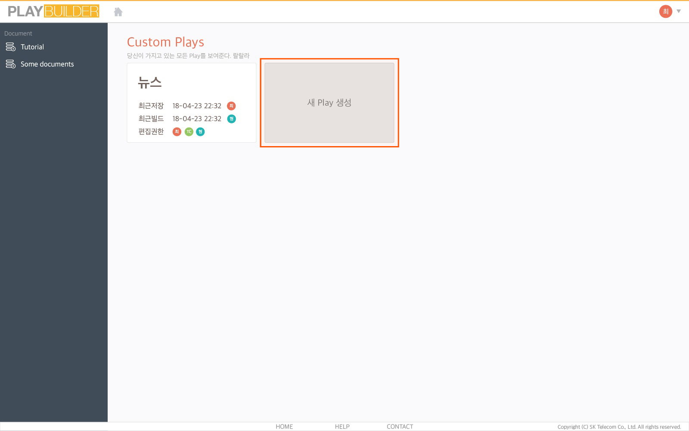

# 1) Play 생성하기

Play Builder를 이용하여 다음 순서에 따라 Play를 생성하세요.

1.  `Developers Console` > `Play kit`페이지에서 `Play Builder` 버튼을 클릭하여 Play Builder를 실행합니다.

2.  Play Builder 첫 화면의 Custom Plays에서 `새 Play 생성` 버튼을 클릭합니다.

    
3. 이름 정하기 팝업창에서 Play 이름과 기본 응답을 입력한 후 `다음` 버튼을 클릭합니다.
   * 이 이름은 Play Builder 내에서만 사용하는 이름입니다.
   * 영문, 숫자, 특수문자인 언더바(_), 하이픈(-)만 사용 가능합니다.
   * 기본 응답은 사용자가 Play에 진입했을 때, Play를 종료할 때, 사용자 발화에 대해 처리할 수 없을 때에 응답할 기본 메시지를 입력합니다.
   *   기본 응답은 Play를 생성한 후에 Built-in Action의 welcome, stop, fallback Action에서 각각 수정할 수 있습니다.

       
4.  Play를 만드는 과정을 설명하는 팝업창에서 `다음` 버튼을 클릭하면 Play 생성이 완료됩니다.

    
5.  생성된 Play는 홈 화면에 등록됩니다. 화면의 `새 Play 생성` 버튼을 클릭하여 Play를 계속해서 추가 생성할 수 있습니다.

    
