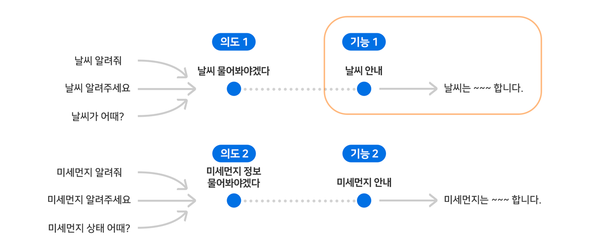
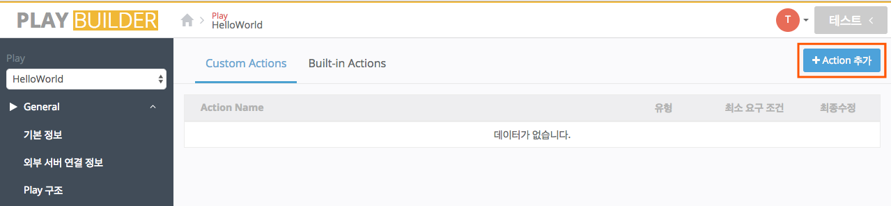
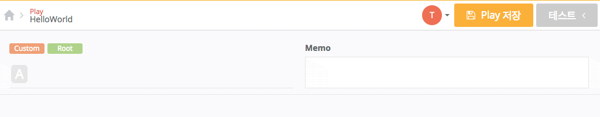
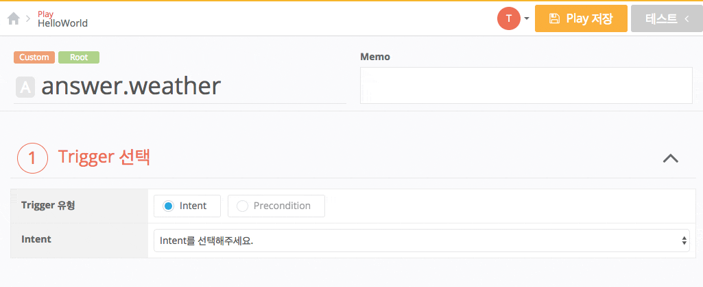
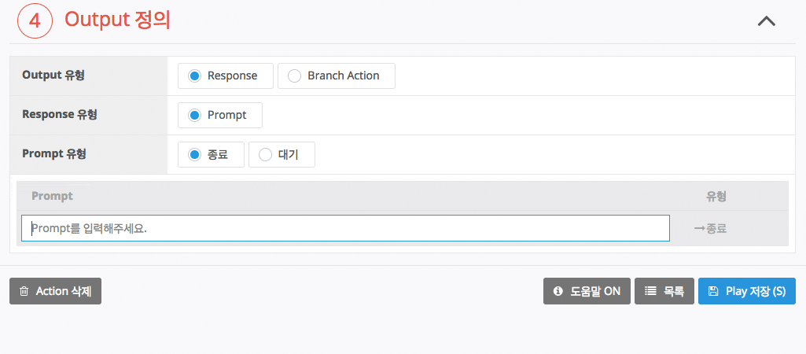
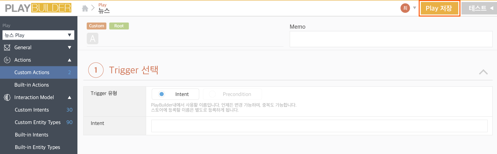

# 3) Action 만들고 응답 등록하기

이제 [Intent 만들고 예상 발화 등록하기](./create-an-intent-and-custom-utterances)에서 만든 2개의 Intent(ask.weather, ask.microdust)에 대한 응답을 입력하는 방법을 살펴보겠습니다.

NUGU에서는 하나의 Intent를 처리하는 최소 응답 단위를 Action이라고 부릅니다.

'응답 등록', 'Action 등록'이라는 말은 동일한 의미이며, 사용자가 목적 달성을 위해 Play에 발화한 것에 대한 응답을 미리 지정해 두는 것을 말합니다.

일반적으로 하나의 Intent에 대하여 하나의 Action을 정의하게 됩니다.

Action은 Play 개발자(제작사)가 사용자의 예상 발화에 대해 응답을 직접 등록하는 Custom Action과 NUGU play kit에서 제공하는 Built-in Action으로 구분할 수 있습니다.

여기서는 Custom Actions를 등록하는 방법에 대해서 설명합니다.

이제 "날씨", "미세 먼지"와 관련하여 정의한 Intent인 ask.weather, ask.microdust에 대한 응답(Action)을 등록해 보도록 하겠습니다.

## 날씨 관련 Action 추가

1. Play Builder 홈 화면에서 Action를 추가할 Play를 클릭하여 선택한 후 `Actions` > `Custom Actions` > `Action 추가` 버튼을 클릭합니다.

   

   * 영자, 숫자, 특수문자인 마침표(`.`), 언더바(`_`), 하이픈(`-`)만 사용할 수 있습니다.
   * Action명은 Intent에 대한 응답이라는 것을 쉽게 알 수 있도록 작성하는 것이 좋습니다.
   * NUGU에서는 이런 경우에 일반적으로 "answer.weather"와 같이 작성합니다.

   
2. Trigger 선택 영역에서 Trigger 유형을 **Intent**로 선택한 후 이전에 만들었던 2개의 Intent 중 이 Action이 처리할 날씨 관련 Intent(예: ask.weather)를 선택해 줍니다.

   
3. Output 정의 영역의 Prompt list 내에 위치한 입력 필드에 응답을 입력하고 `Enter` 키를 누르거나 마우스를 입력 필드 외 영역을 클릭하여 Action을 등록합니다.
4. Prompt List 내에 작성된 Prompt는 응답 하나를 의미하며, 여러 개를 입력하면 그 중 하나가 스피커로 랜덤 재생됩니다.
5. 입력한 응답을 삭제하려면 Prompt list에서 각 응답마다 표시된 휴지통() 아이콘을 누릅니다.

   
6. Play Builder 우측 상단에 있는 `Play 저장`을 누르면 Intent(ask.weather)와 Action(answer.weather)이 연결되어 해당 Play에 저장됩니다.

   


사용자 발화가 이전 단계에서 학습된 NLU 모델에 의해 ask.weather라는 Intent로 분석되면, Play의 answer.weather Action이 활성화 되고 Action에서 정의된 대로 동작하게 됩니다.


## 미세 먼지 관련 Action 추가

"미세 먼지" 관련 Action도 위 "날씨" 관련 Action 등록 방법과 동일하게 추가합니다.


이 장과 함께 보면 좋은 도움말

* [Action이란](../define-an-action)
* [Action Tree 만들기](../define-an-action/use-branch-actions)
* [Response 작성하기](../define-an-action/use-responses)

