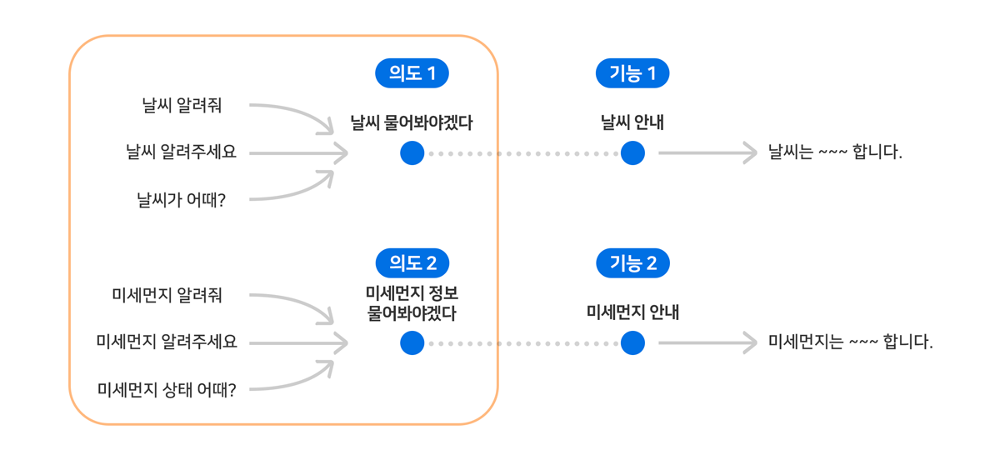

# 2) Intent 만들고 예상 발화 등록하기

Play를 생성한 이후에는 사용자가 어떻게 발화할 것인지 예측한 후 이 예상 발화의 Intent를 Play에 정의해야 합니다. Play는 특정 기능을 동작시키려는 사용자의 발화를 Intent 단위로 묶어서 기능과 연결짓게 됩니다.

Play Builder를 이용하여 '날씨와 미세 먼지 정보를 제공하는 Play'의 Intent를 만들어 보도록 하겠습니다.

## 날씨 관련 Intent 추가

1. Play Builder 홈 화면에서 Intent를 추가할 Play를 클릭하여 선택한 후, `User Utterance Model` > `Custom Intent` > `Intent 추가` 버튼을 클릭합니다.
2. Intent Name 필드에 "날씨"와 관련한 Intent명을 입력하고, 그 Intent 내용에 맞는 사용자 예상 발화를 입력한 후 `등록` 버튼을 클릭합니다.
3. Intent Name 필드

   * 영자, 숫자, 특수문자인 마침표(.), 언더바(_), 하이픈(-)만 사용할 수 있습니다.
   * Intent명은 "날씨를 물어봐야겠다"라는 의도를 쉽게 알 수 있는 영문자로 작성하는 것이 좋습니다.
   * NUGU에서는 이런 경우에 일반적으로 "ask.weather"와 같이 작성합니다.
4. 예상 발화 필드

   * 입력한 Intent에 해당하는 예상 발화들을 입력합니다.
   * 실제 예: "날씨 알려줘", "날씨 알려주세요", "날씨 어때?"
   * 같은 의도라도 다양한 표현이 존재할 수 있으므로 예상 발화를 많이 입력할수록 사용자 의도 파악에 도움이 됩니다.
5. 입력한 발화를 삭제하려면 Expression 리스트에서 각 발화마다 표시된 휴지통() 아이콘을 누릅니다.

   
6. Intent에 예상 발화를 등록한 후 `Play 저장` 버튼을 클릭하여 Intent 등록 작업을 완료합니다.
7. `Play 저장` 버튼 대신 `목록` 버튼을 클릭하면 Play에 Intent를 추가하지 않고 Custom Intents 페이지로 이동합니다.


Intent를 Play에 저장하면, NLU 엔진은 등록된 예상 발화를 자동으로 학습해서 해당 Play의 NLU 모델을 생성하게 됩니다. 이 NLU 모델은 사용자의 발화를 이해하여 Intent/Entity를 분석하는 역할을 합니다.


## 미세 먼지 관련 Intent 추가

1. "미세 먼지" 관련 Intent도 위 "날씨" 관련 Intent 추가 방법과 동일하게 추가합니다.(예: ask.microdust)

   
2. 추가한 Intent는 Custom Intents 페이지에서 확인 및 관리할 수 있습니다.

   
