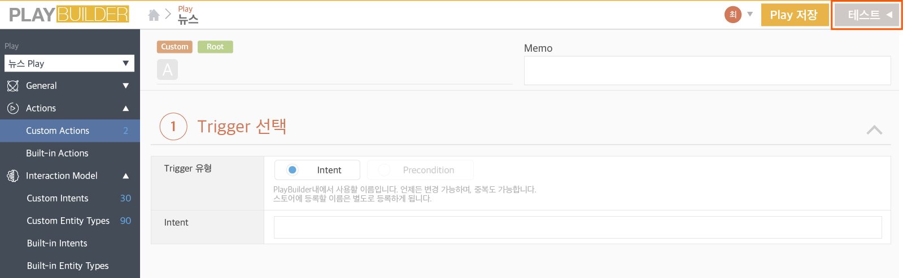
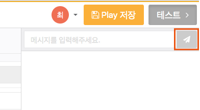
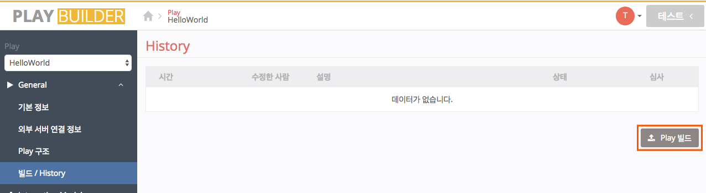
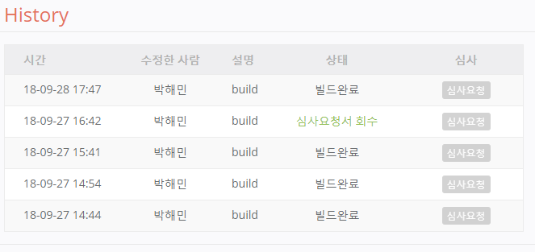

# 4) Play 테스트 및 빌드하기

## 테스트하기

이제 만들어진 Play를 테스트할 차례입니다.

1. Play Builder 우측 상단에 있는 `테스트` 버튼을 클릭하면 테스트 채팅창이 표시됩니다.

   
2. 테스트 채팅창에 날씨 또는 미세 먼지 관련 발화를 입력한 후 Enter 키를 누르거나 버튼을 클릭합니다.(예: 날씨 알려줘)
3. 입력한 발화에 따라 Play가 어떻게 응답하는지를 직접 확인할 수 있습니다.
4. Action에 등록한 "오늘 날씨는 맑겠습니다. 오늘 날씨는 맑아요. 오늘은 맑은 날씨가 되겠습니다." 중 한 문장이 나오는 것을 확인할 수 있습니다.

   
5. 테스트 결과 수정해야 할 부분이 있으면 Intent와 Action을 수정한 후 만족할 만한 결과가 나타날 때까지 위 테스트를 반복합니다.


Intent와 Action 작업에 대한 내용은 각각 [Intent 만들고 예상 발화 등록하기](./create-an-intent-and-custom-utterances)과 [Action 만들고 응답 등록하기](./create-an-action-and-an-answer)을 참고하세요.


## 빌드하기

테스트를 마치면 마지막으로 빌드(Build)라는 과정을 거치면 Play가 완성됩니다.\
빌드(Build)는 테스트와 수정을 반복하여 만들어진 Play를 최종적으로 완성하여 Play Builder 밖으로 내보내는 것을 말합니다.

1. Play Builder에서 빌드할 Play를 선택하고, 우측 상단의 `Play 빌드` 버튼을 클릭한 후 확인창에서 `확인` 버튼을 클릭하면 빌드가 실행됩니다.

   
2. 완성된 Play 빌드는 `General` > `빌드/History` 페이지에서 확인 및 관리할 수 있습니다.

   


* 빌드를 완료한 후에도 Play를 수정 및 업데이트하고, 다시 빌드할 수 있습니다.
* 빌드를 완료한 Play는 `NUGU developers` > `NUGU play kit` > `관리` 메뉴를 이용하여 Play 심사 및 배포할 수 있습니다.

