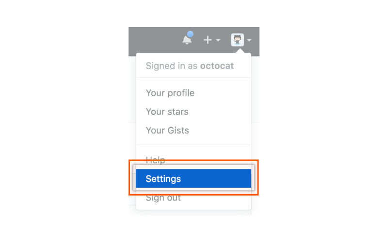
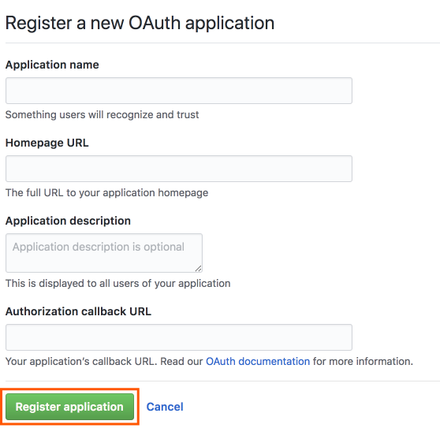
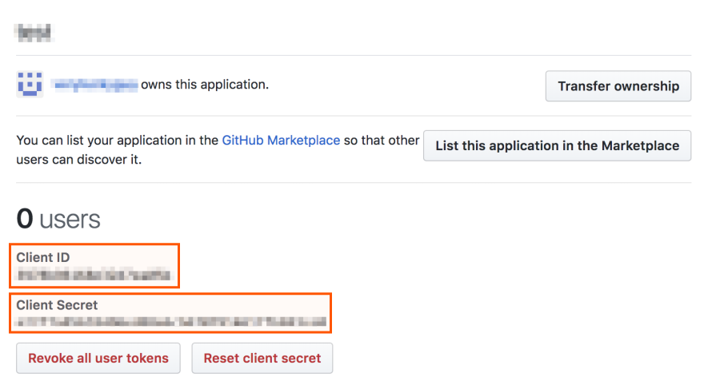
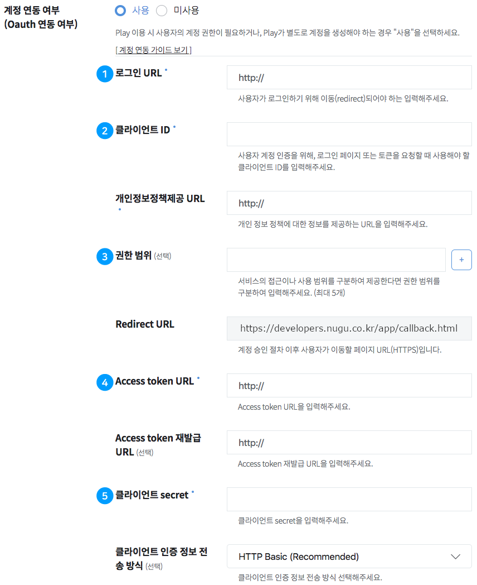
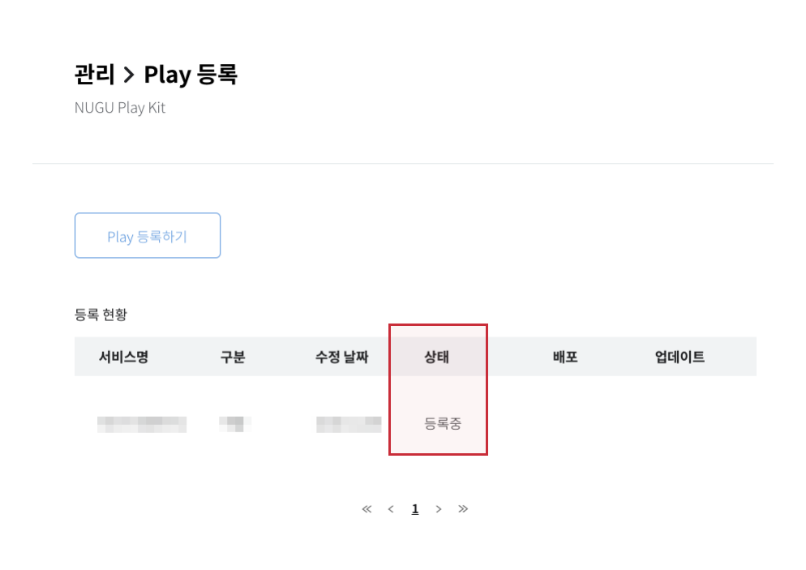
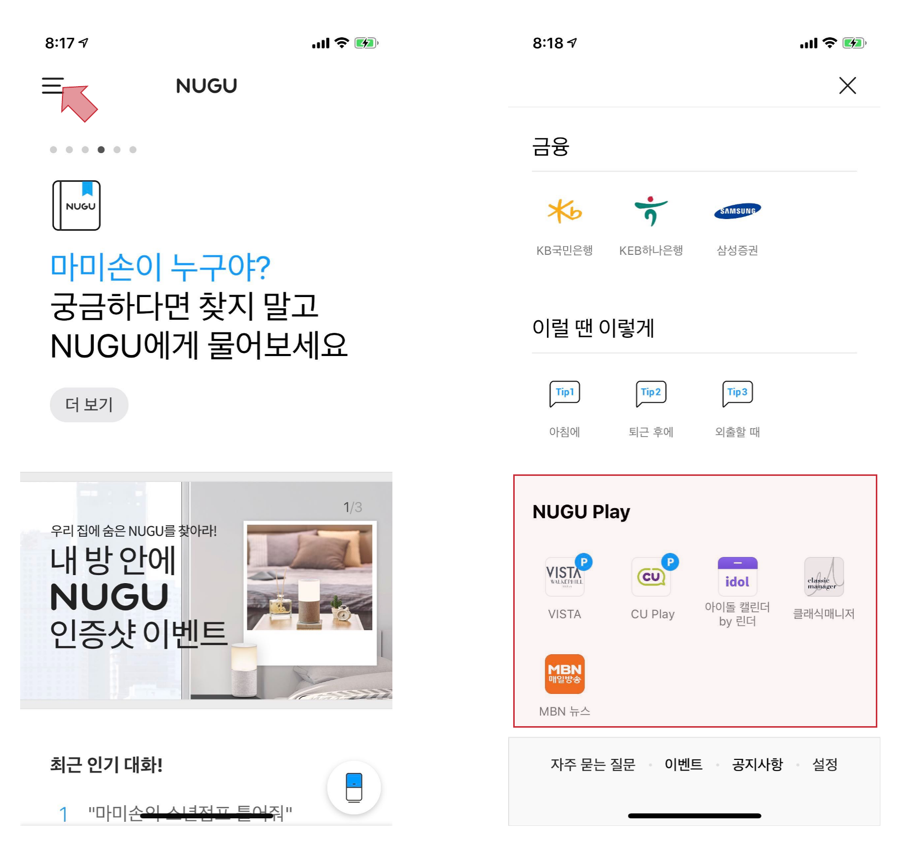
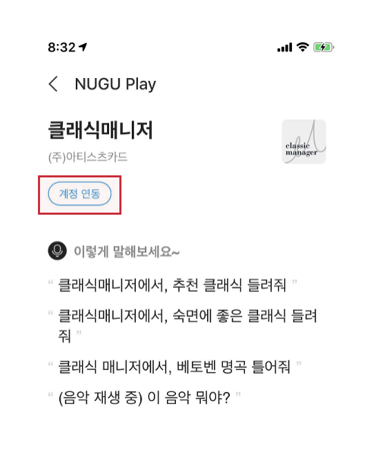

# OAuth 2.0 연동하기

Play Builder를 NUGU 스피커를 통해 훌륭한 서비스를 만들 수 있지만 OAuth 2.0을 이용해 사용자 계정에 접속한다면 다음과 같은 더욱 확장된 서비스를 만들 수 있습니다.

* Google Calendar의 일정 관리
* Facebook의 내 계정의 새로운 소식 알림
* 쇼핑몰에서 사용자의 계정으로 주문 처리
* 내 회사의 계정으로 업무 처리

## OAuth란?

> OAuth는 인터넷 사용자들이 비밀번호를 제공하지 않고 다른 웹사이트 상의 자신들의 정보에 대해 웹사이트나 애플리케이션의 접근 권한을 부여할 수 있는 공통적인 수단으로서 사용되는, 접근 위임을 위한 개방형 표준이다.
> 
> 이 매커니즘은 여러 기업들에 의해 사용되는데, 이를테면 아마존, 구글, 페이스북, 마이크로소프트, 트위터가 있으며 사용자들이 타사 애플리케이션이나 웹사이트의 계정에 관한 정보를 공유할 수 있게 허용한다.
> 
> 출처: [Wikipedia](https://ko.wikipedia.org/wiki/OAuth)

OAuth를 이용해 사용자 정보에 접근할 수 있고, 이를 통해 Play의 기능을 확장할 수 있습니다. NUGU developers에서는 OAuth 2.0 연동을 지원하며 다음의 방식으로 이용할 수 있습니다.

* 아마존, 구글, 페이스북, 마이크로소프트, 트위터와 같은 잘 알려진 OAuth 2.0 계정을 이용 (이하 소셜 계정 이용)
* 자체 OAuth 2.0 Server 이용 (이하 자체 계정 이용)

## 소셜 계정을 이용하여 OAuth 2.0 연동하기 <a id="link-social-account"></a>

다음 예는 깃허브(Github)의 OAuth 2.0 계정과 연동하는 방법을 나타낸 것입니다. 다른 소셜 계정도 비슷한 방식으로 연동이 가능합니다.

* 다음의 1~4 단계까지는 깃허브(Github)의 [Building OAuth Apps](https://developer.github.com/apps/building-oauth-apps) 문서를 참고합니다.

### 1단계: OAuth App 생성하기

깃허브(Github) 가이드 페이지 [Creating an OAuth App](https://developer.github.com/apps/building-oauth-apps/creating-an-oauth-app)에서도 OAuth App 생성에 대한 내용을 확인할 수 있습니다.

1.  Github App의 우측 상단 내 Profile 사진을 클릭하고 `Settings` > `Developers settings` > `OAuth Apps` > `Settings` 메뉴를 클릭합니다.

    
2. `New OAuth App` 버튼을 클릭하여 새로운 OAuth App을 만듭니다.
   * 최초 등록하는 경우, 버튼에는 `Register a new application`이라고 표시됩니다.

     
3. OAuth App 생성 화면에서 Application name, Homepage URL, Application description, Authorization callback URL을 입력한 후 `Register application`을 눌러 OAuth App을 생성을 완료합니다.
   * Authorization callback URL에는 `https://developers.nugu.co.kr/app/callback.html`을 입력합니다.

     

### 2단계: OAuth App 정보 확인하기

1단계에서 등록한 OAuth App에서 Client ID와 Client Secret 정보를 확인합니다.



### 3단계: OAuth URL 정보 확인하기

깃허브(Github) 가이드 페이지 [Authorizing OAuth Apps](https://developer.github.com/apps/building-oauth-apps/authorizing-oauth-apps/#web-application-flow)에서도 OAuth 연동에 필요한 URL 관련 내용을 확인할 수 있습니다.

* 로그인 : [1. Request a user's GitHub identity](https://docs.github.com/en/developers/apps/building-oauth-apps/authorizing-oauth-apps#1-request-a-users-github-identity)
* Access token : [2. Users are redirected back to your site by GitHub](https://docs.github.com/en/developers/apps/building-oauth-apps/authorizing-oauth-apps#2-users-are-redirected-back-to-your-site-by-github)


Github에서는 Access token 재발급이 필요없습니다. 하지만 다른 소셜 계정에서는 Access Token 재발급이 필요할 수 있습니다. 이 경우 소셜 계정의 OAuth 개발 가이드에서 OAuth token 재발급 URL을 확인하면 됩니다.


### 4단계: Scope 결정하기

OAuth Scope는 Access Token으로 사용할 수 있는 리소스의 허용 범위를 이야기한다. 이 값은 각 소셜 계정별로 정의하는 값이 다르므로 각 소셜 계정의 OAuth 개발 가이드를 참고하여 정해야 합니다.

깃허브(Github) 가이드 페이지 [Understanding scopes for OAuth Apps](https://developer.github.com/apps/building-oauth-apps/understanding-scopes-for-oauth-apps)에서도 관련 내용을 확인할 수 있습니다.

### 5단계: NUGU developers에서 OAuth 연동 정보 입력

2단계부터 4단계에 걸쳐 확인한 정보를 `Developers` > `Play kit` > `Play 관리` 메뉴에서 `Play 등록하기` 버튼을 클릭해 OAuth 계정 연동 정보를 입력합니다.



#### ① 로그인 URL
3단계에서 확인한 URL을 입력합니다. (`https://github.com/login/oauth/authorize`)

#### ② 클라이언트 ID
2단계에서 확인한 Client ID를 입력합니다. (ex: 3978bf6158e32d7ea05b)

#### ③ 권한 범위
repo와 gist를 추가합니다.(최대 5개)

#### ④ Access token URL
3단계에서 확인한 URL을 입력합니다.(`https://github.com/login/oauth/access_token`)

#### ⑤ 클라이언트 secret
2단계에서 확인한 클라이언트 Secret을 입력합니다. 예) 12bf7a85698496fd87e6cb6703914617fb693ce0)

### 6단계: Backend proxy 개발하기

위 1~5 단계까지의 작업을 통해 Play 개발 시 사용할 OAuth Token이 준비되면, 이 Access token을 사용할 Backend proxy를 개발해야 합니다.


Backend proxy 개발에 대한 자세한 내용은 [Backend proxy에서 Access token 사용하기](#using-access-token)를 참고하세요.


## 자체 계정을 이용하여 OAuth 2.0 연동하기 <a id="build-your-own-oauth-server"></a>

[OAuth 2.0 Protocol](https://tools.ietf.org/html/rfc6749)을 지원하는 OAuth 2.0 Server를 새로 구축하거나 이미 가지고 있다면 즉시 서비스를 사용할 수 있습니다.

OAuth 2.0 Serve는 인터넷의 기술 문서를 참고하여 구축할 수 있으며, 필요한 경우 에이전시를 통하여 자체 계정을 이용한 OAuth Authorization Serve를 구축할 수 있습니다.

* Grant Type : [Authorization Code Grant](https://tools.ietf.org/html/rfc6749#section-1.3.1)
* Token Type : [Bearer token](https://tools.ietf.org/html/rfc6750)

### Play의 OAuth 연동 정보 작성

`Developers` > `Play kit` > `Play 관리`  메뉴에서 `Play 등록하기` 버튼을 클릭해 OAuth 계정 연동 정보를 입력합니다.

*(별표) 표시는 필수 제공해야 하는 내용입니다.

| 항목                     | 설명                                                                                          | 예시                                       |
|------------------------|---------------------------------------------------------------------------------------------|------------------------------------------|
| 로그인 URL*               | 사용자가 로그인하기 위해 이동(redirect)되어야 하는 URL입니다.                                                    | `https://your-domain/login?querystring`  |
| 클라이언트 ID*              | 토큰을 요청할 때 사용하는 클라이언트 ID입니다.                                                                 | `caDRl3WOuL5myqfHW3bjTIzGRJsVVMGP`       |
| 권한 범위                  | Access Toke Scope이 있는 경우 입력합니다.<br/>자세한 내용은 OAuth 2.0 문서의 Access Token Scope 참고하세요.         | `repo, gist`                             |
| Access token URL*      | Access Token을 발급 받을 수 있는 URL을 입력합니다.<br/>자세한 내용은 OAuth 2.0 문서의 Access Token Request를 참고하세요. | `https://your-domian/access-token`       |
| Access token 재발급 URL   | Refresh token을 발급받기 위한 URL입니다.<br/>자세한 내용은 OAuth 2.0 문서의 Refreshing an Access Token를 참고하세요. | `https://your-domain/refresh-token`      |
| 클라이언트 secret*          | 토큰을 요청할 때 클라이언트ID와 함께 사용하는 값입니다.                                                            | `CigogRESYHuSzTTa`                       |

### Redirect URL (Callback URL) 설정하기

* Parameter값: redirect url
* 계정 승인을 완료한 후 사용자가 이동할 페이지 URL이며, `https://developers.nugu.co.kr/app/oauth/callback`을 사용합니다.


자세한 내용은 OAuth 2.0 문서의 [Authorization Request](https://tools.ietf.org/html/rfc6749#section-4.1.1)를 참고하세요.


### OAuth Server 구현하기

OAuth 관련 서적을 참고하거나 [https://oauth.net/code/](https://oauth.net/code)와 같은 웹사이트에서 제공하는 라이브러리를 사용하여 OAuth Server를 구현할 수 있습니다.

## Backend proxy에서 Access token 사용하기 <a id="using-access-token"></a>

Play 개발을 위해서 OAuth Token을 사용할 준비가 끝났으며, Play 사용자는 NUGU App을 통해서 OAuth 로그인을 통해 OAuth Token을 받을 수 있습니다. 그리고 Play 개발자는 Backend proxy을 통해서 context.session 항목으로 Access token을 받을 수 있습니다.


```bash
POST /action.name
Host: backend.proxy.host.domain
Accept: application/json
Content-Length: 85
Content-Type: application/json
```



```json
{
  "version": "2.0",
  "action": {
    "actionName": "action.name",
    "parameters": {
      "...": {
        "type": "...",
        "value": "..."
      }
    }
  },
  "context": {
    "session": {
      "id": "85964e40-cf9c-4eae-841b-d736d5ef9060",
      "isNew": true,
      "accessToken": "EiIvr59Q02vBi2CJRJOLRxGopq0U"
    },
  ...
```


#### OAuth Token을 더이상 사용하지 못하도록 만료 처리

사용자가 OAuth 인증을 한 이후에 아래와 같이 Invalidate Token API를 호출하여 OAuth Token을 만료 처리할 수 있습니다. 요청 Form의 token은 Access Token 입니다. Token이 만료처리되면 더이상 Backend proxy로 Access token이 전달되지 않습니다. 사용자는 Token이 만료되어도 '계정 연동'을 통해 다시 OAuth 인증을 받을 수 있습니다.


```bash
POST /v1/play/oauth/invalidate
Host: api.sktnugu.com
Content-Length: 168
content-Type: application/x-www-form-urlencoded
```



```text
token=EiIvr59Q02vBi2CJRJOLRxGopq0U
```


성공한 경우는 아래 응답을 주며 Token은 즉시 만료처리됩니다.


```bash
HTTP/1.1 200 OK
Content-Type: application/json
Content-Length: 11
```



```json
{"ok": true}
```


요청한 Token과 일치하는 것이 없는 경우 아래와 같이 에러 응답을 반환합니다.


```bash
HTTP/1.1 200 OK
Content-Type: application/json
Content-Length: 
```



```json
{"ok": false, "error": "invalid_auth"}
```


## OAuth 연동 테스트하기 <a id="test-oauth"></a>

1. Play의 상태가 등록중, 심사대기, 심사반려, 심사중, 심사완료, 배포대기 중인 경우에 스피커에서 테스트가 가능합니다.

   
2. [테스트하기](./test-a-play)에서 '디바이스(스피커)에서 테스트하기' 항목을 참고하여 테스트 스피커를 추가합니다.
3. NUGU 앱에 접속하여 왼쪽 위의 햄버거 메뉴를 클릭한 후 NUGU play 항목에서 내가 만든 Play를 클릭합니다.

   
4. '계정 연동' 버튼을 클릭합니다. 계정 연동 후 스피커로 테스트합니다. NUGU 앱에서 계정 연동을 하고 스피커로 테스트 하면 accessToken을 받을 수 있습니다. (단, 플레이 등록 후 하루 후부터 스피커 테스트가 가능합니다.)

   


Play를 등록하는 방법은 [Play 정보 등록](../play-registration-and-review/register-a-play)을 참고하세요.

