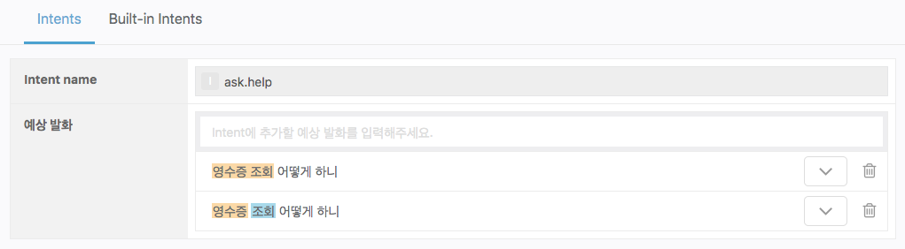
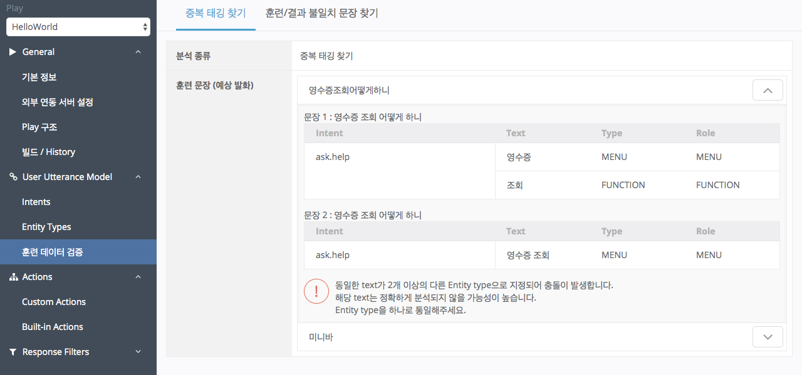
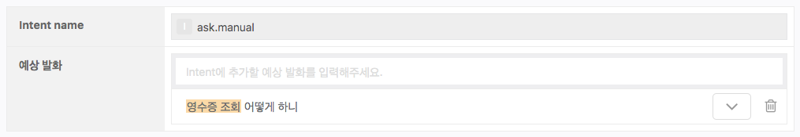
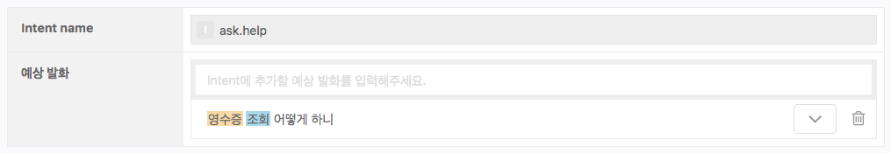
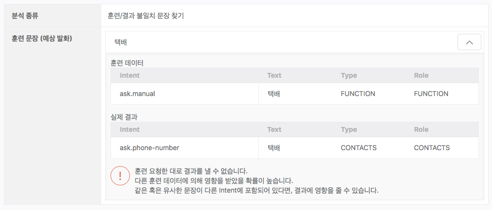

# 훈련 데이터 검증

User Utterance Model은 Play가 사용자의 말을 이해할 수 있도록 훈련된 모델입니다. Play 별로 생성되는 이 모델은 `User Utterance Model` > `Intent`에서 입력한 예상 발화와 해당 발화에 태깅한 Entity 정보에 의해 훈련됩니다. 이 훈련 데이터가 잘못 구성된 경우 Play는 엉뚱한 응답을 하거나, 사용자의 발화를 처리하지 못하게 됩니다.

`훈련 데이터 검증`은 훈련 데이터를 입력하면서 발생할 수 있는 중의성을 찾아주는 보조 도구이며, 2가지 도구를 제공합니다.

| 도구 유형            | 설명                                       |
|------------------|------------------------------------------|
| 중복 태깅 찾기         | 동일한 문장이 다른 방식으로 태깅된 경우를 찾아냅니다.           |
| 훈련/결과 불일치 문장 찾기  | 훈련 문장이 실제로 입력되었을 때, 요청한 대로 분석되는지 검사합니다.  |

`훈련 데이터 검증`은 훈련 데이터(예상 발화) 구성의 최소 규칙을 통과했는지를 체크하는 것으로, 훈련과 함께 자동 수행됩니다. 수정이 필요한 문장이 발견되는 경우 해당 문장을 결과 목록에 보여주며, 훈련 데이터에서 이상을 발견하지 못한 경우, 검증 결과가 나타나지 않습니다.


`훈련 데이터 검증` 분석 결과가 없는 경우, 훈련 데이터가 서로 간섭을 주지 않도록 구성되었다고 볼 수 있습니다.


## 중복 태깅 찾기 

이 도구는 완전히 같은 텍스트로 구성되었지만 다른 방식으로 Entity가 태깅된 문장들을 찾아냅니다. 동일한 문장이 다른 방식으로 태깅되면, NLU엔진 또한 복수로 분석하게 되어 명확한 동작 수행을 할 수 없습니다. 이 도구에서 발견되는 문장은 하나의 방식으로 태깅해야 합니다. 아래의 예는 잘못 태깅한 문장을 나타냅니다.

훈련 데이터를 구성할 때 이와 같이 동일한 문장을 다르게 Entity 태깅한 경우, `중복 태깅 찾기` 도구는 아래와 같이 분석을 하게 됩니다. 이 경우에는, 두 문장 중 하나를 삭제해야만 정상적인 결과를 얻을 수 있습니다.

아래의 예와 같이 같은 문장이 서로 다른 Intent에서 다른 Entity 태깅이 된 경우도 중복태깅으로 간주하여 `중복 태깅 찾기`도구는 해당 문장을 찾아내게 됩니다.

## 훈련/결과 불일치 문장 찾기 

이 도구는 NLU 엔진에 예상 발화 문장이 실제로 입력되었을 때, 요청한 대로 분석할 수 없는 경우를 찾아냅니다. 이는 해당 문장 외에도 다른 문장의 영향을 받아 요청한 대로 분석할 수 없는 경우를 의미합니다. 실제 분석 결과가 훈련 요청한 대로 나오지 않는 원인은 여러가지가 있을 수 있습니다. 중복 태깅에 의해서도 발생할 수 있으며, 동일하진 않더라도 의미상 유사한 문장이 훈련 데이터에 있어서 서로 간섭을 일으킬 수 도 있습니다.

다음과 같이 같은 텍스트가 여러 개의 Entity Type으로 정의된 경우, 훈련 요청한 대로 실제 분석이 되지 않게 됩니다. 다음과 같이 '택배'라는 텍스트가 연락처를 의미하는 'CONTACTS'와 기능을 의미하는 'FUNCTION'에 포함된 경우 중의성이 발생하여 원하는 결과를 얻을 수 없을 가능성이 높습니다.


검증 도구를 통과했다고 하여 훈련 데이터가 완벽함을 의미하지 않습니다.\
다음의 [작성 가이드](../define-user-utterance-model/how-to-write-customer-utterances)에 따라 구성되어야, Play가 사용자의 말을 더 잘 이해할 수 있습니다.

