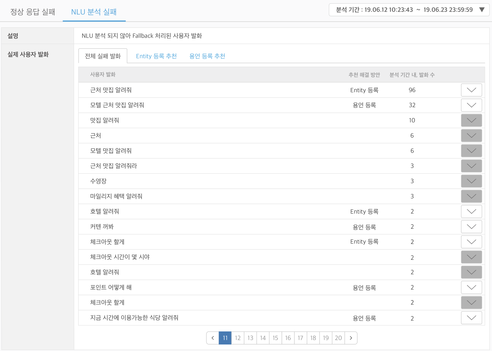
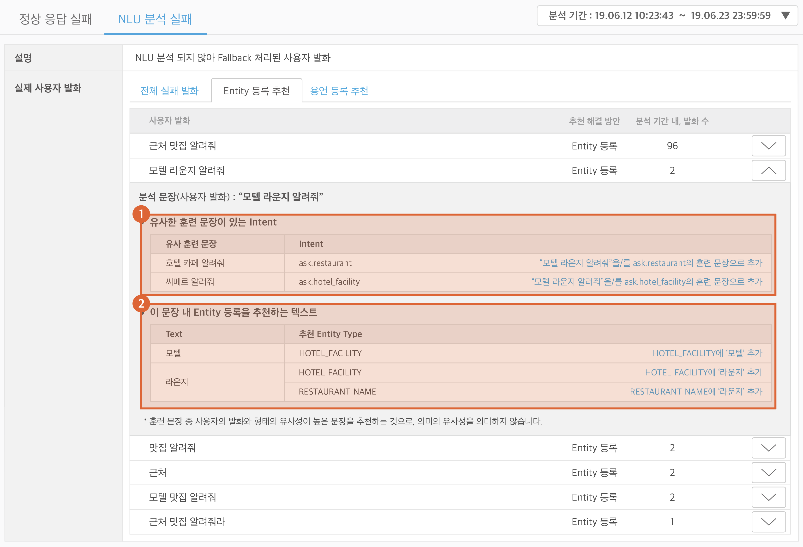
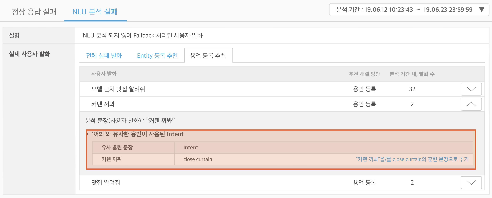

# 실패 발화 분석

`실패 발화 분석`은 최종적으로 사용자에게 전달된 응답이 서비스 실패로 판단되는 경우, 그 때의 사용자 발화를 분석하는 도구입니다. 빌드/심사 단계를 거쳐 배포가 완료된 Play에 대해서만 동작하며, 업데이트를 통해 Play가 새로 배포되면, 해당 배포 시점 부터 새로운 분석이 시작됩니다. 이 분석 도구에서 제공되는 기초 통계 정보 및 추천 정보를 활용하여 User Utterance Model을 수정하는 것을 권장합니다.

| 도구 유형      | 설명                                        |
|------------|-------------------------------------------|
| 정상 응답 실패   | NLU 분석은 이루어졌으나, 정상 응답이 되지 않은 것으로 추정되는 발화  |
| NLU 분석 실패  | NLU 분석이 되지 않아, Fallback 처리된 발화            |

이 도구는 스피커를 통해 사용자에게 전달되는 최종 응답이 에러 메세지에 해당하는 경우 '서비스 실패'라고 판단하며, 이 때 NLU 분석이 되었다면 `정상 응답 실패`, NLU 분석 결과가 없다면 `NLU 분석 실패`로 분류합니다. [Fallback prompt](../define-an-action/built-in-actions#fallback), [Exception prompt](../define-an-action/manage-exceptions) 외에도, 일반 액션에서 "제가 할 수 없는 일이에요.", "검색에 실패했습니다" 등과 같은 응답이 전달된 경우, 서비스 실패로 분류되어 `실패 발화 분석` 도구의 분석 대상이 될 수 있습니다.

## 정상 응답 실패 

이 도구에서는 Play 개발자가 생성한 User Utterance Model에 의해 NLU 분석은 이루어졌으나, 정상적인 응답이 나가지 않은 경우의 로그를 확인할 수 있습니다. NLU 분석이 이루어졌다고 하여, 그 분석이 Play 개발자의 의도대로 되었다고 간주할 수는 없습니다. NLU 엔진이 사용자 발화를 개발자의 의도대로 분석했으나 처리 가능 범위 밖의 요청이었을 수 있고, 또는 개발자의 의도대로 분석하지 않고 다르게 분석했을 수도 있습니다.

첫 번째 경우(의도대로 분석되었으며 그 요청이 가능 범위 밖인 경우)는 별도의 대응이 필요없으나, 두 번째 경우(예상과 다르게 분석된 경우)는 학습 문장을 추가/수정하거나, Entity를 수정/추가하여 의도대로 분석이 되도록 User Utterance Model을 수정하는 것을 권장합니다.

## NLU 분석 실패 

Play 개발자가 요청한 학습 데이터를 기반으로 생성된 User Utterance Model 만으로는 NLU 엔진이 해당 발화를 분석할 수 없는 경우 해당 발화를 보여주며, 그 중 해결 방안을 제안할 수 있는 경우 이를 보여줍니다. 이 도구가 제시하는 해결 방안은 크게 두 가지 `Entity 등록`과 `용언 등록`이 있습니다.

### 추천 해결 방안 1 : Entity 등록 

NLU 분석 실패 발화 내의 특정 단어가 Entity일 가능성이 있어서 Entity로 등록할 필요가 있다고 분석되는 경우에 추천 방안이 제시됩니다. 이 추천 결과를 통해 (1) 해당 문장 자체를 기존 Intent의 예상 발화로 추가하거나, (2) 발화 내의 특정 단어를 Entity로 추가하여 Model을 수정하는 것을 권장합니다.

#### (1) 이 문장과 유사한 훈련 문장이 있는 Intent

`NLU 분석 실패` 도구는 사용자 발화와 유사하다고 분석되는 훈련 문장(예상 발화)이 있는 경우 그 문장과 Intent를 모두 보여줍니다. 이 도구는 문장의 패턴을 통해 유사한 훈련 문장을 찾기 때문에 실제 의미는 다른 문장이 분석 결과로 제안될 수 있으며, 여러 문장이 동시에 노출될 수도 있습니다. 분석 결과 중 사용자 발화의 의도라고 판단되는 Intent가 있다면, 우측의 버튼을 통해 분석 대상을 Intent의 학습 문장으로 추가할 수 있습니다. 사용자 발화를 여러 Intent의 훈련 문장으로 추가하는 경우 원하는 분석 결과를 얻을 수 없으므로, 하나의 Intent에만 추가하는 것을 권장합니다.

#### (2) 이 문장 내 Entity 등록을 추천하는 텍스트

사용자 발화에 포함된 텍스트 중 Entity 등록을 추천하는 단어가 있는 경우 그 텍스트들을 노출하며, 각 텍스트들과 유사한 텍스트가 포함된 Entity Type 들을 추천합니다. 하나의 텍스트에는 여러 Entity Type이 추천될 수 있습니다. 이 경우도 하나의 텍스트는 하나의 Entity Type에만 추가하는 것을 권장합니다.

### 추천 해결 방안 2 : 용언 등록 

NLU 분석의 원인이 용언인 경우, 그 문장과 유사한 의미로 분석되는 학습 문장 및 Intent을 추천합니다. 이 용언은 기존 데이터에 포함되지 않은 새로운 용언일 가능성이 높습니다. 이 용언과 기존 학습 문장을 조합하여 새로운 학습 문장 및 Intent를 추천하게 되며, 이때 학습 문장에 Entity 태깅이 필요하다면, Entity 태깅된 학습 문장이 추천됩니다.

추천된 문장의 의도가 Intent와 유사하다고 판단된다면, 우측 버튼을 통해 훈련 문장으로 추가하는 것을 권장합니다.


`실패 발화 분석`도구의 분석 기간은 Play 배포에 의해 결정됩니다. 배포 시점 이후의 가장 빠른 로그가 분석 시점이 되며, 해당 배포 Play 버전의 마지막 로그가 분석 종점이 됩니다. 분석은 하루에 한 번, 오전 4 ~ 6시 사이에 진행 됩니다.



음성 인식 단계에서 화자의 의도와 다르게 인식된 발화도 `실패 발화 분석`의 분석 대상으로 노출될 수 있습니다. 음성 인식 엔진은 Play 개발자가 입력한 훈련 데이터를 기반으로 학습되어 동작하므로, 인식이 잘 되지 않는 문장/텍스트를 추가하여 인식이 되도록 데이터를 쌓아나갈 수 있습니다. 그러나 사람 간의 대화에서도 구분이 쉽지 않은 발화(예: 일/이/삼십일일/삼십일 등의 숫자 관련 표현, 들려/들어/틀어, ㅔ/ㅐ/ㅖ, 막다/맑다 등), 어려운 발음, 불분명한 발음 등의 경우에는 데이터의 보강에도 불구하고 인식이 정확히 이루어지지 않을 가능성이 있습니다.



Play로 들어오는 발화 중, Built-in Intent로 분석되었거나, 정상 응답을 한 발화는 `실패 발화 분석` 결과에 노출되지 않습니다. 전체 발화 통계는 다음의 도움말을 참고하세요.\
[Play 이용 통계 확인](../../distribute-and-manage-a-play/monitor-play-stats)

