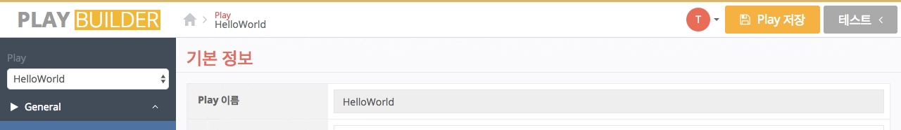
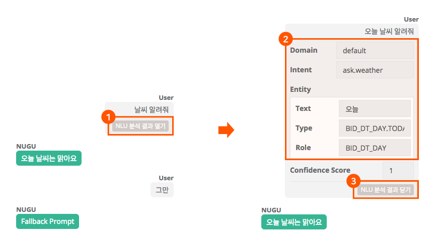
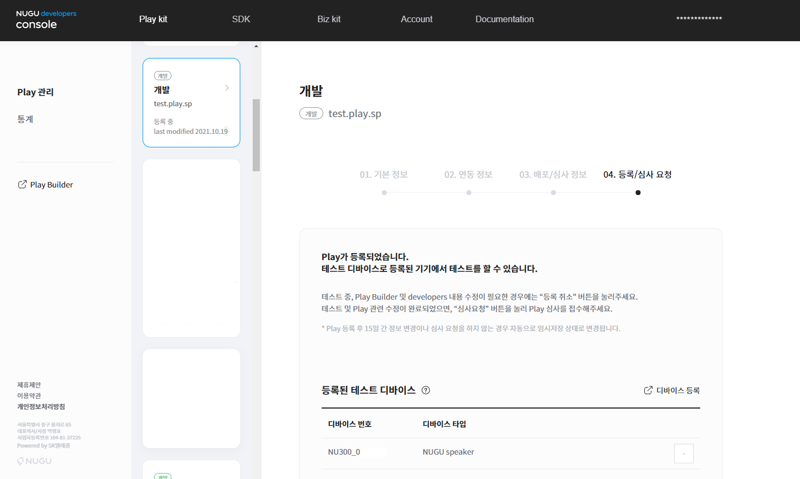
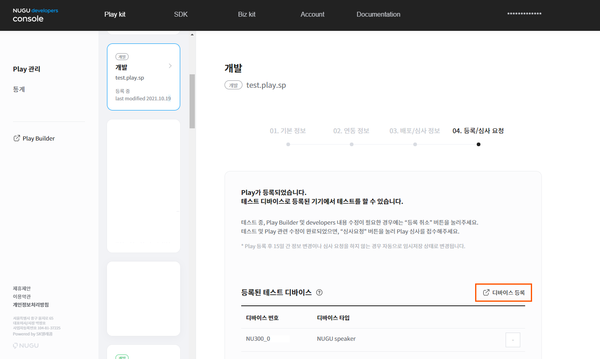
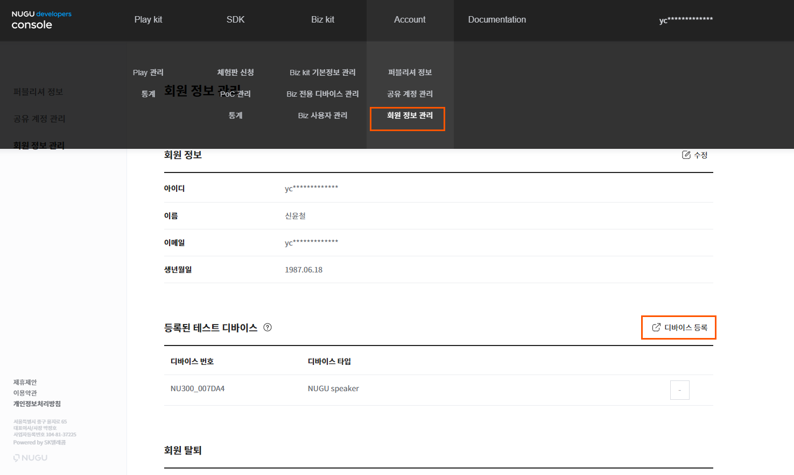

# 테스트하기

Play가 제대로 동작하는지 테스트하는 방법은 크게 두 가지입니다.

* Play Builder에서 채팅으로 테스트
* NUGU 디바이스(스피커, T전화 등)에서 음성으로 테스트

Play Builder에서 채팅으로 테스트하는 방법은 Play Builder를 통해 직접 학습시킨 Intent에 대해 어떻게 분석이 되고 어떻게 동작하는지 확인할 수 있는 테스트입니다.\
NUGU 디바이스(스피커)와 연동하여 진행하는 테스트는 실제 사용자에게 제공될 서비스 그대로를 점검할 수 있는 테스트입니다.\
이 테스트는 NUGU play kit에서 사용할 NUGU 디바이스를 등록해야 합니다.

## Play Builder에서 채팅으로 테스트하기

1. Play Builder 우측 상단에 있는 `테스트` 버튼을 클릭하여 실행한 채팅창에 발화 내용을 입력한 후 버튼을 클릭합니다.(예: 날씨 알려줘)
2. 단축키 Ctrl+D (Mac에서는 ⌘ Command + D) 를 눌러 실행할 수 있습니다.
3. Play Builder 내에서의 테스트는 사용자의 실제 발화를 어떻게 분석할지 확인할 수 있으며, 이 분석 결과를 바탕으로 실제로 의도한 대로 Prompt가 나가게 되는지도 확인할 수 있습니다.

   
4. 분석 결과를 확인하려면 입력 문장 바로 아래의 `NLU 분석 결과 열기`를 클릭합니다. 입력한 문장 아래 분석 결과가 표시됩니다.
5. 분석 결과 표시를 닫으려면 `NLU 분석 결과 닫기`를 클릭합니다.

   

NLU 분석 결과는 문장을 직접 입력하여 학습시킨 Custom Intent에 대해서만 분석이 되며, 이 Custom Intent를 Trigger로 사용하는 Custom Action에 대해 응답 중 Prompt가 어떻게 나가게 되는지 확인할 수 있습니다.

Built-in Intent(그만, 다시 등)는 테스트 내에서 분석되지 않으며, NUGU.ACTION.fallback에 등록한 Prompt가 나가게 됩니다.

다만, 응답을 Directive + Prompt로 정의한 경우에는 Prompt만 나가게 되고, Directive만 등록한 경우에는 채팅창에 빈 칸으로 응답이 나오게 됩니다.

Backend proxy를 사용하고 정상적으로 개발이 되어 있다면, Backend proxy가 처리하는 항목들(Backend Parameter, 예외 상황 처리)도 테스트를 할 수 있습니다.

그러나, Backend proxy가 OAuth를 통해 사용자를 특정하여 서비스를 제공하는 경우에는 Play Builder 내에서 테스트를 할 수 없습니다.

Play Builder 내 테스트가 가능한 항목과 불가능한 항목은 다음과 같습니다.

**테스트 가능 항목**

* 직접 등록한 Custom Intent
* Custom Intent를 Trigger로 하는 Custom Action 의 Prompt 결과

**테스트 불가능 항목**

* Built-in Intent(NUGU.INTENT.stop, NUGU.INTENT.rewind) 의 테스트
* Directive
* Backend proxy 에서 OAuth를 통해 사용자를 특정하여 제공되는 기능

테스트 창에서 어떠한 메시지를 입력하면, 그 메시지 앞에 Wake-up word(아리아, 팅커벨), Play 호출 이름을 붙여서 발화한 것처럼 동작합니다.

따라서, 테스트 창에서는, Wake-up word와 Play의 호출 이름은 넣지 않고 입력해야 정상 동작합니다.

SKML 태그는 결과창에 그대로 나오게 되나, 실제로 발화되지는 않습니다.

테스트창에 30분 동안 입력이 없으면, 해당 Play를 담당하는 NLU 엔진이 비활성화 됩니다.\
아무 텍스트를 입력하거나, User Utterance Model을 수정 또는 저장한 경우에는 NLU 엔진이 활성화되며, 1분 후에 다시 테스트할 수 있습니다.\
일반적으로 NLU 엔진이 활성화하는 데 10초 정도 걸리며, User Utterance Model에 입력된 문장이 1만 문장 이상의 경우 20초 가량 걸립니다.

Initial Parameter를 정의했으나, 실제로 Backend proxy에서 Initial Parameter를 전달하지 않으면 응답이 늦을 수도 있습니다.

## 디바이스에서 테스트하기 

### Play 테스트 가능 상태 확인하기

Play의 상태가 등록중, 심사대기, 심사반려, 심사중, 심사완료, 배포대기 중인 경우에 스피커에서 테스트가 가능합니다.


Play를 등록하는 방법은 [Play 정보 등록](../play-registration-and-review/register-a-play)을 참고하세요.



NUGU 디바이스 테스트는 음성인식 학습 등의 사유로 Play 및 테스트기기 등록 다음날부터 가능합니다.

하루가 지나도 NUGU 디바이스에서 Play를 테스트할 수 없다면, `Support` > `문의 사항`으로 문의해 주시기 바랍니다.


### 테스트용 스피커 설정하기

개발한 Play는 실제 NUGU 디바이스(스피커 등)에서 테스트할 수 있습니다. 개발한 Play를 테스트해 보기 위해서는 NUGU developers의 사용자 계정에 NUGU 디바이스를 테스트 기기로 등록해야 합니다.


테스트 디바이스를 등록하기 전에 다음 사항을 꼭 확인해야 합니다.

* NUGU 디바이스에 연결된 계정이 NUGU developers에서 사용하는 계정인지 확인해 주세요. 따라서, NUGU App에 NUGU developers 계정으로 로그인한 후 이 계정과 연결할 NUGU 디바이스를 선택하여 등록해 주세요.
* 테스트 기기로 등록할 NUGU 디바이스의 전원이 켜져 있는지를 확인해 주세요. 디바이스의 전원이 꺼져 있으면 테스트 기기를 등록할 수 없습니다.
* 테스트 기기는 최대 10대까지 등록할 수 있습니다.


1. `Developers Console` > `Play Kit`에서 Play가 등록완료 상태가 된 경우, 하단의 디바이스 등록 버튼을 통해 계정에 연결된 기기를 테스트 기기로 등록 할 수 있습니다.

   
2. 다른 방법으로는 `Developers Console` > `Account `> `회원 정보 관리`에서 하단의 디바이스 등록 버튼을 통해 계정에 연결된 기기를 테스트 기기로 등록 할 수 있습니다.

   

테스트 기기 등록이 완료되면 테스트 기기 등록 메뉴의 등록된 기기 목록에 등록된 디바이스가 표시됩니다. NUGU 디바이스 테스트를 중지하려면, 등록된 디바이스 우측의 `-` 버튼을 클릭하여 디바이스를 삭제합니다.
