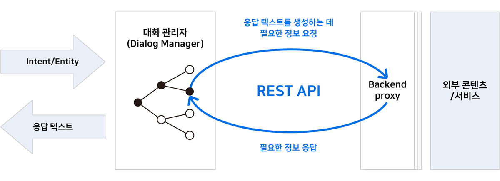
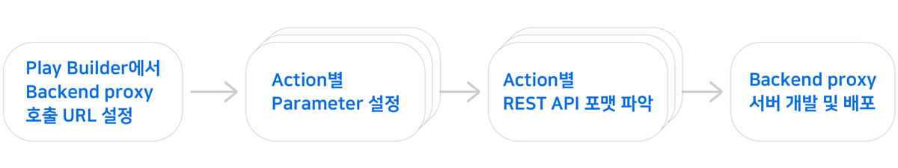
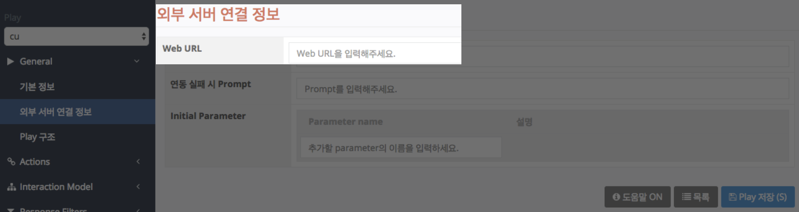
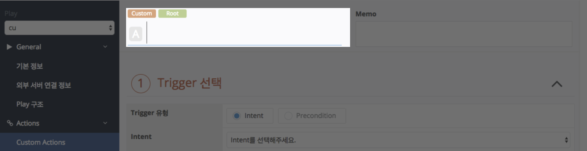
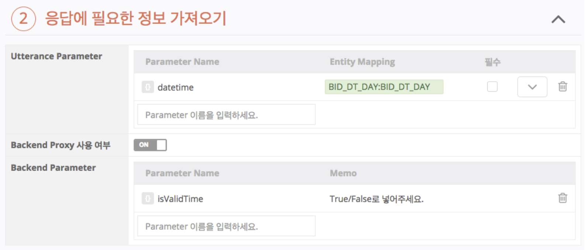
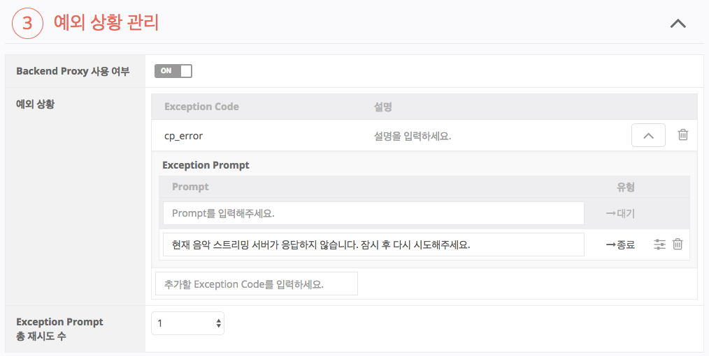

# Backend proxy 구축하기

Play에서는 사용자의 발화를 분석한 내용을 기반으로 적절한 응답을 내보내 주거나 동작을 수행합니다. 이 응답에 필요한 정보가 외부 서버로부터 가져와야 하는 경우는 REST API를 통해 요청해야 하며, 음악을 재생하는 등의 디바이스를 동작시키는 명령을 정의하는 것도 Backend proxy에서 처리해야 합니다.

NUGU 플랫폼의 Dialog Manager는 지정된 포맷(Backend proxy API 규격)으로 요청을 하기 때문에 외부 서비스의 REST API 포맷이 Backend proxy API 규격과 다르다면 포맷을 변환해주기 위한 Backend proxy 서버를 개발해야 합니다.



이 서버는 Play Builder를 통해 Play를 만드는 과정에서 정의한 파라미터와 [Backend proxy API Reference](./backend-proxy-api-reference)에서 제공하는 규격을 사용하여 직접 개발해야 합니다.

NUGU 플랫폼에서는 Backend proxy를 구축할 수 있는 클라우드 환경을 제공하고 있지 않으며, Play를 개발하는 곳에서 직접 구축을 하거나 클라우드 서비스를 이용할 수 있습니다.



위 그림에서 첫번째 단계와 두번째 단계는 Play Builder에서 설정하는 작업이기 때문에 여기서 추가로 설명하지 않습니다.

Play Builder에 Action별로 설정된 정보를 기반으로 Action 당 하나의 REST API 포맷을 파악하고 Backend proxy 호출을 필요로 하는 Action 수만큼의 REST API를 지원하는 서버를 개발합니다. 따라서 Play 외부 연동 서버 개발을 하려면 3번째 단계에서 REST API 포맷을 파악하는 방법을 이해하면 됩니다.

Backend proxy API 규격은 다음과 같은 정보를 Backend proxy 서버로 전달합니다.

| 정보          | 설명                                                                                                                                                                                                                                                                                         |
|-------------|--------------------------------------------------------------------------------------------------------------------------------------------------------------------------------------------------------------------------------------------------------------------------------------------|
| Action 이름   | Backend proxy에서 처리해야 하는 요청을 구분하는 데 사용됩니다.<br/>어떠한 Action이 Backend proxy를 호출했는지 확인할 수 있습니다.                                                                                                                                                                                                 |
| Parameters  | Play에서 정의된 Parameter들이 전달됩니다.<br/>Utterance Parameter에는 Play 사용자의 실제 발화에 담긴 Entity 혹은 그 Entity가 정규화된 값이 "value"로 전달됩니다.<br/>Backend Parameter는 "value"를 담아서 Play로 전달하게 될 Parameter이며 value는 "null"로 전달됩니다.<br/>Utterance/Backend Parameter를 구분할 수 없으므로, Play에서 어떻게 정의를 했는지 파악한 후 구현해야 합니다. |
| Context 정보  | 사용자 식별 token, 디바이스 상태 정보 등이 전달됩니다.                                                                                                                                                                                                                                                         |
| Event 정보    | 디바이스에서 발생한 Event 정보                                                                                                                                                                                                                                                                        |

Backend proxy 서버는 위의 정보를 바탕으로 특정 사용자가 전달한 요청에 대해 적절한 정보를 전달해야 합니다.

## REST API URL

REST API 호출은 Backend proxy를 사용하도록 지정한 Action에서만 이루어지며, 각 Action 별로 고유한 REST API URL이 결정됩니다.

REST API URL 생성 규칙은 다음과 같습니다.

* `Play Builder` > `General` > `외부 서버 연결 정보` > `Web URL` + `Play Builder` > `Actions` > `Action Name`

예를 들어 외부 서버 연결 정보의 Web URL에 `http://backend_proxy.nugu.com`를 설정하고, Action 이름을 "playMusic"으로 설정했다면 해당 Action을 처리하는 REST API URL은 `http://backend_proxy.nugu.com/playMusic`이 됩니다.

각각의 정보를 참조하기 위한 Play Builder 화면은 아래와 같습니다.





## Request Body

Request의 Body로 전달되는 JSON 포맷의 데이터는 [Backend proxy API Reference](./backend-proxy-api-reference)를 참조합니다. 이 JSON 데이터는 임의의 필드가 추가 될 수 있으므로, 이에 대한 영향이 없도록 구현되어야 합니다. Request Body에 정의된 필드 중 Play Builder에 설정한 값들에 의해 결정되는 필드는 action.parameters 입니다.

NUGU 플랫폼에서 Play Builder에 설정된 정보로부터 action.parameters 필드를 채우는 규칙은 다음과 같습니다.

| 필드명    | 생성 규칙                                                                                                                                                                            |
|--------|----------------------------------------------------------------------------------------------------------------------------------------------------------------------------------|
| KEY    | Play Builder의 "응답에 필요한 정보 가져오기" 화면에서 다음의 두 위치에 설정된 모든 파라미터가 포함되어야 합니다.<br/> Utterance Parameter의 Parameter Name<br/> Backend Parameter의 Parameter Name                           |
| type   | Utterance Parameter에만 적용되며, Play Builder의 Entity Mapping에 설정된 값 중 ":" 앞의 값만 전송합니다.<br/>Backend Parameter의 경우에는 Entity Mapping을 설정하지 않기 때문에 이 필드는 사용되지 않습니다.                      |
| value  | 실제 해당 파라미터에 할당된 값을 전송합니다.<br/>Utterance Parameter의 경우 필수가 체크되지 않은 파라미터는 값이 있을 수도 있고 없을 수도 있습니다.<br/>Backend Parameter의 경우에도 Backend proxy가 몇 번 호출되느냐에 따라 값이 있을 수도 있고 없을 수도 있습니다. |

예를 들어 설명하면 아래와 같습니다.



Backend Parameter의 경우 Backend proxy에서 처리한 결과를 가져오는 용도로 사용되기 때문에 Request Body에는 null을 갖게 됩니다.

Backend Parameter에 어떤 값을 채워줄지는 Play Builder에서 설정한 Action의 용도에 따라 다르며, Play Builder 작성자와 Backend proxy 개발자 간에 어떻게 처리해야 할지 정확하게 내용을 공유하고 있어야 합니다.


```json
{
  "action": {
    "actionName": "action이름",
    "parameters": {
      "datetime": {
        "type": "BID_DT_DAY",
        "value": "오늘"
      },
      "isValidTime": {
        "type": null,
        "value": null
      }
    }  
  }
}
```


## Response Body

REST API 요청에 대한 응답으로 생성되는 Body는 Request Body의 action.parameters에 전달했던 모든 KEY를 동일하게 Response에 전달해주어야 합니다.

1. Request의 action.parameters에 사용된 KEY는 모두 Response의 "output" 내의 KEY로 정의되어야 합니다.
2. "output" 내의 KEY는 Request와 다르게 "type", "value" 필드를 갖지 않고, string 타입의 값(VALUE)만을 포함합니다.
3.  Utterance Parameter와 Backend Parameter 모두 Backend proxy에 요청을 한 뒤에 값이 바뀔 수 있습니다.

    (Request에서 값을 갖거나 null일 수 있으며, Response에서는 요청 값을 그대로 갖거나 변경되거나 null이 될 수 있습니다.)


Response에서 모든 값을 그대로 똑같이 포함하는 이유는 입출력이 명확히 구분되지 않기 때문입니다.\
사용자 발화에 의해 설정된 Utterance Parameter의 경우 Backend proxy에서 값을 바꾼 뒤에 응답 텍스트에 사용될 수도 있습니다. 규격만을 정확히 따른다면 어떻게 사용하든 크게 문제되지 않습니다.


### resultCode



"output" 필드 외에 "resultCode"가 정의되어 있습니다. 이 필드는 위 그림에서 설정한 Exception Code에 의해 결정됩니다.


[예외 상황 관리](../define-an-action/manage-exceptions)를 참고하세요.


Play Builder는 Backend proxy 호출 시 발생할 수 있는 다양한 예외 상황마다 적절히 대응할 수 있도록 설정할 수 있습니다.

Play Builder에서는 "Exception Code"와 각 상황에서의 Exception Prompt 또는 사용자에게 오류 상황을 알려주고 필요한 Parameter를 다시 물어볼 수 있는데, 이때의 각 상황은 Backend proxy의 "resultCode"로 전달되는 값과 Play Builder에서 설정한 "Exception Code"를 매칭하여 동작을 결정합니다.

따라서 Response Body로 전달되는 JSON 포맷에서 "resultCode"에 올 수 있는 값의 종류와 수행되는 로직은 다음과 같습니다.

* **"OK"** - 성공일 경우 Backend proxy는 고정된 값을 보내줘야 합니다. (이 값 외의 모든 경우(case)는 예외 처리를 합니다.)
* **Exception Code** - Play Builder에서 정의한 Exception Code 값으로 Play Builder에서 설정한 동작을 수행합니다.
* 이외의 모든 값 ("", null 포함) - `Play Builder` > `외부 서버 연결 정보` > `연동 실패 시 Prompt` 영역에서 지정한 기본(Default) Prompt를 보내 줍니다.

### directives

directive에는 Play가 지원하는 Capability Interface에서 정의한 Directive가 올 수 있습니다. Play는 임의 개수의 Capability Interface를 지원하도록 설정할 수 있고, Play가 지원하는 Capability Interface의 모든 directive가 Response Body 내에 포함될 수 있습니다.

어떤 Play가 2개의 Capability Interface를 지원한다면 "directive" 필드에는 0개, 1개, 2개의 Directive가 포함될 수 있습니다.
