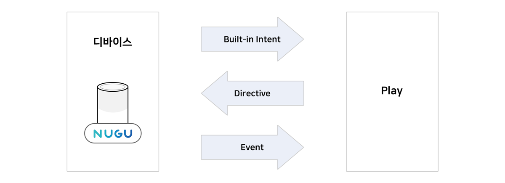
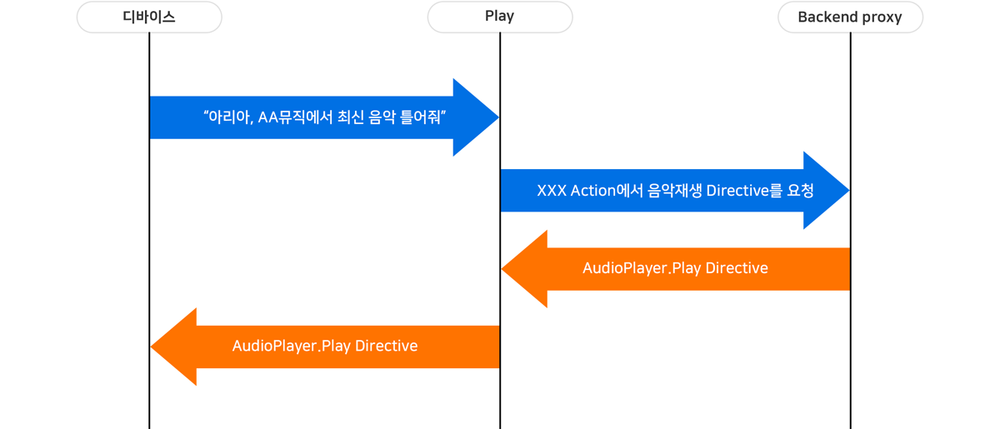
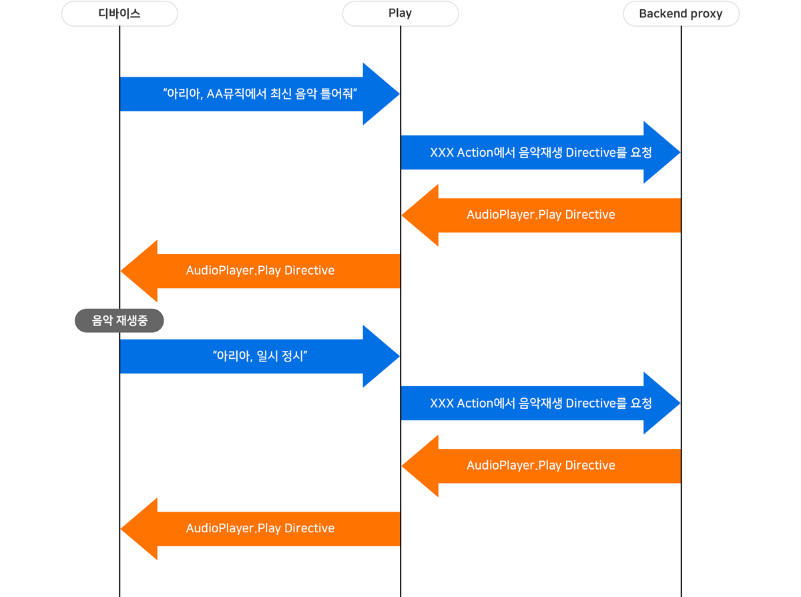

# Capability Interfaces

Capability Interface는 디바이스의 기능을 제어하기 위한 규격을 의미합니다. 예를 들어 스트리밍을 통한 음악을 재생하는 Play는 AudioPlayer Interface를 사용하면 필요한 기능을 구현할 수 있습니다.

특정 기능을 위한 명령어들을 같은 이름 공간(namespace) 내에 정의하며, Play가 지원하는 기능에 따라 필요한 Capability Interface를 포함하여 구현할 수 있습니다. Capability Interface는 외부 연동 서버(Backend proxy)에 구현이 되어 있어야 Play에서 활용할 수 있습니다.


Play에서 Capability Interface를 활용하는 방법에 대한 자세한 내용은 [AudioPlayer Interface 지원하는 Play 만들기](../create-a-play-with-audioplayer)를 참고하세요.


Capability Interface는 다음의 세 요소로 구성되어 있습니다.

**Built-in Intent**

Built-in Intent는 자주 사용될 것으로 예상되거나 꼭 정의해야 하는 발화들을 미리 훈련시켜 제공하는 Intent입니다.

별도로 학습 문장을 등록하지 않아도 되도록 기본으로 제공되는 Intent이며, Action 정의(기능 정의) 시에 바로 사용할 수 있습니다.

**Directive**

Play가 디바이스의 특정 기능을 제어하기 위한 명령어입니다.

**Event**

디바이스에서 특정 기능을 실행시키는 과정에서 디바이스의 상태가 변했을 때 Play로 전송됩니다.

Built-in Intent, Directive, Event는 스피커와 Play 사이에서 다음과 같은 방향으로 전달됩니다.

## Built-in Intent

Built-in Intent는 해당 디바이스 기능을 사용자가 발화를 통해 제어하려고 할때 예상되는 발화를 미리 학습시켜둔 Intent입니다. Built-in Intent는 Capability Interface별로 다르며 Built-in Intent를 갖지 않는 Interface가 있을 수 있습니다.

Capability Interface를 선택할 때마다 사용할 수 있는 Built-in Intent들이 확장됩니다.


Built-in Intent에 대한 자세한 내용은 [Built-in Intent](../define-user-utterance-model/built-in-intents)를 참고하세요.


## Directive

Directive는 Action에 정의된 Response로 사용됩니다. Directive를 응답으로 정의한 Action이 Built-in Intent, Custom Intent 등 Trigger로 인해 활성화되면, Play는 Backend proxy에 정의된 Directive를 요청하게 됩니다.

Play는 Backend proxy로부터 Directive를 넘겨받아 디바이스로 전달하게 됩니다. 따라서, Backend proxy에서는 각 Directive를 생성해서 요청이 올 때마다 전달을 해야 합니다.

Directive 구현에 대한 자세한 내용은 은 [Backend proxy API Reference](./backend-proxy-api-reference)를 참고해 주세요.

Directive가 정의된 Play를 사용하기 위해서 일반적으로 사용자는 "아리아 AA뮤직에서 최신 음악 틀어줘"와 같이 Play의 호출 이름(Invocation name)을 함께 발화해야 합니다.

그러나, 다음의 경우에는 Play의 호출 이름(Invocation name)을 함께 말하지 않아도 자동으로 AudioPlayer를 사용하는 Play로 전달(Routing)됩니다.

* Play Directive를 전송하여 오디오가 재생 중인 경우
* 일시 정지(Pause) 상태인 경우, 일시 정지 시점부터 1시간 이내
* 오디오가 종료된 후 17초 이내

## Event

Event는 디바이스의 기능이 동작하면서 Play가 제어를 하기 위해 알아야 하는 상태 변화가 있을 때마다 전달됩니다.Directive를 사용하기 위해서는 Event에 대한 이해가 필수적이며, Capability Interface별로 전달되는 Event는 다르기 때문에 사용할 Interface별 Event 스펙을 확인해야 합니다.

## Capability Interface의 종류

Capability Interface 종류는 다음과 같습니다. 현재는 AudioPlayer Interface만 지원합니다.

* AudioPlayer Interface : 스트리밍을 통한 음악 재생
