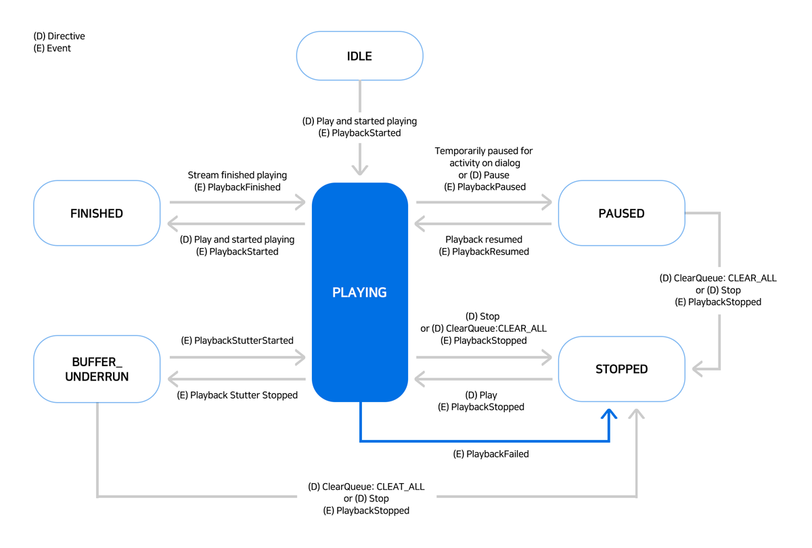
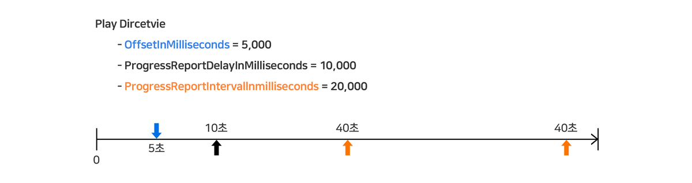

# AudioPlayer Interface

Play가 스트리밍 URL을 통한 오디오 파일 재생 기능을 포함한다면 AudioPlayer Interface를 사용하도록 설정을 해야 스피커에서 오디오 파일 재생이 가능합니다. 오디오 파일의 재생은 스트리밍 방식으로만 가능하고, 재생을 시작하려면 Play Directive에 스트리밍 URL을 전달해야 합니다.

AudioPlayer Interface는 오디오 파일의 재생 외에 플레이어의 다양한 상태를 확인할 수 있는 이벤트와 동작을 제어하기 위한 Directive로 구성이 되어 있습니다. 또한 Built-in Intent들을 기본적으로 제공하기 때문에 오디오 파일 제어를 위한 언어 학습 모델을 별도로 만들 필요가 없습니다.

## 지원하는 스트리밍 포맷

오디오 재생을 위해 NUGU 디바이스에서 지원하는 스트리밍 프로토콜과 오디오 코덱은 다음의 표에서 제공하는 규격을 지원해야 합니다. 다음은 NUGU 디바이스에서 지원하는 스트리밍 포맷입니다.

| 스트리밍                       | 오디오 코덱  | 샘플링 주파수        | 비트율            | 비고                                                         |
|----------------------------|---------|----------------|----------------|------------------------------------------------------------|
| HLS (Http Live Streaming)  | mp3     | \\\>= 44.1KHz  | \\\>= 128kbps  | -                                                          |
| MP4 over HTTP              | AAC     | \\\>= 44.1KHz  | \\\>= 96kbps   | 초기 버퍼링 시간을 줄이기 위해 moov atom을 파일의 앞쪽으로 이동시킨 MP4 파일을 권장합니다.  |

샘플링 주파수와 비트율은 최소 권장 사항을 의미합니다. 더 낮은 값을 사용해도 재생을 되지만 음질의 저하를 체감할 수 있기 때문에 최소 권장을 준수할 것을 강력히 권장합니다.


AudioPlayer Interface를 지원하는 Play를 만드는 방법은 [AudioPlayer를 지원하는 Play 만들기](../../create-a-play-with-audioplayer)를 참고하세요.


## State Diagram

AudioPlayer Interface는 사용자의 발화와 스트리밍 상태의 변경에 따라 아래의 그림과 같은 상태를 가집니다.

Play는 스피커의 오디오 플레이어의 상태와 사용자의 발화에 따라 적절한 처리를 할 수 있도록 개발해야 합니다. 여기서는 AudioPlayer Interface에서 제공하는 Built-in Intent, Directive, Event에 대해 설명합니다.



| 상태(State)  | 설명                                                                                                                                                                                                |
|------------|---------------------------------------------------------------------------------------------------------------------------------------------------------------------------------------------------|
| IDLE       | 최초 전원이 켜지면 IDLE 상태로 진입합니다.<br/>이후 재생이 한번이라도 시작되면 전원이 꺼질 때까지 IDLE 상태가 될 수 없습니다.                                                                                                                    |
| PLAYING    | AudioPlayer에서 재생 중인 상태입니다.                                                                                                                                                                        |
| STOPPED    | Stop Directive를 받아 중지된 상태입니다.                                                                                                                                                                     |
| PAUSED     | PAUSED 상태가 되는 경우는 다음 두 경우입니다.<br/>1. Pause Directive를 받아 일시 정지 상태<br/>2. 오디오 재생 중에 사용자 발화가 들어오면 자동으로 PAUSED상태가 되고, 해당 발화의 처리가 끝나고 오디오 재생이 이어지는 경우에는 PLAYING 상태로 돌아감                               |
| FINISHED   | 정상적으로 끝까지 재생을 마치면 FINISHED 상태가 됩니다.<br/>만약, 다음 곡이 버퍼되어 있으면 FINISHED 상태가 되었다가 바로 PLAYING상태로 바뀝니다.                                                                                                  |

## Built-in Intents

Built-in Intent는 Play Builder에 Intent를 정의하지 않아도 NUGU 플랫폼에서 기본으로 제공하는 Intent입니다. Built-in Intent는 Play 생성 시 추가되며, 모든 Play에서 공통(필수)으로 사용되는 Universal Intent와 Capability Interface(AudioPlayer Interface)를 사용함으로 선택했을 때 추가되는 Control Intent로 구분됩니다.


Built-in Intent에 대한 자세한 내용은 [Built-in Intent](../../define-user-utterance-model/built-in-intents)를 참고하세요.


### 공통(필수) Intent

| 유형                | Intent              | 대표 발화                               |
|-------------------|---------------------|-------------------------------------|
| Universal Intent  | NUGU.INTENT.play    | 틀어줘, 들려줘, 재생, 플레이                   |
| ^^                | NUGU.INTENT.stop    | 그만, 종료, 멈춰, 스톱, 정지, 중지              |
| ^^                | NUGU.INTENT.pause   | 일시정지, 잠깐 멈춰                         |
| ^^                | NUGU.INTENT.resume  | 계속 틀어줘, 이어서 틀어줘, 일시정지 해제, 일시정지 풀어줘  |

### Control Intent

| 유형                                | Intent                        | 대표 예상 발화                                     |
|-----------------------------------|-------------------------------|----------------------------------------------|
| Control Intent<br/>(AudioPlayer)  | NUGU.INTENT.next              | 다음, 넘겨, 넥스트, 다음 것                            |
| ^^                                | NUGU.INTENT.previous          | 이전, 이전 것                                     |
| ^^                                | NUGU.INTENT.forward           | 앞으로                                          |
| ^^                                | NUGU.INTENT.backward          | 뒤로                                           |
| ^^                                | NUGU.INTENT.random            | 셔플, 랜덤, 무작위                                  |
| ^^                                | NUGU.INTENT.cancel.random     | 셔플해제, 랜덤 해제, 무작위 취소                          |
| ^^                                | NUGU.INTENT.repeat            | 반복해줘, 반복, 무한 반복, 계속 반복, 반복 켜줘, 반복해서 들려줘      |
| ^^                                | NUGU.INTENT.cancel.repeat     | 반복 해제, 반복 취소, 반복 종료, 반복 꺼줘, 반복 그만            |
| ^^                                | NUGU.INTENT.rewind            | 다시, 다시 틀어줘, 다시 들려줘, 다시 시작, 처음으로, 처음부터        |
| ^^                                | NUGU.INTENT.ask.content.info  | 이거 뭐야, 뭔지 알려줘                                |
| ^^                                | NUGU.INTENT.another           | 다른 것, 이거 말고, 그거 말고, 그거 말고 다른 거, 딴거, 다른거 틀어줘  |

Play Builder에서 이 Intent 별로 Custom Action을 생성할 수 있는데, 필수로 지정된 4개의 Intent들은 Play Builder에서 Custom Action을 꼭 생성해주어야 합니다.

그 외의 Intent들은 기능은 제공하지 않더라도 Action을 생성하여 적절한 답변을 주기를 권장하며, Action을 생성하지 않은 경우에는 Play 생성 시 설정한 Fallback Action이 실행됩니다.


"BTS 노래 틀어줘"와 같이 Entity와 함께 발화하는 경우는 Built-in intent로 분석되지 않습니다. Entity와 함께 분석되어 처리해야 하는 경우, 직접 Custom Intent를 정의해야 합니다.

Intents 등록에 대한 자세한 내용은 [User Utterance Model 정의하기(Intent & Entity)](../../define-user-utterance-model)를 참고하세요.


Play Builder에서 Action을 정의하지 않는 경우 Fallback Action에 등록한 문장이 응답으로 나오기 때문에 지원하지 않는 기능이라도 적절한 답변을 보내주는 것을 권장합니다.

예를 들어, 셔플 기능을 지원하지 않는 경우 Action을 생성하고 응답으로 "랜덤 재생은 지원하지 않습니다."라고 명확히 안내해주는 것이 좋습니다.

## Directives

#### Play Directive


```json
{
  "type": "AudioPlayer.Play",
  "audioItem": {
    "stream": {
      "url": "{{STRING}}",
      "offsetInMilliseconds": {{LONG}},
      "progressReport": {
        "progressReportDelayInMilliseconds": {{LONG}},
        "progressReportIntervalInMilliseconds": {{LONG}}
      },
      "token": "{{STRING}}",
      "expectedPreviousToken": "{{STRING}}"
    },
    "metadata": {}
    // reserved
  }
}
```


| parameter                             | type    | mandatory  | description                                                                                                                     |
|---------------------------------------|---------|------------|---------------------------------------------------------------------------------------------------------------------------------|
| url                                   | string  | Y          | 오디오 콘텐츠의 URL을 입력합니다.                                                                                                            |
| offsetInMilliseconds                  | long    | Y          | 재생을 어느 offset(위치)에서 시작할지 설정합니다.<br/>값이 '0'이면 처음부터 재생합니다.                                                                        |
| progressReportDelayInMilliseconds     | long    | N          | 재생을 시작해서 지정된 시간 뒤에 한 번 progressReportDelayElapsed 이벤트가 발생합니다.<br/>(offsetInMilliseconds 값과는 상관없이 콘텐츠 시작 시간을 기준으로 한 절대값을 의미합니다.) |
| progressReportIntervalInMilliseconds  | long    | N          | 재생을 시작해서 지정된 주기마다 progressReportIntervalElapsed 이벤트가 발생합니다.<br/>(offsetInMilliseconds 값과는 상관없이 콘텐츠 시작 시간을 기준으로 한 절대값을 의미합니다.)   |
| token                                 | string  | Y          | 현재 stream을 나타내는 token입니다.<br/>token은 재생할 오디오 콘텐츠 별로 고유해야 합니다.                                                                   |
| expectedPreviousToken                 | string  | N          | 이전 stream을 나타내는 token입니다.                                                                                                       |
| metadata                              | object  | N          | reserved                                                                                                                        |

audioItem.stream.progressReport는 오디오의 시작 시간을 기준으로 절대 위치에 해당하는 시간에 이벤트를 발생시켜야 합니다. 아래의 그림처럼 Play Directive에 의해 시작하는 위치와 무관하게 시작을 기준으로 설정한 시간이 되는 경우 이벤트가 발생됩니다.



#### Stop Directive

오디오 재생을 멈춥니다.


```json
{
  "type": "AudioPlayer.Stop"
}
```


#### Pause Directive

재생 중인 오디오를 일시 정지합니다.


```json
{
  "type": "AudioPlayer.Pause"
}
```


## Events

#### PlaybackStarted

스트리밍 URL별로 재생이 시작될 때마다 발생합니다.


```json
{
  "type": "AudioPlayer.PlaybackStarted",
  "requestId": "{{STRING}}",
  "token": "{{STRING}}",
  "offsetInMilliseconds": {{LONG}}
}
```


| Parameter             | Type    | Mandatory  | 설명                                                   |
|-----------------------|---------|------------|------------------------------------------------------|
| token                 | string  | Y          | 현재 재생 중인 stream의 token입니다.                           |
| offsetInMilliseconds  | long    | Y          | PlaybackStarted를 보낼 때 현재 재생 중인 stream의 offset 값입니다.  |

#### PlaybackFinished

특정 스트리밍 URL을 끝까지 재생하여 종료되는 경우 발생합니다.


```json
{
  "type": "AudioPlayer.PlaybackFinished",
  "requestId": "{{STRING}}",
  "token": "{{STRING}}",
  "offsetInMilliseconds": {{LONG}}
}
```


Play가 PlaybackFinished 이벤트를 수신하는 경우에는 다음과 같이 처리할 수 있습니다.

* Play List를 재생 중이고 다음 곡이 있는 경우 Play Directive를 전송
* 한 곡만 재생하는 중이거나, Play List의 마지막 곡을 재생 중이면서 전체 반복을 다시 하지 않는 경우 Stop Directive를 전송

Stop Directive는 전송하지 않아도 되지만, 재생 중인 경우는 다음 곡 재생 여부를 명확히 전달하는 것이 좋습니다.

#### PlaybackStopped

다음의 경우에 PlaybackStopped 이벤트가 발생합니다.

* Stop Directive를 수신하는 경우
* 재생 중에 Play Directive를 수신하여 기존에 재생 중인 곡을 Stop하는 경우 (이후 Play에 전달된 다음 곡을 재생)


```json
{
  "type": "AudioPlayer.PlaybackStopped",
  "requestId": "{{STRING}}",
  "token": "{{STRING}}",
  "offsetInMilliseconds": {{LONG}}
}
```


#### PlaybackFailed

오디오 재생 중 오류가 발생하면 해당 오류를 표시합니다.


```json
{
  "type": "AudioPlayer.PlaybackStarted",
  "requestId": "{{STRING}}",
  "token": "{{STRING}}",
  "offsetInMilliseconds": {{LONG}}
  "error": {
    "type": "{{STRING}}",
    "message": "{{STRING}}"
  },
  "currentPlaybackState": {
    "token": "{{STRING}}",
    "offsetInMilliseconds": {{LONG}},
    "playerActivity": "{{STRING}}"
  }
}
```


| Parameter                                  | Type    | Mandatory  | 설명                                                                                                                                                                                                                                                                                                                       |
|--------------------------------------------|---------|------------|--------------------------------------------------------------------------------------------------------------------------------------------------------------------------------------------------------------------------------------------------------------------------------------------------------------------------|
| token                                      | string  | Y          | 재생에 실패한 stream의 token입니다.                                                                                                                                                                                                                                                                                                |
| offsetInMilliseconds                       | long    | Y          | PlaybackFailed를 보낼 때 현재 재생 중인 stream의 offset 값입니다.                                                                                                                                                                                                                                                                       |
| error.type                                 | string  | Y          | 에러 유형을 표시합니다.<br/>MEDIA_ERROR_UNKNOWN: 알 수 없는 오류<br/>MEDIA_ERROR_INVALID_REQUEST: 서버가 잘못된 요청으로 인식<br/>MEDIA_ERROR_SERVICE_UNAVAILABLE: 서비스에 연결할 수 없음<br/>MEDIA_ERROR_INTERNAL_SERVER_ERROR: 서버가 요청을 수락했으나 처리할 수 없음<br/>MEDIA_ERROR_INTERNAL_DEVICE_ERROR: 디바이스 내부 오류                                                     |
| error.message                              | string  | Y          | 발생한 에러에 대해 자세히 설명합니다.                                                                                                                                                                                                                                                                                                    |
| currentPlaybackState.token                 | string  | Y          | 현재 재생 중인 stream의 token으로 위에 있는 token과 다를 수 있습니다.                                                                                                                                                                                                                                                                         |
| currentPlaybackState.offsetInMilliseconds  | long    | Y          | 에러가 발생했을 때 현재 재생 중인 stream의 offset 값입니다.                                                                                                                                                                                                                                                                                 |
| currentPlaybackState.playActivity          | string  | Y          | Player의 상태를 나타냅니다.<br/>PLAYING, PAUSED, FINISHED, BUFFER_UNDERRUN, IDLE                                                                                                                                                                                                                                                  |

#### ProgressReportDelayElapsed

Play Directive에서 progressReportDelayInMilliseconds를 보내고, 설정된 시간 위치(offset)에서 재생될 때 Event가 발생합니다. 재생을 시작한 후 특정 위치까지 재생했을 때 과금이나 인증 등의 추가 작업이 필요한 경우에 사용합니다.


```json
{
  "type": "AudioPlayer.ProgressReportDelayElapsed",
  "requestId": "{{STRING}}",
  "token": "{{STRING}}",
  "offsetInMilliseconds": {{LONG}}
}
```


#### ProgressReportIntervalElapsed

Play 디렉티브에서 progressReportIntervalInMilliseconds를 보냈을 때 설정된 시간 간격마다 Event가 발생합니다. 재생을 시작한 후 특정 위치까지 재생했을 때 과금이나 인증 등의 추가 작업이 필요한 경우에 사용합니다.


```json
{
  "type": "AudioPlayer.ProgressReportIntervalElapsed",
  "requestId": "{{STRING}}",
  "token": "{{STRING}}",
  "offsetInMilliseconds": {{LONG}}
}
```


#### PlaybackPaused

재생 중인 오디오를 일시 정지할 때 사용합니다.


```json
{
  "type": "AudioPlayer.PlaybackPaused",
  "requestId": "{{STRING}}",
  "token": "{{STRING}}",
  "offsetInMilliseconds": {{LONG}}
}
```


#### PlaybackResumed

일시 정지 중인 오디오를 다시 재생 시작할 때 사용합니다.


```json
{
  "type": "AudioPlayer.PlaybackResumed",
  "requestId": "{{STRING}}",
  "token": "{{STRING}}",
  "offsetInMilliseconds": {{LONG}}
}
```

