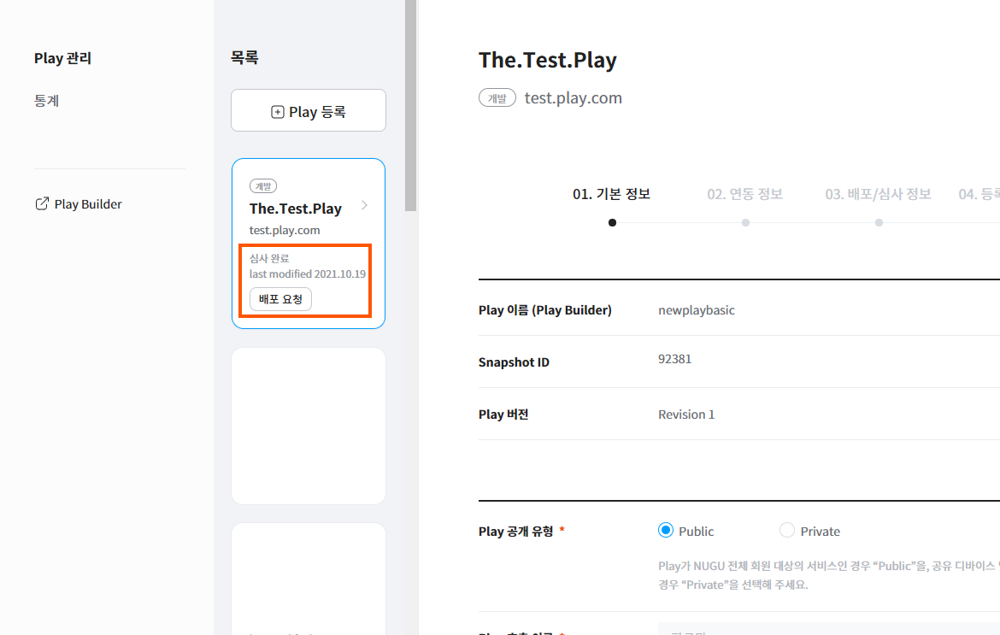
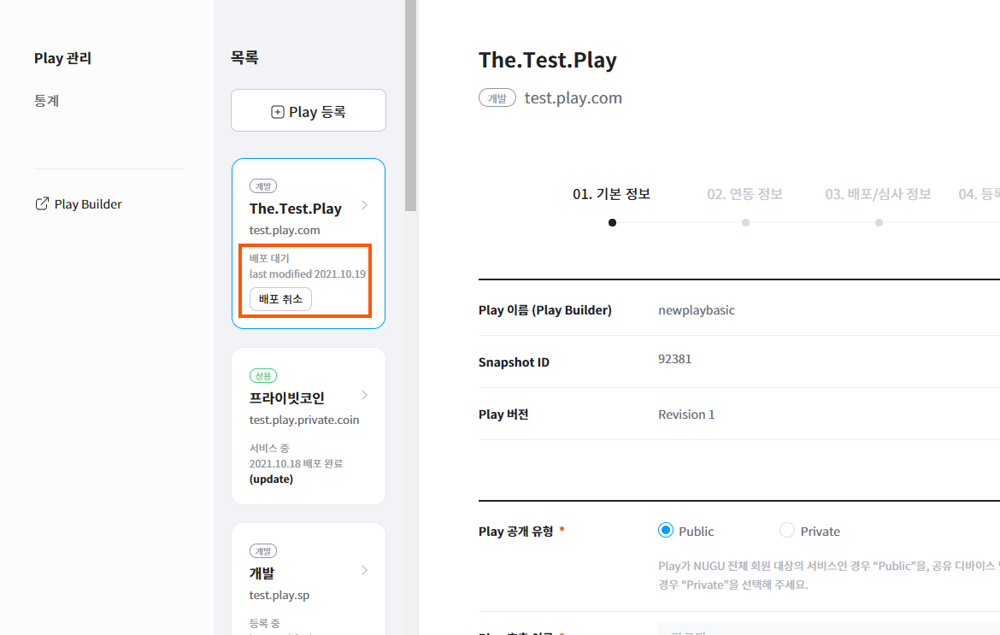
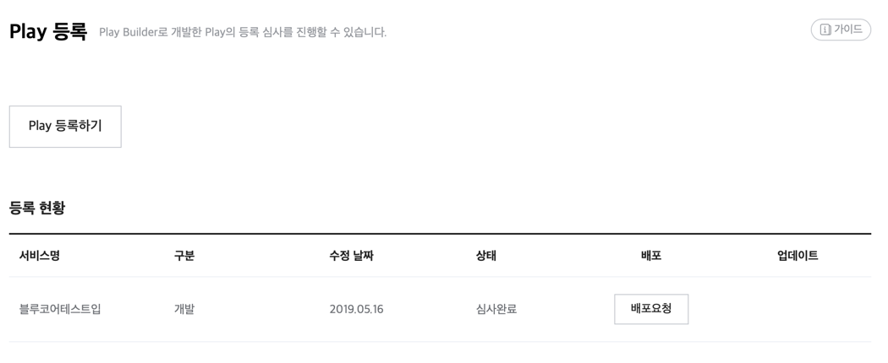

# Play 배포

Play 심사 승인이 완료된 Play는 배포 설정 기능을 통해 Play 배포요청을 해야 NUGU 서비스 제공이 가능합니다.

## 배포 프로세스 

[심사 프로세스](../play-registration-and-review/play-review#review-process)를 거쳐 “심사 완료“ 상태가 됐다면,  [배포 신청](#distribution-request)하실 수 있습니다.\
정상적으로 배포가 완료되면 사용자들은 해당 Play를 호출하여 사용할 수 있습니다.


기본적으로 이용 가능 기기는 “NUGU”, “NUGU mini”, “NUGU candle”이며, 사전 요청 또는 내부 결정에 따라 추가적인 검증을 거쳐 "T전화", “NUGU nemo”, “Tmap”, “Btv” 등 NUGU플랫폼이 적용된 다른 기기에도 적용이 가능합니다.

요청 방법 : `Support` > `문의사항 (개발)`



서비스 중인 Play를 중지하는 방법에 대한 자세한 내용은 [Play 상태 변경(중지 및 서비스 재개)](./manage-a-play#change-play-status)를 참고하세요.


## 배포 정책 

Play 배포는 평일 10~17시에 수시로 진행됩니다. [배포 신청](#distribution-request)이후,  별도의 문의로 배포 희망일을 요청할 수 있으며, 희망일이 없다면 요청 후 배포 가능한 시점에 배포합니다.\
Play 동작에 이상이 있거나, 내부 사정에 따라 배포가 어려운 경우, 배포 요청일과 실제 배포일이 상이할 수 있습니다.

## 배포 신청 

Play의 심사 승인이 완료되면 Play 등록 현황 리스트에 `배포요청` 버튼이 생성됩니다. 이 버튼을 이용하여 배포를 신청할 수 있습니다.

1. `Developers` > `Play kit` > `관리` 페이지에서 배포 신청할 Play의 \[배포요청] 버튼을 클릭합니다.

   
2. 배포요청 팝업창에서 내용을 확인 한 후 `확인` 버튼을 클릭하면 배포 요청이 완료됩니다. 배포희망일이 별도로 존재하면 `Support` > `문의사항` (관리) 를 통해 요청 할 수 있습니다.
   배포요청 완료 후 운영자가 배포일을 지정하면 Play 개발자의 메일로 배포 완료 안내 메일이 발송 됩니다.
3. 배포 완료되면 해당 Play는 **서비스 중** 상태가 됩니다.
   배포 대기는 배포 신청을 한 상태에서 배포일이 도래하지 않았을 경우를 말하며, 이 경우에는 배포 신청을 취소할 수가 있습니다. 자세한 내용은 [배포 신청 취소](#distribution-requestcancellation)를 참고하세요.

## 배포 신청 취소 

Play 배포 대기 상태(지정한 배포일이 아직 도래하지 않은 상태)에서는 언제든지 배포 신청을 취소할 수 있습니다.

1. `Developers` > `Play kit` > `관리` 페이지에서 배포 신청을 취소할 Play의 `배포취소` 버튼을 클릭합니다.

   
2. 배포 취소 확인 팝업창에서 `확인` 버튼을 클릭하면 배포 신청이 취소됩니다.
3. 배포 취소가 완료되면 해당 Play는 `배포대기`에서 `심사완료` 상태로 변경되고, `배포요청` 버튼이 생성됩니다.

   
