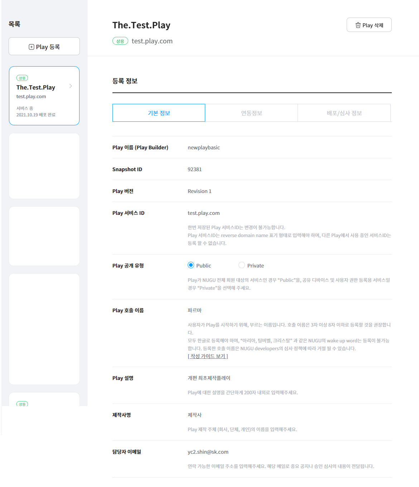
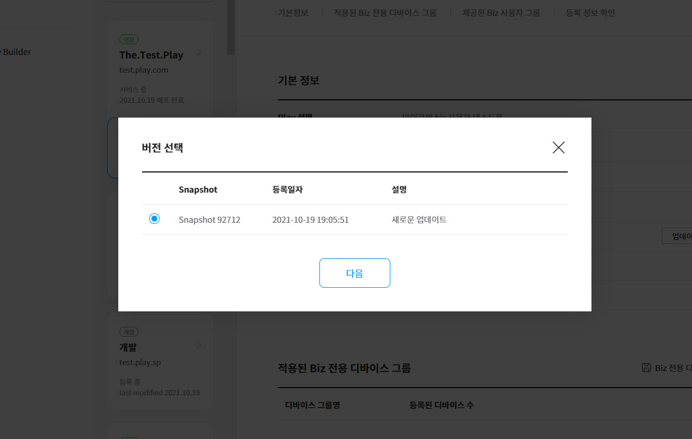

# Play 업데이트

Play 업데이트를 통해 배포를 완료한 Play를 수정하거나 기능을 고도화할 수 있습니다.

## 업데이트 등록 

Play가 배포되면 Play는 상용 서비스 상태가 되며, Play 등록 현황 리스트에 업데이트 버전을 등록할 수 있도록 `업데이트` 버튼이 생성됩니다. 이 버튼을 클릭하여 Play의 업데이트 버전을 등록할 수 있습니다.

1. `Developers` > `Play kit` > `Play 관리 `페이지의 서비스중 Play에, Play Builder에서 서비스중 버전 이후의 새로운 빌드를 생성한 경우, `업데이트` 버튼이 생성되며, 클릭 할 수 있습니다.

   
2. Snapshot 버전 리스트에서 등록할 버전을 선택하고 `확인` 버튼을 클릭합니다.

   

이후의 업데이트 절차는 Play 등록 방법과 동일합니다. 업데이트 등록이 완료되면 업데이트 버전에 대한 심사/배포 프로세스가 진행됩니다.


Play 등록에 대한 자세한 내용은 [Play 정보 등록 및 심사 요청하기](../play-registration-and-review)를 참고하세요.


## 업데이트 심사 / 배포 

등록된 업데이트 버전에 대한 심사/배포 프로세스는 Play 심사와 동일합니다.


Play 등록에 대한 자세한 내용은 [Play 정보 등록 및 심사 요청하기](../play-registration-and-review)를 참고하세요.

