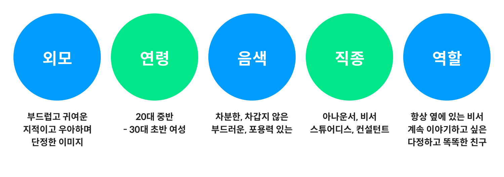
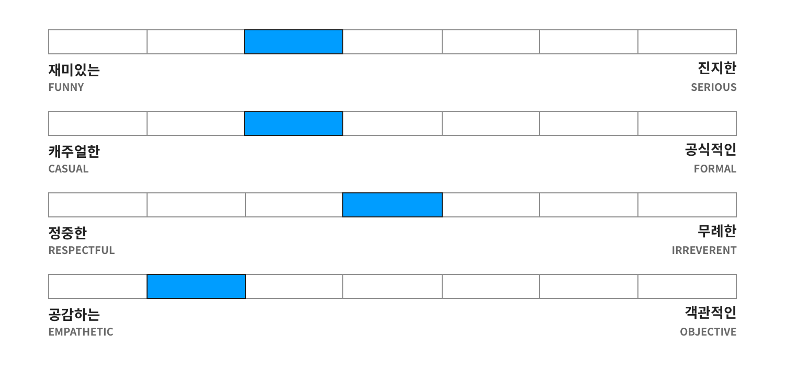

# Prompt 디자인

Prompt란 NUGU 에이전트의 음성 답을 의미하며, 음성으로 전달되는 정보를 사용자가 잘 이해할 수 있도록 다음과 같은 가이드라인을 고려하여 디자인하는 것이 좋습니다.

## Prompt 정확성

다음 사항에서는 정보의 누락 없이 정확하고 명확하게 말해야 합니다.

* **정보 전달이 목적인 경우**

  사용자가 각 기능 실행에 대한 답변(Prompt) 피드백만으로도 이해할 수 있도록 필요한 정보를 빠짐없이 모두 포함합니다.

* **질문인 경우**

  사용자가 답변(Prompt)를 들었을 때 질문형으로 이해할 수 있도록 문장을 구성합니다.

  원활한 상호작용을 위해 사용자가 대답해야 하는 발화를 명확하게 제시해야 합니다.

* **오류 상황인 경우**

  오류 발생의 이유나 해결 방법을 구체적이고 정확하게 제시합니다.


목록에서 선택해야 하는 경우, 사용자가 "O번째"라고 답변할 수 있도록 질문합니다.  
예) 몇 번째 장소로 갈까요?


## Prompt 간결성

사용자와 음성으로만 상호작용하기 때문에 효율적인 의사 전달을 위해 간결하게 말해야 합니다.

* 불필요한 꾸밈말이나 조사를 사용하여 답변(Prompt)가 불필요하게 길어지지 않도록 주의합니다.
* 기능 실행이 목적인 답변(Prompt)인 경우에는 가능한 짧고 간결한 형태로 응답합니다.   


사용자가 이미 알고 있는 주소를 안내할 경우, 시, 군, 구, 동 등 전체 주소를 안내하기 보다는 동 이하 주소만 안내


* 한 문장 안에는 기본 2개, 최대 4개의 정보만 배치합니다.
* 전체 문장이 3문장 이상이 되어야 할 경우 중요한 정보를 포함하고 있을 경우에만 허용합니다.

  이 경우, 정보와 정보 사이를 구분하여 읽어 사용자의 이해를 도와야 합니다.

* 문장과 문장 사이에 동일한 단어 또는 술어를 반복 사용하여 중복되는 느낌을 주는 것을 지양합니다.


오전 날씨는 비가 오고, 오후에는 비가 와요 (X)  
하루 종일 비가 와요 (O)


## Prompt 다양성

사용자가 자주 이용하는 서비스라면 매번 동일한 응답을 듣는 것이 지루할 수 있으므로 다양한 응답으로 구성합니다.


**사용자**: 아리아, 놀아줘!
**NUGU**: 아 저도요 오후엔 졸리고 무료하고 좀 그렇네요 제가 내는 퀴즈를 맞춰 보실래요?  
**사용자**: 아리아, 놀아줘!  
**NUGU**: 흠 이럴 때는 뭘 해드려야 칭찬받을까요? 요즘 유행하는 신조어를 지금 배워보는 건 어때요?  
**사용자**: 아리아, 놀아줘!  
**NUGU**: 아 이런 날은 뭔가 재미있는 일이 생기면 좋을 텐데요. 음 제가 준비한 무드등 개인기 한번 보실래요?


## Prompt 일관성

### NUGU 페르소나

페르소나는 인격을 뜻하는 라틴어로서, NUGU 페르소나란 사용자가 NUGU 에이전트에 대해 가지는 인격에 대한 심상을 의미합니다.

즉, 사람들은 다른 사람의 목소리를 들을 때 머릿속에 자동으로(빠르고, 무의식적으로) 그 사람에 대한 캐릭터(나이, 교육 정도, 감정의 상태, 얼마나 믿을만한지, 친절한지 등)을 형성하게 되는데, NUGU 사용자는 NUGU 에이전트가 제공하는 말투나 목소리 등으로부터 이러한 이미지를 갖게 됩니다. 서비스 전반에 걸쳐 일관된 페르소나를 유지하여 사용자가 NUGU 에이전트와 자연스럽게 상호작용할 수 있도록 VUX를 디자인하는 것이 필요합니다.

NUGU의 페르소나는 20대 후반에서 30대 초반의 여성으로, 차분하고 편안함을 지향하는 다정다감한 성격의 친구같은 비서입니다. 세부 대화 스타일은 다음과 같으며, 작성한 Prompt가 NUGU 페르소나와 일치하는지 검토하는 것을 권장합니다.

### 스타일

실제 대화에서도 언어가 동일한 사람들 간에 말투나 억양이 조금씩 다르며, 이는 각 개인의 습관이 반영되어 나타납니다.  
작성자 개인의 언어 습관이 Prompt에 미치는 영향을 줄이고, NUGU 페르소나에 맞는 어투를 적용하기 위한 기본 가이드는 다음과 같습니다.

* 구어체로 친근하게 응답

  가능한 구어체를 사용해 자연스러운 대화를 도출합니다. 답변(Prompt) 디자인 시, 글로 적다 보면 소설이나 에세이처럼 문어체로 작성될 우려가 있습니다.


“아이유 밤편지를 재생합니다.” 보다는 “아이유의 밤편지, 들려드릴게요.”


* 서술어 형태의 교차 배치

  여러 문장을 제공해야 한다면 문장 서술어 부분에 ‘~에요’와 ‘~입니다’ 표현을 교차 사용하여 자연스러운 문장으로 구성합니다.


로그인 전에는 미리 듣기만 가능합니다. 전곡 듣기를 원하시면 누구 앱을 통해 로그인해 주세요.


