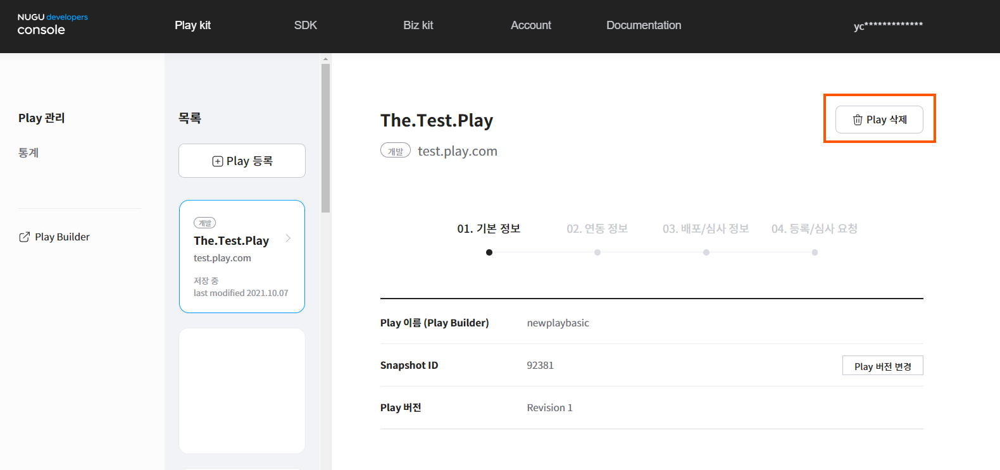

# Play 정보 수정 및 삭제

저장한 Play 정보는 Play 심사를 시작하기 전까지는 언제든지 수정, 삭제할 수 있으며, `Developers Console` > `Play kit` > `Play 관리` > `Play 삭제` 버튼으로 진행할 수 있습니다.

Play 상태가 등록, 심사 대기(심사 요청 중) 상태일 때는 심사 요청과 등록을 취소해야 정보를 수정할 수 있습니다.


심사 대기 중인 Play를 취소하는 방법은 [심사 취소](./play-review#review-cancellation)를 참고하세요.


심사 요청한 Play의 심사 결과가 반려로 결정되면 심사 요청 전 상태로 돌아가기 때문에 기본 정보를 수정하거나 삭제할 수 있습니다.

단, Play가 아래 상태와 같은 경우에는 수정하거나 삭제할 수 없습니다.

* 등록 중 (심사를 진행하기 위해 정보를 확정한 상태)
* 심사 중 (심사 담당자에 의해 Play 심사가 진행 중인 상태)
* 서비스 중 (배포 완료되어 서비스 중인 상태)


Play가 상용 서비스 중인 경우에는 Play를 삭제 진행 시, 서비스 중단 절차가 필요합니다. 서비스 중인 Play를 중지하거나, 삭제할 경우 NUGU 운영팀의 확인이 필요합니다. 중지 및 삭제 요청 시 NUGU 운영팀 담당자에게 내용이 전달되어 담당자 확인을 거치게 됩니다.

