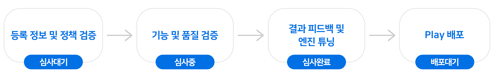
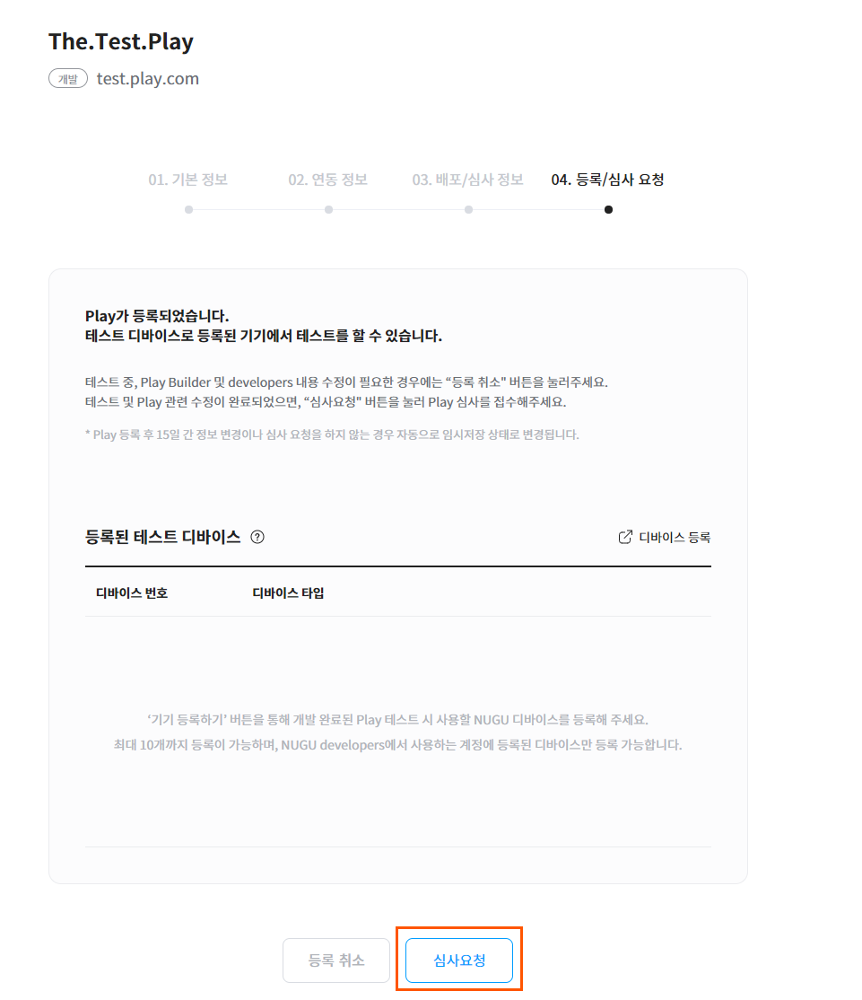
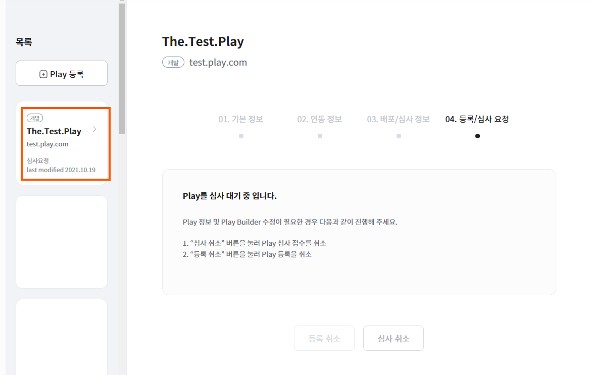
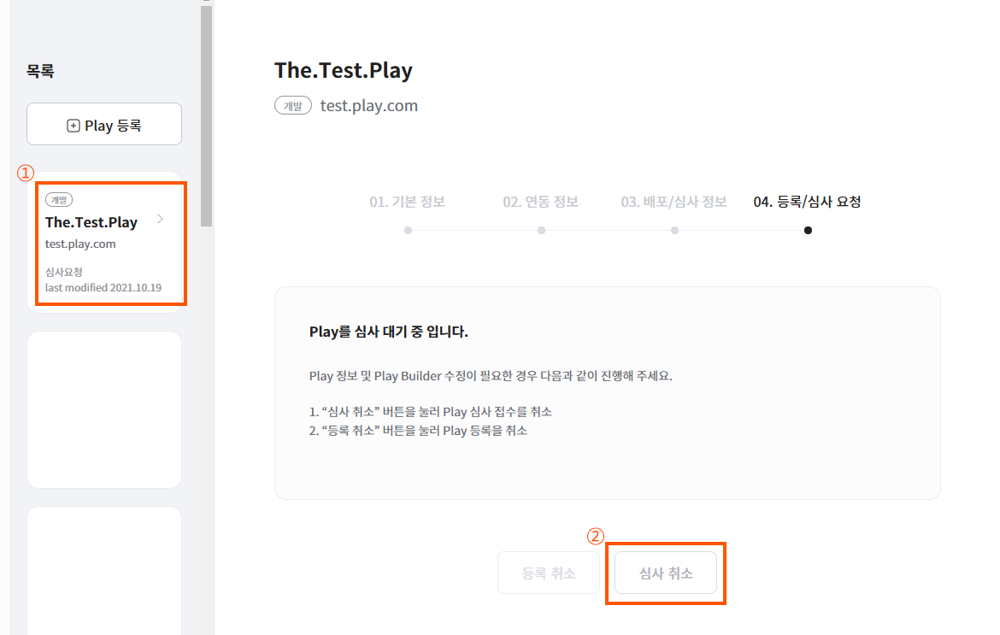

# Play 심사

`Developers Console` >  `Play kit` > `Play 관리`심사 착수 후 2~3주(워킹데이 10~15일)입니다.메뉴에서 Play 심사에 필요한 각종 정보(기본 정보, 연동 정보, 배포 정보, 심사 정보)들을 모두 빠짐없이 등록을 한 후에 심사 요청을 하면 Play에 대한 심사가 시작됩니다.([심사 요청](#review-request))

Play 심사 중에는 Play 정보를 수정할 수 없기 때문에 수정이 필요한 경우에는 심사 요청을 취소하고, 정보를 수정하여 다시 요청하면 됩니다.([심사 취소](#review-cancellation))

Play 심사가 시작되면 심사 중으로 상태가 변경되고, 이 과정에서 Play의 정책, 기능, 품질을 종합적으로 검증합니다. 필요시 계정 연동 테스트도 진행합니다.([심사 정책](#review-policy) / [심사 프로세스](#review-process))

Play 심사 기간은 심사 착수 후 2~3주이며, 심사 결과 정상적으로 서비스가 가능하다고 판단하면 심사 완료, 수정이 필요한 경우에는 반려 의견을 드리게 됩니다.


Play 심사 승인이 거절되면 Play 반려 사유 리포트를 Play 기본 정보 등록 시 기입한 담당자 연락처(이메일)로 전달합니다. “Play 반려 사유”에 대한 이슈를 해결한 후 재심사를 요청할 수 있으며, Play 재심사 프로세스는 Play 심사 절차와 동일합니다.


## 심사 프로세스 

개발 완료 및 충분한 테스트를 마친 Play는 [심사 요청](#review-request) 이후 다음의 프로세스에 따라 심사합니다.\
심사 소요 기간은 각 기준을 충족했을 때, 심사 착수 후 2~3주(워킹데이 10~15일)입니다.


심사완료 직전, 수정 피드백 반영을 위해 일시 반려할 수 있습니다.



매 단계에서 심사 기준이 충족되지 않는 경우, 피드백과 함께 반려 처리됩니다.


### 1. 등록 정보 및 정책 검증 (심사 착수 후 1~2일)

1. Play 등록 정보 검증
   * 등록 정보의 법적 권리 및 사실 여부 확인
   * Play 사용자에게 노출되는 정보의 오탈자 및 내용 적절성 확인
2. 정책 검증 ([심사 정책](#review-policy)에 따름)
   * Play의 호출 이름(Invocation Name) 적합성
   * 제공 서비스 및 콘텐츠의 적합성
   * 다른 서비스와의 간섭 여부

### 2. 기능 및 품질 검증 (4~5일)

1. 기능 검증
   * Play Builder에 작성하신 내용을 바탕으로 기능 검증을 수행합니다. 발화 테스트 및 로그 분석을 통해 아래의 기능적 결과가 정상인지 확인합니다.
     * 음성 인식(음성 발화 -> text 변환) 결과
     * User Utterance Model(intent, entity) 분석 결과
     * **Action Output의 동작 결과**
     * Backend Proxy 및 계정 서버(OAuth2.0 연동 시) 연동
2. 품질 검증
   * 기능 동작과 더불어 아래의 품질 기준들을 만족하는지 확인합니다.
     * User Utterance Model(intent, entity) 이 사용자의 예상 발화를 폭넓게 지원해야 한다
     * Action Output 및 서비스Flow가 UX적으로 적합해야 한다.
     * 음성 안내 및 기기 동작만으로 Play를 사용하는데 지장이 없어야 합니다. 다음 명령이나 필요 설정, 필수적인 entity를 안내하는지, 전반적인 사용 경험이 자연스러운지 판단합니다.
     * Play 컨셉과 설명에 맞는 기능과 콘텐츠를 충분히 제공하는지 판단합니다.
     * Backend Proxy 및 계정 서버(OAuth2.0 연동 시)가 안정적이어야 합니다.
     * (AudioPlayer Interface사용 시) 오디오 컨트롤 관련 Built-in Intent를 충분히 활용하여 설계하고, 적절한 Action을 설정해야 합니다.
     * (Display Interface사용 시) 각 Action에 적합한 형태의 화면을 제공해야 한다.


**Action Output의 동작 결과**

Play Builder만으로 파악할 수 없는 기대 결과는 심사 요청 시 함께 전달해주시면 빠른 검증에 도움이 됩니다.

(예시) 연동되는 IoT기기, OAuth2.0 연동용 테스트 계정, Backend Proxy에서 처리하여 반환되는 Prompt 및 기기 동작 등


### 3. 결과 피드백 및 엔진 튜닝(4~5일)

1. 앞선 검증 결과를 개발자에게 전달합니다.
   * 심사 합격 및 수정 피드백
     * 검증 결과, **심사 합격 기준**을 충족한 경우 “심사완료” 상태로 변경합니다.
     * 심사 합격 기준을 거의 충족했으나, 일부 수정할 부분이 있는 경우 개별적으로 심사 피드백을 전달합니다. 이 과정에서 빌드 내용 수정이 필요한 경우 일시적으로 반려 처리 할 수 있습니다.
   * 심사 불합격
     * 검증 결과, 심사 합격 기준을 충족하지 못한 경우 반려 사유와 함께 “심사 반려“ 상태로 변경합니다. 수정 후 재심사요청 하실 수 있으며, 반려 사유에 대한 문의는 `Support > 문의사항` 을 통해 문의해주세요.
     * Play Builder에 입력된 User Utterance Model을 기반으로, 음성인식 성능을 향상시키고자 기술 검토 및 엔진 튜닝을 진행합니다. Play 서비스 범위에 따라 엔진 튜닝에 추가적인 기간이 소요될 수 있습니다.


**심사 합격 기준**

* 대표 기능 및 Backend/계정서버 연동 관련 이슈 없음
* 기본 발화(Play Builder에 입력된 발화) E2E 성공률 95% 이상
* 확장 발화(기본 발화 외 임의로 생성한 테스트 발화) E2E 성공률 90% 이상
* 내부 품질 기준 충족


### 4. Play 배포(배포 요청일 전후)

“심사완료” 상태에서 추가적인 수정사항이 없으시다면, 희망하는 배포일자와 함께 [배포 신청](../distribute-and-manage-a-play/distribute-a-play#distribution-request)해주시면 되며, 해당일자 전후로 Play를 배포합니다.\
Play 동작에 이상이 있거나, 내부 사정에 따라 배포가 어려운 경우, 배포 요청일과 실제 배포일이 상이할 수 있습니다.

## 심사 정책 

Play의 심사는 앞선 [심사 프로세스](#review-process)에 따라 이뤄지며, 이 과정에서 기능/품질 수준 외에 반려 사유가 될 수 있는 정책적 기준들은 다음과 같습니다. 본 정책은 수시로 업데이트될 수 있으며, 원활한 심사를 위해 심사 요청 전 자세히 확인하시길 권장합니다.

* Play의 호출 이름(Invocation Name) 적합성
* 제공 서비스 및 콘텐츠의 적합성
* 다른 서비스와의 간섭 여부

### 1. Play의 호출 이름(Invocation Name) 정책

Play 세션으로 진입하거나 Play를 바로 사용하기 위해서는 발화문(명령문)의 맨 앞에 호출 이름(Invocation Name)이 필요합니다. NUGU서비스 및 다른 Play와의 충돌이 없도록 다음과 같은 정책으로 심사하고 있습니다.

| 정책요약                                                                       | 상세설명                                                                                                                                                     |
|----------------------------------------------------------------------------|----------------------------------------------------------------------------------------------------------------------------------------------------------|
| 호출 이름는 **유일(Unique)** 해야 한다.                                               | 기존 서비스중인 Play의 호출 이름과 같을 수 없고, 완전히 포함하거나 포함될 수 없다.                                                                                                       |
| **1개의 Play**에 **1개의 호출 이름**을 등록한다.                                         | 2개 이상의 구분되는 호출 이름을 사용할 수 없으나, 발음 및 사용자 인식상 같은 사용성을 가진다면 운영자가 확인 후 **별칭(Alias)**을 등록할 수 있다.                                                               |
| **지적재산권 분쟁의 소지**가 없어야 한다.                                                  | 호출 이름에 지적재산권이 있다면, 1) 권리를 득하지 않은 개인/기업인 경우 2) 권리를 득했으나 법적 증빙이 누락된 경우 심사 반려 또는 증빙 요청을 할 수 있다. 또한, 일반적인 통념상 특정 기업/브랜드를 상기시킬 경우 위와 준하게 본다.              |
| 호출 이름은 **3음절 이상, 8음절 이하**여야 한다. (한글 표기 기준)                                 | 음성인식 성능 및 다른 명령과의 충돌을 방지하고자 음절 수를 제한한다.                                                                                                                  |
| **NUGU 서비스명과 중복**되지 않아야 한다.                                                | 서비스중/예정인 NUGU서비스의 대표 명칭과 중복을 허용하지 않는다.                                                                                                                   |
| **NUGU Wake-up word**(아리아, 팅커벨)를 사용할 수 없고, **NUGU브랜드와 직접적 연관성**을 나타낼 수 없다. | NUGU서비스 사용에 혼란을 주지 않기 위해 Wake-up word를 사용할 수 없으며, 마찬가지 이유로 제휴/계약 관계없이 NUGU브랜드를 차용할 수 없다.                                                                 |
| **일반 명사** 또는 **범용적인 단어/표현**의 단독 사용은 허용하지 않는다.                              | (예시) 일반 명사 : 레시피, 날씨, 인공지능 (예시) 범용적인 단어 : 을지로, 명동, 유재석, 김연아 (예시) 범용적인 표현 : 똑똑아, 여보야, 안녕 단, 조합을 통해 범용성이 해소된 경우는 허용 가능하다. (예시) 명동 길잡이, 우리집 똑똑이 |
| 명사형 단어를 권장하며, 조사나 술어로 끝나는 호출 이름은 지양한다.                                     | 호출 이름에 대한 인식이 잘 되지 않을 수 있다. 단 고유한 명칭인 경우 허용한다. (예시) 야놀자                                                                                          |
| 불쾌감 및 사회적 논란을 조장하거나 응급 상황과 관련된 호출 이름은 지양한다.                                | 욕설, 비하, 성인 단어, 부정적 의미를 내포한 단어, 응급 상황(119, SOS) 관련 단어 등                                                                                                   |
| 기억하기 어렵거나, 발음하기 불편한 호출 이름은 지양한다.                                           | (예시) 나는너너는나, 철수책상철책상, 파파파파파                                                                                                                              |


**별칭(Alias) 등록**

사용자 입장에서 구분하기 어려운 동음이의어나 유사 명칭에 대해 운영자가 직접 검토하고 등록합니다. 별칭 검토 요청은 `Support > 문의사항` 을 통해 문의해주세요.

(예시) “세계의 날씨”의 별칭 : “세계 날씨“, “3개의 날씨“


### 2. 제공 서비스 및 콘텐츠 적합성 관련 정책

NUGU developers에서는 다음의 정책에서 금지하는 서비스나 콘텐츠를 제공하거나, 해당하는 서비스로 유도한다고 판단하는 경우, 심사를 보류 또는 반려할 수 있습니다. 서비스중인 Play는 서비스를 정지/차단할 수 있고, 관련 사항은 개발자 계정 내 연락처로 안내 드립니다.

1. 상표권, 지식 재산권 그리고 브랜드 관련 위반 사항
   * NUGU의 브랜드를 명시하거나 NUGU 브랜드로 오인할 수 있는 표현은 허용하지 않습니다. 이는 사용자에게 노출되는 호출 이름, Play설명, Play아이콘, 서비스 및 콘텐츠 내용에 모두 해당합니다. `Support > 제휴 제안, 문의 사항`을 통해 사전 협의된 경우만 예외적으로 허용할 수 있습니다.
   * 타사의 브랜드나 상표권 그리고 지식재산권을 침해하면 안 됩니다. Play에 사용할 브랜드, 상표권 그리고 지식재산권에 대해서 법적인 권리를 가지고 있는 경우에는 심사 과정에서 확인할 수 있도록 관련 증빙을 제출해야 합니다. 심사 요청 시 “심사/배포 정보”에 URL 또는 첨부 파일을 등록할 수 있습니다.
2. 연령 제한 현재 Play의 모든 서비스 및 콘텐츠는 ＂전체연령가＂ 등급만을 제공할 수 있습니다.
   * 포르노 등 성적인 콘텐츠 금지
   * 폭력성 콘텐츠 금지
   * 사행성 콘텐츠 금지
3. 부적절한 콘텐츠 제한 아래 주요 제한사항 외에도 사회적 통념상 부적절한 콘텐츠 운영자의 판단에 따라 제한됩니다.
   * 사이비 종교, 인종, 문화, 정치, 성 차별 등 사회적 논란을 조장하거나 불쾌감을 주는 콘텐츠 금지
   * 불법 행위(성매매, 무기 제조, 마약 구매, 해킹 등)에 대한 안내 또는 관련 출처 유도 금지
   * 사용자의 개인 정보를 불법적으로 수집하는 콘텐츠 금지
4. 전문 정보(의료/법률) 제공의 제한
   * Play를 통해 의료/법률 정보 및 컨설팅을 제공하는 것은 관련 법규에 따라 제한됩니다.
   * NUGU play로 의료/법률 관련 서비스를 제공하기 위해서는 Play설명 및 Prompt를 통해 면책 문구를 충분히 고지해야 합니다.
     * `이 Play는 참고용 의료 정보만을 제공하며, 의료 진단이나 치료는 반드시 전문의와 상담해주세요.`
5. 다른 Play 사용 유도 제한 Play에서 별도의 서비스를 제공하지 않고, 단순히 다른 Play를 추천하는 기능만 제공하는 것은 금지합니다. Play 사용 중 다른 Play를 호출할 때 금전적 보상을 해주는 형태도 금지합니다.
6. 미지원 기능에 대한 제한 및 별도 협의
   * 현재 Play 내 구매(in app purchase) 기능을 제공하고 있지 않습니다. Play 내 결제/구매는 준비중이며, 그 전까지는 모두 무료로만 제공할 수 있습니다. 단, 기부를 위한 Play는 `Support > 제휴제안`을 통해 문의해주세요.
   * 현재 모든 광고를 허용하지 않고 있습니다. 수익을 위해 광고 제공이 꼭 필요한 경우, `Support > 문의사항이나 제휴제안`을 통해 문의해주세요.
   * NUGU developers에서 지원하지 않는 언어로만 구성된 경우 심사 반려될 수 있습니다.

추후 위 기능들이 제공될 때, 개발 가이드를 포함하여 본 문서를 업데이트할 예정입니다.

### 3. 다른 서비스 간섭 관련 정책

NUGU play와 기본 NUGU서비스 간 간섭을 방지하고자 아래와 같은 기준으로 심사하고 있으며, 해당할 경우 운영자 의견과 함께 반려될 수 있습니다.

1. 간섭 여부를 판단하는 서비스의 범위
   * Play 심사 요청 시점에 서비스중인 NUGU서비스(Built-in 서비스)
2. [NUGU 서비스 매뉴얼](https://nugu.co.kr/static/service) 페이지를 참고하세요.
   * Play 심사 요청 시점에 서비스중인 다른 Play
3. NUGU 모바일앱 > 좌측상단 메뉴바 > “NUGU play”란 페이지를 참고하세요.
   * Play 심사 요청 시점에 개발/심사중인 NUGU서비스 및 다른 Play
   * 일반 사용자에게 제공되지 않는 B2B서비스 및 Private Play
4. 간섭 여부를 판단하는 기준

| 허용하지 않음                                                                                                                               |
|---------------------------------------------------------------------------------------------------------------------------------------|
| \\- 유사한 명령어로 동작하는 경우 - 같은 서비스 범위를 제공하거나 중복되는 콘텐츠를 제공하는 경우 - 유사한 UX로 사용자에게 혼란을 줄 수 있는 경우 - 유사한 콘셉트로 다른 서비스에 악영향을 줄 수 있는 경우 |

| 허용할 수 있음                                                                                                                                                                                                                                                                                                                                                              |
|-----------------------------------------------------------------------------------------------------------------------------------------------------------------------------------------------------------------------------------------------------------------------------------------------------------------------------------------------------------------------|
| 유사한 명령어로 동작하나, 호출 이름(Invocation Name)으로 명확한 구분이 가능한 경우 - 라디오 서비스("라디오 틀어줘") – BTN울림 Play("BTN울림에서 라디오 틀어줘") 같은 서비스 범위를 제공하나 중복되지 않는 콘텐츠를 제공하는 경우 - 누구백과 서비스(날짜별 별자리 정보) – 별천지 Play(계절별 별자리 제공) 유사한 콘셉트이나 다른 서비스와 상호 보완적이거나 다양성을 늘려주는 경우 - 날씨 서비스(국내 날씨 정보) – 세계의날씨 Play(국외 날씨 정보) Private Play로, 해당 사용자그룹이 다른 서비스와의 간섭에 영향이 없는 경우 |

## 심사 요청 

개발 완료 및 충분한 테스트를 마친 Play는 Play정보 등록 이후 서비스 적합성에 대해 심사 요청하여 승인을 받아야 합니다.

등록/심사 요청 페이지 하단에 위치한 `심사요청` 버튼을 클릭하여 Play의 심사를 요청합니다.

심사 요청과 동시에 Play 상태는 심사 대기로 전환되고, Play 심사 담당자에게 심사 요청 사항이 자동으로 전달됩니다. Play 상태는 `Developers Console` > `Play kit` > `Play 관리` 페이지에서 확인할 수 있습니다.


심사 요청된 Play 정보를 운영자가 검토하여 필수 정보가 누락된 경우에는 본격적인 심사 과정을 진행하기 전에 반려할 수 있습니다.\
반려된 경우에는 등록 현황에 `반려` 상태로 표시됩니다.


## 심사 취소 

Play 심사가 시작하기 전인 심사 요청 상태(**심사대기** 상태)일 때는 언제든지 `심사취소` 버튼을 클릭하여 요청하신 Play 심사를 취소할 수 있습니다.


운영자가 심사 요청을 받아 심사를 시작한 경우(`심사중` 상태)에는 심사 취소를 할 수 없습니다.


1. `Developers Console` > `Play kit` > `Play 관리`에서 심사를 취소할 **심사대기** 상태의 Play를 클릭하여 선택합니다.
2. 배포/심사 정보 페이지 하단에 위치한 `심사취소` 버튼을 클릭하여 심사 취소를 완료합니다.
   
   
3. 심사 취소 요청과 동시에 Play는 등록 중 상태로 바뀝니다.


Play 등록 상태는 `Developers Console` > `Play kit` > `Play 관리` 페이지에서 확인할 수 있습니다.

