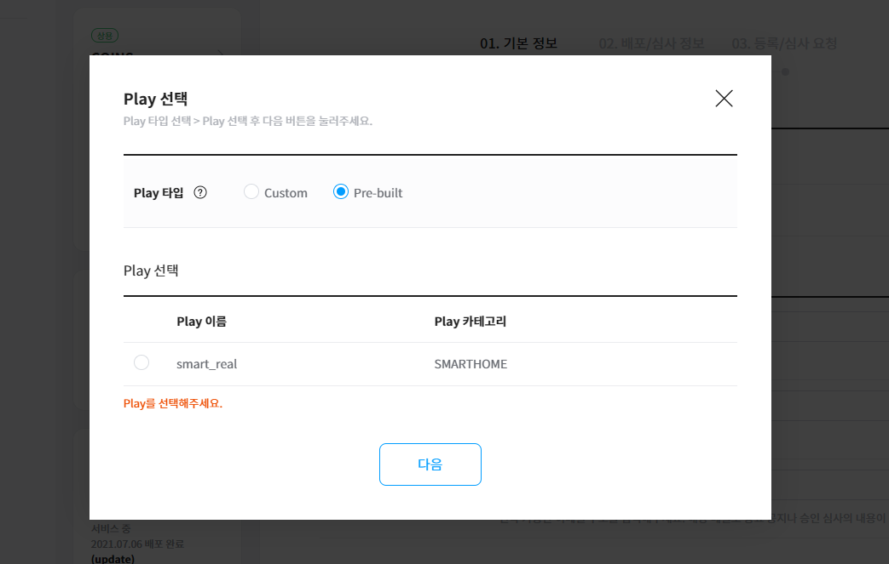
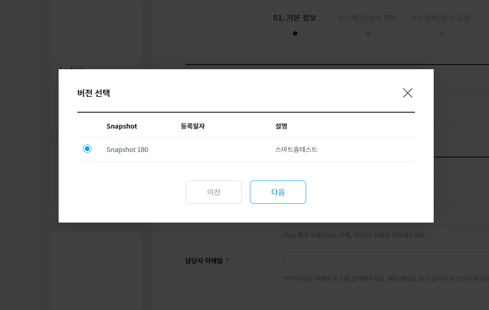
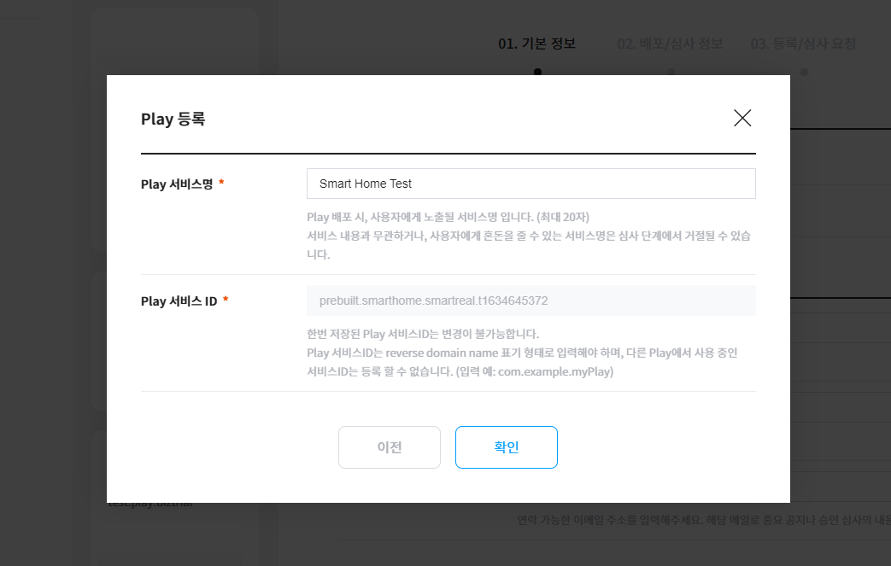
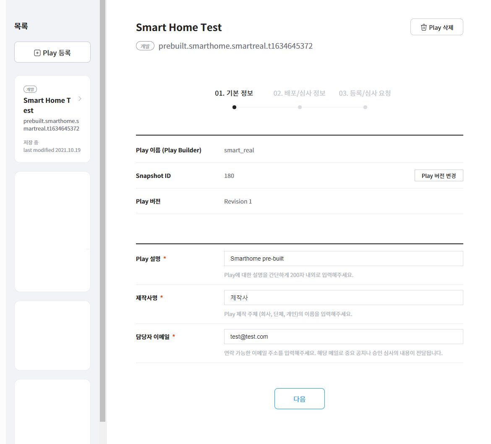
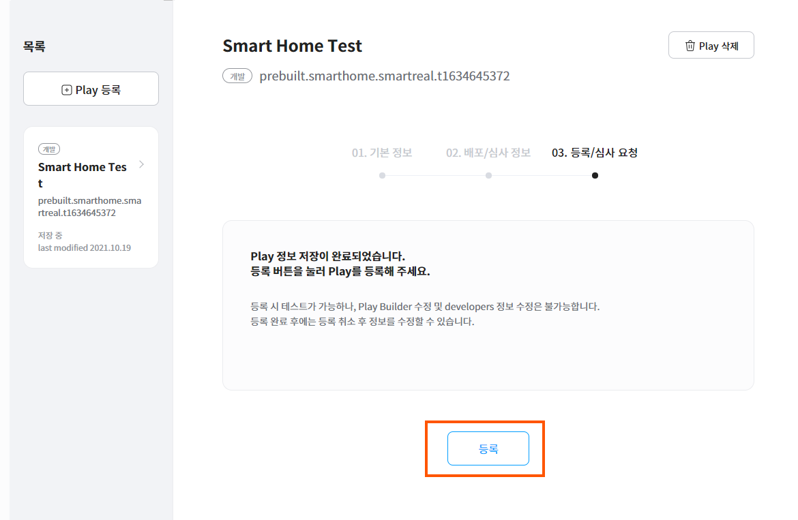
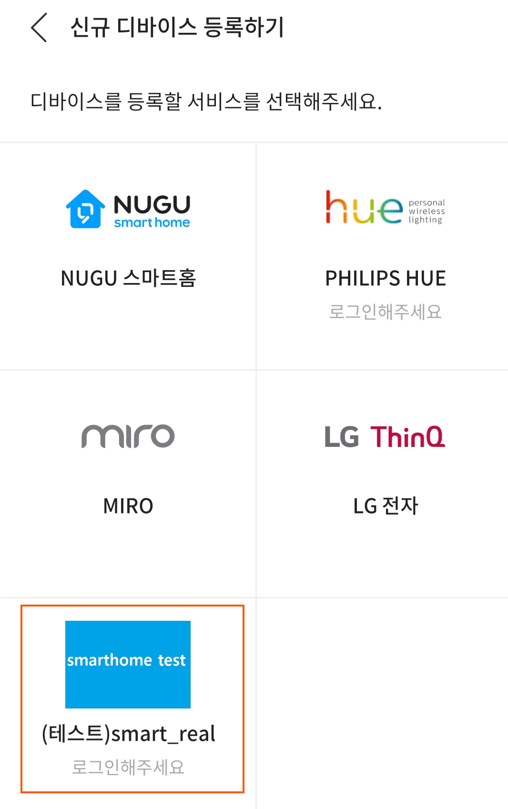

# Play 정보 등록 (smarthome play)

Custom Play가 아닌, Pre-built Play로 만들어진 스마트홈 Play에 대한 등록 방식입니다.

Play Builder에서 Pre-Built 타입으로 개발 완료된 Smarthome Play는 `Developers Console` > `Play kit` > `Play 관리` 메뉴의  `Play 등록` 버튼을 통해 Play를 등록하고 관련 정보를 입력해야 합니다.

Smarthome Play는 제휴 제안을 통해 정식 서비스 절차를 거쳐야 상용 배포가 가능하며, 그 전까지는 Play의 등록 단계까지 가능하여, 본인의 TID 계정에 연결된 디바이스에서 테스트가 가능합니다.

1. `Play 등록하기` 버튼을 클릭하세요. Play Builder에서 개발한 Play 리스트 팝업이 표시되며, Play 타입을` Pre-Built` 로 선택하면 Play Builder에서 만들어 빌드한 Smarthome Play를 선택 할 수 있습니다.

   
2. Smarthome Play를 선택하고, 빌드한 스냅샷 버전을 선택합니다.

   
3. Play 서비스명을 등록합니다. (custom과 다르게, Play 서비스 ID는 자동생성 됩니다.)

   
4. Play 서비스가 생성되면, Play 기본정보, 배포/심사정보를 입력할 수 있으며, Custom Play 보다 훨씬 단순한 내용으로 구성되어 있습니다. 필수 정보를 모두 기입하면 등록이 가능합니다.

   

   
5. 정보를 모두 입력하여 등록을 마치면, 스마트홈 Play는 등록을 진행한 Developers TID 기준으로, NUGU APP > 스마트홈 > 신규 디바이스 등록하기에서 Play Bulder에서 Play에서 설정한 Auth 정보를 바탕으로 스마트홈 계정을 연동 할 수 있는 Contents Provider 테스트 메뉴가 해당 TID에만 생성되고, 스마트홈 기기를 연결한 IoT 서비스사의 계정을 연동하여 테스트 할 수 있습니다.

   
6. 테스트 이후 실제 상용 서비스를 위한 심사, 배포를 하기 위해서는 NUGU 스마트홈 제휴 제안을 통한 사전 제휴 협의가 필요합니다. 출시 일정, QA, 트래픽 예측, 안정성 검토 후 담당자와 상의하여 출시가 결정되면, 이후에는 Custom Play와 동일한 과정으로 심사, 배포를 진행할 수 있습니다.
