# Play 정보 등록

개발 완료된 Play는 `Developers Console` > `Play kit` > `Play 관리` > `Play 등록` 버튼을 통해 Play를 등록하고 관련 정보를 입력해야 합니다.

\1. `Play 등록하기` 버튼을 클릭하세요. Play Builder에서 개발한 Play 리스트 팝업이 표시됩니다.

   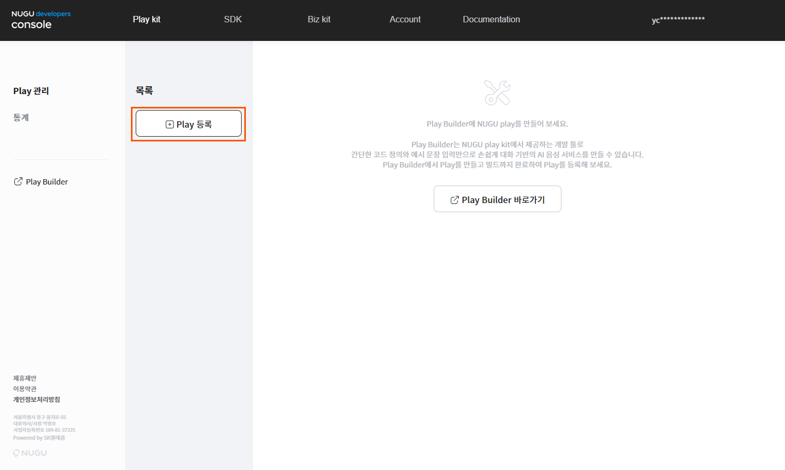

\2. 등록할 Play의 타입을 결정하고 `다음` 버튼을 클릭하여 Play의 Snapshot 버전을 선택하는 화면으로 이동합니다. 일반적인 Play는 Custom 타입이며, Play Builder에 smarthome play 타입으로 만들어진 Play는 Pre-Built-in입니다.

   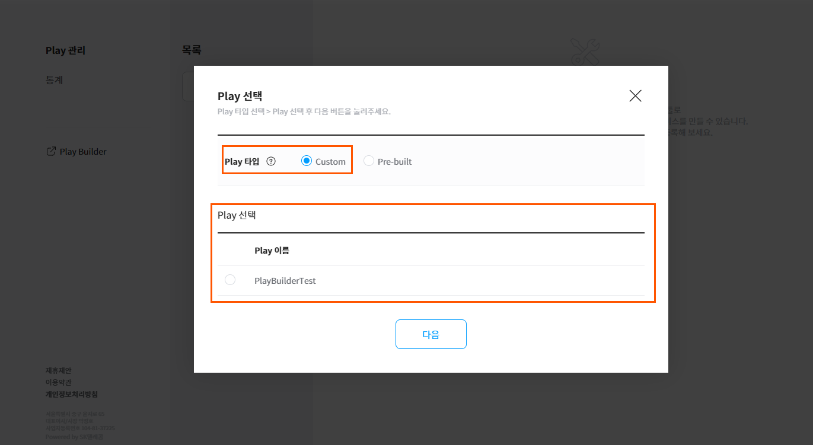


Smarthome 타입의 경우 [Pre-built Play Builder로 스마트홈 Play 만들기](../smarthome-play)를 참고하세요.


\3. 등록할 Snapshot 버전을 선택하고 확인 버튼을 클릭하여, Play 이름/ID 생성 화면으로 이동합니다.

   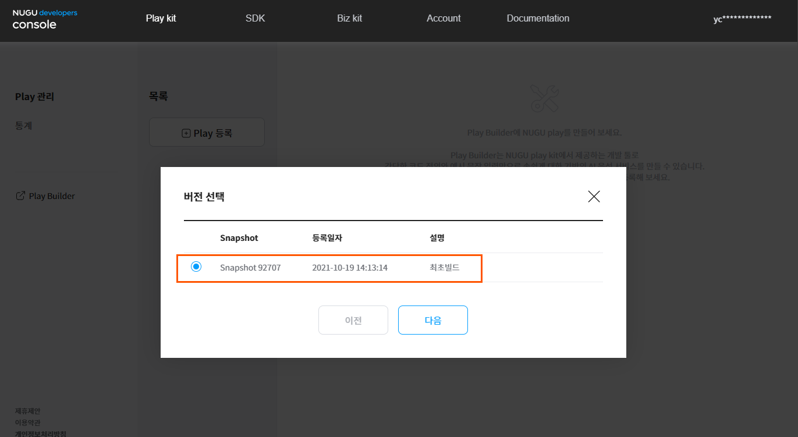

\4. 사용자에게 노출될 Play 서비스명과, 고유한 Play ID를 생성합니다.

Play 서비스명은 Play Builder에서의 Play Name과 다르게 Developers에서 지정하는 이름이며, NUGU APP을 포함한 서비스 화면 노출 용도로 활용됩니다.

Play 서비스 ID는 개별 Play를 구분하는 고유ID이며, 한 번 저장한 후에는 변경이 불가능합니다. Play 서비스ID는 reverse domain name 표기 형태로 입력해야 하며, 다른 Play에서 이미 사용 중인 서비스ID는 등록할 수 없습니다. (입력 예 : com.example.myPlay)

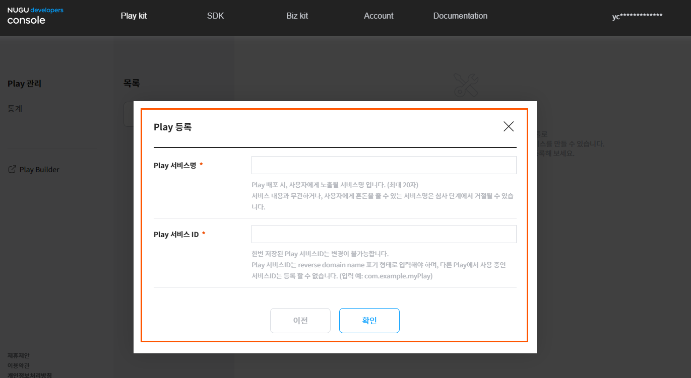

Play 서비스명과 Play 서비스 ID를 입력하여 넘어가면,  배포를 위한 4단계의 정보 입력 화면이 생성됩니다. Play 정보 등록은 총 4단계이며, 1단계 기본 정보 입력 → 2단계 연동 정보 입력 → 3단계 배포/심사 정보 → 4단계 등록/심사 요청의 순서로 진행됩니다.

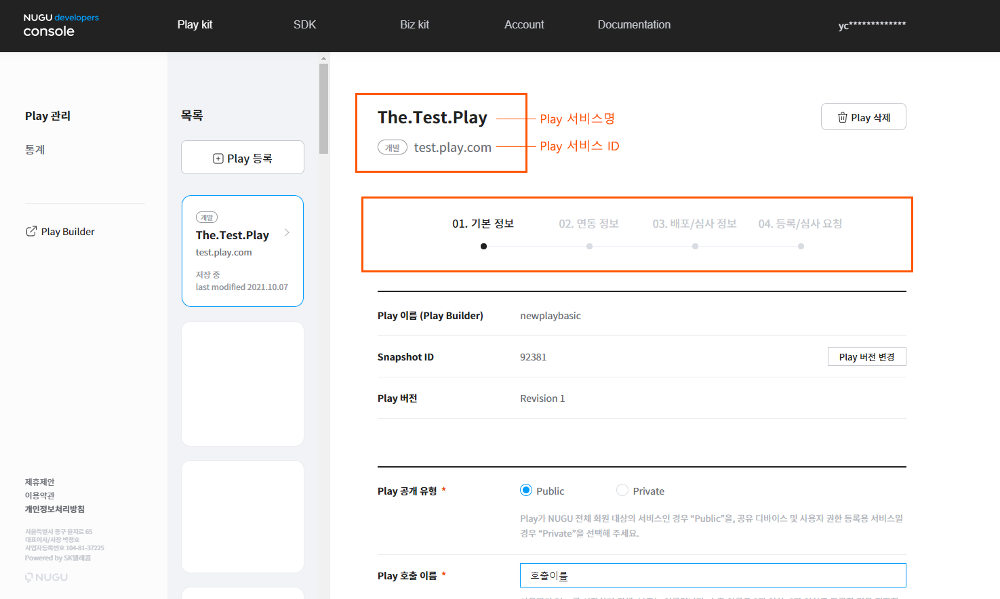

## 기본 정보 

Play 기본 정보는 Play 관련 필수 정보로 아래의 내용들을 등록해야 합니다. 입력을 완료하면 `다음` 버튼을 클릭합니다.

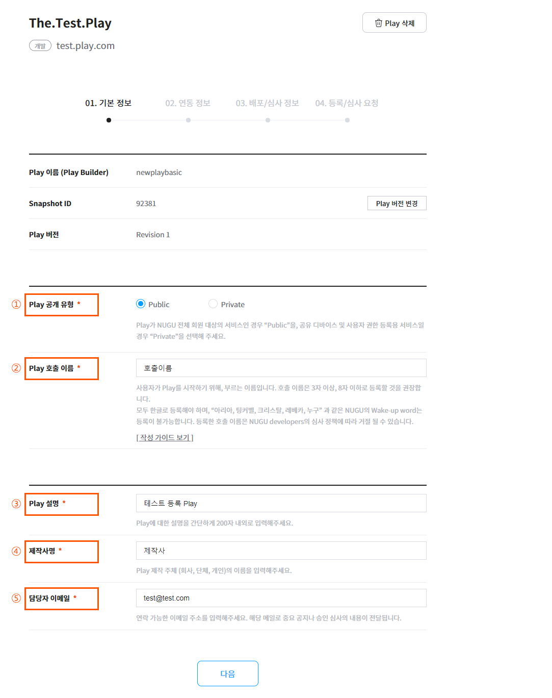

**① Play 공개 유형**

Play 타입은 Public Play와 Private Play로 구분됩니다. Play의 서비스 대상이 NUGU 전체 회원일 경우에는 Public Play를, Play 사용 권한을 부여 받은 특정인 또는 개인을 대상으로 할 경우에는 Private Play를 선택합니다. Play 타입은 심사 승인 이후에는 변경이 불가능하므로 신중하게 결정해야 합니다. Private Play 타입의 Play는 NUGU biz kit에서 사용합니다.

**②  Play 호출 이름**

사용자가 Play를 시작하기 위해 부를 때 사용하는 이름입니다. 반드시 3자 이상의 한글로만 등록해야 하며, 가능하면 8자 이하로 기억하고 부르기 쉬운 단어를 사용하는 것이 좋습니다. Play 호출 이름은 Play 심사 항목이기 때문에 신청하신 이름을 그대로 사용할 수 있다고 보장하지 않습니다. 널리 쓰이는 일반적인 이름이나 타사명, 서비스에 해당하는 용어 또는 이와 유사한 호출 이름은 사용할 수 없기 때문에,심사를 하면서 운영자가 별도로 연락을 드릴 수도 있습니다. 효과적인 호출 이름을 등록할 수 있도록 먼저 [[작성 가이드 보기](#define-an-invocation-name)]를 읽어보신 후에 등록 절차를 진행해주시길 권장합니다.

**③ Play 설명**

등록하고자 하는 Play에 대한 설명(서비스 설명)을 기재합니다. Play 심사 시 Play에 대해서 파악을 할 수 있는 영역이므로, 자신의 Play의 특징이나 서비스 콘셉트 등을 쉽게 파악할 수 있도록 작성해 주세요. 설명은 최대 200자까지 입력할 수 있습니다.

**④ 제작사명**

Play를 개발한 주체(개인, 회사 또는 단체)의 이름 또는 별칭을 입력합니다. 등록된 내용은 NUGU App과 추후 Play Ground에 노출됩니다. 법인의 경우에는 Play 승인 과정에서 관련 자료(예: 법인 등록증, 사업자등록증 등)를 요청할 수 있습니다. 제작사명은 최대 30자까지 입력할 수 있습니다.

**⑤ 담당자 이메일**

연락 가능한 서비스 담당자의 이메일 정보를 입력합니다. 입력한 이메일로 Play에 대한 주요 내용(심사 승인, 반려, 상태 변경, 주요 공지)이 전달됩니다. 법인인 경우에는 개인 이메일 보다는 개발, CS 등 폭넓은 영역에서 의견을 받을 수 있는 대표 이메일 계정을 입력해주시는 편이 좋습니다.

****

### 호출 이름 정의하기 

#### Play 호출 이름의 필수 조건

Play 호출 이름 정의 시 다음의 조건을 만족해야 합니다.

* 3음절 이상 8음절 이하여야 합니다.
* 하나의 Play에는 하나의 호출 이름만 지정합니다.
* 서술어가 포함된 문장은 사용하지 않습니다. 예외적으로, Play 개발자가 보유한 상표명이나 지적재산권이 있을 경우 심사 후 허용이 가능합니다. (예: 야놀자)
* 단체 또는 개인의 지적재산권을 침해하지 않아야 합니다.
* 서비스 기능을 유추할 수 없는 호출 이름은 불가합니다.
* 기존 NUGU에서 제공하고 있는 도메인명은 사용할 수 없습니다.
  예) 날씨, 알람, 음악, 쇼핑, 타이머, 에이에스엠알, 마이큐앤에이, 감성대화, 무드등, 뉴스, 라디오
* 이미 사용되고 있는 서비스명/브랜드명은 사용할 수 없습니다.
  예) 구글캘린더, 도미노피자, 멜론, 뮤직메이트, 비비큐, 비티비연동, 삼성증권, 십일번가, 케이비국민은행, 케이이비하나은행, 팟빵, 홈픽택배, 누구
* NUGU 에이전트의 호출어는 사용할 수 없습니다. (예: 아리아, 팅커벨)
* 알파벳, 숫자, 기호가 사용된다면 모두 한글발음으로 사용합니다.(기호는 가능한 한 사용하지 않을 것을 권장합니다.)
* 조사로 끝나는 단어는 허용하지 않습니다. “~에게, ~에서” 등의 조사가 포함될 경우 NUGU 기능에 영향을 줄 수 있습니다.
* 호칭, 일반 명사, 범용 문구의 단독 사용은 허용하지 않습니다. 단, 조합되는 경우는 가능합니다.
  * 임의의 단어나, 문구의 추가(예: 김동진의 팟캐스트)
  * 고유의 브랜드 이름을 추가(예: 도미노피자, 미스터피자)
* 기존 Play명과 중복되지 않아야 합니다.
* 사용 불가한 호출 이름과 유사 발음으로 인식될 수 있는지 확인합니다.
  예) 으막(“음악”이라는 NUGU에서 제공하고 있는 도메인명으로 인식될 수 있습니다. 또한 도메인명은 호출이름으로 사용할 수 없습니다.
* 불쾌감을 줄 수 있는 단어(비속어, 욕설 등)는 사용할 수 없습니다. 이러한 단어는 승인 심사를 통해 거절될 수 있습니다


Play 호출 이름은 위 조건을 기준으로 사용 승인 심사를 진행하게 되며, 조건에 적합하지 않은 경우에는 승인 허가가 거절될 수 있습니다.

또한, 각 사안의 예외 상황도 고려하여 심사하고 있음을 밝힙니다.


#### 권장 사항

다음의 사항을 참고하여 Play 호출 이름 작성하기를 권장합니다.

* 호출 이름이 브랜드 또는 지적 자산에 해당하는 고유한 이름(예: “스타벅스”, “멜론”)이어야 하지 않는다면, 해당 Play의 서비스 기능을 이름에 포함시켜 더 적합한 호출 이름을 제공할 수 있도록 합니다.
  * 홈픽택배, 11번가 쇼핑, 데일리브리핑, 오늘의 운세
* Play 호출 이름을 발화한 후 이어서 발화하는 “오픈”, ”열어”, ”시작”, ”스타트”, ”실행” 등의 Intent를 원활하게 발음할 수 있는 이름으로 정하는 것이 좋습니다.

## 연동 정보 

사용자에게 제공할 Play 타입을 선택하고, 제공하려는 Play의 사용자 계정이 NUGU 사용자 계정과 연결이 필요할 경우 계정 연동에 관련된 정보를 입력합니다.

**계정 연동 여부(OAuth 연동 여부)**

사용자 계정 체계를 필요로 하지 않는 Play 서비스라면, \[미사용]을 선택하면 됩니다.

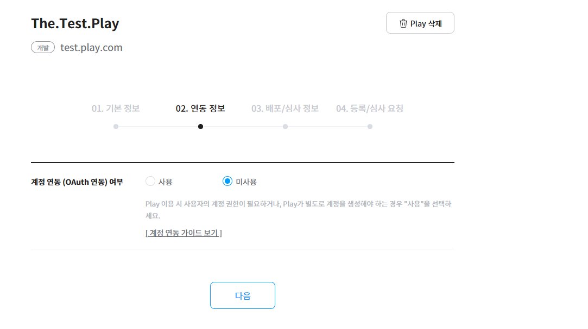

**계정 연동 여부(OAuth 연동 여부)**

제공하려는 Play의 사용자 계정과 NUGU 사용자 계정의 연결이 필요할 경우, 계정 연동에서 \[사용]을 선택하고, 다음 정보를 등록합니다. 계정 연동에 대한 자세한 내용은 [\[계정 연동 가이드 보기\]](../create-plays-with-play-builder/link-oauth20)를 참고하세요.

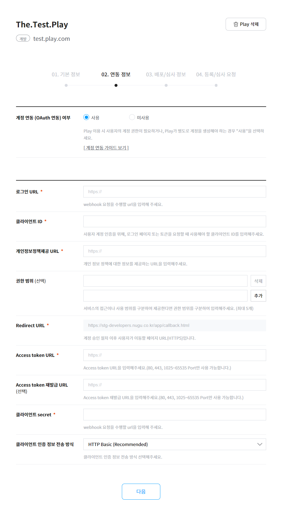

**ⓐ 로그인 URL**

사용자가 계정을 연동할 수 있도록 이동하는 URL을 등록합니다.

**ⓑ 클라이언트ID**

계정 인증 시 HTTP 요청에 필요한 클라이언트ID를 입력합니다. 클라이언트 ID는 인증 서버 구축 시 생성한 값입니다.

**ⓒ 개인정보정책제공 URL**

제공하는 Play의 개인 정보 보호 정책 관련 내용을 제공하는 페이지 URL을 입력합니다. 이 내용은 NUGU App 및 추후 Play Ground에서 보여집니다.

**ⓓ 권한 범위**

사용자 계정 연결 시 발급되는 Access Token의 사용 범위를 추가합니다. 선택 항목이며, 최대 5개까지 입력 가능합니다.

**ⓔ Redirect URL**

계정 승인 절차 완료 후 이동하는 페이지 URL(HTTPS)를 표시합니다.(기본 제공)

**ⓕ Access Token URL**

Access Token을 발급 받을 수 있는 URL을 입력합니다.

**ⓖ Access token 재발급 URL(선택)**

Access Token을 갱신할 수 있는 URL을 입력합니다.

**ⓗ 클라이언트 secret**

Access Token을 획득 시 HTTP 요청에 필요한 클라이언트 secret을 입력합니다. 클라이언트 secret은 인증 서버를 구축할 때 생성한 값입니다.

**ⓘ 클라이언트 인증 정보 전송 방식(선택)**

인증 서버의 인터페이스 구현에 맞는 클라이언트 인증 정보 전송 방식을 선택합니다.

## 배포/심사 정보 

Play 심사 승인에 필요한 정보와 사용자에게 Play를 설명하기 위한 정보들로 구성되어 있으며, 등록된 내용은 NUGU App을 통해 사용자에게 제공됩니다.

배포/심사 정보 등록 후 `심사 요청` 버튼을 클릭하면 자동으로 NUGU developers 운영자에게 Play가 심사가 요청됩니다.


심사 요청에 대한 자세한 내용은 [심사 요청](./play-review#review-request) 페이지를 참고해주세요.


****

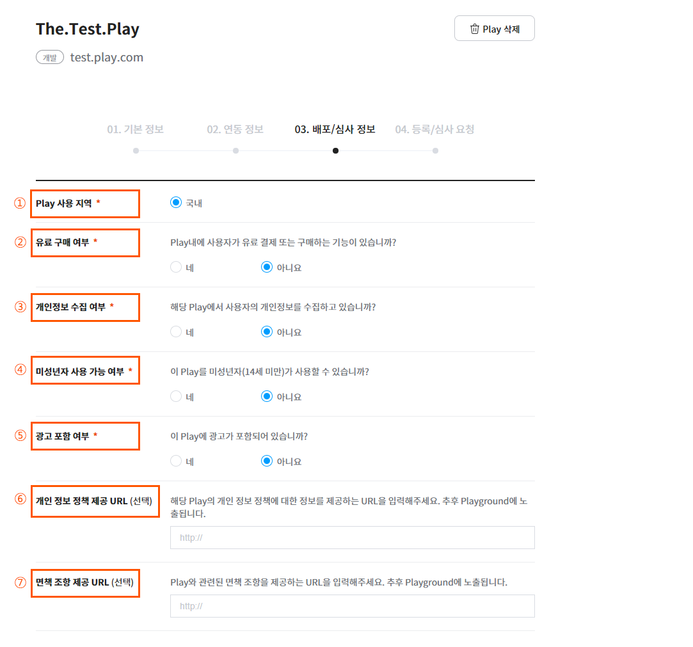

**① Play 사용 지역**

등록한 Play가 서비스될 지역을 선택하는 기능으로 국내에서만 Play를 제공할 수 있습니다.

**② 유료 구매 여부**

제공하려는 Play에 사용자가 유료 결제 또는 구매하는 기능이 있는지 선택합니다. 현재는 유료 구매 기능을 제공하지 않기 때문에 기본적으로 없음이 선택되어 있으며, 항목을 변경하실 수 없습니다.

**③ 개인 정보 수집 여부**

제공하려는 Play에서 사용자의 개인정보를 수집하는지 그 여부를 선택합니다.

**④ 미성년자 사용 가능 여부**

제공하려는 Play가 미성년자(14세 미만)가 사용할 수 있는 서비스인지 선택합니다.

**⑤ 광고 포함 여부**

제공하려는 Play에 광고 기능이 포함되어 있는지 선택합니다.

**⑥ 개인 정보 정책 제공 URL(선택)**

해당 Play의 개인 정보 정책에 대한 정보를 제공하는 URL을 입력해주세요. 추후 Play Ground에 정보가 제공됩니다.

**⑦ 면책 조항 제공 URL(선택)** Play와 관련된 면책 조항을 제공하는 URL을 입력해주세요. 추후 Play Ground에 정보가 제공됩니다.

****

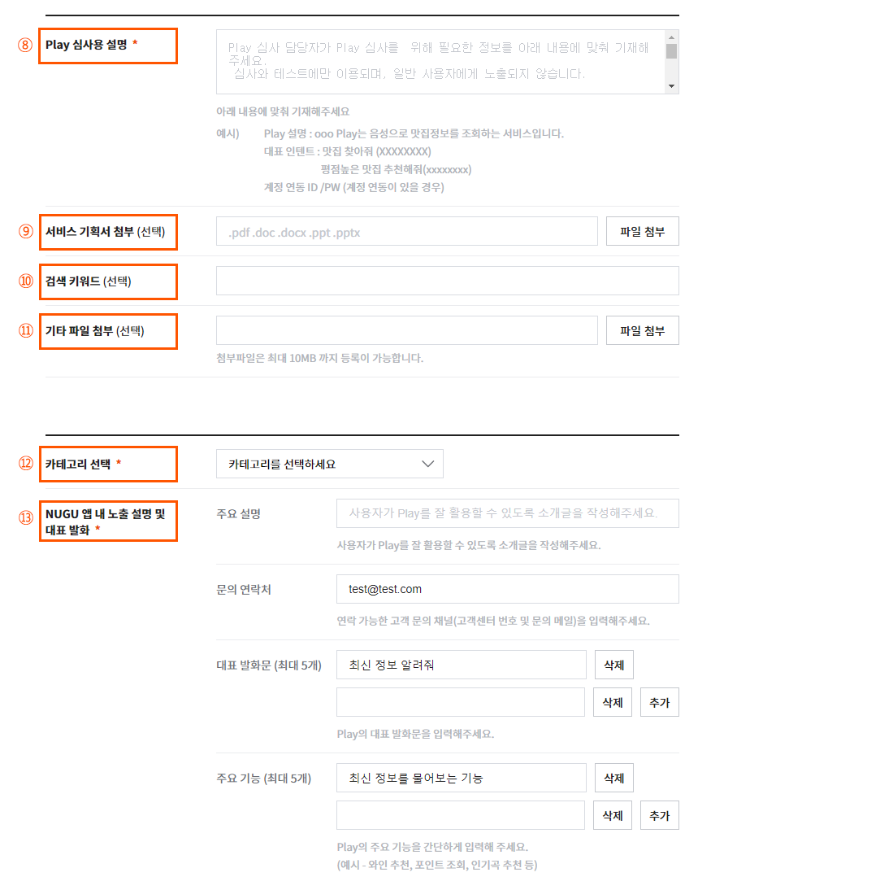

**⑧ Play 심사용 설명**

Play 심사 담당자가 Play를 검증할 때 참고하는 내용으로, 일반 사용자에게는 보여지지 않습니다. 안내 문구에 따라 Play 설명, Play의 대표 인텐트(Intent)를 입력하고, Play 사용을 위해 OAuth 계정 연동이 필요할 경우에는 테스트할 수 있는 ID와 패스워드(PW) 정보도 같이 등록해야 합니다.

**⑨ 서비스 기획서 첨부(선택)**

해당 Play 대한 서비스 기획서를 첨부할 수 있습니다.(첨부 가능한 파일 종류는 pdf, doc, docx, ppt, pptx입니다.) 서비스 기획서 첨부는 선택 사항입니다.

**⑩ 검색 키워드(선택)**

특정 키워드로 사용자가 Play를 검색할 때, 그 키워드에 맞춰 검색 결과를 보여줄 때 자신의 Play가 노출될 수 있도록 제공하는 기능입니다.

**⑫ 카테고리 선택**

제공하려는 Play의 성격에 맞는 카테고리를 선택합니다.

**⑬ NUGU 앱 내 노출 설명 및 대표 발화**

NUGU App을 통해 사용자에게 제공될 Play에 대한 주요 안내 사항과, 주요 기능, 대표 발화문(음성 명령어)을 입력합니다. 주요 기능과 대표 발화문은 최대 5개까지 등록이 가능하며, 입력한 대표 발화문(음성 명령어)은 사용자가 Play를 어떻게 사용해야 하는지 보여주는 예시입니다.

1. **주요 설명 사항**: 사용자에게 제공할 Play에 대한 설명과 연락 가능한 고객 문의 채널을 입력합니다. 프로모션 등을 진행할 경우에도 해당 내용을 입력할 수 있습니다.
2. **문의 연락처** : 사용자에게 노출되는 연락 가능한 고객 문의 채널 정보입니다. (고객센터 번호, 메일)
3. **대표 발화문**: 위 주요 기능에서 입력한 기능과 매칭되는 대표 발화문(음성 명령어)을 입력합니다. 기능당 1개씩만 입력할 수 있습니다.
4. **주요 기능**: 해당 Play가 제공하는 대표 기능을 등록합니다.

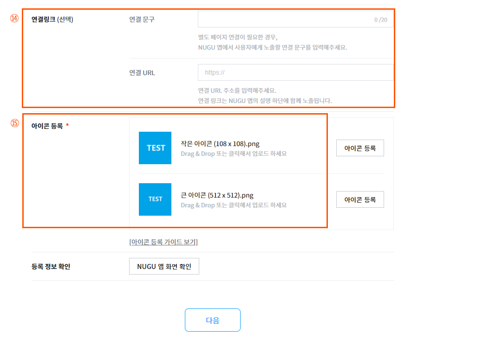

**⑭ 연결링크(선택)**

특정 페이지를 소개하고 싶을 경우, 텍스트로 입력하고 연결될 링크를 삽입할 수 있습니다. 다양한 콘텐츠를 소개하고 싶을 때 콘텐츠 리스트가 있는 페이지 연결이 가능합니다.

**⑮ 아이콘 등록**

NUGU App과 Play Ground(스토어)를 통해 보여줄 Play 아이콘을 등록합니다.(PNG 파일)

1. **작은 아이콘**: 108 X 108 px 사이즈의 이미지 파일로 `NUGU App` > `NUGU play` 페이지와 Play 페이지에 보여집니다.
2. **큰 아이콘**: 512 X 512 px 사이즈의 이미지 파일로 향후 확장되는 PoC에서 활용할 예정입니다.


아이콘 등록에 관한 사항은 [아이콘 등록](../../reference/register-icon)를 참고하세요.



배포 후, NUGU App > NUGU play 메뉴에서 배포된 Play를 확인할 수 있습니다.

