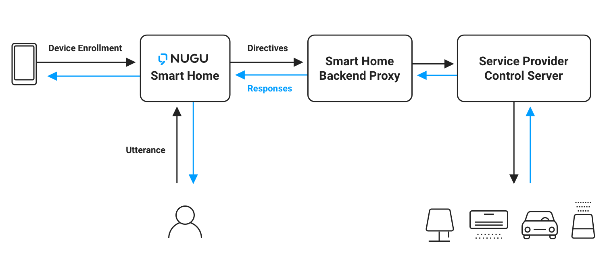
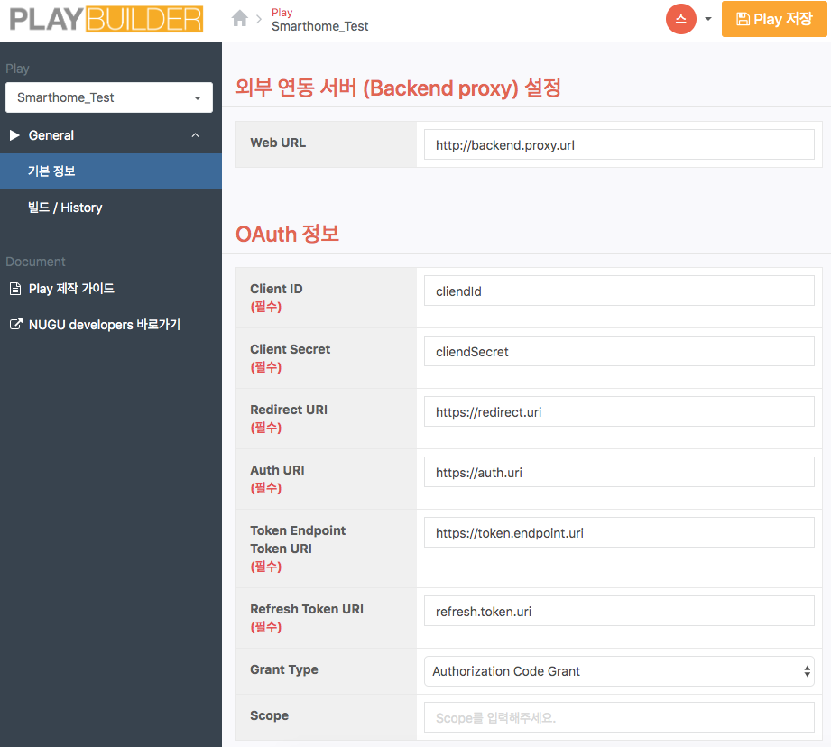
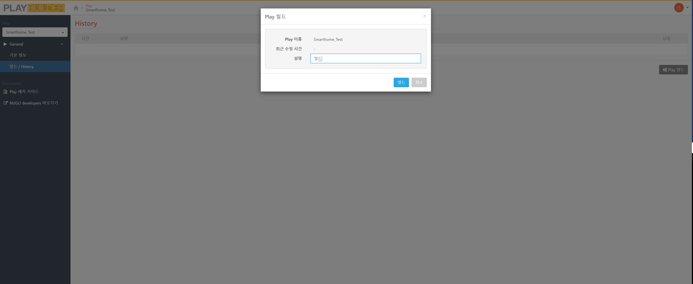

# Pre-built Play Builder로 스마트홈 Play 만들기

NUGU 스마트홈을 활용해 SmartHome Play 제작하면 NUGU 클라이언가 탑재된 다양한 기기(NUGU 스피커, T map, B tv STB, T 전화 )등에서 음성 인터페이스를 활용하여 스마트홈 기기들을 제어하고 확인할 수 있습니다. 이 문서에서는 NUGU스마트홈을 통해 서비스를 제공하고 싶은 IoT Service Provider에게 규격 및 개발 가이드와 API 레퍼런스, 샘플코드, NUGU SmartHome Play Builder 사용 가이드 등을 제공합니다. NUGU스마트홈은 계속 개발되고 있으며, 관련 규격들은 지속적으로 업데이트됩니다.



## SmartHome Play 만들기

SmartHome Play는 스마트홈 관련 기능에 대해 사용자 발화 및 처리로직들이 사전에 정의되어 있는 Prebuilt 유형의 Play입니다. 따라서 SmartHome Play는 별도로 UtteranceModel 및 Action정의를 하실 필요가 없이 OAUTH 연동 및 SmartHomeBackendProxy 구현만으로 제작할 수 있습니다. SmartHome Play 역시 NUGU Developers 내 Play Builder를 활용해 만들 수 있으며 Play 생성 시 Play 유형을 SmartHome으로 선택해야 합니다. SmartHome Play를 만들기 위한 순서 및 자세한 내용을 아래를 참조하시기 바랍니다.UtteranceModel 및 Action정의를 하실 필요가 없이 OAUTH 연동 및 SmartHomeBackendProxy 구현만으로 제작할 수 있습니다. SmartHome Play 역시 NUGU Develpers 내 Play Builder를 활용해 만들 수 있으며 Play 생성 시 Play 유형을 SmartHome으로 선택해야 합니다. SmartHome Play를 만들기 위한 순서 및 자세한 내용을 아래를 참조하시기 바랍니다.

NUGU developers를 통해 [Play Builder](https://builder.nugu.co.kr/index.html#/playList)에 접속해주세요.

Play Builder에서 우측 하단 Play 생성"+ 버튼"을 선택 해 새로운 Play를 제작합니다. Play유형은 SmartHome으로 선택한 후 Play이름을 입력해야 합니다. Play이름은 Play Builder 내에서 사용할 이름입니다. 사용자에게 공개하게 될 Play의 이름은 별도로 등록하게 됩니다.

Play Builder를 통해 기본정보를 입력해주세요. 기본정보는 Play이름, Play별칭, 외부 연동 서버(Backend proxy)설정, OAuth정보로 구성되어 있습니다.




Oauth 정보 : SmartHome Play의 경우 IoT ServiceProvider의 사용자 계정 인증을 NUGU의 사용자 계정과 연동해야 하므로 인증서버 연동이 필수적으로 필요하며 해당 연동은 OAUTH 2.0 규격에 따라 아래 정보가 필요합니다.

1. Clinet ID
2. Client Secret
3. Redirect URI
4. Auth URI
5. Token Endpoint (Token URI)
6. Token Refresh URI
7. Grant Type
8. Scope


외부 연동 서버(backend proxy) 설정 : NUGU의 사용자 발화체계 및 Action 로직을 IoT Service와 연동해 줄 BackendProxy 서버의 개발이 필수입니다.

SmartHome BackendProxy는 Discovery와 Control 2개의 역할을 수행합니다. 자세한 내용은 아래 [Discovery](#discovery)와 [Control](#control)을 참조해주세요.

Play의 기본정보 입력을 마친 후 빌드/History 메뉴를 통해 Play빌드를 진행합니다. Play를 빌드한 시점을 기준으로 입력된 정보로 NUGU developers에서 Play의 등록 및 심사를 진행하실 수 있습니다. 만약 Play의 기본정보가 변경될 경우 새로 빌드하고 이를 NUGU developers에서 재등록 혹은 업데이트를 진행해야 합니다.



SmartHome Play의 빌드를 마친 후 NUGU developers의 관리 > Play등록 메뉴에서 Play등록하기를 통해 Play를 등록 및 심사 요청해야 합니다.

Play타입을 Smarthome으로 선택하면 Play Builder를 통해 제작한 SmartHome Play의 리스트를 불러올 수 있습니다. SmartHome Play의 심사 프로세스는 Custom Play와 동일하지만 Play 심사를 위한 등록 정보는 일부 차이가 있습니다.

SmartHome Play의 빌드를 마친 후 NUGU developers의 관리 > Play등록 메뉴에서 Play등록하기를 통해 Play를 등록 및 심사 요청해야 합니다. Play타입을 Smarthome으로 선택하면 Play Builder를 통해 제작한 SmartHome Play의 리스트를 불러올 수 있습니다. SmartHome Play의 심사 프로세스는 Custom Play와 동일하지만 Play 심사를 위한 등록 정보는 일부 차이가 있습니다.

SmartHome Play를 등록한 후 심사대기 및 심사 중 상태일 때 NUGU 클라이언트가 탑재된 기기를 통해 테스트를 진행할 수 있습니다. SmartHome Play를 제작한 NUGU Developers의 T ID와 동일한 T ID로 NUGU 모바일 앱에 접속해 스마트홈 메뉴에서 신규 기기 등록하기를 선택하면 심사 중인 IoT ServiceProvider의 SmartHome Play가 보이고 사용자 계정 연동을 통해 스마트홈 기기를 NUGU 앱에 등록해 테스트를 진행할 수 있습니다. 자세한 내용은 다음 링크를 참고해 주세요. [Play 정보 등록 (smarthome play)](./play-registration-and-review/play-smarthome-play)


Key Terms

1. Discovery - 사용자가 발화로 제어 가능한 디바이스를 탐색하는 기능. Discovery 를 위해서는 Discovery 요청을 처리할 수 있는 SmartHomeBackendProxy 서버를 개발해야 함. Discovery 가 된 디바이스는 NUGU App 의 스마트홈에 노출되며 별칭을 설정하여 발화로 제어할 수 있어야 함. 제어를 위해서는 Control 요청을 처리하는 SmartHomeBackendProxy 서버를 개발해야 함.
2. Control - SmartHomeBackendProxy 가 받게 되는 기기 제어 요청. 이 요청을 처리하기 위해서는 기기를 제어하기 위한 SmartHomeBackendProxy 서버를 개발해야 함.
3. SmartHomeBackendProxy - Discovery, Control 요청을 처리하는 서버.
4. OAuth2 - OAuth2 인증에 필요한 정보 입력 필요.

NUGU SmartHome Platform은 지금도 계속해서 개발되고 있습니다. 현재 NUGU SmartHome Platform 에 등록되지 않은 스마트홈 기기 유형 및 기능에 대한 문의 및 요청은 NUGU developers Support 내에 문의사항 / 제휴제안을 통해 등록해주세요.


## Discovery

SmartHome Play의 동작을 위해서는 SmartHomeServiceProvider의 SmartHomeDevice 정보를 NUGU스마트홈에 등록해야 합니다. 일반 사용자가 NUGU스마트홈에 SmartHomeDevice를 등록하려면 NUGU App의 스마트홈 메뉴에서 "신규 디바이스 등록하기" 기능을 사용해야 합니다. "신규 디바이스 등록하기"를 선택한 후 SmartHome Play를 선택하면 해당 SmartHome Play의 SmartHomeServiceProvider가 제공하는 계정연동(OAUTH 2.0) 웹페이지로 이동하고 계정 연동을 통해 SmartHomeServiceProvider에 등록된 SmartHomeDevice 정보를 불러오게 됩니다. 불러온 SmartHomeDevice 정보 중 사용자가 선택해 등록한 SmartHomeDevice는 NUGU스마트홈을 통해 제어할 수 있게 됩니다. 사용자가 NUGU App을 통해 SmartHome Play의 SmartHomeDevice를 등록하려고 하면 NUGU스마트홈은 SmartHomeServiceProvider에게 Discovey를 요청하고 SmartHomeServiceProvider는 아래 예시와 같이 NUGU스마트홈에 등록할 수 있는 모든 SmartHomeDevice 정보를 응답해야 합니다.

### Discovery Request 예시


```json
{
  "userIdentifier": "t6Pv9PLAEmYZilNiloUUnZbVDjXgvUCzwpWY1tPq (optional, e.g. hue whitelist identifier)",
  "token": "7KOdwPQdJPZf4KYsjtHdqz3e8fKd"
}
```


### Discovery Response Sample


```json
{
  "devices": [
    {
      "id": "D1234567",
      "type": "AIR_CONDITIONER",
      "modelName": "example model name",
      "friendlyNameSuggestion": "거실",
      "manufacturer": "example manufacturer",
      "supportedCapabilities": {
        "airflowControl": {
          "supportedAirflowTypes": ["강", "강풍", "미풍", "수면", "약", "약풍", "자동", "자동풍"]
        },
        "airQualityCheck": {},
        "endTimeControl": {},
        "modeControl": {
          "supportedModes": ["무풍모드", "냉방모드", "수면모드"]
        },
        "powerControl": {},
        "temperatureControl": {}
      },
      "customData": {
        ...
      },
      "connectionStatus": true
    }
  ]
}
```


## Control

NUGU스마트홈에 등록된 SmartHomeDevice에 제어 요청이 올 경우 NUGU스마트홈은 내부 로에 따라 제어 대상 및 제어 명령을 확정 짓고 Discovery단계에서 등록된 정보를 활용해 SmartHomeServiceProvider에게 제어 명령을 전달합니다. 이때 제어 명령을 실제로 수신하는 것은 SmartHome Play를 제작할 당시에 입력한 SmartHomePlayBackendProxy입니다. 제어명령은 SmartHomeDeviceType과 SmartHomeCapability, SmartHomeDirective로 정리되어 요청되며, SmartHomeCapability, SmartHomeDirective에 따라 부가 정보가 포함되기도 합니다.

### Control Request 예시


```json
{
  "version": 1,
  "requestId": "2019071712638a4378649347bdb21643127a0f6d83",
  "action": {
    "command": {
      "smartHomeCapability": "TemperatureControl",
      "smartHomeDirective": "SetTemperature",
      "parameters": {
        "temperatureLevel": 22
      }
    },
    "smartHomeDevices": [
      {
        "id": "D83077224431",
        "type": "에어컨",
        "model": null,
        "friendlyName": "거실",
        "customData": {}
      }
    ]
  },
  "context": {
    "session": {
      "id": "a5a250af-48f7-4ceb-b099-ea6753afa570",
      "accessToken": "DUMMY_ACCESS_TOKEN",
      "userIdentifier": "SERVICE_PROVIDER_USER_ID (optional, e.g. Hue whitelist Identifier)"
    }
  }
}
```


### Control Response 예시


```json
{
  "resultCode": "OK", // 에러일 경우 에러코드 응답
  "requestId": "2019071712638a4378649347bdb21643127a0f6d83", // request로 받은 값을 그대로 응답
  "parameters": {} // directive 마다 필요한 property 채워서 응답.
}
```

