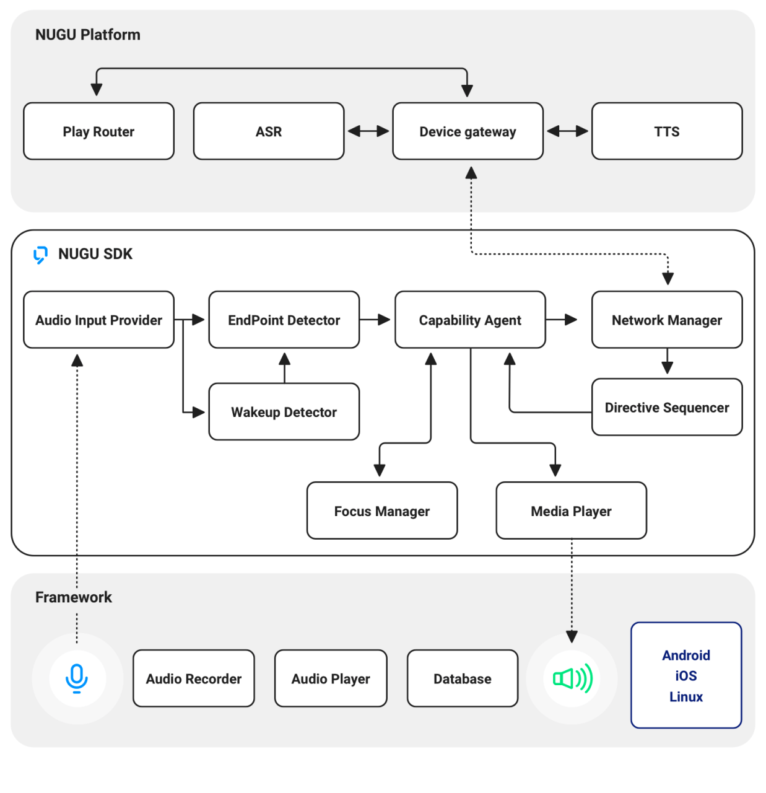

# NUGU SDK



NUGU SDK는 다양한 디바이스와 앱에서의 NUGU 플랫폼 연동을 지원하여 음성인터페이스 기반 다양한 AI 기능을 제공합니다. NUGU SDK에서 제공되는 API 형식에 따라 이용자의 요청(음성명령)을 NUGU 플랫폼으로 전송하고 NUGU 플랫폼의 처리 결과를 클라이언트에 전달합니다.

NUGU SDK는 사용자의 요청(음성명령)을 NUGU 플랫폼으로 전송하고 NUGU 플랫폼의 처리 결과따라 디바이스나 어플리케이션의 기능을 제어합니다.

