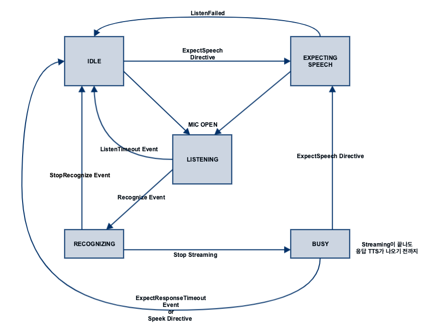

# ASR

## Version

최신 버전은 1.7 입니다.

| Version | Date       | Description                                                                                                |
|:--------|:-----------|:-----------------------------------------------------------------------------------------------------------|
| 1.0     | 2019.11.24 | 규격 추가                                                                                                      |
| 1.1     | 2020.04.29 | Recognize directive 에 wakeup, timeout 필드 추가<br/>Recognize directive, ExpechSpeech event 에 asrContext 필드 추가 |
| 1.2     | 2020.06.05 | Recognize directive, ExpectSpeech event 의 asrContext 에 playServiceId 필드 추가                                 |
| 1.3     | 2020.06.09 | Recognize directive, ExpectSpeech event 의 sessionId 필드 삭제                                                  |
| 1.4     | 2020.11.18 | ExpectSpeech directive 에 epd 필드 추가                                                                         |
| 1.5     | 2021.03.03 | Context 에 state, initiator 필드 추가                                                                           |
| 1.6     | 2021.05.31 | ASR.ExpectSpeech directive 에 listenTimeoutFailBeep 필드 추가                                                   |
| 1.7     | 2022.07.04 | ASR.ExpectSpeech directive의 asrContext에 isAddListen 추가                                                     |

## State Diagram



## SDK Interface

### ASRAgent 사용

ASR interface 규격에 따른 디바이스의 동작 제어는 ASRAgent 가 처리합니다.



NuguAndroidClient instance 를 통해 ASRAgent instance 에 접근할 수 있습니다.


```kotlin
val asrAgent = nuguAndroidClient.asrAgent
```


Microphone 으로 부터 음성 데이터를 가져오기 위한 AudioSourceManager 를 생성합니다.


```kotlin
val audioSourceManager = AudioSourceManager(AudioRecordSourceFactory())
```


음성인식에 필요한 학습 모델을 설정합니다.


```kotlin
NuguAndroidClient.Builder(
    context,
    NuguOAuth.create(context),
    audioSourceManager
).endPointDetector(
    EndPointDetector(
        context.getDir(
            "skt_nugu_assets",
            Context.MODE_PRIVATE
        ).absolutePath + File.separator + "skt_epd_model.raw"
    )
)
```


AudioSourceManager, ASRAgent 를 연결해주기 위한 SpeechRecognizerAggregator 를 생성합니다.


```kotlin
speechRecognizerAggregator = SpeechRecognizerAggregator(
    null,
    SpeechProcessorDelegate(asrAgent),
    audioSourceManager,
    Handler(Looper.getMainLooper())
)
```




NuguClient instance 를 통해 ASRAgent instance 에 접근할 수 있습니다.


```swift
let asrAgent = nuguClient.asrAgent
```


Microphone 으로 부터 음성 데이터를 가져오기 위한 MicInputProvider 를 생성합니다.


```swift
let micInputProvider = MicInputProvider()
```


Microphone 으로 부터 가져온 음성 데이터가 NuguClient 로 전달될 수 있도록 합니다.


```swift
micInputProvider.delegate = nuguClient
```


음성인식에 필요한 학습 모델을 설정합니다.


```swift
let epdFile = Bundle.main.url(forResource: "skt_epd_model", withExtension: "raw")!
nuguClient.asrAgent.options = ASROptions(endPointing: .client(epdFile: epdFile))
```




[CapabilityFactory::makeCapability](https://nugu-developers.github.io/nugu-linux/classNuguCapability_1_1CapabilityFactory.html#a46d96b1bc96903f02905c92ba8794bf6) 함수로 [ASRAgent](https://nugu-developers.github.io/nugu-linux/classNuguCapability_1_1IASRHandler.html) 를 생성하고 [NuguClient](https://nugu-developers.github.io/nugu-linux/classNuguClientKit_1_1NuguClient.html) 에 추가해 주어야합니다.


```cpp
auto asr_handler(std::shared_ptr<IASRHandler>(
        CapabilityFactory::makeCapability<ASRAgent, IASRHandler>()));

nugu_client->getCapabilityBuilder()
    ->add(asr_handler.get())
    ->construct();
```


음성인식에 필요한 학습 모델을 설정합니다.


```cpp
 asr_handler->setAttribute(ASRAttribute { "/var/lib/nugu/model", "CLIENT", "PARTIAL" });
```




### 음성 인식 요청

`아리아` 발화 또는 NUGU Button 선택 시 [Recognize](#recognize) event 를 전달하여 음성인식을 시작할 수 있습니다.




```kotlin
speechRecognizerAggregator.startListening(initiator = TAP)
```





```swift
try micInputProvider.start()
asrAgent.startRecognition(initiator: .user)
```





```cpp
asr_handler->startRecognition()
```




### 음성인식 진행 상태 모니터링

음성인식에 대한 진행 상태를 모니터링 할 수 있습니다.

음성인식에 대한 STT(SpeechToText) 결과가 [NotifyResult](#notifyresult) directive 로 전달됩니다.



SpeechRecognizerAggregatorInterface.OnStateChangeListener 를 추가합니다.


```kotlin
val listener = object: SpeechRecognizerAggregatorInterface.OnStateChangeListener {
    override fun onStateChanged(state: State) {
        ...
    }
}
speechRecognizerAggregator.addListener(listener)
```


ASRAgentInterface.OnResultListener 를 추가합니다.


```kotlin
val resultListener = object: ASRAgentInterface.OnResultListener {
    fun onPartialResult(result: String, dialogRequestId: String) {
        // STT 중간 결과
        ...
    }

    fun onCompleteResult(result: String, dialogRequestId: String) {
        // STT 최종 결과
        ...
    }

    ...
}
asrAgent.addOnResultListener(resultListener)
```




ASRAgentDelegate 를 추가합니다.


```swift
class MyASRAgentDelegate: ASRAgentDelegate {
    func asrAgentDidChange(state: ASRState) {
        ...
    }

    func asrAgentDidReceive(result: ASRResult, dialogRequestId: String) {
        // NotifyResult 결과 확인
        ...
    }
}
asrAgent.add(delegate: MyASRAgentDelegate())
```




음성인식 진행 상태를 모니터링 하려면 [IASRListener](https://nugu-developers.github.io/nugu-linux/classNuguCapability_1_1IASRListener.html) 를 추가합니다.


```cpp
class MyASRListener : public IASRListener {
public:
    ...

    void onState(ASRState state, const std::string &dialog_id) override
    {
        ...
    }

    void onPartial(const std::string &text, const std::string &dialog_id) override
    {
        // STT 중간 결과
        ...
    }

    void onComplete(const std::string &text, const std::string &dialog_id) override
    {
        // STT 최종 결과
        ...
    }

    ...
};
auto asr_listener(std::make_shared<MyASRListener>());
CapabilityFactory::makeCapability<ASRAgent, IASRHandler>(asr_listener.get());
```




### 음성 인식 중단

사용자가 음성 인식 중단 요청을 [StopRecognize](#stoprecognize) event 로 전달할 수 있습니다.




```kotlin
speechRecognizerAggregator.stopListening()
```





```swift
asrAgent.stopRecognition()
```





```cpp
asr_handler->stopRecognition()
```




## Context


```json
{
  "ASR": {
    "version": "1.6",
    "engine": "{{STRING}}",
    "state": "{{STRING}}",
    "initiator": "{{STRING}}"
  }
}
```


| parameter | type   | mandatory | description                                                                                                                                                                                                          |
|:----------|:-------|:----------|:---------------------------------------------------------------------------------------------------------------------------------------------------------------------------------------------------------------------|
| engine    | string | N         | Device 에서 사용하는 음성인식 engine 을 명시 NUGU 음성인식 engine 을 사용하는 경우 "skt"(값을 채우지 않으면 default "skt")                                                                                                                           |
| state     | string | Y         | IDLE<br/>EXPECTING_SPEECH<br/>LISTENING<br/>RECOGNIZING<br/>BUSY<br/>[State Diagram](#state-diagram) 참고                                                                                                              |
| initiator | string | N         | 마이크 오픈이 어떻게 트리거되었는지<br/>- WAKE_UP_WORD : 사용자 발화로 Wakeup<br/>- PRESS_AND_HOLD : PTT 방식으로 Wakeup<br/>- TAP : NUGU 버튼 등에 의해서 Wakeup<br/>- EXPECT_SPEECH : ASR.ExpectSpeech<br/>- EARSET : 이어셋 VoiceCommand 등을 통해 Wakeup |

## Directives

### ExpectSpeech


```json
{
  "header": {
    "namespace": "ASR",
    "name": "ExpectSpeech",
    "messageId": "{{STRING}}",
    "dialogRequestId": "{{STRING}}",
    "version": "1.6"
  },
  "payload": {
    "playServiceId": "{{STRING}}",
    "domainTypes": ["{{STRING}}"],
    "asrContext": {
      "task": "{{STRING}}",
      "sceneId": "{{STRING}}",
      "sceneText": [
        "{{STRING}}"
      ],
      "playServiceId" : "playServiceId",
      "isAddListen" : {{BOOLEAN}}
    },
    "epd": {
      "timeoutMilliseconds": {{LONG}},
      "silenceIntervalInMilliseconds": {{LONG}},
      "maxSpeechDurationMilliseconds": {{LONG}}
    },
    "listenTimeoutFailBeep": {{BOOLEAN}}
  }
}
```


| parameter                         | type            | mandatory | description                                                                                                                           |
|:----------------------------------|:----------------|:----------|:--------------------------------------------------------------------------------------------------------------------------------------|
| playServiceId                     | string          | N         | **Y** : 회신받아야 하는 경우<br/>**N** : 마이크만 열고 싶은경우<br/>default : N                                                                          |
| property                          | string          | N         | **NORMAL** : 일반 발화를 입력으로 받음<br/>**DICTATION** : dictation 서버로 라우팅하여 처리 필드가 없는 경우<br/>default 값은 NORMAL                                |
| domainTypes                       | array of string | N         | ExpectSpeech 의한 발화시에 NLU에서 사용할 domainType 셋팅 정보                                                                                       |
| asrContext                        | object          | N         | -                                                                                                                                     |
| asrContext.task                   | string          | N         | -                                                                                                                                     |
| asrContext.sceneId                | string          | N         | -                                                                                                                                     |
| asrContext.sceneText              | array of string | N         | -                                                                                                                                     |
| asrContext.playServiceId          | string          | N         | -                                                                                                                                     |
| asrContext.isAddListen            | boolean         | N         | add-listen으로 인입된 발화 여부                                                                                                                |
| epd                               | object          | N         | End Point Detection 관련 정보 없으면 device의 default 값을 사용<br/>하위의 3개 파라미터도 optional이기 때문에 존재하는 파라미터만 업데이트하고, 없는 파라미터는 device의 default 값을 사용 |
| epd.timeoutMilliseconds           | long            | N         | Wake up 후 종료까지 대기 시간 (단위: msec)<br/>**이 값은 위의 timeoutInMilliseconds와는 다른 epd 전용값**                                                    |
| epd.silenceIntervalInMilliseconds | long            | N         | end point detection 전에 기다리는 묵음 구간 (단위: msec)                                                                                          |
| epd.maxSpeechDurationMilliseconds | long            | N         | 사용자 발화 최대 녹음 시간 (단위: msec)                                                                                                            |
| listenTimeoutFailBeep             | boolean         | N         | Listening timeout 발생시 beep 재생 여부<br/>default 값은 true                                                                                  |

### NotifyResult

* 음성 인식 결과 전달


```json
{
  "header": {
    "namespace": "ASR",
    "name": "NotifyResult",
    "messageId": "{{STRING}}",
    "dialogRequestId": "{{STRING}}",
    "version": "1.6"
  },
  "payload": {
    "token": "{{STRING}}",
    "result": "{{STRING}}",
    "state": "{{STRING}}"
  }
}
```


| parameter | type   | mandatory | description                                                                                                                                                                                                             |
|:----------|:-------|:----------|:------------------------------------------------------------------------------------------------------------------------------------------------------------------------------------------------------------------------|
| token     | string | N         | Recognize Event에서 사용한 token 값 (어떤 발화에 대한 분석 결과인지 식별하기 위한 용도)                                                                                                                                                            |
| result    | string | N         | 인식 결과를 전송                                                                                                                                                                                                               |
| state     | string | Y         | **PARTIAL** : 사용자 발화의 일부분<br/>**COMPLETE** : 사용자 발화의 전체 문장<br/>**NONE** : 음성 인식 결과 없음<br/>**ERROR** : Error 발생<br/>**SOS** : SOS(Start of Speech)<br/>**EOS** : EOS(End of Speech)<br/>**FA** : Wakeup False Acceptance |

### CancelRecognize


```json
{
  "header": {
    "namespace": "ASR",
    "name": "CancelRecognize",
    "messageId": "{{STRING}}",
    "dialogRequestId": "{{STRING}}",
    "version": "1.6"
  },
  "payload": {
    "cause": "{{STRING}}"
  }
}
```


| parameter | type   | mandatory | description                                   |
|:----------|:-------|:----------|:----------------------------------------------|
| cause     | string | Y         | **WAKEUP_POWER** : 다른 wakeup보다 power가 적어서 취소됨 |

## Events

### Recognize


```json
{
  "header": {
    "namespace": "ASR",
    "name": "Recognize",
    "messageId": "{{STRING}}",
    "dialogRequestId": "{{STRING}}",
    "version": "1.6"
  },
  "payload": {
    "codec": "{{STRING}}",
    "playServiceId": "{{STRING}}",
    "domainTypes": ["{{STRING}}"],
    "language": "{{STRING}}",
    "endpointing": "{{STRING}}",
    "encoding": "{{STRING}}",
    "wakeup": {
      "word": "{{STRING}}",
      "boundary": {
        "start": {{LONG}},
        "end": {{LONG}},
        "detection": {{LONG}}
      },
      "power": {
        "noise": {{LONG}},
        "speech": {{LONG}}
      }
    },
    "asrContext": {
      "task": "{{STRING}}",
      "sceneId": "{{STRING}}",
      "sceneText": [
        "{{STRING}}"
      ],
      "playServiceId" : "playServiceId"
    },
    "timeout": {
      "listen": {{LONG}},
      "maxSpeech": {{LONG}},
      "response": {{LONG}}
    }
  }
}
```


| parameter                 | type            | mandatory | description                                                                                                        |
|:--------------------------|:----------------|:----------|:-------------------------------------------------------------------------------------------------------------------|
| codec                     | string          | Y         | SPEEX                                                                                                              |
| playServiceId             | string          | N         | ExpectSpeech에 의한 발화인 경우에만 ExpectSpeech에서 받은 playServiceId를 적용                                                      |
| property                  | string          | N         | ExpectSpeech에 의한 발화인 경우에만 ExpectSpeech에서 받은 property를 적용                                                           |
| domainTypes               | array of string | N         | ExpectSpeech에 의한 발화인 경우에만 ExpectSpeech에서 받은 domainTypes를 적용                                                        |
| language                  | string          | N         | **KOR**, **ENG**, **JPN**, **CHN**, ...<br/>default 값은 KOR                                                         |
| endpointing               | string          | Y         | **CLIENT** : 클라이언트 EPD(EndPointDetector) 사용<br/>**SERVER** : 서버 EPD 사용                                             |
| encoding                  | string          | N         | **PARTIAL** : 사용자 발화의 일부분<br/>**COMPLETE** : 사용자 발화의 전체 문장 (default)                                               |
| wakeup                    | object          | N         | 서버 EPD 사용시 필수 값.<br/>wakeup을 포함해서 서버에 전달하는 경우 포함<br/>wakeup 정보를 전달하는 경우 포함 (전달하는 pcm에 wakeup이 포함되지 않더라도 필요한 경우 전달) |
| wakeup.word               | string          | Y         | 전송하는 stream에 포함된 wakeup word( ex "아리아")                                                                            |
| wakeup.boundary           | object          | N         | 전송하는 stream에서 wakeup word에 대한 boundary 정보                                                                          |
| wakeup.boundary.start     | long            | Y         | wakeup module 에서 얻은 milliseconds 를 sample count 로 변환해서 전송해야 함.<br/>sample count for start time                     |
| wakeup.boundary.end       | long            | Y         | wakeup module 에서 얻은 milliseconds 를 sample count 로 변환해서 전송해야 함.<br/>sample count for end time                       |
| wakeup.boundary.detection | long            | Y         | wakeup module 에서 얻은 milliseconds 를 sample count 로 변환해서 전송해야 함.<br/>sample count for detection time                 |
| wakeup.boundary.metric    | string          | N         | **sample(default)** / **byte** / **frame** / **time**<br/>현재 sample 만 지원되며, 추후 byte / frame / time 속성 지원 예정        |
| wakeup.power              | object          | N         | 전송하는 stream에 포함된 wakeup pcm의 power값                                                                                |
| wakeup.power.noise        | float           | Y         | wakeup pcm의 power중 noise를 의미하는 값 (주로 min값)                                                                         |
| wakeup.power.speech       | float           | Y         | wakeup pcm의 power중 speech를 의미하는 값 (주로 max값)                                                                        |
| asrContext                | object          | N         | ExpectSpeech에 의한 발화인 경우에만 ExpectSpeech에서 받은 asrContext를 적용                                                         |
| asrContext.task           | string          | N         | -                                                                                                                  |
| asrContext.sceneId        | string          | N         | -                                                                                                                  |
| asrContext.sceneText      | array of string | N         | -                                                                                                                  |
| asrContext.playServiceId  | string          | N         | -                                                                                                                  |
| timeout                   | object          | N         | Server EPD 사용시 필수 값.                                                                                               |
| timeout.listen            | long            | Y         | SOS 를 기다리는 시간 (milliseconds)                                                                                       |
| timeout.maxSpeech         | long            | Y         | SOS이후 EOS를 기다리는 시간 (milliseconds)                                                                                  |
| timeout.response          | long            | Y         | EOS 이후 응답을 기다리는 시간 (milliseconds)                                                                                  |

### ResponseTimeout

* Recognize Event가 전달되고 사용자 발화도 모두 전달이 완료된 이후 응답을 받지 못한 경우


```json
{
  "header": {
    "namespace": "ASR",
    "name": "ResponseTimeout",
    "messageId": "{{STRING}}",
    "dialogRequestId": "{{STRING}}",
    "version": "1.6"
  },
  "payload": {
    "playServiceId": "{{STRING}}"
  }
}
```


| parameter     | type   | mandatory | description                                                   |
|:--------------|:-------|:----------|:--------------------------------------------------------------|
| playServiceId | string | N         | ExpectSpeech에 의한 발화인 경우에만 ExpectSpeech에서 받은 playServiceId를 적용 |

### ListenTimeout

* Recognize event가 전달되고 사용자 발화가 발화하지 않은 경우


```json
{
  "header": {
    "namespace": "ASR",
    "name": "ListenTimeout",
    "messageId": "{{STRING}}",
    "dialogRequestId": "{{STRING}}",
    "version": "1.6"
  },
  "payload": {
    "playServiceId": "{{STRING}}"
  }
}
```


| parameter     | type   | mandatory | description                                                   |
|:--------------|:-------|:----------|:--------------------------------------------------------------|
| playServiceId | string | N         | ExpectSpeech에 의한 발화인 경우에만 ExpectSpeech에서 받은 playServiceId를 적용 |

### StopRecognize

* Recognize event 취소


```json
{
  "header": {
    "namespace": "ASR",
    "name": "StopRecognize",
    "messageId": "{{STRING}}",
    "dialogRequestId": "{{STRING}}",
    "version": "1.6"
  },
  "payload": {
    "playServiceId": "{{STRING}}"
  }
}
```


| parameter     | type   | mandatory | description                                                   |
|:--------------|:-------|:----------|:--------------------------------------------------------------|
| playServiceId | string | N         | ExpectSpeech에 의한 발화인 경우에만 ExpectSpeech에서 받은 playServiceId를 적용 |

### ListenFailed

* Recognize event 이후 클라이언트에서 에러(마이크를 열지 못하는 등)가 발생한 경우


```json
{
  "header": {
    "namespace": "ASR",
    "name": "ListenFailed",
    "messageId": "{{STRING}}",
    "dialogRequestId": "{{STRING}}",
    "version": "1.6"
  },
  "payload": {
    "playServiceId": "{{STRING}}"
  }
}
```


| parameter     | type   | mandatory | description                                                   |
|:--------------|:-------|:----------|:--------------------------------------------------------------|
| playServiceId | string | N         | ExpectSpeech에 의한 발화인 경우에만 ExpectSpeech에서 받은 playServiceId를 적용 |
