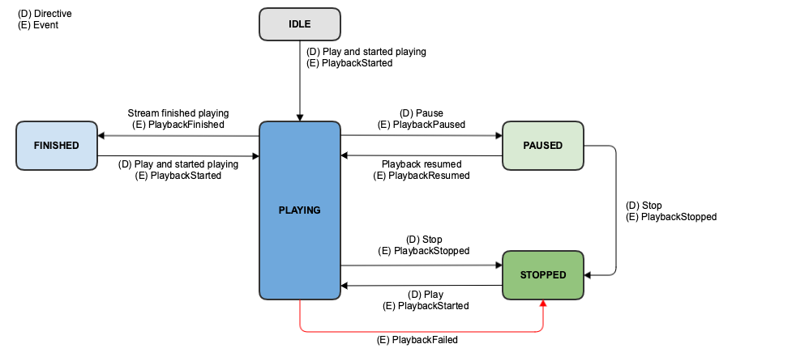

# AudioPlayer

## Version

최신 버전은 1.7 입니다.

| Version | Date       | Description                                                                                                                                                                                                                                                                         |
|---------|------------|-------------------------------------------------------------------------------------------------------------------------------------------------------------------------------------------------------------------------------------------------------------------------------------|
| 1.0     | 2019.11.13 | 규격 추가                                                                                                                                                                                                                                                                               |
| 1.1     | 2020.03.03 | lyric, favorite, repeat, shuffle, template.settings 관련 directive/event 추가<br/>AudioPlayer.Template1 에 lyrics, settings, badge 관련 필드 추가<br/>AudioPlayer.Play 에 cacheKey 필드 추가<br/>AudioPlayer.UpdateMetadata directive 추가<br/>AudioPlayer.Template1의 content.imageUrl을 Mandatory로 수정 |
| 1.2     | 2020.03.12 | Request{Play/Resume/Next/Previous/Pause/Stop}<br/>Command Directive Request{Play/Resume/Next/Previous/Pause/Stop}CommandIssued Event 추가.                                                                                                                                            |
| 1.3     | 2020.06.05 | PlaybackStopped event 에 reason 필드 추가.<br/>RequestCommandFailed event 추가.                                                                                                                                                                                                            |
| 1.4     | 2020.08.12 | Context 에 playServiceId 추가                                                                                                                                                                                                                                                          |
| 1.5     | 2020.12.09 | PlaybackStopped event 의 reason 필드 값에 대한 조건 수정                                                                                                                                                                                                                                       |
| 1.6     | 2021.03.05 | AudioPlayer.Template1 의 lyrics 에 showButton 필드 추가<br/>AudioPlayer.Template2 에 lyrics 필드 추가<br/>AudioPlayer.Template2 에 subtitle1 필드 추가                                                                                                                                              |
| 1.7     | 2023.04.05 | context 에 playlistToken 필드 추가<br/>UpdateMetadata 에 playlist 필드 추가 |

## State Diagram



## SDK Interface

### AudioPlayerAgent 사용

AudioPlayer interface 규격에 따른 디바이스의 동작 제어는 AudioPlayerAgent 가 처리합니다.



NuguAndroidClient instance 를 통해 AudioPlayerAgent instance 에 접근할 수 있습니다.


```kotlin
val audioPlayerAgent = nuguAndroidClient.audioPlayerAgent
```




NuguClient instance 를 통해 AudioPlayerAgent instance 에 접근할 수 있습니다.


```swift
let audioPlayerAgent = nuguClient.audioPlayerAgent
```




[CapabilityFactory::makeCapability](https://nugu-developers.github.io/nugu-linux/classNuguCapability_1_1CapabilityFactory.html#a46d96b1bc96903f02905c92ba8794bf6) 함수로 [AudioPlayerAgent](https://nugu-developers.github.io/nugu-linux/classNuguCapability_1_1IAudioPlayerHandler.html) 를 생성하고 [NuguClient](https://nugu-developers.github.io/nugu-linux/classNuguClientKit_1_1NuguClient.html) 에 추가해 주어야합니다.


```kotlin
auto audio_player_handler(std::shared_ptr<IAudioPlayerHandler>(
        CapabilityFactory::makeCapability<AudioPlayerAgent, IAudioPlayerHandler>()));

nugu_client->getCapabilityBuilder()
    ->add(audio_player_handler.get())
    ->construct();
```




### 재생 상태 모니터링

[Play](#play) directive 로 전달된 음원에 대한 재생 상태를 모니터링 할 수 있습니다.



AudioPlayerAgentInterface.Listener 를 추가합니다.


```kotlin
val listener = object: AudioPlayerAgentInterface.Listener {
    override fun onStateChanged(activity: State, context: Context) {
        ...
    }
}
audioPlayerAgent.addListener(listener)
```




AudioPlayerAgentDelegate 를 추가합니다.


```swift
class MyAudioPlayerAgentDelegate: AudioPlayerAgentDelegate {
    func audioPlayerAgentDidChange(state: AudioPlayerState, dialogRequestId: String) {
        ...
    }
}

audioPlayerAgent.add(delegate: MyAudioPlayerAgentDelegate())
```




[IAudioPlayerListener](https://nugu-developers.github.io/nugu-linux/classNuguCapability_1_1IAudioPlayerListener.html) 를 추가합니다.


```cpp
class MyAudioPlayerListener : public IAudioPlayerListener {
public:
    ...

    void mediaStateChanged (AudioPlayerState state, const std::string &dialog_id) override
    {
        ...
    }

    ...
};
auto audio_player_listener(std::make_shared<MyAudioPlayerListener>());
CapabilityFactory::makeCapability<AudioPlayerAgent, IAudioPlayerHandler>(audio_player_listener.get());
```




### UI 구성 및 제어

AudioPlayer 로 음원을 재생할 때 화면을 구성하기 위해 필요한 데이터는 [Play](#play) directive 의 `audioItem.metadata.template` 에 포함되어 전달됩니다.

[Stop](#stop) directive 또는 SDK 내부 timer 등에 의해 종료될 수 있으며, [UpdateMetadata](#updatemetadata) directive 에 의해 변경될 수 있습니다.

[AudioPlayer.Template1](#audioitemmetadatatemplate---audioplayertemplate1) 에 포함된 가사의 화면은 `사용자 발화` 에 따라 [ShowLyrics](#showlyrics), [HideLyrics](#hidelyrics), [ControlLyricsPage](#controllyricspage) directive 로 제어될 수 있습니다.



DisplayAggregatorInterface.Renderer 를 추가합니다.


```kotlin
val renderer = object: DisplayAggregatorInterface.Renderer {
    override fun render(templateId: String, templateType: String, templateContent: String, dialogRequestId: String, displayType: Type): Boolean {
        ...
    }

    ...
}
nuguAndroidClient.setDisplayRenderer(renderer)
```


UI 제어 요청을 처리하려면 LyricsPresenter 를 추가합니다.


```kotlin
val presenter = object: LyricsPresenter {
    override fun show(): Boolean {
        ...
    }

    override fun hide(): Boolean {
        ...
    }

    ...
}
audioPlayerAgent.setLyricsPresenter(presenter)
```




AudioPlayerDisplayDelegate 를 추가합니다.


```swift
class MyAudioPlayerDisplayDelegate: AudioPlayerDisplayDelegate {
    func audioPlayerDisplayShouldRender(template: AudioPlayerDisplayTemplate, completion: @escaping (AnyObject?) -> Void) {
        ...
    }

    func audioPlayerDisplayShouldShowLyrics(completion: @escaping (Bool) -> Void) {
        ...
    }

    func audioPlayerDisplayShouldHideLyrics(completion: @escaping (Bool) -> Void) {
        ...
    }

    ...
}

audioPlayerAgent.displayDelegate = MyAudioPlayerDisplayDelegate()
```




[IAudioPlayerListener](https://nugu-developers.github.io/nugu-linux/classNuguCapability_1_1IAudioPlayerListener.html) 를 추가합니다.


```cpp
class MyAudioPlayerListener : public IAudioPlayerListener {
public:
    ...

    void renderDisplay(const std::string& id, const std::string& type, const std::string& json_payload, const std::string& dialog_id) override
    {
        ...
    }

    bool showLyrics(const std::string& id) override
    {
        ...
    }

    bool hideLyrics(const std::string& id) override
    {
        ...
    }

    ...
};
auto audio_player_listener(std::make_shared<MyAudioPlayerListener>());
CapabilityFactory::makeCapability<AudioPlayerAgent, IAudioPlayerHandler>(audio_player_listener.get());
```




### 제어 명령

PUI, GUI 등으로 사용자가 [다음](#nextcommandissued)/[이전](#previouscommandissued)/[즐겨찾기](#favoritecommandissued)/[반복](#repeatcommandissued)/[셔플](#shufflecommandissued) 요청을 event 로 전달할 수 있습니다.




```kotlin
// 다음
audioPlayerAgent.next()
// 이전
audioPlayerAgent.prev()
// 즐겨찾기
audioPlayerAgent.requestFavoriteCommand(false)
// 반복
audioPlayerAgent.requestRepeatCommand(RepeatMode.NONE)
// 셔플
audioPlayerAgent.requestShuffleCommand(false)
```





```swift
// 다음 
audioPlayerAgent.next()
// 이전
audioPlayerAgent.prev()
// 즐겨찾기
audioPlayerAgent.requestFavoriteCommand(false)
// 반복
audioPlayerAgent.requestRepeatCommand(.none)
// 셔플
audioPlayerAgent.requestShuffleCommand(false)
```





```cpp
// 다음
audio_player_handler->next()
// 이전
audio_player_handler->prev()
// 즐겨찾기
audio_player_handler->requestFavoriteCommand(false)
// 반복
audio_player_handler->requestRepeatCommand(RepeatType.NONE)
// 셔플
audio_player_handler->requestShuffleCommand(false)
```




## Context


```json
{
  "AudioPlayer": {
    "version": "1.7",
    "playServiceId": "{{STRING}}",
    "playerActivity": "{{STRING}}",
    "token": "{{STRING}}",
    "offsetInMilliseconds": {{LONG}},
    "durationInMilliseconds": {{LONG}},
    "lyricsVisible": {{BOOLEAN}},
    "playlistToken": "{{STRING}}"
  }
}
```


| parameter               | type     | mandatory  | description                                                                       |
|-------------------------|----------|------------|-----------------------------------------------------------------------------------|
| playServiceId           | string   | N          | 현재 사용 중인 음원의 playServiceId                                                        |
| playerActivity          | string   | Y          | 현재 state                                                                          |
| token                   | string   | N          | 현재 사용 중인 음원의 토큰                                                                   |
| offsetInMilliseconds    | long     | Y          | 현재 사용 중인 음원의 offset                                                               |
| durationInMilliseconds  | long     | N          | 현재 사용 중인 음원의 전체 재생시간(알수 없으면 보내주지 않음)                                              |
| lyricsVisible           | boolean  | N          | AudioPlayer에서 가사 화면이 보여지고 있는지 여부<br/>가사를 보여줄 수 없는 Device에서는 lyricsVisible를 보내지 않음 |
| playlistToken           | string   | N          | 디바이스가 가지고 있는 playlist의 token<br/>(playlist를 사용할 수 없는 Device에서는 playlistToken를 보내지 않음) |

## Directives

### Play

새로운 음원 또는 현재 음원 재생 요청입니다.(Play, Resume, Seek 요청이 포함되어 있습니다.)


```json
{
  "header": {
    "namespace": "AudioPlayer",
    "name": "Play",
    "messageId": "{{STRING}}",
    "dialogRequestId": "{{STRING}}",
    "version": "1.7"
  },
  "payload": {
    "playServiceId": "{{STRING}}",
    "sourceType": "{{STRING}}",
    "cacheKey": "{{STRING}}",
    "audioItem": {
      "stream": {
        "url": "{{STRING}}",
        "offsetInMilliseconds": {{LONG}},
        "progressReport": {
          "progressReportDelayInMilliseconds": {{LONG}},
          "progressReportIntervalInMilliseconds": {{LONG}}
        },
        "token": "{{STRING}}",
        "expectedPreviousToken": "{{STRING}}"
      },
      "metadata": {
        "template": {}
      }
    }
  }
}
```


| parameter                                                            | type   | mandatory   | description                                                                                                            |
|----------------------------------------------------------------------|--------|-------------|------------------------------------------------------------------------------------------------------------------------|
| sourceType                                                           | string | N           | URL or ATTACHMENT(default 는 URL)<br/>- ATTACHMENT 일 경우 stream에 url이 존재 하지 않음                                           |
| cacheKey                                                             | string | N           | 디바이스에서 미디어 캐시를 위한 unique key(디바이스 캐시 기능은 필수가 아님)<br/>캐시가 불가능한 미디어 이면 디바이스로 내려주지 않음                                     |
| audioItem.stream                                                     | object | Y           | -                                                                                                                      |
| audioItem.stream.url                                                 | string | N           | 오디오 컨텐츠의 URL (URL에 의한 streaming만 지원)<br/>sourceType 이 ATTACHMENT일 경우 없음                                                |
| audioItem.stream.offsetInMilliseconds                                | long   | Y           | 시작부터 얼마만큼의 offset부터 재생할지 설정.<br/>0이면 처음부터 재생                                                                           |
| audioItem.stream.progressReport.progressReportDelayInMilliseconds    | long   | N           | 재생을 시작해서 지정된 시간 뒤에 한 번 progressReportDelayElapsed Event가 발생<br/>(offsetInMilliseconds 값과는 무관하게 컨텐츠 시작 시간 기준으로 절대값을 의미) |
| audioItem.stream.progressReport.progressReportIntervalInMilliseconds | long   | N           | 재생을 시작해서 지정된 주기마다 progressReportIntervalElapsed Event가 발생<br/>(offsetInMilliseconds 값과는 무관하게 컨텐츠 시작 시간 기준으로 절대값을 의미)   |
| audioItem.stream.token                                               | string | Y           | 현재 stream을 나타내는 token Resume 을 판단하기 위한 key 값으로 사용되기 때문에, Play 에서 제공하는 미디어 내에서 unique 함이 보장되어야 함.                       |
| audioItem.stream.expectedPreviousToken                               | string | N           | 이전 stream을 나타내는 token                                                                                                  |
| audioItem.metadata                                                   | object | N           | -                                                                                                                      |
| audioItem.metadata.template                                          | object | N           | 각 type별 포맷은 아래에 기술 template이 정의되지 않은 경우 Display를 포함하는 디바이스는 Default 화면을 보여주어야 함                                        |

#### audioItem.metadata.template - AudioPlayer.Template1


```json
{
  "metadata": {
    "disableTemplate": {{BOOLEAN}},
    "template": {
      "type": "AudioPlayer.Template1",
      "title": {
        "iconUrl": "{{STRING}}",
        "text": "{{STRING}}"
      },
      "grammarGuide": ["{{STRING}}"],
      "content": {
        "title": "{{STRING}}",
        "subtitle1": "{{STRING}}",
        "subtitle2": "{{STRING}}",
        "imageUrl": "{{STRING}}",
        "durationSec": "{{STRING}}",
        "backgroundImageUrl": "{{STRING}}",
        "backgroundColor": "{{STRING}}",
        "badgeImageUrl": "{{String}}",
        "badgeMessage": "{{String}}",
        "lyrics": {
          "title": "{{String}}",
          "lyricsType": "{{String}}",
          "lyricsInfoList": [
            {
              "time": {{Integer}},
              "text": "{{String}}"
            }
          ],
          "showButton": {
            "text": "{{String}}"
          }
        },
        "settings": {
          "favorite": {{BOOLEAN}},
          "repeat": "{{String}}",
          "shuffle": {{BOOLEAN}}
        }
      },
      "playlist": PlaylistObject
    }
  }
}
```


| parameter                                   | type                | mandatory | description                                                                                          |
|---------------------------------------------|---------------------|-----------|------------------------------------------------------------------------------------------------------|
| disableTemplate                             | bool                | N         | true면 스크린을 가진 디바이스에서 AudioPlayer 재생 시 template을 display하지 않음<br/>default - false                     |
| template.type                               | string              | Y         | AudioPlayer template type<br/>- AudioPlayer.Template1<br/>- AudioPlayer.Template2                    |
| template.title                              | object              | Y         | title object                                                                                         |
| template.title.iconUrl                      | string              | N         | icon image url                                                                                       |
| template.title.text                         | string              | Y         | title text                                                                                           |
| template.content                            | object              | Y         | content object                                                                                       |
| template.content.title                      | string              | Y         | content 영역의 title                                                                                    |
| template.content.subtitle1                  | string              | Y         | subtitle1                                                                                            |
| template.content.subtitle2                  | string              | N         | subtitle2                                                                                            |
| template.content.imageUrl                   | string              | Y         | image url                                                                                            |
| template.content.durationSec                | string              | N         | content duration in sec<br/>**없거나 0, 음수, null이면 progress를 disabled 처리**                              |
| template.content.backgroundImageUrl         | string              | N         | background image url                                                                                 |
| template.content.backgroundColor            | string              | N         | background color<br/>default - "#000"                                                                |
| template.content.badgeImageUrl              | string              | N         | 이미지(content.imageUrl)의 오른쪽 상단에 표시될 Badge Image의 URL                                                  |
| template.content.badgeMessage               | string              | N         | 이미지(content.imageUrl)의 왼쪽 하단에 표시될 Badge Message                                                      |
| template.content.lyrics                     | obejct              | N         | 가사 화면을 표시하기 위한 정보                                                                                    |
| template.content.lyrics.title               | string              | Y         | 가사 화면에서 보여질 제목                                                                                       |
| template.content.lyrics.lyricsType          | string              | Y         | 가사의 종류<br/>- **NONE** : 자막 없음<br/>- **SYNC** : 자막 동기화<br/>- **NON_SYNC** : 자막 동기화 없음                 |
| template.content.lyrics.lyricsInfoList      | array of lyricsInfo | Y         | 가사 내용(lyricsInfo)의 목록 기본 값은 빈 배열                                                                     |
| template.content.lyrics.lyricsInfoList.time | integer             | N         | lyricsTyps 이 SYNC 이면 mandatory lyricsInfo가 보여지는 시점의 millisecond 단위의 시간 정보                            |
| template.content.lyrics.lyricsInfoList.text | string              | Y         | lyricsInfo가 보여지는 시점의 가사 내용                                                                           |
| content.lyrics.showButton                   | object              | N         | 가사 화면을 표시하기 위한 버튼                                                                                    |
| content.lyrics.showButton.text              | string              | Y         | 버튼 text                                                                                              |
| template.content.settings                   | object              | N         | 사용자가 설정한 정보를 표시함<br/>- Play에서는 표시할 하위 field를 설정할 수 있음<br/>- 설정한 field에 대한 Event와 Directive를 사용할 수 있음 |
| template.content.settings.favorite          | boolean             | N         | 재생 중인 음원에 대한 좋아요 여부                                                                                  |
| template.content.settings.repeat            | string              | N         | 재생 목록에 대한 반복 설정<br/>- **ALL** : 전곡 반복<br/>- **ONE** : 한곡 반복<br/>- **NONE** : 반복 없음                   |
| template.content.settings.shuffle           | boolean             | N         | 재생 목록의 음원을 임의의 순서로 재생할지 여부                                                                           |
| template.grammarGuide                       | list of string      | N         | 발화 도움말                                                                                               |
| template.floatingBanner                       | FloatingBannerObject | N         | display interface 규격의 floatingBanner 참고 |
| template.playlist                       | playlist object	| N         | 재생목록 |

#### audioItem.metadata.template - AudioPlayer.Template2


```json
{
  "metadata": {
    "disableTemplate": {{BOOLEAN}},
    "template": {
      "type": "AudioPlayer.Template2",
      "title": {
        "iconUrl": "{{STRING}}",
        "text": "{{STRING}}"
      },
      "grammarGuide": ["{{STRING}}"],
      "content": {
        "title": "{{STRING}}",
        "subtitle": "{{STRING}}",
        "subtitle1": "{{STRING}}",
        "imageUrl": "{{STRING}}",
        "durationSec": "{{STRING}}",
        "backgroundColor": "{{STRING}}",
        "lyrics" : {
          "title" : "{{String}}",
          "lyricsType" : "{{String}}",
          "lyricsInfoList" : [
            {"time":"{{Integer}}","text": "{{String}}"}
          ],
          "showButton": {
            "text": "{{String}}"
          }
        }
      }
    }
  }
}
```


| parameter                                   | type                | mandatory | description                                                                          |
|---------------------------------------------|---------------------|-----------|--------------------------------------------------------------------------------------|
| disableTemplate                             | bool                | N         | true면 스크린을 가진 디바이스에서 AudioPlayer 재생 시 template을 display하지 않음 default : false         |
| template.type                               | string              | Y         | AudioPlayer template type<br/>- AudioPlayer.Template1<br/>- AudioPlayer.Template2    |
| template.title                              | object              | Y         | title object                                                                         |
| template.title.iconUrl                      | string              | N         | icon image url                                                                       |
| template.title.text                         | string              | Y         | title text                                                                           |
| template.content                            | object              | Y         | content object                                                                       |
| template.content.title                      | string              | Y         | content 영역의 title                                                                    |
| template.content.subtitle                   | string              | Y         | subtitle                                                                             |
| template.content.subtitle1                  | string              | Y         | lyrics가 있는 경우, 가사화면 제목 우측의 소제목                                                       |
| template.content.imageUrl                   | string              | N         | background image url                                                                 |
| template.content.durationSec                | string              | N         | content duration in sec<br/>없거나 0, 음수, null이면 progress를 화면에서 disabled 처리             |
| template.content.backgroundColor            | string              | N         | background color<br/>default : "#000"                                                |
| template.content.lyrics                     | obejct              | N         | 가사 화면을 표시하기 위한 정보                                                                    |
| template.content.lyrics.title               | string              | Y         | 가사 화면에서 보여질 제목                                                                       |
| template.content.lyrics.lyricsType          | string              | Y         | 가사의 종류<br/>- **NONE** : 자막 없음<br/>- **SYNC** : 자막 동기화<br/>- **NON_SYNC** : 자막 동기화 없음 |
| template.content.lyrics.lyricsInfoList      | array of lyricsInfo | Y         | 가사 내용(lyricsInfo)의 목록 기본 값은 빈 배열                                                     |
| template.content.lyrics.lyricsInfoList.time | integer             | N         | lyricsTyps 이 SYNC 이면 mandatory lyricsInfo가 보여지는 시점의 millisecond 단위의 시간 정보            |
| template.content.lyrics.lyricsInfoList.text | string              | Y         | lyricsInfo가 보여지는 시점의 가사 내용                                                           |
| content.lyrics.showButton                   | object              | N         | 가사 화면을 표시하기 위한 버튼                                                                    |
| content.lyrics.showButton.text              | string              | Y         | 버튼 text                                                                              |
| template.grammarGuide                       | list of string      | N         | 발화 도움말                                                                               |

### Stop

음원 재생 중지 요청입니다.


```json
{
  "header": {
    "namespace": "AudioPlayer",
    "name": "Stop",
    "messageId": "{{STRING}}",
    "dialogRequestId": "{{STRING}}",
    "version": "1.7"
  },
  "payload": {
    "playServiceId": "{{STRING}}"
  }
}
```


### Pause

음원 일시정지 요청입니다.


```json
{
  "header": {
    "namespace": "AudioPlayer",
    "name": "Pause",
    "messageId": "{{STRING}}",
    "dialogRequestId": "{{STRING}}",
    "version": "1.7"
  },
  "payload": {
    "playServiceId": "{{STRING}}"
  }
}
```


### UpdateMetadata

음원의 Metadata UI 설정 정보를 갱신 요청입니다.


```json
{
  "header": {
    "namespace": "AudioPlayer",
    "name": "UpdateMetadata",
    "messageId": "{{STRING}}",
    "dialogRequestId": "{{STRING}}",
    "version": "1.7"
  },
  "payload": {
    "playServiceId": "{{STRING}}",
    "metadata": {
      "template": {
        "content": {
          "settings": {
            "favorite": {{BOOLEAN}},
            "repeat": "{{STRING}}",
            "shuffle": {{BOOLEAN}}
          }
        },
        "playlist": PlaylistObject
      }
    }
  }
}
```


| parameter                                   | type    | mandatory  | description                                                                                                    |
|---------------------------------------------|---------|------------|----------------------------------------------------------------------------------------------------------------|
| metadata.template.content.settings.favorite | boolean | N          | AudioPlayer.Template1의 settings.favorite 와 연동                                                                  |
| metadata.template.content.settings.repeat   | string  | N          | AudioPlayer.Template1의 settings.repeat 과 연동<br/>- **ALL** : 전곡 반복<br/>- **ONE** : 한곡 반복<br/>- **NONE** : 반복 없음 |
| metadata.template.content.settings.shuffle  | boolean | N          | AudioPlayer.Template1의 settings.shuffle 과 연동                                                                   |
| metadata.template.playlist | Playlist Object	| N          | PlaylistTemplate1<br/>playlist.type은 수정 불가하며, 나머지 field들은 수정 가능 |

### ShowLyrics

가사화면 표시 요청입니다.


```json
{
  "header": {
    "namespace": "AudioPlayer",
    "name": "ShowLyrics",
    "messageId": "{{STRING}}",
    "dialogRequestId": "{{STRING}}",
    "version": "1.7"
  },
  "payload": {
    "playServiceId": "{{STRING}}"
  }
}
```


### HideLyrics

가사화면 닫기 요청입니다.


```json
{
  "header": {
    "namespace": "AudioPlayer",
    "name": "HideLyrics",
    "messageId": "{{STRING}}",
    "dialogRequestId": "{{STRING}}",
    "version": "1.7"
  },
  "payload": {
    "playServiceId": "{{STRING}}"
  }
}
```


### ControlLyricsPage

가사화면 스크롤 위치 이동 요청입니다.


```json
{
  "header": {
    "namespace": "AudioPlayer",
    "name": "ControlLyricsPage",
    "messageId": "{{STRING}}",
    "dialogRequestId": "{{STRING}}",
    "version": "1.7"
  },
  "payload": {
    "playServiceId": "{{STRING}}",
    "direction": "{{STRING}}"
  }
}
```


| parameter  | type    | mandatory  | description            |
|------------|---------|------------|------------------------|
| direction  | string  | Y          | 이전과 다음 PREVIOUS, NEXT  |

### RequestPlayCommand

* Nugu mobile application 에서 새로운 곡 재생을 요청하기 위한 Directive.


```json
{
  "header": {
    "namespace": "AudioPlayer",
    "name": "RequestPlayCommand",
    "messageId": "{{STRING}}",
    "dialogRequestId": "{{STRING}}",
    "version": "1.7"
  },
  "payload": {}
}
```


| parameter  | type    | mandatory  | description              |
|------------|---------|------------|--------------------------|
| payload    | object  | Y          | Play 에서 곡 재생을 위해 필요한 정보  |

### RequestResumeCommand

* Nugu mobile application 에서 현재 재생중인 play 에 대한 제어를 위한 Directive.


```json
{
  "header": {
    "namespace": "AudioPlayer",
    "name": "RequestResumeCommand",
    "messageId": "{{STRING}}",
    "dialogRequestId": "{{STRING}}",
    "version": "1.7"
  },
  "payload": {}
}
```


### RequestNextCommand

* Nugu mobile application 에서 현재 재생중인 play 에 대한 제어를 위한 Directive.


```json
{
  "header": {
    "namespace": "AudioPlayer",
    "name": "RequestNextCommand",
    "messageId": "{{STRING}}",
    "dialogRequestId": "{{STRING}}",
    "version": "1.7"
  },
  "payload": {}
}
```


### RequestPreviousCommand

* Nugu mobile application 에서 현재 재생중인 play 에 대한 제어를 위한 Directive.


```json
{
  "header": {
    "namespace": "AudioPlayer",
    "name": "RequestPreviousCommand",
    "messageId": "{{STRING}}",
    "dialogRequestId": "{{STRING}}",
    "version": "1.7"
  },
  "payload": {}
}
```


### RequestPauseCommand

* Nugu mobile application 에서 현재 재생중인 play 에 대한 제어를 위한 Directive.


```json
{
  "header": {
    "namespace": "AudioPlayer",
    "name": "RequestPauseCommand",
    "messageId": "{{STRING}}",
    "dialogRequestId": "{{STRING}}",
    "version": "1.7"
  },
  "payload": {}
}
```


### RequestStopCommand

* Nugu mobile application 에서 현재 재생중인 play 에 대한 제어를 위한 Directive.


```json
{
  "header": {
    "namespace": "AudioPlayer",
    "name": "RequestStopCommand",
    "messageId": "{{STRING}}",
    "dialogRequestId": "{{STRING}}",
    "version": "1.7"
  },
  "payload": {}
}
```


## Events

### PlaybackStarted


```json
{
  "header": {
    "namespace": "AudioPlayer",
    "name": "PlaybackStarted",
    "messageId": "{{STRING}}",
    "dialogRequestId": "{{STRING}}",
    "version": "1.7"
  },
  "payload": {
    "token": "{{STRING}}",
    "offsetInMilliseconds": {{LONG}},
    "playServiceId": "{{STRING}}"
  }
}
```


| parameter             | type    | mandatory  | description                |
|-----------------------|---------|------------|----------------------------|
| token                 | string  | Y          | 현재 재생 중인 stream의 token     |
| offsetInMilliseconds  | long    | Y          | 현재 재생 중인 stream의 offset 값  |

### PlaybackPaused


```json
{
  "header": {
    "namespace": "AudioPlayer",
    "name": "PlaybackPaused",
    "messageId": "{{STRING}}",
    "dialogRequestId": "{{STRING}}",
    "version": "1.7"
  },
  "payload": {
    "token": "{{STRING}}",
    "offsetInMilliseconds": {{LONG}},
    "playServiceId": "{{STRING}}"
  }
}
```


| parameter             | type    | mandatory  | description                |
|-----------------------|---------|------------|----------------------------|
| token                 | string  | Y          | 현재 재생 중인 stream의 token     |
| offsetInMilliseconds  | long    | Y          | 현재 재생 중인 stream의 offset 값  |

### PlaybackResumed


```json
{
  "header": {
    "namespace": "AudioPlayer",
    "name": "PlaybackResumed",
    "messageId": "{{STRING}}",
    "dialogRequestId": "{{STRING}}",
    "version": "1.7"
  },
  "payload": {
    "token": "{{STRING}}",
    "offsetInMilliseconds": {{LONG}},
    "playServiceId": "{{STRING}}"
  }
}
```


| parameter             | type    | mandatory  | description                |
|-----------------------|---------|------------|----------------------------|
| token                 | string  | Y          | 현재 재생 중인 stream의 token     |
| offsetInMilliseconds  | long    | Y          | 현재 재생 중인 stream의 offset 값  |

### PlaybackFinished


```json
{
  "header": {
    "namespace": "AudioPlayer",
    "name": "PlaybackFinished",
    "messageId": "{{STRING}}",
    "dialogRequestId": "{{STRING}}",
    "version": "1.7"
  },
  "payload": {
    "token": "{{STRING}}",
    "offsetInMilliseconds": {{LONG}},
    "playServiceId": "{{STRING}}"
  }
}
```


| parameter             | type    | mandatory  | description                |
|-----------------------|---------|------------|----------------------------|
| token                 | string  | Y          | 현재 재생 중인 stream의 token     |
| offsetInMilliseconds  | long    | Y          | 현재 재생 중인 stream의 offset 값  |

### PlaybackStopped


```json
{
  "header": {
    "namespace": "AudioPlayer",
    "name": "PlaybackStopped",
    "messageId": "{{STRING}}",
    "dialogRequestId": "{{STRING}}",
    "version": "1.7"
  },
  "payload": {
    "token": "{{STRING}}",
    "offsetInMilliseconds": {{LONG}},
    "playServiceId": "{{STRING}}",
    "reason": "{{STRING}}"
  }
}
```


| parameter             | type    | mandatory  | description                                                                                                                                                          |
|-----------------------|---------|------------|----------------------------------------------------------------------------------------------------------------------------------------------------------------------|
| token                 | string  | Y          | 현재 재생 중인 stream의 token                                                                                                                                               |
| offsetInMilliseconds  | long    | Y          | 현재 재생 중인 stream의 offset 값                                                                                                                                            |
| reason                | string  | N          | 이 이벤트가 만들어진 이유를 명시하기 위한 객체 **STOP**, **PLAY_ANOTHER** 중 하나.<br/>- **PLAY_ANOTHER** : 동일 play 내에서 다른 곡 재생을 위해 이전에 재생하던 곡을 정지했을 때 올려주는 값.<br/>- **STOP** : 그 외 정지의 경우. |

### PlaybackFailed


```json
{
  "header": {
    "namespace": "AudioPlayer",
    "name": "PlaybackFailed",
    "messageId": "{{STRING}}",
    "dialogRequestId": "{{STRING}}",
    "version": "1.7"
  },
  "payload": {
    "token": "{{STRING}}",
    "offsetInMilliseconds": {{LONG}},
    "error": {
      "type": "{{STRING}}",
      "message": "{{STRING}}"
    },
    "currentPlaybackState": {
      "token": "{{STRING}}",
      "offsetInMilliseconds": {{LONG}},
      "playerActivity": "{{STRING}}"
    },
    "playServiceId": "{{STRING}}"
  }
}
```


| parameter                                  | type    | mandatory  | description                                                                                                                                                                               |
|--------------------------------------------|---------|------------|-------------------------------------------------------------------------------------------------------------------------------------------------------------------------------------------|
| token                                      | string  | Y          | 재생에 실패한 stream의 token                                                                                                                                                                     |
| offsetInMilliseconds                       | long    | Y          | PlaybackFailed를 보낼 때 재생 중인 stream의 offset 값                                                                                                                                               |
| error.type                                 | string  | Y          | **MEDIA_ERROR_UNKNOWN**<br/>**MEDIA_ERROR_INVALID_REQUEST**<br/>**MEDIA_ERROR_SERVICE_UNAVAILABLE**<br/>**MEDIA_ERROR_INTERNAL_SERVER_ERROR**<br/>**MEDIA_ERROR_INTERNAL_DEVICE_ERROR**   |
| error.message                              | string  | Y          | 에러에 대해 자세히 기술                                                                                                                                                                             |
| currentPlaybackState.token                 | string  | Y          | 현재 재생 중인 stream의 token으로 위에 있는 token과 다를 수 있음                                                                                                                                             |
| currentPlaybackState.offsetInMilliseconds  | long    | Y          | 에러가 발생했을 때 현재 재생 중인 stream의 offset 값                                                                                                                                                      |
| currentPlaybackState.playActivity          | string  | Y          | player의 상태<br/>**PLAYING**, **PAUSED**, **FINISHED**, **IDLE**                                                                                                                            |

### ProgressReportDelayElapsed

* Play directive로 전달된 stream이 재생을 시작한 뒤 progressReportDelayInMilliseconds
* **offsetInMilliseconds는 stream의 시작을 기준으로 offset을 의미 (컨텐츠 재생 시간 0부터 절대값을 의미)**


```json
{
  "header": {
    "namespace": "AudioPlayer",
    "name": "ProgressReportDelayElapsed",
    "messageId": "{{STRING}}",
    "dialogRequestId": "{{STRING}}",
    "version": "1.7"
  },
  "payload": {
    "token": "{{STRING}}",
    "offsetInMilliseconds": {{LONG}},
    "playServiceId": "{{STRING}}"
  }
}
```


| parameter             | type    | mandatory  | description                |
|-----------------------|---------|------------|----------------------------|
| token                 | string  | Y          | 현재 재생 중인 stream의 token     |
| offsetInMilliseconds  | long    | Y          | 현재 재생 중인 stream의 offset 값  |

### ProgressReportIntervalElapsed

* Play directive로 전달된 stream이 재생을 시작한 뒤 progressIntervalDelayInMilliseconds 주기마다 Event 전달
* **offsetInMilliseconds는 stream의 시작을 기준으로 offset을 의미 (컨텐츠 재생 시간 0부터 절대값을 의미)**


```json
{
  "header": {
    "namespace": "AudioPlayer",
    "name": "ProgressReportIntervalElapsed",
    "messageId": "{{STRING}}",
    "dialogRequestId": "{{STRING}}",
    "version": "1.7"
  },
  "payload": {
    "token": "{{STRING}}",
    "offsetInMilliseconds": {{LONG}},
    "playServiceId": "{{STRING}}"
  }
}
```


| parameter             | type    | mandatory  | description                |
|-----------------------|---------|------------|----------------------------|
| token                 | string  | Y          | 현재 재생 중인 stream의 token     |
| offsetInMilliseconds  | long    | Y          | 현재 재생 중인 stream의 offset 값  |

### NextCommandIssued

사용자가 다음 음원 재생을 요청하면 전송됩니다.


```json
{
  "header": {
    "namespace": "AudioPlayer",
    "name": "NextCommandIssued",
    "messageId": "{{STRING}}",
    "dialogRequestId": "{{STRING}}",
    "version": "1.7"
  },
  "payload": {
    "playServiceId": "{{STRING}}",
    "token": "{{STRING}}",
    "offsetInMilliseconds": {{LONG}}
  }
}
```


| parameter             | type    | mandatory  | description                |
|-----------------------|---------|------------|----------------------------|
| token                 | string  | Y          | 현재 재생 중인 stream의 token     |
| offsetInMilliseconds  | long    | Y          | 현재 재생 중인 stream의 offset 값  |

### PreviousCommandIssued

사용자가 이전 음원 재생을 요청하면 전송됩니다.


```json
{
  "header": {
    "namespace": "AudioPlayer",
    "name": "PreviousCommandIssued",
    "messageId": "{{STRING}}",
    "dialogRequestId": "{{STRING}}",
    "version": "1.7"
  },
  "payload": {
    "playServiceId": "{{STRING}}",
    "token": "{{STRING}}",
    "offsetInMilliseconds": {{LONG}}
  }
}
```


| parameter             | type    | mandatory  | description                |
|-----------------------|---------|------------|----------------------------|
| token                 | string  | Y          | 현재 재생 중인 stream의 token     |
| offsetInMilliseconds  | long    | Y          | 현재 재생 중인 stream의 offset 값  |

### FavoriteCommandIssued

사용자가 현재 음원 즐겨찾기(좋아요 포함)를 요청하면 전송됩니다.


```json
{
  "header": {
    "namespace": "AudioPlayer",
    "name": "FavoriteCommandIssued",
    "messageId": "{{STRING}}",
    "dialogRequestId": "{{STRING}}",
    "version": "1.7"
  },
  "payload": {
    "playServiceId": "{{STRING}}",
    "favorite": {{BOOLEAN}}
  }
}
```


| parameter  | type     | mandatory  | description          |
|------------|----------|------------|----------------------|
| favorite   | boolean  | Y          | 재생 중인 음원에 대한 좋아요 여부  |

### RepeatCommandIssued

사용자가 현재 음원 반복 재생을 요청하면 전송됩니다.


```json
{
  "header": {
    "namespace": "AudioPlayer",
    "name": "RepeatCommandIssued",
    "messageId": "{{STRING}}",
    "dialogRequestId": "{{STRING}}",
    "version": "1.7"
  },
  "payload": {
    "playServiceId": "{{STRING}}",
    "repeat": {{BOOLEAN}}
  }
}
```


| parameter  | type     | mandatory  | description                                                             |
|------------|----------|------------|-------------------------------------------------------------------------|
| repeat     | boolean  | Y          | 재생 목록에 대한 반복 설정 - **ALL** : 전곡 반복 - **ONE** : 한곡 반복 - **NONE** : 반복 없음  |

### ShuffleCommandIssued

사용자가 셔플 재생을 요청하면 전송됩니다.


```json
{
  "header": {
    "namespace": "AudioPlayer",
    "name": "ShuffleCommandIssued",
    "messageId": "{{STRING}}",
    "dialogRequestId": "{{STRING}}",
    "version": "1.7"
  },
  "payload": {
    "playServiceId": "{{STRING}}",
    "shuffle": {{BOOLEAN}}
  }
}
```


| parameter  | type     | mandatory  | description                 |
|------------|----------|------------|-----------------------------|
| shuffle    | boolean  | Y          | 재생 목록의 음원을 임의의 순서로 재생할지 여부  |

### ShowLyricsSucceeded

* ShowLyrics Directive가 발생하여 가사화면을 성공적으로 띄운다음 발생되는 Event


```json
{
  "header": {
    "namespace": "AudioPlayer",
    "name": "ShowLyricsSucceeded",
    "messageId": "{{STRING}}",
    "dialogRequestId": "{{STRING}}",
    "version": "1.7"
  },
  "payload": {
    "playServiceId": "{{STRING}}"
  }
}
```


### ShowLyricsFailed

* ShowLyrics Directive가 발생하였는데 가사화면을 띄우지 못한 경우 발생되는 Event


```json
{
  "header": {
    "namespace": "AudioPlayer",
    "name": "ShowLyricsFailed",
    "messageId": "{{STRING}}",
    "dialogRequestId": "{{STRING}}",
    "version": "1.7"
  },
  "payload": {
    "playServiceId": "{{STRING}}"
  }
}
```


### HideLyricsSucceeded

* HideLyrics Directive가 발생하여 가사화면을 성공적으로 닫은 다음 발생되는 Event


```json
{
  "header": {
    "namespace": "AudioPlayer",
    "name": "HideLyricsSucceeded",
    "messageId": "{{STRING}}",
    "dialogRequestId": "{{STRING}}",
    "version": "1.7"
  },
  "payload": {
    "playServiceId": "{{STRING}}"
  }
}
```


### HideLyricsFailed

* HideLyrics Directive가 발생하였는데 가사화면을 닫지 못한 경우 발생되는 Event


```json
{
  "header": {
    "namespace": "AudioPlayer",
    "name": "HideLyricsFailed",
    "messageId": "{{STRING}}",
    "dialogRequestId": "{{STRING}}",
    "version": "1.7"
  },
  "payload": {
    "playServiceId": "{{STRING}}"
  }
}
```


### ControlLyricsPageSucceeded

* ControlLyricsPage Directive가 발생하여 가사화면을 성공적으로 이동한 다음 발생되는 Event


```json
{
  "header": {
    "namespace": "AudioPlayer",
    "name": "ControlLyricsPageSucceeded",
    "messageId": "{{STRING}}",
    "dialogRequestId": "{{STRING}}",
    "version": "1.7"
  },
  "payload": {
    "playServiceId": "{{STRING}}",
    "direction": "{{STRING}}"
  }
}
```


| parameter  | type    | mandatory  | description                       |
|------------|---------|------------|-----------------------------------|
| direction  | string  | Y          | 이전과 다음을 수행한 결과<br/>PREVIOUS, NEXT |

### ControlLyricsPageFailed

* ControlLyricsPage Directive가 발생하였는데 가사화면을 이동하지 못한 경우 발생되는 Event


```json
{
  "header": {
    "namespace": "AudioPlayer",
    "name": "ControlLyricsPageFailed",
    "messageId": "{{STRING}}",
    "dialogRequestId": "{{STRING}}",
    "version": "1.7"
  },
  "payload": {
    "playServiceId": "{{STRING}}",
    "direction": "{{STRING}}"
  }
}
```


| parameter  | type    | mandatory  | description                       |
|------------|---------|------------|-----------------------------------|
| direction  | string  | Y          | 이전과 다음을 수행한 결과<br/>PREVIOUS, NEXT |

### RequestPlayCommandIssued


```json
{
  "header": {
    "namespace": "AudioPlayer",
    "name": "RequestPlayCommandIssued",
    "messageId": "{{STRING}}",
    "dialogRequestId": "{{STRING}}",
    "version": "1.7"
  },
  "payload": {}
}
```


| parameter  | type    | mandatory  | description                                              |
|------------|---------|------------|----------------------------------------------------------|
| payload    | string  | **Y**      | RequestPlayCommand Directive 에 포함되어 있는 payload 를 그대로 포함. |

### RequestResumeCommandIssued

* RequestResumeCommand Directive 를 받은 디바이스가 발생시키는 Event.


```json
{
  "header": {
    "namespace": "AudioPlayer",
    "name": "RequestResumeCommandIssued",
    "messageId": "{{STRING}}",
    "dialogRequestId": "{{STRING}}",
    "version": "1.7"
  },
  "payload": {
    "token": "{{STRING}}",
    "offsetInMilliseconds": {{LONG}},
    "playServiceId": "{{STRING}}"
  }
}
```


| parameter             | type    | mandatory  | description                |
|-----------------------|---------|------------|----------------------------|
| token                 | string  | Y          | 현재 재생 중인 stream의 token     |
| offsetInMilliseconds  | long    | Y          | 현재 재생 중인 stream의 offset 값  |

### RequestNextCommandIssued

* RequestNextCommand Directive 를 받은 디바이스가 발생시키는 Event.


```json
{
  "header": {
    "namespace": "AudioPlayer",
    "name": "RequestNextCommandIssued",
    "messageId": "{{STRING}}",
    "dialogRequestId": "{{STRING}}",
    "version": "1.7"
  },
  "payload": {
    "token": "{{STRING}}",
    "offsetInMilliseconds": {{LONG}},
    "playServiceId": "{{STRING}}"
  }
}
```


| parameter             | type    | mandatory  | description                |
|-----------------------|---------|------------|----------------------------|
| token                 | string  | Y          | 현재 재생 중인 stream의 token     |
| offsetInMilliseconds  | long    | Y          | 현재 재생 중인 stream의 offset 값  |

### RequestPreviousCommandIssued

* RequestPreviousCommand Directive 를 받은 디바이스가 발생시키는 Event.


```json
{
  "header": {
    "namespace": "AudioPlayer",
    "name": "RequestPreviousCommandIssued",
    "messageId": "{{STRING}}",
    "dialogRequestId": "{{STRING}}",
    "version": "1.7"
  },
  "payload": {
    "token": "{{STRING}}",
    "offsetInMilliseconds": {{LONG}},
    "playServiceId": "{{STRING}}"
  }
}
```


| parameter             | type    | mandatory  | description                |
|-----------------------|---------|------------|----------------------------|
| token                 | string  | Y          | 현재 재생 중인 stream의 token     |
| offsetInMilliseconds  | long    | Y          | 현재 재생 중인 stream의 offset 값  |

### RequestPauseCommandIssued

* RequestPauseCommand Directive 를 받은 디바이스가 발생시키는 Event.


```json
{
  "header": {
    "namespace": "AudioPlayer",
    "name": "RequestPauseCommandIssued",
    "messageId": "{{STRING}}",
    "dialogRequestId": "{{STRING}}",
    "version": "1.7"
  },
  "payload": {
    "token": "{{STRING}}",
    "offsetInMilliseconds": {{LONG}},
    "playServiceId": "{{STRING}}"
  }
}
```


| parameter             | type    | mandatory  | description                |
|-----------------------|---------|------------|----------------------------|
| token                 | string  | Y          | 현재 재생 중인 stream의 token     |
| offsetInMilliseconds  | long    | Y          | 현재 재생 중인 stream의 offset 값  |

### RequestStop CommandIssued

* RequestStopCommand Directive 를 받은 디바이스가 발생시키는 Event.


```json
{
  "header": {
    "namespace": "AudioPlayer",
    "name": "RequestStopCommandIssued",
    "messageId": "{{STRING}}",
    "dialogRequestId": "{{STRING}}",
    "version": "1.7"
  },
  "payload": {
    "token": "{{STRING}}",
    "offsetInMilliseconds": {{LONG}},
    "playServiceId": "{{STRING}}"
  }
}
```


| parameter             | type    | mandatory  | description                |
|-----------------------|---------|------------|----------------------------|
| token                 | string  | Y          | 현재 재생 중인 stream의 token     |
| offsetInMilliseconds  | long    | Y          | 현재 재생 중인 stream의 offset 값  |

### RequestCommandFailed


```json
{
  "header": {
    "namespace": "AudioPlayer",
    "name": "RequestCommandFailed",
    "messageId": "{{STRING}}",
    "dialogRequestId": "{{STRING}}",
    "version": "1.7"
  },
  "payload": {
    "error": {
      "type": "{{STRING}}",
      "message": "{{STRING}}"
    }
  }
}
```


| parameter      | type    | mandatory  | description                                                                                                                                                                                                                    |
|----------------|---------|------------|--------------------------------------------------------------------------------------------------------------------------------------------------------------------------------------------------------------------------------|
| error.type     | string  | Y          | **에러 타입 코드**<br/>- **INVALID_COMMAND** : **IDLE/STOP** 상태일때 Request Pause/Resume/Next/Previous/Stop Command Directive 수신한 경우 (**STOP/IDLE 일때 RequestPlayCommand 는 정상요청이므로 제외에 유의**)<br/>- **UNKNOWN_ERROR** : 그 이외에 처리중 에러난 경우 |
| error.message  | string  | Y          | STOP/IDLE 상태에서는 Request XXX Command 를 처리할 수 없음.                                                                                                                                                                                |
